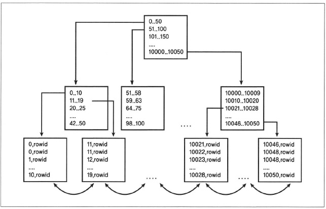

# Chapter 02 "인덱스 튜닝"

## 1. 인덱스 스캔 튜닝

### 1) B-Tree 인덱스

* 오라클은 `디스크 소트`와 `테이블 풀 스캔`을 회피하여 DBMS에 부하를 줄이기 위해 인덱스를 이용한다.
    * 디스크 소트: 정렬 작업을 메모리 내에서 완료하지 못할 정도로 용량이 커서 디스크 공간까지 활용하여 정렬 연산을 하는 것
    * 테이블 풀 스캔: 테이블 스페이스에 저장된 테이블을 처음부터 끝까지 전체 검색하는 것
* 오라클의 인덱스 유형 중 가장 널리 사용되는 것이 B-Tree(Balanced Tree) 인덱스이다.
* B-Tree 인덱스는 데이터가 정렬된 상태로 저장되어서 부하가 큰 Sort 연산을 회피하는데 유용하다.
* B-Tree 인덱스는 선택도(1/선택값)가 낮은 컬럼에 생성하는 것이 유리하다. (예: 성별보다는 주민등록번호, 이름값에 유용)
* 인덱스가 생성된 컬럼을 NVL, TRIM과 같은 오라클 자체 함수로 감싸면 인덱스 사용이 불가능하다.



### 2) 인덱스와 테이블의 관계

* 인덱스와 테이블은 각각의 객체이고, 논리적/물리적으로 완전히 분리되어 있다.
* 인덱스 스캔이 성공하면, 리프 블록의 ROWID(테이블의 최우선순위 인덱스)를 이용하여 테이블에 액세스를 하게 된다. 
* → 결국, `테이블 랜덤 액세스` Cost 를 줄이는 것이 인덱스 튜닝의 핵심이다. 
    * 인덱스 스캔 100건 + 이후 테이블 랜덤 액세스 100건 = GOOD
    * 인덱스 스캔 100건 + 이후 테이블 랜덤 액세스 1건 = BAD(비효율)

### 3) 인덱스 스캔 튜닝

* 효율적인 인덱스를 사용하여 테이블 풀 스캔을 회피하고 소트 연산을 생략하자!

### 4) 인덱스 스캔 튜닝 관련 힌트

* INDEX - 사용자가 지정한 테이블과 인덱스를 선택하여 인덱스 스캔 유도

```sql
SELECT /*+ INDEX(테이블 인덱스) */
```

* FULL - 인덱스 스캔이 아닌 테이블 풀 스캔을 하도록 유도

```sql
SELECT /*+ FULL(테이블) */
```

### 실습 2-1) 인덱스 활용하기

* 튜닝 전 SQL
    * TB_CUST.CUST_NM, TB_ORD.CUST_ID 컬럼이 이 변별력 있는 컬럼임에도 인덱스가 없다.

```sql
SELECT 	/*+ FULL(A) */
   		COUNT(*) -- SORT AGGREGATE
FROM 	TB_CUST A
WHERE	A.CUST_NM LIKE 'AB%' 
AND		EXISTS
    	(
        SELECT	'1'
        FROM 	TB_ORD C
        WHERE	C.CUST_ID = A.CUST_ID 
        AND		C.PRDT_CD LIKE 'AB%'
     )
;
```

* 튜닝
    * TB_CUST 테이블에 CUST_NM 컬럼 인덱스를 생성한다.
    * TB_ORD 테이블에 CUST_ID와 PRDT_CD 컬럼으로 구성된 복합 인덱스를 생성한다.
    * NS_JS 힌트 사용 (중첩 루프 세미 조인) - 조건 만족 시 해당 조인 대상 행은 더 이상 스캔을 수행하지 않고 다음 행으로 넘어간다.

```sql
SELECT	/*+ INDEX(A TB_CUST_IDX01) */
 		COUNT(*)
FROM 	TB_CUST A
WHERE 	A.CUST_NM LIKE 'AB%'
AND 	EXISTS
        (
        SELECT	/*+ INDEX(C TB_ORD_IDX01) NL_SJ */ 
                '1'
        FROM 	TB_ORD C
        WHERE 	C.CUST_ID = A.CUST_ID
        AND 	C.PRDT_CD LIKE 'AB%'
        )
;
```

* 추가 튜닝
    * 위에서, CUST_NM 컬럼으로 이루어진 인덱스를 스캔하였기 때문에 테이블 랜덤 액세스가 불가피하다.
    * (CUST_NM ,CUST_ID) 로 구성된 인덱스 컬럼을 추가하여 `테이블 랜덤 액세스를 없애고` 인덱스 스캔만으로 데이터를 조회하자.

### 실습 2-2) 인덱스 구성 컬럼을 추가하여 테이블 랜덤 액세스를 제거하자

* 튜닝 전 SQL
    * (ORD_DT, ORD_NM, ORD_AMT) 로 구성된 효율적인 인덱스를 이용한다.
    * 그러나 SELECT 절에 인덱스 컬럼이 아닌 다른 컬럼도 조회하고 있어, 인덱스 스캔에 이어서 테이블 랜덤 액세스 부하가 발생한다.

```sql
SELECT	ORD_DT
      , SALE_GB
      , PAY_GB
      , Count(*)               AS 주문건수
      , Sum(ORD_AMT)           AS 총주문금액
      , Round(Avg(ORD_AMT), 2) AS 평균주문금액
FROM	TB_ORD
WHERE	ORD_DT BETWEEN '20150101' AND '20151231'
AND 	ORD_NM LIKE 'A%'
AND 	ORD_AMT >= 1000
GROUP  BY ORD_DT
          , SALE_GB
          , PAY_GB
ORDER  BY ORD_DT
          , SALE_GB
          , PAY_GB
; 
```

* 튜닝
    * (ORD_DT, ORD_NM, ORD_AMT, SALE_GB, PAY_GB) 컬럼으로 구성된 인덱스를 신규로 생성한다.
    * 테이블 랜덤 액세스가 사라졌다는 것은 인덱스 구성 컬럼만으로 (인덱스 스캔만으로) SQL 쿼리문을 처리했다는 것이다.

```sql
SELECT	/*+ INDEX(TB_ORD TB_ORD_IDX02) */
		ORD_DT
      , SALE_GB
      , PAY_GB
      , Count(*)               AS 주문건수
      , Sum(ORD_AMT)           AS 총주문금액
      , Round(Avg(ORD_AMT), 2) AS 평균주문금액
FROM	TB_ORD
WHERE	ORD_DT BETWEEN '20150101' AND '20151231'
AND 	ORD_NM LIKE 'A%'
AND 	ORD_AMT >= 1000
GROUP  	BY 
		ORD_DT
      , SALE_GB
      , PAY_GB
ORDER  	BY 
		ORD_DT
      , SALE_GB
      , PAY_GB
; 
```

## 2. 인덱스 풀 스캔 튜닝

### 1) 인덱스 풀 스캔

* 인덱스 풀 스캔: 인덱스라는 객체만을 풀 스캔하여 원하는 데이터를 가져온다.

### 2) 인덱스 풀 스캔의 종류

* 인덱스 풀 스캔 / 인덱스 패스트 풀 스캔
* 오라클은 데이터를 가져올 때(Fetching) 항상 블록 단위로 가져오게 된다. 
    * 싱글 블록 I/O - 1번 읽기, 1개 블록 가져오기 / 인덱스 스캔
    * 멀티 블록 I/O - 1번 읽기, 여러개의 블록 가져오기 / 테이블 풀 스캔
* 멀티 블록 I/O 읽기 방식을 인덱스 스캔에서도 사용하기 위해, 인덱스 패스트 풀 스캔을 사용한다.
* 인덱스는 정렬을 유지하지만, 인덱스 패스트 풀 스캔은 데이터의 정렬을 보장하지 않는다. 정렬된 데이터 검색보다는 통계나 집계 도출시 유용하다.

### 3) 인덱스 풀 스캔 튜닝

* 인덱스 구성 컬럼 만으로 결과를 도출할 수 있는 경우
* 인덱스 구성 컬럼을 추가하여 결과를 도출할 수 있는 경우 인덱스 컬럼 추가
* 부분 범위 처리 시 인덱스만 부분적으로 읽어서 성능 극대화 

### 4) 인덱스 풀 스캔 튜닝 관련 힌트

*  INDEX_FFS - 테이블 풀 스캔 대신 인덱스 패스트 풀 스캔을 유도한다.
    * 컬럼 결과 집합의 정렬을 보장하지 않는다.

```sql
SELECT  /*+ INDEX_FFS(테이블 인덱스) */
```

### 실습 2-3) 인덱스 패스트 풀 스캔을 활용하여 집계 쿼리하기.

* 튜닝 전 SQL
    * 인덱스 범위 스캔을 통한 테이블 랜덤 액세스 부하가 존재한다.

```sql
SELECT	/*+ INDEX(TB_SUPP TB_SUPP_IDX01) */
		SUBSTR(INST_DT, 1, 6)
	  , COUNT(*)
FROM 	TB_SUPP
WHERE 	INST_DT BETWEEN TO_CHAR(SYSDATE - 365, 'YYYYMMDD') AND TO_CHAR(SYSDATE, 'YYYYMMDD')
AND 	SUPP_NM LIKE '%A%'
GROUP 	BY 
		SUBSTR(INST_DT, 1, 6)
;
```

* 튜닝
    * (INST_DT, SUPP_NM) 으로 구성된 인덱스를 추가하여, 인덱스 스캔만으로 결과 집합을 도출할 수 있게 조치한다.
    * TB_SUPP_IDX02 인덱스만 멀티 블록 I/O 읽기로 빠르게 스캔하여 테이블 랜덤 액세스를 제거한다.

## 3. 테이블 풀 스캔 튜닝

### 1) 선택도

* 인덱스 스캔이 테이블 풀 스캔에 비해 반드시 유리한 것은 아니다.
* 예) 성별 컬럼 인덱스
    * 인덱스 스캔시 테이블 전체 행들의 50%에서 테이블 랜덤 액세스가 발생한다.
    * 테이블 풀 스캔은 멀티블록 I/O 읽기이므로 테이블 풀 스캔이 더 유리하다.
* 선택도(1/선택값)가 15% 보다 크다면 테이블 풀 스캔이 유리하다.

### 2) 테이블 풀 스캔 튜닝

* 선택도가 높은 컬럼의 인덱스를 사용하여 인덱스 스캔을 하는 SQL 문을 강제로 테이블 풀 스캔으로 처리하도록 한다.

### 실습 2-4) 테이블 풀 스캔을 유도하여 비효율적인 인덱스 스캔을 예방하자.

* 튜닝 전 SQL
    *  SALE_GB 컬럼은 33.3%로 선택도가 높은 컬럼임에도 인덱스 스캔을 하였다.
    * 인덱스 스캔시 싱글 블록 I/O 읽기를 하게 되면 테이블 랜덤 액세스를 하므로 부하가 있다.
    * INLIST ITERATOR - IN 조건 안에 있는 SALE_GB 컬럼의 값을 기준으로 실행 계획의 아래 행을 반복하게 된다. '=' 연산으로 N번 비교한다.

```sql
SELECT	/*+ INDEX(TB_ORD TB_ORD_IDX01) */
		*		
FROM 	TB_ORD
WHERE 	SALE_GB IN ('01', '02')
;
```

* 튜닝
    * 테이블을 풀 스캔 하여 테이블 전체를 멀티 블록 I/O 읽기 방식으로 조회한다.

```sql
SELECT	/*+ FULL(TB_ORD) */
		*
FROM 	TB_ORD
WHERE 	SALE_GB IN ('01', '02')
;
```

