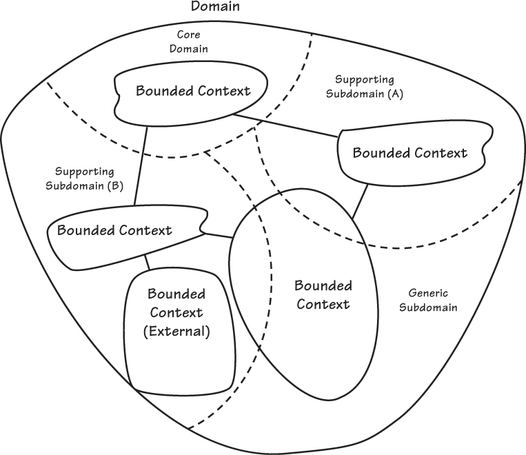

# MSA와 DDD에 대한 이해

## 1. 도메인

* 도메인은 소프트웨어로 해결하고자 하는 문제의 영역, 즉 개발하고자 하는 전체 서비스를 잘라낸 단위를 가리킨다.
* 즉, 비즈니스 영역이라 할 수 있다.

## 2. MSA 경계 구분하기

* 마이크로 서비스는 기술적 관심사보다 비즈니스 능력, 하위 도메인 등 비즈니스 관심사 위주로 구성된다. (DDD)
* 즉, MSA는 DDD를 기반으로 아키텍처 패턴을 정의한 것이다.
* 도메인 모델은 명확한 바운디드 컨텍스트 내, 혹은 마이크로서비스 내에 적용므로, 
바운디드 컨텍스트는 도메인 모델의 경계를 결정하고 `무엇이 응집되고 독립적으로 개발될 수 있을지` 보여준다.
* MSA 를 구성하기 위해서는 이러한 것들이 목표가 되므로, 결국 바운디드 컨텍스트의 명확한 정의가 반드시 필요한 것이다.

## 3. DDD의 주요 설계 원칙 - Loose Coupling(느슨한 결합)과 High Cohesion(높은 응집)

* 도메인들 간에는 Loose Coupling하고 도메인 내에서는 High Cohesion 해야 한다.
* 즉, 도메인을 잘 나누고(Loose Coupling) 어떤 서비스들을 하나의 도메인으로 잘 묶을지 (High Cohesion) 설계하는 것까지가 DDD나 MSA가 추구하는 지향점이 되어야 한다.

## 4. DDD와 MSA 설계 원칙

* 위 DDD의 설계 원칙(Loose Coupling과 High Cohesion)을 MSA에 적용하면, 
* 도메인 내 마이크로서비스와 도메인 외부 마이크로서비스로 구분될 것이고, 
* 내부 인터페이스인지 외부 인터페이스인지에 따라 마이크로서비스들 간의 커뮤니케이션 방식, 즉 설계 원칙이 달라질 것이다.

### MSA 설계 원칙

* Strong Module Boundaries (명확한 모듈 경계)   
    * 시스템 변경 사항이 발생하면, 변경할 특정 도메인 내 마이크로서비스 단위만 이해하고 처리하면 된다.
* Independent Deployment (독립적 배포) 
    * 최근 DevOps 환경에서 CI/CD가 자동화되고 강화될 수 있었던 것은 MSA의 힘이 크다. 
    * 이는 MSA가 배포 단위까지 고려해서 설계하기 때문이다.
* Technology Diversity (기술 다양성)
    * 각각의 마이크로서비스의 독립성이 강화되면서, 마이크로서비스 내의 기술 선택이 자유롭다.

# DDD

> "훌륭한 소프트웨어를 개발하고 싶다면 서비스 도메인에 귀를 기울여라" - DDD, 에릭 에반스

## 1. DDD에 대한 이해

### DDD를 사용하는 데서 오는 비즈니스 가치

* 조직이 그 도메인에 유용한 모델을 얻는다.
* 정교하게 정확하게 비즈니스를 정의하고 이해한다.
* 도메인 전문가가 소프트웨어에 설계에 기여한다.
* 사용자 경험이 개선된다.
* 순수한 모델 주변에 명확한 경계가 생긴다.
* 엔터프라이즈 아키텍처의 구성이 좋아진다.
* 애자일하고, 반복적이고 지속적인 모델링이 사용된다.
* 전략적인 동시에 전술적인 새로운 도구가 적용된다.

### DDD 적용의 난관

* 보편 언어를 만들어 도메인 전문가와 소통하기
* 개발자의 사고방식 전환 - 기술 뿐 아니라 도메인을 먼저 생각하자.

### DDD와 테스트

* 어떻게 도메인 모델이 동작해야 하고, 어떤 다양한 컴포넌트들이 동작하는지에 대한 시나리오를 작성하면 
이 설계에 대해 커뮤니케이션 할 수 있게 된다. 
* 이 시나리오를 가지고 도메인 모델을 검증하는데 사용할 수도 있다. (사례를 통한 명세, 행위 주도 개발)
* 즉, 공유된 이해를 기반으로 보편 언어와 모델을 협업을 통해 개발하고, 모델이 명세서를 준수하고 있는지 
인수 테스트를 만들어보면서 수행할 수 있다.
* 단위 테스트(given/when/then)를 통해서도 이와 비슷한 결과를 달성할 수도 있다. 

## 2. DDD 설계의 기초 - 바운디드 컨텍스트와 보편 언어

### 바운디드 컨텍스트

* Biz Domain의 사용자, 프로세스, 정책/규정 등을 고유한 비즈니스 목적별로 그룹핑한것
* 그 범주 내에서 소프트웨어 모델의 각 컴포넌트는 특정한 의미를 갖고, 특정한 일을 수행한다.
* 모델이 구현되는 곳이다. - 1개의 Bounded Context는 최소한 1개 이상의 Micro service로 구성된다.

### 보편언어

* 바운디드 컨텍스트 안에서 일하는 팀이 소프트웨어 모델을 생성한다.
* 그리고, 모든 팀 구성원이 사용하는 언어를 반영한다. 즉, 팀 모두가 보편언어의 표현이 가진 제약사항과 정확한 의미를 이해해야한다.
* 이 언어의 대표적인 기록 형태는 소프트웨어 모델의 소스 코드다.

### 기본적인 전략적 설계에 대해 - "핵심이 무엇인가?"

* 바운디드 컨텍스트는 전략적 계획의 핵심이 되는 모든 개념들을 밀접하게 유지하면서 포용해야 하고, 나머지는 모두 제외시켜야 한다. 
* 핵심이 무엇인지 알기 위해서는, 필수적인 2 그룹, `도메인 전문가` 와 `소프트웨어 개발자`를 하나로 묶어서 서로 협업하는 팀을만들어야 한다.
    * 도메인 전문가 - 비즈니스가 동작하는 방법에 대한 비전에 의미를 둔다.
    * 개발자 - 소프트웨어 개발에 중점을 둔다. 

### 서브 도메인 

* 전체 비즈니스 도메인의 하위 부분이며, 하나의 논리적 도메인 모델을 나타내는 것이라고 생각할 수도 있다. 
* 크든, 작든 비즈니스에 대한 전략적 의의가 있다. 
* 서브 도메인의 유형 중, 핵심 도메인 영역은 명시적인 바운디드 컨텍스트이자, 잘 정의된 도메인 모델이어야 한다.
* 레거시 시스템을 개선하는데 있어서 서브 도메인을 사용하는게 유용하다.
    * 얼기 설기 얽혀있는 거대한 진흙 모델에 대해, 논리적으로 도메인 모델을 나눠볼 수 있다. 
* DDD를 활용할 때, 바운디드 컨텍스트와 서브도메인은 1:1 관계를 맺는 것을 목표로 하자.  
이는, 바운디드 컨텍스트를 정확하게 유지시키고 핵심 전략 목표에 집중하는데 도움을 주기 때문이다.

### 컨텍스트 매핑 (상호작용) 

* Bounded Context간의 관계를 나타낸다.

### Event Storming

* 비즈니스 도메인 내에서 일어나는 시나리오를 찾아 Bounded Context를 식별하는 방법론
* https://happycloud-lee.tistory.com/94
* https://www.youtube.com/watch?v=QUMERCN3rZs
* 마이크로 서비스 패턴 Chapter 5에서 비즈니스 로직 설계, Aggregate 등을 다루고 있음.

# Refernece
* https://helloworld.kurly.com/blog/ddd-msa-service-development/
* https://happycloud-lee.tistory.com/94
* http://redutan.github.io/2018/04/28/IDDD-chapter02
