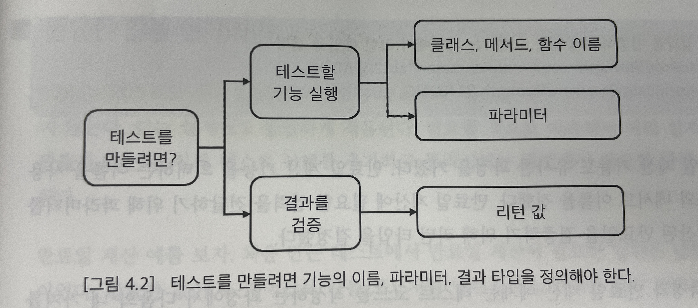
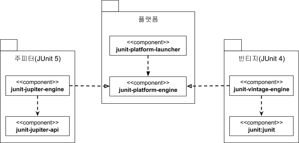

# Chapter 04 "TDD 기능 명세/설계"

## 1. 기능 명세

* 설계는 기능 명세로부터 시작한다. 
* 기능 명세의 입력과 결과를 코드에 반영하는 과정에서 기능의 이름, 파라미터, 리턴 타입 등이 결정되고, 이는 곧 기능에 대한 설계 과정과 연결되는 것이다.

## 2. 설계 과정을 지원하는 TDD

* TDD 는 테스트 코드를 먼저 만들고, 테스트를 통과시키기 위해 코드를 구현하고 리팩토링하는 과정을 반복한다.



* TDD 자체가 설계는 아니지만 TDD를 하다 보면 테스트 코드를 작성하면서 클래스/메서드 이름, 메서드 파라미터, 리턴 타입을 고민하게 되고 이 과정에서 일부 설계를 진행하게 된다.

### 필요한 만큼 설계하기

* TDD는 현 시점에서 테스트를 통과할 만큼만 코드를 작성하고, 필요할 것으로 예측해서 미리 코드를 만들지 않는다.<br>
(이전의 실습에서도, 테스트를 진행하는 과정에서 필요한 만큼만 설계를 변경하고 리팩토링을 하는 과정을 가졌다.)
* 이를 통해 설계가 불필요하게 복잡해지는 것을 방지할 수 있다.


## 3. 기능 명세 구체화

* 테스트 코드를 작성하려면 파라미터와 결과 값을 정해야 하므로, 개발자는 요구사항에서 기능의 입력과 결과를 도출해야 한다.
* 개발자는 테스트 케이스 사례를 추가하면서 기능 명세를 구체화하게 된다. 그리고 이 때 개발자는 최대한 예외적인 상황이나 복잡한 상황에 해당하는 구체적인 예를 끄집어내서 모호함을 없애야 한다. (윤년/평년 등)
* 테스트 코드를 이용하면 구체적인 예를 이용해서 기능을 바로 실행해 볼 수 있으므로, 유지보수에도 도움이 된다.

<hr>

# Chapter 05 "JUnit 기초"

## 1. JUnit 5 모듈 구성



* JUnit Platform을 기반으로 위에 JUnit 구현체 Jupiter, Vintage 모듈을 올려놓은 구조이다.
    * JUnit Platform: JUnit 테스트 코드를 실행해 주는 런처(luncher) 역할을 제공한다.
    * JUnit Jupiter: JUnit 5를 위한 테스트 API와 실행 엔진을 제공한다.
    * JUnit Vintage: JUnit 3과 4로 작성된 테스트를 JUnit 5 Platform에서 실행하기 위한 모듈을 제공한다.

```xml
dependencies {
    testImplementation 'org.junit.jupiter:junit-jupiter-api:5.8.1'
    testRuntimeOnly 'org.junit.jupiter:junit-jupiter-engine:5.8.1'
}

test {
    useJUnitPlatform()
}
```

* junit-jupiter-api를 테스트 구현으로 사용하고 JUnit Platform을 이용해서 테스트를 실행한다.

## 2. @Test 애노테이션과 테스트 메서드

* 테스트로 사용할 클래스를 만들고, 메서드에 @Test 애노테이션을 붙여주면 실행 가능하다.
* @Test 애노테이션을 붙인 메서드는 private이면 안된다.

```java
import org.junit.jupiter.api.Test;
import static org.junit.jupiter.api.Assertions.assertEquals;

public class CalculatorTest {

    @Test
    void plus() {
        int result = Calculator.plus(1, 2); // 기댓값, 검사값
        assertEquals(3, result);
        assertEquals(5, Calculator.plus(4, 1));
    }
}
```

## 3. 주요 단언 메서드

### 단언 메서드

|메서드|설명|
|-|-|
|assertEquals(expected, actual)|	실제 값(actual)이 기대하는 값(expected)과 같은지 검사한다.|
|assertNotEquals(unexpected, actual)|	실제 값(actual)이 특정 값(unexpected)과 같지 않은지 검사한다.|
|assertSame(Object expected, Object actual)|	두 객체가 동일한 객체인지 검사한다.|
|assertNotSame(Object unexpected, Object actual)|	두 객체가 동일하지 않은 객체인지 검사한다.|
|assertTrue(boolean condition)|	값이 true인지 검사한다.|
|assertFalse(boolean condition)|	값이 false인지 검사한다.|
|assertNull(Object actual)|	값이 null인지 검사한다.|
|assertNotNull(Object actual)|	값이 null이 아닌지 검사한다.|
|fail()|	테스트를 실패 처리한다.|

* fail()
    * 무조건 실패 에러 AssertionFailedError 발생시키고, 다음 라인부터 실행되지 않는다.

```java
public class asserttionFailTest {
    @Test
    void 테스트_실패_fail메서드() {
        fail("테스트 일부러 실패할거야.");
    }
}
```

### Assertions가 제공하는 익셉션 발생 유무 검사 메서드

* 만약 익셉션 발생 유무가 검증 대상이라면, fail() 메서드를 사용하는 것보다 아래 메서드를 사용하는 것이 더욱 명시적이다.

|메서드|설명|
|-|-|
|assertThrows(Class<T> expectedType, Executable executable)	|executable을 실행한 결과로 지정한 타입의 익셉션이 발생하는지 검사한다.|
|assertDoesNotThrow(Executable executable)|	executable을 실행한 결과로 익셉션이 발생하지 않는지 검사한다.|

```java
@Test
void assertThrowsTest() {
    // assertThrows()는 발생한 익셉션 객체를 리턴한다.
    IllegalArgumentException thrown = assertThrows(IllegalArgumentException.class,
            () -> {
                AuthService authService = new AuthService();
                authService.authenticate(null, null);
            });
    // 발생한 익셉션을 이용해서 추가로 검증이 필요하면 assertThrows()가 리턴한 익셉션 객체를 사용한다.
    assertTrue(thrown.getMessage().contains("id"));
}
```

### assert 메서드 동작 방식

* assert 메서드는 실패하면 다음 코드를 실행하지 않고 바로 익셉션을 발생한다.
* 일단 모든 검증을 실행하고, 그 중에 실패한 것이 있는지 확인하고자 할 때에는 assertAll()을 사용한다.
    * 실행 결과로 검증에 실패한 코드가 있으면 그 목록을 모아서 에러 메시지로 보여준다.

```java
@Test
void assertAllTest() {
    assertAll(
            () -> assertEquals(3, 5/ 2),
            () -> assertEquals(4, 2 * 2),
            () -> assertEquals(6, 11 / 2)
    );
}
```

> * 테스트 케이스에서 "Error"나 "Exception"이 발생하면 테스트는 실패가 되고 실행을 중지한다.
> * 테스트 케이스에 "fail"이나 "assert~"가 없다면 무조건 성공으로 처리한다.

## 4. 테스트 라이프사이클

### JUnit의 코드 실행 순서
1. 테스트 메서드를 포함한 객체 생성. @Test 메서드를 실행할 때마다 객체를 새로 생성한다.
1. (존재하면) @BeforeEach 메서드 실행
1. @Test 메서드 실행
1. (존재하면) @AfterEach 메서드 실행

### @BeforeEach 과 @AfterEach

* @BeaforeEach
    * 테스트를 실행하는데 필요한 준비 작업을 할 때.
    * 예: 테스트에서 사용할 임시 파일 생성, 테스트 메서드에서 사용할 객체 생성
* @AfterEach
    * 테스트를 실행한 후에 정리할 것이 있을 때.
    * 예: 테스트에서 사용한 임시 파일 삭제
* 위 애노테이션이 붙은 메서드는 private 이면 안된다.

### @BeaforeAll 과 @AfterAll

* @BeforeAll
    * 한 클래스의 모든 테스트 메서드가 실행되기 전에 특정 작업을 수행해야 할 때.
    * static 메서드에 붙인다.
    * 이 메서드는 클래스의 모든 테스트 메서드를 실행하기 전에 한 번 실행된다.
* @AfterAll
    * 클래스의 모든 테스트 메서드를 실행한 뒤에 실행된다.

## 5. 테스트 메서드가 서로 필드를 공유한다거나 실행 순서를 가정하고 테스트를 작성하지 말아야 한다.

```java
public class BadTest {
    private FileOperator op = new FileOperator();
    private static File file;   // 두 테스트가 데이터를 공유할 목적으로 static 필드로 정의

    @Test
    void fileCreationTest() {...}

    @Test
    void readFileTest() {...}
}
```

* 테스트 메서드가 특정 순서대로 실행된다는 가정 하에 테스트 메서드를 작성하면 안 된다.
    * JUnit이 테스트 순서를 결정하긴 하지만 그 순서는 버전에 따라 달라질 수 있다.
* 각 테스트 메서드는 서로 독립적으로 동작해야 한다.
    * 한 테스트 메서드의 결과에 따라 다른 테스트 메서드의 실행 결과가 달라지면 안 된다.
    * 테스트 메서드 간에 의존이 생기면 이는 테스트 코드의 유지 보수를 어렵게 만든다.

## 6. 추가 어노테이션

### @DisplayName, @Disabled

* @DisplayName - 테스트에 표시 이름을 붙인다.
* @Disabled - 특정 테스트를 실행하고 싶지 않을 때.

### 태깅과 필터링

* @Tag - 클래스와 테스트 메서드에 적용할 수 있다.
* 메이븐이나 그래들에서 실행할 테스트를 선택할 수 있다. 

```
test {
    useJUnitPlatform {
        includeTags 'assertionsTest'
        excludeTags 'basic-test'
    }
}
```

### 테스트 메시지

* assertEquals() 메서드의 세번째 인자로 설명 문자열을 추가할 수 있다.

### @TempDir

* 임시 폴더를 생성하고, @TempDir 애노테이션을 붙인 필드나 파라미터에 임시 폴더 경로를 전달한다. (File 이나 Path 타입에 적용할 수 있다.)
* 어노테이션 위치
    * 필드에 적용 
        * 테스트 메서드를 실행하기 전에 임시 폴더를 생성하고 그 폴더 정보를 해당 필드에 할당한다.
        * 각 테스트 메서드를 실행할 때마다 임시 폴더를 생성한다.
    * 테스트 메서드 파라미터에 적용
        * 특정 테스트 메서드에서만 임시 폴더를 생성해서 사용하고 싶을 때.
    * 특정 테스트 클래스 단위로 임시 폴더를 생성하고 싶다면 static 필드에 @TempDir 애노테이션을 붙이거나, @BeforeAll 메서드의 파라미터에 @TempDir 를 적용한다.
* 테스트를 실행한 뒤에는 생성한 임시 폴더 및 파일을 삭제한다.

```java
public class TempDirTest {
    // 테스트 메서드를 실행하기 전에 임시 폴더를 생성하고 그 폴더 정보를 tempFolder 필드에 할당한다.
    @TempDir
    File tempDirectory;

    @Test
    void test1() {
        // 파일 생성 등 작업
        System.out.println(tempDirectory.getAbsolutePath());
    }

    // 필드에 적용하면 각 테스트 메서드를 실행할 때마다 임시 폴더를 생성한다.
    @Test
    void test2(@TempDir Path tempFolder) {
        System.out.println(tempFolder);
    }

    @Test
    void test3() {
        System.out.println(tempDirectory.getAbsolutePath());
    }
}
```

### 테스트 실행 시간 검증

* @Timeout() - 테스트가 일정 시간 내에 실행되는지 검증할 수 있다.

<hr>

# Chapter 06 "테스트 코드의 구성"

## 1. 상황 찾기

* 주어진 상황에 따라 기능 실행 결과는 달라진다.<br>
어떤 상황이 실행 결과에 영향을 줄 수 있는지, 다양한 예외 상황을 찾아내고 이를 코드에 반영해야 한다.

## 2. 테스트 코드의 구성 요소: 상황, 실행, 결과 확인

```java
// given
// when
// then
```

## 3. 외부 상황과 외부 결과

* 상황 설정에 테스트 대상 뿐 아니라 외부 요인도 있을 수 있는데, <br>
테스트 코드 안에서 상황을 명시적으로 구성하면, 내용을 이해하기 쉽다.<br>
    * 예: 파일을 미리 만들어 두지 않고, 테스트 코드에서 상황에 맞는 파일을 생성하면, 다른 개발자도 테스트를 실행할 수 있다.
* 외부 상태가 테스트 결과에 영향을 주지 않도록 한다.
    * 테스트 코드는 반복적으로 실행해서 문제가 없는지 검증해야 한다. 그렇기 때문에 테스트는 언제 실행해도 항상 정상적으로 동작하는 것이 중요하다.
    * 예: 회원 가입 로직 테스트 시, ID 생성 후에 트랜잭션을 롤백 한다.
* 외부 API 등, 외부 요인은 테스트 코드에서 마음대로 제어할 수 없는 경우가 많다. 이 때 대역을ㄹ 사용하면 테스트 작성이 쉬워진다.
    * 대역: 테스트 대상이 의존하는 대상의 실제 구현을 대신하는 구현 (Chapter 07)
