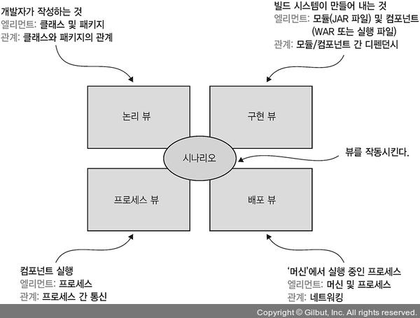
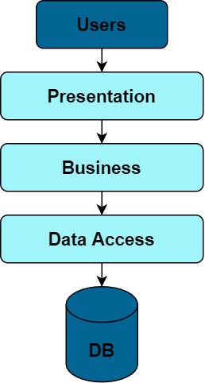
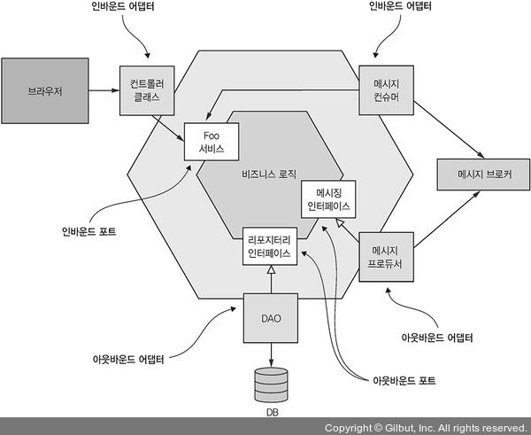
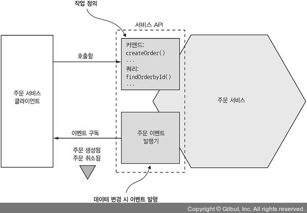
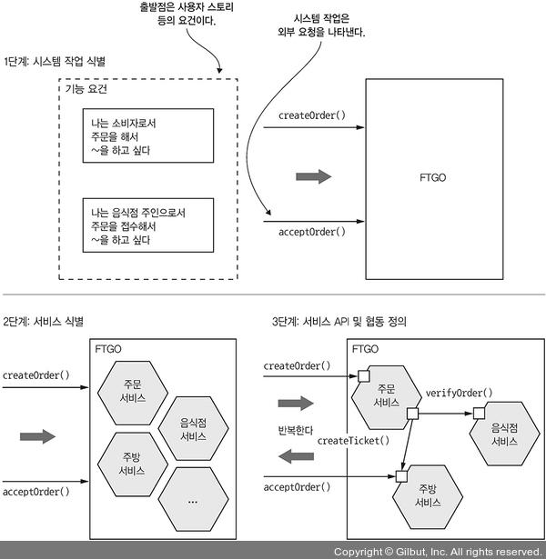
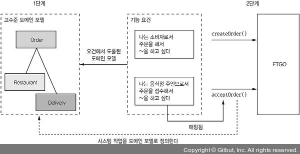
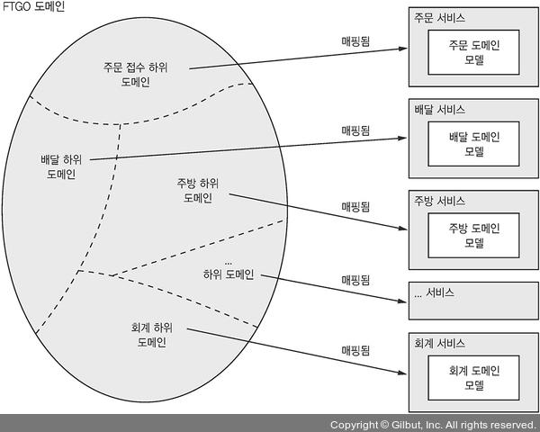

# Chapter 02 "분해 전략"

### 핵심

* 서비스를 어떻게 정의하느냐
* 서비스는 기술 관심사보다는 비즈니스 관심사를 중심으로 구성됨 (DDD)

### 목표

* 소프트웨어 아키텍처 관점에서 마이크로서비스 아키텍처 정의
* 애플리케이션의 요건 정의, 마이크로서비스를 정의하는 과정 기술

### Summary

* 마이크로 서비스는 기술적 관심사보다 비즈니스 능력, 하위 도메인 등 비즈니스 관심사 위주로 구성된다.

## 1. 마이크로서비스 아키텍쳐란 무엇인가?

### 1.1. 소프트웨어 아키텍처의 정의와 중요성

#### 소프트웨어 아키텍처의 정의

* 컴퓨팅 시스템의 소프트웨어 아키텍처는 소프트웨어 엘리먼트(element)와 그들 간의 관계, 그리고 이 둘의 속성(property)으로 구성된 시스템을 추론하는 데 필요한 구조(structure)의 집합이다.
*  → 즉, 분해 전략에서는 엘리먼트의 분해와 파트간의 연관관계를 어떻게 잘 풀어낼 것인지가 중요하다.

#### 소프트웨어 아키텍처의 4+1 뷰 모델

* 각 뷰는 아키텍처의 특정한 측면을 기술하고, 특정 소프트웨어 엘리먼트와 그들 사이의 관계로 구성된다.
* 각 뷰의 시나리오는 뷰의 여러 엘리먼트가 협동하는 과정을 명시한다.

#### 애플리케이션의 요건 - 아키텍처의 중요성 

* 기능 요건 - 애플리케이션이 해야 할 일을 정의
* 서비스 품질 요건 - 확장성, 신뢰성, 관리성, 테스트성, 배포성 등

### 1.2. 아키텍처 스타일 개요

* MSA 를 말하기 이전에, 소프트웨어 아키텍처를 먼저 생각하고 이해해야 한다.
* MSA를 구성하는 어플리케이션의 아키텍쳐 스타일은 여러가지가 있지만 
그중 예전방식의 Layered architecture와 책에서 구현하고자 하는 Hexagonal architecture에 대한 내용을 보자.

#### 계층화 아키텍처 스타일 (Layered architecture)

* 소프트웨어 엘리먼트를 계층별로 구성하는 전형적인 아키텍처 스타일
* 계층마다 명확히 정의된 역할을 분담

3계층 아키텍처 - 계층화 아키텍처를 논리 뷰에 적용한 사례

* Presentation Layer: 사용자 인터페이스 또는 외부 API가 구현된 계층
* Business Logic Layer: 비즈니스 로직 계층
* Persistence Layer: DB 상호 작용 로직이 구현된 계층

단점

* 표현 계층이 하나 뿐이다. 
    * → 호출하는 시스템이 많을 경우 고민
* 영속화 계층이 하나 뿐이다.
    * → DB 가 여러개일 경우 고민
* 비즈니스 로직 계층을 영속화 계층에 의존하는 형태로 정의한다.
    * → DB 디펜던시에 의존하기때문에 DB가 없는 테스트가 어려움.
* 일반적으로, 비지니스 로직 계층은 인터페이스 리파지터리를 정의하고, 
영속화 계층은 그 인터페이스를 구현한 DAO 클래스를 정의한다.  
결국, 실제 디펜던시는 계층화 아키텍처의 정의와는 반대이다.

#### 육각형 아키텍처 스타일 (Hexagonal architecture)

* 어댑터 - 비즈니스 로직 및 외부 시스템과 통신
* 포트 - 비즈니스 로직이 자신의 외부 세계와 상호 작용하는 방법이 정의된 작업 (예: 자바의 인터페이스)

* 인바운드 어댑터
    * 기존 layered architecture 의 표현 계층 대신
    * 외부에서 들어온 요청을 인바운드 포트를 호출하여 처리한다.
    * 예) REST end-point, 스프링 MVC 컨트롤러, 메시지를 구독하는 메시지 브로커 클라이언트
* 아웃바운드 어댑터: 
    * 기존 layered architecture 의 영속화 계층 대신
    * 비즈니스 로직에서 들어온 요청을, 외부 애플리케이션/서비스를 호출하여 처리한다.
    * 예) DB 작업이 구현된 DAO 클래스, 원격 서비스를 호출하는 프로시 클래스
    * 이벤트를 발행하기도 한다.

장점

* 비즈니스 로직에 있던 표현/데이터 접근 로직이 어댑터와 분리되었기 때문에 
비즈니스 로직이 표현/데이터 접근 로직, 어댑터 어디에도 의존하지 않는다.
* 따라서, 비즈니스 로직만 따로 테스트하기 쉽다.
* Inbound adapter와 Outbound adapter로 시스템간의 교류를 통제함으로써 각각의 역할과 책임이 분리된다.

### 1.3. MSA 는 일종의 아키텍처 스타일이다.

* 모놀리식 아키텍처: 애플리케이션을 실행/배포 가능한 단일 컴포넌트로 구성한다. 
    * 육각형 아키텍처 방식으로 구성한 논리 뷰를 가질 수 있다.
* 마이크로 서비스 아키텍처: 애플리케이션을 `느슨하게` 결합된, 독립적으로 배포 가능한 여러 `서비스`로 구성한다.
    * 구현 뷰를 다수의 컴포넌트로 구성한다.
    * 컴포넌트는 곧 서비스(비즈니스 능력)고, 각 서비스는 자체 논리 뷰 아키텍처를 갖고 있다.

#### 서비스란 무엇인가?

* 서비스: 어떤 기능이 구현되어 단독 배포가 가능한 소프트웨어 컴포넌트
* 클라이언트가 자신이 서비스하는 기능에 접근할수 있도록 API 제공
    * 커맨드 - 명령/CUD
    * 쿼리 - 조회/R
    * 이벤트 발행
* 서비스 API는 내부 구현 상세를 캡슐화하여, 모듈성이 보장된다.

#### 느슨한 결합

* 서비스는 구현 코드를 감싼 API 를 통해서만 상호 작용 하므로 
클라이언트에 영향을 끼치지 않고 서비스 내부 구현 코드를 바꿀수 있다.
* → 유지보수성, 테스트성을 높이고, 개발 시간을 단축하는 효과가 있다.
* 서비스가 직접 DB와 통신하는 일은 불가능하고, DB 테이블을 서로 공유하지 않기 때문에 runtime isolation도 향상된다.
    * [의견] 이건 완벽한 의미의 MSA ... 즉 DB 까지 분리한 환경을 말하는 거겠지? 
    그런데 실제로 커머스에서.., 주문 등의 서비스에서 DB 분리가 가능 한가?  
    1건의 주문 일어날때 호출해야하는 API 가 여러개일텐데...그게 서버에서 감당이 가능해?

#### 공유 라이브러리의 역할

* 변경 가능성이 조금이라도 있는 기능이라면, 라이브러리 하나에 모두 패키징해 배포하는 것이 아니라, 별도의 서비스로 구현하는 것이 낫다.
* 서비스 코드 중복을 줄이는 것은 좋지만, 의도치 않은 서비스간 결합도를 유발하지 않아야 한다.

#### 서비스 규모는 별로 중요하지 않다.

* 크기보다는 작은 팀이 가장 짧은 시간에, 다름 팀과 협동하는 부분은 최소로 하여 개발 가능한 서비스를 설계해야 한다.
* 유지보수성, 테스트성, 배포성, 애플리케이션 확장성 향상
* 현재 애플리케이션의 서비스를 어떻게 식별하고 서비스를 서로 협동시킬지 결정하는 것이 관건이다.

## 2. 마이크로서비스 아키텍처 정의

3단계 프로세스

> 어플리케이션을 잘게 나누고 시작하는것이 아닌, 
어플리케이션에 접근하는 관점을 점차 확장시켜나가는 것이 마이크로서비스 아키텍처를 정의하는 과정이다.

* 1단계: 애플리케이션 요건을 핵심 요청으로 추출
* 2단계: 어떻게 여러 서비스로 분해할지 결정
* 3단계: 서비스별로 API 정의
    * 1단계에서 식별된 시스템 작업을 각 서비스에 배정
    * 여러 서비스가 협동하는 방식을 결정

분해 과정의 장애물

* 네트워크 지연 - 서비스간 왕복이 너무 잦아 실제로 분해할 수 없는 경우도 있음.
* 서비스 간 동기 통신으로 인해 가용성이 떨어짐. - 자기 완비형 서비스 개념으로 해결 (3장 내용)
* 여러 서비스에 걸쳐 데이터 일관성 유지 (사가, 4장)
* 애플리케이션 도처에 숨어 있는 만능 클래스 - DDD 개념을 활용하면 제거 가능

### 2.1. [1단계] 시스템 작업 식별

2단계 프로세스로 시스템 작업을 정의

* 1단계: 고수준 도메인 모델을 생성
    * 시스템 작업을 기술하기 위해 필요한 보케쥴러리를 제공하는 핵심 클래스로 구성
* 2단계: 시스템 작업 식별 후, 그 동작을 도메인 모델 관점에서 기술

#### 고수준 도메인 모델 생성

* 시스템 작업의 동작을 기술하는데 필요한 보케블러리를 정의
* 시나리오를 확장하여 도메인 모델을 생성하고, 각 클래스들의 역할을 정의하여 클래스 다이어그램을 작성할 수 있음.

#### 시스템 작업 정의 - 애플리케이션이 어떤 요청을 처리할지 식별

* 커맨드(command, 명령): 데이터 생성, 수정, 삭제 (CRU)
    * 아키텍처와 연관된 시스템 작업은 대부분 커맨드이다. (선행/후행조건 필요)
* 쿼리(query, 조회): 데이터 읽기(R)

> 고수준 도메인 모델과 시스템 작업을 보면 애플리케이션이 무슨 일을 하는지 알 수 있기 때문에, 아키텍처를 정의하는데 유용하다. 

### 2.2. [2단계] 서비스 정의: (1) 비즈니스 능력에 따라 분해

1. 비즈니스 능력은 곧 조직이 하는 일이다.
1. 비즈니스 능력 식별
    * 비즈니스 능력은 보통 특정 비즈니스 객체에 집중하며, 여러 개의 하위 능력으로 분해할 수 있다.  
1. 위에서 도출한 비즈니스 능력으로 여러 서비스를 정의한다. 

### 2.3. [2단계] 서비스 정의: (2) 하위 도메인 패턴별 분해

* DDD(Domain-driven Design): 하위 도메인별로 서비스를 정의한다.
* 하위 도메인(sub-domain)
    * DDD는 도메인을 구성하는 각 하위 도메인마다 도메인 모델을 따로 정의한다.
    * 비즈니스 능력과 같은 방법으로 식별하므로, 비즈니스 능력과 유사한 하위 도메인이 도출된다.
* 경계 컨텍스트(bounded context)
    * 도메인 모델의 범위
    * 도메인 모델을 구현한 코드 아티팩트를 포함한다.
    * MSA에 DDD 를 적용하면, 각 서비스가 경계 컨텍스트가 된다.

* 각각 자체 도메인 모델을 가진 서비스에 하위 도메인을 매핑함.
* 자체 도메인 모델을 가진 하위 도메인이라는 개년ㅁ 덕분에, 만능 클래스를 제거하고 서비스로 분해하기가 더 수월해진다.

### 2.4. 분해 지침

객체 지향 설계에 근거한 2가지 원칙

* 단일 책임 원칙 (SRP)
    * 클래스는 단 한개의 책임을 가져야 한다. 
    * 클래스는 오직 하나의 변경 사유를 가져야 한다.
    * MSA 적용) 주문~배달 과정 하나하나 모두 개별 서비스가 맡아 처리한다.
* 공동 폐쇄 원칙(CCP)
    * 어떤 두 클래스가 동일한 사유로 맞물려 변경되면 동일한 패키지에 있어야 한다.
    * 애플리케이션의 유지보수성이 현저히 향상된다.
    * MSA 적용) 동일한 사유로 변경되는 컴포넌트를 모두 같은 서비스로 묶을 수 있다. 

### 2.5. 서비스 분해의 장애물

* 네트워크 지연 - 서비스를 여러 개로 나누면 서비스 간 왕복 횟수가 급증
    * 한 차례 왕복으로 여러 객체를 한 번에 가져오는 배치 API 구현
    * 값비싼 IPC 를 언어 수준의 메서드나 함수 호출로 대체
* 동기 IPC로 인한 가용성 저하
    * 비동기 메시징으로 강한 결합도를 제거하고 가용성을 높임 (3장)
* 여러 서비스에 걸쳐 데이터 일관성 유지 (atomically)
    * saga (4장) - 메시징을 이용한 일련의 로컬 트랜잭션
        * 최종 일관성 보장: 실시간 동기화는 불가능하지만, 결국 언젠가는 동기화되어 일관성이 맞추어진다.
        * 어떤 데이터를 원자적으로 업데이트 해야 한다면 그 데이터를 하나의 서비스 내부에 두어야 한다.
* 여러 DB에 걸친 데이터의 일관된 뷰 확보
* 분해를 저해하는 만능 클래스
    * 굉장히 많은 필드가 다수의 컬럼을 가진 DB 테이블에 매핑된 경우가 많음.
    * DDD를 적용하여, 각 서비스를 자체 도메인 모델을 갖고 있는 개별 하위 도메인으로 취급한다.

### 2.6. [3단계] 서비스별 API(작업과 이벤트) 정의

1. 시스템 작업을 서비스로 배정 - 어느 서비스가 요청의 진입점인지 결정
1. 서비스 간 협동 지원에 필요한 API 확정 - 면밀한 분석 필요

