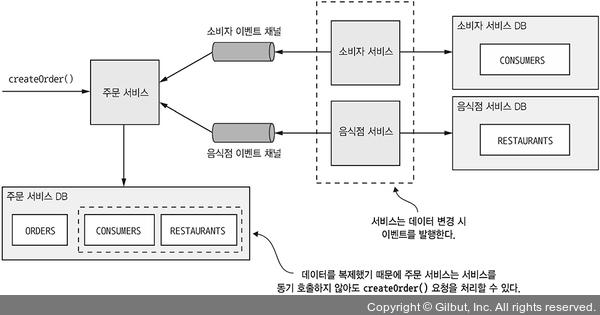

# Chapter 03 "프로세스 간 통신"

## Summary

* 마이크로서비스 아키텍쳐는 분산 아키텍처이므로 IPC가 중요한 역할을 한다.
* API 정의 및 발전 과정을 잘 관리해야 한다.
* IPC 기술은 무척 다양하지만, 각자 일장일단이 있다.
    * 사용성은 동기 RPC 프로토콜(예: REST)가 좋지만, 서비스 가용성을 높이려면 비동기 메시징 기반으로 서비스끼리 통신하는 것이 좋다.
* 시스템 전체에 실패가 전파되는 현상을 방지하려면, 동기 프로토콜을 쓰는 서비스 클라이언트가 부분 실패를 처리할 수 있게 설계해야 한다. 
    * 타임아웃
    * 회로 차단기 패턴
* 동기 프로토콜을 쓰는 아키텍처는 클라이언트가 서비스 인스턴스의 네트워크 위치를 찾을 수 있게 서비스 디스커버리 장치를 달아 주어야 한다.
    * 배포 플랫폼(서버 쪽 디스커버리 및 서드파티 등록 패턴)
    * 애플리케이션 수준 (클라이언트 쪽 디스커버리 및 자가 등록 패턴) - 다중 배포 플랫폼에서 서비스를 실행하는 경우에도 처리가 가능
* 메시지를 DB 트랜잭션에 태워 확실하게 전송해야 한다.
    * 트랜잭셔널 아웃박스 패턴 - 일단 메시지를 DB 트랜잭션의 일부로 DB에 쓴다.
    * 폴링 발행기 패턴 또는 트랜잭션 로그 테잉일 패턴 - 별도 프로세스가 DB 에서 메시지 조회 후 메시지 브로커에 발행한다.

## 1. 마이크로서비스 아키텍처 IPC 개요

### 1.1. 클라리언트/서비스 간 상호 스타일

|서비스|일대일|일대다|
|--|--|--|
|동기|요청/응답|-|
|비동기|비동기 요청/응답 단방향 알림|발행/구독 발행/비동기 응답|

#### 동기/비동기

* 동기: 클라이언트는 서비스가 제시간에 응답하리라 기대하고 대기 도중 블로킹 할 수 있음.
* 비동기: 클라이언트가 블로킹하지 않음. 응답은 즉시 전송되지 않아도 됨.

#### 일대일/일대다

* 일대일: 각 클라이언트 요청은 정확히 한 서비스가 처리함.
    * 요청/응답: 클라리언트는 서비스에 요청을 하고 응답을 기다림. 서비스가 서로 강하게 결합되는 상호 작용 스타일.
    * 비동기 요청/응답: 클라이언트는 서비스 요청, 서비스는 비동기적으로 응답.
    * 단방향 알림: 클라이언트는 서비스에 일방적으로 요청만 하고, 서비스는 응답을 보내지 않음.
* 일대다: 각 클라이언트 요청을 여러 서비스가 협동하여 처리함.
    * 발행/구독: 클라리언트는 `알림` 메시지를 발행하고, 구독 중인 0개 이상의 서비스가 메시지를 소비함.
    * 발행/비동기 응답: 클라이언트는 요청 메시지를 발행하고, 주어진 시간동안 서비스가 응답하기를 기다림.

### 1.2. 마이크로 서비스 API 정의

* 서비스 API는 서비스와 그 클라리언트 간의 약속이므로 
서비스 API를 IDL(Interface Definition Language, 인터페이스 정의 언어)로 정확하게 정의해야 한다.
* [`선 설계 후 구현 방식`](https://www.programmableweb.com/news/how-to-design-great-apis-api-first-design-and-raml/how-to/2015/07/10) 으로 진행하면, 클라이언트 니즈에 좀 더 부합한 서비스를 구축할 수 있다.

### 1.3. API 를 발전시키기 위한 전략

* 시맨틱 버저닝
    * API를 올바르게 버저닝하여 일정한 규칙에 맞게 발전시킴.
    * {MAJOR.MINIOR.PATCH}
        * MAJOR: 하위 호환되지 않는 변경분
        * MINOR: 하위 호환되는 변경분
        * PATCH: 하위 호환되는 오류 수정 시
* 변경을 하더라도 가급적 하위 호환성을 보장하는 방향으로 해야 한다.
* 중대한, 기존 버전과 호환이 안 되는 변경을 API 에 적용해야 할 때에는 
일정 기간 동안 서비스는 신구 버전 API를 모두 지원해야 한다.

### 1.4. (범언어적) 메시지 포맷. 즉, 데이터 포맷

* 텍스트 메시지 포맷
    * [XML 스키마](https://ko.wikipedia.org/wiki/XML_%EC%8A%A4%ED%82%A4%EB%A7%88_(W3C)) 와 [JSON 스키마](https://json-schema.org/)
    * 장점: 사람이 읽을 수 있고, 그 자체만으로 의미가 분명하다.
    * 단점: 메시지가 길다. / 모든 메시지에 속성값 이외에 속성명이 추가되는 오버헤드가 있다
* 이진 메시지 포맷
    * [프로토콜 버퍼](https://ko.wikipedia.org/wiki/%ED%94%84%EB%A1%9C%ED%86%A0%EC%BD%9C_%EB%B2%84%ED%8D%BC)와 [아브로](https://ko.wikipedia.org/wiki/%EC%95%84%ED%8C%8C%EC%B9%98_%EC%95%84%EB%B8%8C%EB%A1%9C)(구조화된 데이터를 직렬화하는 방식)
    * 효율과 성능 중시
    * 메시지 구조 정의에 필요한 타입 IDL을 제공하며, 컴파일러는 메시지를 직렬화/역직렬화하는 코드를 생성한다. 
    → 따라서 서비스를 API 우선 접근 방식으로 설계할 수 밖에 없다.

## 2. 동기 RPI 패턴 응용 통신

* RPI: 클라이언트가 서비스에 요청을 보내면 서비스가 처리 후 응답을 회신하는 IPC
* 클라이언트는 REST 같은 동기식 RPI 프로토콜로 서비스를 호출한다.

### 2.1. 동기 RPI 패턴: REST

* HTTP로 소통하는 IPC
* URL로 참조되는 `리소스`를 가공(조작)
* [REST 성숙도 모델(레너드 리처드슨) - 진정한 Restful이란?](https://velog.io/@younge/REST-API-%EC%84%B1%EC%88%99%EB%8F%84-%EB%AA%A8%EB%8D%B8-Maturity-Model-eqqyjqff)
    * Level 0 : 1 URI, 1 HTTP method.
        * 단 하나의 endpoint를 사용하고, 전달되는 서로 다른 매개변수를 통해 하나의 endpoint에서 여러 동작을 하게 된다.
        * 매개 변수를 body로 전달하기 위해 HTTP method는 POST가 된다.
    * Level 1 : N URI, 2 HTTP method
        * 리소스 개념을 도입한다.
        * 모든 요청을 단일 서비스 endpoint로 보내는 것이 아니라 개별 리소스와 통신하게 된다. 
        리소스별로 고유한 URI를 사용해서 식별한다.
    * Level 2 : N URI, 4 HTTP method
        * HTTP method인 GET, POST, PUT, DELETE를 사용해 CRUD를 수행한다.
        * GET은 상태를 변화시키지 않는 안전한 Action을 나타내고, 안전하게 얼마든지 호출할 수 있고 매번 같은 결과를 얻도록 한다. 
        * 따라서 캐싱을 할 수 있어 웹 인프라를 활용할 수 있다.
    * Level 3 : Hypermedia As Engine of Application State (HATEOAS, 애플리케이션 상태 엔진으로서의 하이퍼미디어) 원칙 기반
        * API 서비스의 모든 endpoint를 최초 진입점이 되는 URI를 통해 Hypertext Link 형태로 제공한다. 
        * 단순한 API 목록 제공뿐만 아니라 어떤 request의 다음 request에 필요한 endpoint까지 제공한다. 
        * 클라이언트에게 다음에 어떤 동작이 가능한지 힌트를 제공할 수 있다.
* REST API IDL - Swagger 
* 요청 한 번으로 많은 리소스를 가져오기 어렵다.
    * API 에 연관된 리소스도 함께 조회하도록 쿼리 매개변수를 지정하면, 시나리오가 복잡해져 효율이 떨어진다.
    * → 데이터를 효율적으로 조회할수 있게 설계된 [GraphQL](https://tech.kakao.com/2019/08/01/graphql-basic/) 또는 [넷플릭스 팔코](https://devcoding.tistory.com/23) 등의 대체 API 기술이 인기
* 장점
    * 단순하고 익숙하다.
    * Postman, curl 등을 사용해서 간편하게 테스트할 수 있다.
    * 요청/응답 스타일의 통신을 직접 지원한다.
    * HTTP는 방화벽 친화적이다. - 단일 포트를 사용하고, 인터넷에서 서버 접속이 가능하며, TCP를 사용하는 등 방화벽 입장에서 쉽게 접근 가능
    * 중간 브로커가 필요하지 않아 시스템 아키텍쳐가 단순하다.
* 단점
    * 요청/응답 방식의 통신만 지원한다.
    * 가용성이 떨어진다. - 중간에서 메시지를 버퍼링하는 매개자 없이 클라이언트/서비스가 직접 통신하기 때문에 양쪽 다 실행중이어야 한다.
    * 클라이언트가 URL을 을 알고 있어야 한다. - 그러나, 요즘은 서비스 디스커러비 메커니즘을 이용해 클라이언트가 서비스 인스턴스 위치를 찾을 수 있다.
    * 요청 한 번으로 많은 리소스를 가져오기 어렵다.
        * API 에 연관된 리소스도 함께 조회하도록 쿼리 매개변수를 지정하면, 시나리오가 복잡해져 효율이 떨어진다.
        * → 데이터를 효율적으로 조회할수 있게 설계된 [GraphQL](https://tech.kakao.com/2019/08/01/graphql-basic/) 또는 [넷플릭스 팔코](https://devcoding.tistory.com/23) 등의 대체 API 기술이 인기
    * 다중 업데이트 작업을 HTTP 동사에 매핑하기 어렵다.
        * /orders/{orderId}/cancel 과 같이 url끝에 하위 리소스를 정의해 해결하는 방법도 있다. 
        * 하지만 REST답지 않은 스타일 때문에 gRPC같은 대체기술로 문제를 해결하기도 한다.

### 2.2. 동기 RPI 패턴: gRPC

* [gRPC](https://meetup.toast.com/posts/261): 다양한 언어로 클라이언트/서버를 작성할 수 있는 프레임워크
* 이진 메시지 기반의 프로토콜이므로, 서비스를 API 우선 방식으로 설계할 수 밖에 없다. 
* 클라이언트/서버는 프로토콜 버퍼 포맷의 이진 메시지를 HTTP/2를 통해 교환한다.
* 장점
    * 다양한 업데이트 작업이 포함된 API를 설계하기 쉽다.
    * 특히 큰 메시지를 교환할 때 콤팩트하고 효율적이다.
    * 양방향 스트리밍 덕분에 RPI, 메시징 두 가지 통신 방식 모두 가능하다.
    * 다양한 언어로 작성된 클라이언트/서버 간 연동이 가능하다.
* 단점
    * 자바스크립트 클라이언트가 하는 일이 REST/JSON 기반 API 보다 더 많다.
    * 구형 방화벽은 HTTP/2를 지원하지 않는다.
* gRPC 또한 REST 처럼 동기 통신하는 매커니즘이기 때문에 부분 실패를 해결해야 한다.

### 2.3. 부분 실패 처리: 회로 차단기 패턴

* 부분 실패가 전체 시스템에 영향을 주지 않도록 서비스를 설계해야 한다.
* circuit breaker: 연속 실패 횟수가 주어진 임계치를 초과하면, 일정 시간 동안 호출을 즉시 거부하는 RPI 프록시
* 솔루션 1) [견고한 RPI 프록시 설계](https://netflixtechblog.com/fault-tolerance-in-a-high-volume-distributed-system-91ab4faae74a)
    * 응답 대기에 타임 아웃을 걸어 둔다.
    * 미처리 요청 개수 제한: 클라리언트가 특정 서비스에 요청 가능한 미처리 요청의 최대 개수를 설정
    * **회로 차단기 패턴**: 성공/실패 요청 개수를 지켜보다가 에러율이 주어진 임계치를 초과하면 그 이후 시도는 바로 실패 처리
* 솔루션 2) 원격 서비스가 실패하면 어떻게 조치해야 할지 결정 (Fail Over)
    * 캐시된 버전의 데이터 또는 에러를 반환
        * 호출한 서비스가 각각 실패할 경우를 대비한 대응 방안이 준비되어 있어야 한다.
    * **서비스 디스커버리에 의존** 
        * 어떤 서비스가 다른 서비스를 RPI로 호출할 때 해당 서비스 인스턴스의 네트워크 위치를 알고 있어야 한다.

### 2.4. 서비스 디스커버리

* 마이크로서비스 기반의 어플리케이션들은 인스턴스마다 네트워크 위치들이 동적으로 배정되거나, 자동 확장, 실패등 변화할 요인이 많기 때문에 이를 관리할 필요성이 있다.
* 구현 방법 1) 애플리케이션 수준의 서비스 디스커버리 패턴 적용 - 클라이언트/서비스가 직접 서비스 레지스트리와 상호 작용
    * 
    * 서비스 인스턴스는 자신의 네트워크 위치를 서비스 레지스트리에 등록하고, 
    서비스 클라이언트는 이 서비스 레지스트리부터 전체 서비스 인스턴스 목록을 가져와 그중 한 인스턴스로 요청을 라우팅 한다.
    * 적용 패턴 2가지
        1. 자가 등록 패턴 - 서비스 인스턴스는 서비스 레지스트리에 자기 자신을 등록한다.
        1. 클라이언트쪽 디스커버리 패턴 - 서비스 클라이언트는 서비스 레지스트리에 있는 가용 서비스 인스턴스 목록을 조회하고 부하 분산한다.
* 구현 방범 2) 플랫폼에 내장된 서비스 디스커버리 패턴 적용
    * 
    * 서비스 클라이언트가 DNS명/VIP를 요청하면, 배포 플랫폼이 알아서 가용 서비스 인스턴스 중 하나로 요청을 라우팅한다.
    * 배포 플랫폼이 서비스 등록, 서비스 디스커버리, 요청 라우팅을 전부 관장한다.
    * 서비스 관련 디스커버리 관련 코드는 클라이언트/서비스 어느 쪽에도 없기 때문에 
    서비스 개발 언어와 상관 없이 모든 클라이언트/서비스에 곧바로 적용할 수 있다.
    * 적용 패턴 2가지
        1. 서드파티 등록 패턴 - 서비스가 자신을 서비스 레지스트리에 등록하는 것이 아니라, 배포 플랫폼의 일부인 서드파티가 이 작업을 대행한다.
        1. 서버 쪽 디스커버리 패턴 - 클라이언트가 서비스 레지스트리를 질의하지 않고, 서비스 디스커버리를 담당한 라우터에 요청한다.

## 3. 비동기 메시징 패턴 응용 통신

* 메시징: 서비스가 메시지를 서로 비동기적으로 주고받는 통신 방식
* 클라이언트가 서비스에 메시지를 보내 요청을 하게 되면, 요청받는 서비스 인스턴스가 응답가능할 경우 메시지를 클라이언트에 응답한다.
* 비동기 통신을 하기 때문에 클라이언트가 응답을 기다리며 블로킹을 하지 않는다.
* 클라이언트도 응답을 바로 받지 못한다는 전제하에 작성한다.

### 3.1. 메시징 개요

#### 메시지

* 메시지 구성: 헤더(메타데이터) + 본문(실제로 송신할 텍스트 또는 이진 포맷의 데이터)
* 메시지 종류 - 책에서는 커맨드, 이벤트를 활용하는 방식으로 활용
    * 문서(document): 데이터만 포함된 제네릭한 메시지(예: 커맨드에 대한 응답).
    * 커맨드(command): RPC 요청과 동등한 메시지. 호출할 작업과 전달할 매개변수가 지정되어 있음.
    * 이벤트(event): 송신자에게 어떤 사건이 발생했음을 알리는 메시지. 이벤트는 대부분 Order, Customer 같은 도메인 객체의 상태 변화를 나타내는 도메인 이벤트임.

#### 메시지 채널

* 메시지는 채널을 통해 교환된다.
* 송신자의 비즈니스 로직은 메시지 송신자 어댑터로 구현된 송신 포트 인터페이스를 호출하고, 메시지 채널을 통해 수신자에게 메시지를 전달한다.
* 수신자 쪽 메시지 핸들러 어댑터가 호출되어 메시지를 처리하고 수신자의 비즈니스 로직으로 구현된 수신 포트 인터페이스가 호출된다.
* 채널의 종류
    * point-to-point 채널: 채널을 읽는 컨슈머 중 딱 하나만 지정하여 메시지를 전달.
        * 일대일 상호 작용 스타일
        * 예: 커맨드 메시지
    * publish-subscribe 채널: 모든 컨슈머에게 메시지를 전달.
        * 일대다 상호 작용 스타일
        * 예: 이벤트 메시지

### 3.2. 비동기 API를 위한 메시징 상호 작용 스타일 구현

* 요청/응답 및 비동기 요청/응답
    * 클라이언트가 요청을 보내면 서비스는 응답을 반환한다.
    * 클라이언트는 서비스가 어디로 응답 메시지를 보내야 하는지 알려주어야 한다. 
* 단방향 알림
* 발행/구독
    * 서비스는 자신이 관심 있는 도메인 객체의 이벤트 채널을 구독한다.
* 발행/비동기 응답
    * 발행/구독 + 요청/응답의 조합

### 3.3 메시징 기반 서비스의 API 명세 작성

* 서비스의 비동기 API는 메시지 채널, 커맨드, 응답, 이벤트 메시지 타입으로 구성된다.

### 3.4. 메시지 브로커

* 메시지 브로커: 서비스가 서로 통신할 수 있게 해주는 인프라 서비스

#### 브로커리스 메시징 - 서비스가 서로 직접 통신

* 서비스가 메시지를 서로 깆겁 교환한다.
* ZeroMQ
* 장점
    * 메시지가 직접 전달 되므로, 네트워크 트래픽이 가볍고 지연 시간이 짧다.
    * 메시지 브로커가 성능 병목점이나 장애점이 될 이리 없다.
    * 메시지 브로커를 설정/관리할 필요가 없으므로 운영 복잡도가 낮다.
* 단점 → 엔터프라이즈 애플리케이션은 대부분 메시지 브로커 기반의 아키텍처를 사용한다.
    * 서비스가 서로의 위치를 알고 있어야 하므로 서비스 디스커버리 메커니즘을 사용해야 한다.
    * 메시지 교환 시 송신자/수신자 모두 실행 중이어야 한다.
    * 전달 보장 같은 메커니즘을 구현하기가 더 어렵다.

#### 브로커 기반 메시징 

* 메시지 브로커: 모든 메시지가 지나가는 중간 지점
* 송신자가 컨슈머의 네트워크 위치를 몰라도 된다.
* 컨슈머가 메시지를 처리할 수 있을 때까지 메시지 브로커에 메시지를 버퍼링할 수도 있다.
* ActiveMQ, RabbitMQ, Apache Kafka, AWS...
* 메시징 순서 유지 및 확장성을 필수 고려해야 한다.
* 메시지 채널은 메시지 브로커마다 구현 방식이 다르다. 
* 장점
    * 느슨한 결합
        * 클라이언트는 채널에 메시지를 보내는 식으로 요청.
        * 서비스 인스턴스의 정보가 필요하지 않음.
    * 메시지 버퍼링
        * 메시지 브로커는 처리 가능한 시점까지 메시지를 버퍼링.
        * 큐에 지속적으로 메시지를 쌓기 때문에 연계된 서비스가 느려지거나 불능 상태가 되더라도 컨슈머는 계속 이벤트를 쌓을 수 있음.
    * 유연한 통신: 메시징은 모든 상호 작용 스타일을 지원함.
    * 명시적 IPC
* 단점
    * 성능 병목 가능성 - 유연한 확장으로 보완.
    * 단일 장애점 가능성 - 하지만 요즘 브로커는 고가용성이 보장되도록 설계되어 있음.
    * 운영 복잡도가 높음 - 설치, 구성, 운영 필요.

### 3.5. 수신자 경합과 메시지 순서 유지

메시지 순서를 유지한 채 scale-out 을 하기 위해  
아파치 카프카나 AWS 키네시스등은 샤딩된 채널을 이용하여 문제를 해결한다.

1. 샤딩된 채널은 복수의 샤드로 구성, 각 샤드는 채널처럼 작동한다.
1. 신자는 메시지 헤더에 샤드키를 지정하고, 메시지 브로커는 메시지를 샤드 키별로 샤드/파티션에 배정한다.
1. 메시징 브로커는 수신자 인스턴스들을 묶어 하나의 동일한 논리 수신자로 취급한다.(컨슈머 그룹) 
메시지 브로커는 각 샤드를 하나의 수신자에 배정하고, 수신자가 시동/종료하면 샤드를 재배정한다.

* 이 그림에서는 orderId가 각 주문 이벤트 메시지의 샤드 키이다.
* 주문별 이벤트는 각각 동일한 샤드에 발행되고, 어느 한 컨슈머 인스턴스만 메시지를 읽기 떄문에 메시지 처리 순서가 보장된다.

### 3.6. 중복 메시지 처리

메시지 브로커는 ‘적어도 한 번 전달'을 보장하는 대신에, 브로커 자신이 실패할 경우 같은 메시지를 여러번 전달할 수도 있다. 
프로세스가 뒤죽박중될 가능성이 있기 때문에, 중복 메시지를 처리향 한다.

* 방법 1) 멱등한 메시지 핸들러 작성
    * 반복적으로 호출해도 문제가 없는 경우에는 전혀 인슈가 없지만, 이러한 로직은 실제로 별로 없다.
* 방법 2) 메시지를 추적하고 중복 메시지를 솎아 내기
    * 메시지 핸들러가 중복 메시지를 걸러 내서 멱등하게 동작하도록 만들어야 한다.
    * 컨슈머가 메시지 ID를 이용하여 메시지 처리 여부를 추적하면서 중복 메시지를 솎아내면 된다.
    * 예) 컨슈머가 소비하는 메시지 ID를 무조건 DB테이블에 저장한다.

### 3.7. 트랜잭셔널 메시징

* DB 업데이트와 메시지 전송을 한 트랜잭션으로 묶지 않으면, DB 업데이트 후 메시지는 아직 전송되지 않은 상태에서 서비스가 중단될 수 있기 때문에 문제가 된다.

####  DB 테이블을 메시지 큐로 활용

* 메시지를 보내는 서비스에 메시지용 DB 테이블(아웃박스)을 만든다. - 임시 메시지 큐 역할
* 비즈니스 객체를 생성, 수정, 삭제하는 DB 트랜잭션의 일부로 위 테이블에 메시지를 삽입한다.
* 로컨 ACID 트랜잭션이기 때문에 원자성은 자동 보장된다.
* 트랜잭셔널 아웃박스 패턴 적용 - 이벤트나 메시지를 DB에 있는 아웃박스에 저장해서 유트랜잭션의 일부로 발생한다.

#### 메시지를 DB 에서 메시지 브로커로 옮기는 방법

* 방법 1) 이벤트 발행: 폴링 발행기 패턴
    * 메시지 릴레이로 테이블을 폴링해서 미발행 메시지를 조회한다.
        * SELECT 쿼리 를 주기적으로 실행하여 조회한 메시지를 하나씩 각자의 목적지 채널로 보내서 메시지 브로커에 발행한다.
        * 그리고 나중에 OUTBOX 테이블에서 메시지를 삭제한다.
    * 규모가 작을 경우 쓸 수 있는 단순한 방법.
* 방법 2) 이벤트 발행: 트랜잭션 로그 테일링 패턴
    * 메시지 릴레이로 DB 트랜잭션 로그(커밋 로그)를 테일링 하여 DB에 반영된 변경분을 발행한다.
        * 애플리케이션에서 커밋된 업데이트는 각 DB의 트랜잭션 로그 항목으로 남는다.
        * 트랜잭션 로그 마이너로 트랜잭션 로그를 읽어 변경분을 하나씩 메시지로 메시지 브로커에 발행한다.
    * 개발 공수가 소요됨.

### 3.8. 메시징 라이브러리/프레임워크

* 서비스가 메시지를 주고받으려면 라이브러리가 필요한데, 
메시지브로커의 클라이언트 라이브러리는 기본적인 메시지 소통 수단일 뿐, 고수준의 상호작용 스타일을 지원하지 않는다.
* 사례) 저자의 eventuate tram 프레임워크
    * 트랜잭셔널 메시징: 메시지를 DB 트랜잭션의 일부로 발행한다.
    * 중복 메시지 감지: 이벤추에이트 트램의 메시지 컨슈머는 중복 메시지를 솎아 낸다.  
    이는, 컨슈머가 메시지를 한 번만 처리하도록 보장한다.

## 4. 비동기 메시징으로 가용성 개선 

### 4.1. 동기 통신으로 인한 가용성 저하

* 요청을 처리하는 과정에서 타 서비스와 동기 통신을 하면 그만큼 가용성이 떨어지므로
* 가능하면 서비스가 비동기 메시징을 이용하여 통신하도록 설계하는 것이 좋다.

### 4.2. 동기 상호 작용 제거

* 비동기 상호 작용 스타일 

    * 클라이언트/서비스는 메시징 채널을 통해 메시지를 전송하여 비동기 통신을 한다.
    * 블로킹 과정이 발생하지 않는다.
    * 메시지가 소비되는 시점까지 메시지 브로커가 메시지를 버퍼링하기 때문에 매우 탄력적이다.
* 데이터 복제 

    * 서비스에 동기API가 있는 경우, 데이터를 복제하여 가용성을 높일 수 있다.
    * 데이터를 소유한 서비스가 발행하는 이벤트를 구독해서 최신 데이터를 유지하는 방법이다
    * 물론 대용량의 레플리카를 만드는 것을 비효율적이므로 경우에 맞게 사용하는것이 좋다.
* 응답 반환 후 마무리 - 요청 처리 도중 동기 통신을 제거 

    * 처리 방법
        1. 로컬에서 가용한 데이터만 갖고 요청을 검증한다.
        1. 메시지를 OUTBOX 테이블에 삽입하는 식으로 DB를 업데이트한다.
        1. 클라이언트에 응답을 반환한다.
    * 서비스는 요청 처리중에 다른 서비스와 동기적 상호 작용을 하지 않고, 다른 서비스에 메시지를 비동기 전송한다. (서비스를 느슨하게 결합한다.)
    * 주문 서비스는 여타 서비스를 호출하지 않은 채 주문을 생성한 후, 소비자/음식점 등 다른 서비스와 메시지를 교환하여 생성한 Order를 비동기적으로 검증한다.

