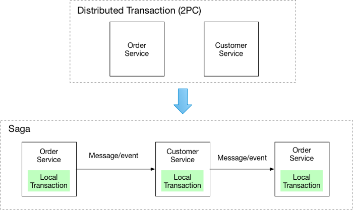
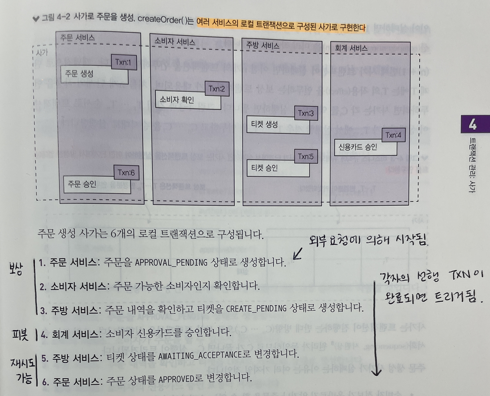
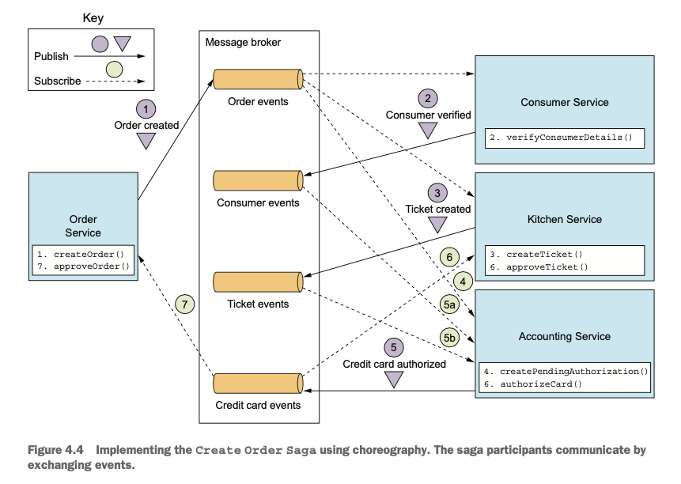
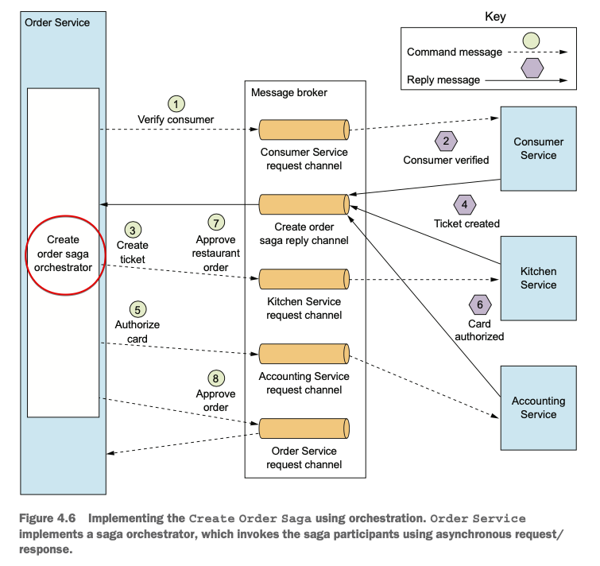
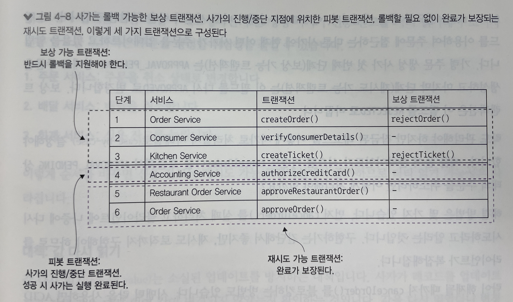
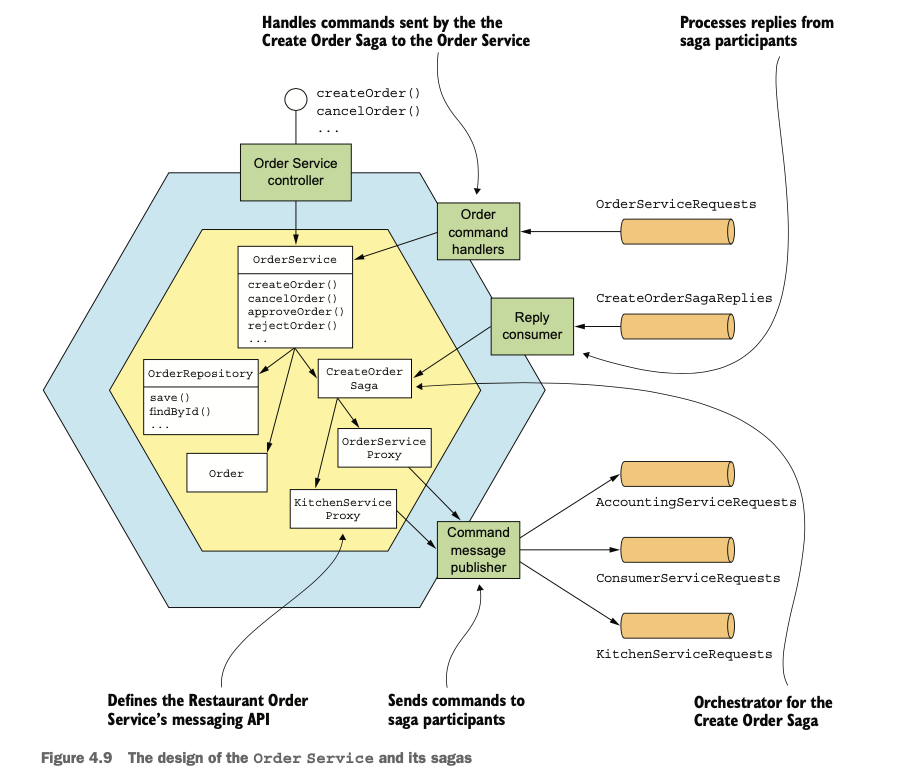

# Chapter 034 "트랜잭션 관리: 사가"

* MSA에서도 단일 서비스 내부의 트랜잭션은 ACID 가 보정하지만, 여러 서비스의 데이터를 업데이트하는 트랜잭션은 구현하기가 까다롭다.
    * Atomicity 원자성 - 모든 작업이 반영되거나 모두 롤백됨.
    * Consistency 일관성 - 데이터는 미리 정의된 규칙에서만 수정이 가능함. (예: 숫자 컬럼에 문자열값은 저장 안되도록 보장해줌.)
    * Isolation 격리성 - 트랜잭션 작업 수행 중에는 다른 트랜잭션에 영향을 주어서도 안되고, 다른 트랜잭션들에 의해 간섭을 받아서도 안 됨.
        * 다수의 트랜잭션이 동시에 수행중인 상황에서 하나의 트랜잭션이 완료될 때까지는 현재 실행 중인 트랜잭션의 중간 수행결과를 다른 트랜잭션에서 보거나 참조 할 수 없음.
    * Durability 지속성 - 한번 반영(COMMIT)된 트랜잭션의 내용은 영원히 적용됨.
* → saga 라는 메시지 주도 방식의 로컬 트랜잭션을 사용한다.
    * 사가는 ACID 에서 I(격리성)이 빠진 ACD만 지원하므로
    * 동시 비정상(concurrency anomaly)의 영향을 방지하거나 줄일 수 있는 설계 기법을 적용해야 한다.

## 1. 마이크로서비스 아키텍처에서의 트랜잭션 관리

* saga를 설명하기 전, 마이크로 서비스 아키텍처에서 트랜잭션 관리가 어려운 이유를 살펴보자.

### 1.1. 분산 트랜잭션의 필요성

* 데이터가 여러 서비스에 흩어져 있는 MSA의 경우, 
서비스마다 DB가 따로 있기 때문에 여러 DB에 걸쳐 데이터 일관성을 유지할 수 있는 수단이 필요하다.

### 1.2. 분산 트랜잭션의 문제점

* X/Open DTP(Distributed Transaction Processing) - 분산 트랜잭션의 사실상 표준
    * 둘 이상의 동종 또는 이종의 DB가 관련된 전역 트랜잭션에서, 2단계 커밋(2PC)을 이용
    * 2PC: 둘 이상의 DB가 연동할 때, ACID 속성을 완전히 보장하기 위해 2단계 처리(Prepare 단계, Commit 단계)를 함.
* 분산 트랜잭션의 문제점
    * NoSQL DB(예: MongoDB, 카산드라)와 현대 메신저 브로커(예: RabbitMQ, 아파치 카프카)는 분산 트랜잭션을 지원하지 않기 때문에, 최근 기술을 사용할 수 없다.
    * 동기 IPC 형태라 가용성이 떨어진다.

### 1.3. 데이터 일관성 유지: 사가 패턴

* 사가: MSA에서 분산 트랜잭션 없이 데이터 일관성을 유지하는 매커니즘
    * 여러 서비스의 데이터를 업데이트 하는 시스템 커맨드마다 사가를 하나씩 정의한다.
    * 사가는 일련의 로컬 트랜잭션이고, 각 로컬 트랜잭션은 ACID 트랜잭션 프레임워크/라이브러리를 이용하여 서비스별 데이터를 업데이트 한다.
* 각 서비스는 로컬 트랜잭션이 완료되면 메시지를 발행하여 다음 사가 단계를 트리거한다. 
    * 메시지를 통해 사가 참여자를 느슨하게 결합하고 사가가 반드시 완료되도록 보장한다.

#### 사가는 보상 트랜잭션으로 변경분을 롤백한다.

* ACID 트랜잭션은 에러 발생시 쉽게 ROLLBACK 이 가능하지만, 사가는 단계마다 로컬 DB에 변경분을 커밋하므로 자동 롤백이 불가능하다.
* 그렇기 때문에, 보상 트랜잭션(Compensating Transaction)을 미리 작성해야 한다.
    * (n+1) 번째 사가 트랜잭션이 실패하면 이전 n개의 단계들을 하나씩 UNDO해야 한다.
    * 모든 단계에 보상 트랜잭션이 필요한 것은 아니다. 
        * read-only 단계 - 주문 가능한 소비자인지 확인
        * 항상 성공하는 단뎨 다음에 이어지는 단계 - 소비자 신용카드 승인

#### 예제: 주문 생성 사가

* 보상 트랜잭션: 실패할 가능성이 있는 단계 다음
* 피봇 트랜잭션: 절대로 실패하지 않는 않는 단계 다음
* 재시도 가능 트랜잭션: 항상 성공

## 2. 사가 편성

* 일반 트랜잭션과 보상 트랜잭션의 순서화
* 도중 하나라도 로컬 트랜잭션이 실패하면, 사가는 보상 트랜잭션을 역순으로 실행한다.
* 종류
    * 코레오그래피: 의사 결정과 순서화를 사가 내 서비스에게 맡긴다. 사가 내 서비스들은 주로 이벤트 교환 방식으로 통신한다.
    * 오케스트레이션: 사가 편성 로직을 사가 오케스트레이터에 중앙화한다. 사가 오케스트레이터는 사가 내 서비스에게 커맨드 메시지를 보내 수행할 작업을 지시한다.

### 2.1. 코레오그래피 사가

* 사가 참여자가 할 일을 알려 주는 중앙 편성자가 없다.
* 그 대신, 사가 참여자가 서로 이벤트를 구독해서 그에 따라 반응한다.

#### 주문 생성 사가 구현: 코레오그래피 스타일

* 사가 서비스가 서로 이벤트를 주고받으며 소통한다.
* 각 서비스는 자신의 DB를 업데이트하고, 다음 참여자를 트리거하는 이벤트를 발행한다.
* 각 서비스는 발생/구독 방식으로 소통하기 때문에, 통신 이슈가 있다.

#### 확실한 이벤트 기반 통신 - 통신 이슈 고려

* 통신 이슈
    * 사가 참여자가 자신의 DB를 업데이트 하고, DB 트랜잭션의 일부로 이벤트를 발행하도록 해야 한다.
    * 이 때, DB를 업데이트 하는 작업과 이벤트를 발행하는 작업은 원자적으로(atomically) 일어나야 하므로
    * 사가 참여자가 확실하게 통신하려면 *트랜잭셔널 메시징(3장)* 을 사용해야 한다.
* 수신한 데이터와의 매핑
    * 사가 참여자는 자신이 수신한 이벤트와 자신이 가진 데이터를 연관 지을 수 있어야 한다.
    * 데이터를 매핑할 수 있도록, 다른 사가 참여자가 상솬관계 ID가 포함된 이벤트를 발생해야 한다. (예: orderId)

#### 코레오그래피 사가의 장단점

* 장점
    * 단순함: 비즈니스 객체를 생성/수정/삭제할 때 서비스가 이벤트를 발생한다.
    * 느슨한 결합: 참여자는 이벤트를 구독할 뿐 서로를 직접 알지 못한다.
* 단점
    * 어떤 사가가 어떻게 작동되는지 개발자가 이해하기 어렵다: 오케스트레이션 사가와 달리, 사가를 어느 한 곳에 정의한 것이 아니라 여러 서비스에 구현 로직이 흩어져 있다. 
    * 서비스 간 순환 의존성: 참여자가 서로 이벤트를 구독하는 특성상, 순환 의존성(cyclic dependency)이 발생하기 쉽다. 
        * 예: 주문 → 회계 → 주문 서비스
        * 순환 의존성은 잠재적인 설계 최약점이다.
    * 단단히 결합될 위험성: 사가 참여자는 각자 자신에게 영향을 미치는 이벤트를 모두 구독해야 한다.
* 간단한 사가라면 코레오그래피 방식으로도 충분하지만, 복잡한 사가는 아무래도 오케스트레이션 방식이 적합하다.

### 2.2. 오케스트레이션 사가

* 사가 내 서비스들이 해야 할 일이 지정된 오캐스트레이터 클래스를 정의하고 
사가 오케스트레이터는 커맨드/비동기 응답 상호작용을 하여 서비스들에게 통신을 한다.
* 즉, 사가 단계를 실행하기 위해 해당 참여자가 무슨 일을 해야 하는지 커맨드 메시지에 적어 보낸다.

#### 주문 생성 사가 구현: 오케스트레이션 스타일

* 사가 오케스트레이터 클래스가 비동기 요청/응답을 주고받으면서 주방 서비스, 소비자 서비스 등을 호출하고, 그 처리 과정에 따라 커맨드 메시지를 전송한다.
* 그리고 이 클래스는 자신의 응답 채널에서 메시지를 읽어 다음 사가 단계를 결정한다.
* 일관성 차원에서 주문 서비스가 마치 다른 참여자인 것처럼 취급한다.

#### 사가 오케스트레이터를 State Machine 으로 모델링

* State Machine
    * State 
    * Transition (이벤트에 의해 트리거됨)
        * 사가 참여자가 로컬 트랜잭션을 완료하는 시점에 트리거되고, 
        로컬 트랜잭션의 상태와 결과에 따라 상태 전이를 어떻게 하고 어떤 액션을 취할지 결정한다.
    * Action (전이가 발생할때마다 액션이 일어남)
        * 사가 참여자를 호출
* 가능한 모든 시나리오를 기술하는 상태 기계로 사가를 모델링하면 설계, 구현, 테스트를 쉽게 진행할 수 있다.

#### 사가 오케스트레이션과 트랜잭셔널 메시징

* 오케스트레이션 사가는 DB를 업데이트 하는 서비스와 메시지를 발행하는 서비스가 단계마다 있다.
* 이 때, 서비스는 트랜잭셔널 메시지를 사용해서 DB 업데이트와 메시지 발행 작업을 원자적으로 처리해야 한다. (3장)

#### 오케스트레이션 사가의 장단점

* 장점
    * 의존 관계 단순화 : 오케스트레이터는 참여자를 호출하지만, 참여자는 오케스트레이터를 호출하지 않으므로 순환 의존성이 발생하지 않는다.
    * 낮은 결합도: 각 서비스는 오케스트레이터가 호출하느 API를 구현할 뿐, 사가 참여자가 발행하는 이벤트는 몰라도 된다.
    * 관심사를 더 분리하고 비즈니스 로직을 단순화: 사가 편성 로직이 사가 오케스트레이터 한곳에만 있으므로 도메인 객체는 더 단순해지고 자신이 참여한 사가에 대해서는 알지 못한다.
* 단점
    * 비즈니스 로직이 오케스트레이터에 너무 많이 중앙화될 수 있다. (똑똑한 오케스트레이터 하나가 깡통 서비스에 일일이 할 일을 지시하는 모양새) 
    → 오케스트레이터가 순서화만 담당하고 여타 비즈니스 로직은 갖기 않도록 설계해야 한다.

## 3. 비격리 문제 처리

* 사가는 서비스들간에 통신을 유용하게 하지만, 트랜잭션간의 격리성을 보장하지 않는다.
* 실제로, 사가의 한 트랜잭션이 커밋한 변경분을 다른 사가가 즉시 바라볼 수 있다.
    * 문제성 1) 한 사가가 실행 중에 접근하는 데이터를 도중에 다른 사가가 바꿔치기할 수 있다.
    * 문제성 2) 한 사가가 업데이트를 하기 이전 데이터를 다른 사가가 읽을 수 있어서 데이터 일관성이 깨질 수 있다.
* 격리성이 보장되지 않으면, 트랜잭션이 차례대로 실행되지 않는 것처럼 데이터를 읽고 쓰게 되는 현상이 발생할 수 있다. (사가를 동시 실행한 결과와 순차 실행한 결과가 달라질 수 있음)
* 따라서, 격리 수준을 정하고 대책 수준을 선택하여 보완하는 것이 좋다.

### 3.1. 비정상(anomaly)

* *소실된 업데이트(lost updates)*
    * 한 사가의 변경분을 다른 사가가 미처 못 읽고 덮어 쓸 때 발생한다.
* *더티 읽기(dirty reads)*
    * 한 사가가 업데이트 중인 데이터를 다른 크랜잭션이나 사가가 읽을 때 발생한다.
* 퍼지/반복 불가능한 읽기(fuzzy/nonrepeatable reads)
    * 한 사가의 상이한 두 단계가 같은 데이터를 읽어도 결과가 달라지는 현상 (다른 사가가 그 사이 업데이트를 했기 때문에 생기는 문제)

### 3.2. 비격리 대책

#### *_PENDING 상태

* _PENDING 상태를 두는 것 - 시맨틱 락 대책의 예
* 예) 현재 주문을 사가로 업데이트 하는 중이니, 그에 맞게 행동하라고 다른 사가에게 알리는 것

#### 사가의 구조 - 3가지 트랜잭션

* *보상 가능 트랜잭션*
    * 보상 트랜잭션으로 롤백 가능한 트랜잭션
* 피봇 트랜잭션
    * 사가의 진행/중단 지점.
    * 피봇 트랜잭션이 커밋되면 사가는 완료될 때까지 실행된다.
* *재시도 트랜잭션*
    * 롤백할 필요 없이 완료가 보장됨.
    * 피봇 트랜잭션 직후의 트랜잭션. 반드시 성공한다.

#### 대책

* 시맨틱 락(semantic lock)
    * 보상 가능 트랜잭션이 생성/수정하는 레코드에 무조건 플래그를 셋팅하여, 다른 트랜잭션이 레코드에 접근하지 못하게 lock을 걸어 놓거나, 다른 트랜잭션이 해당 레코드를 처리할 때 warning을 알린다.
    * 플래그는 재시도 가능 트랜잭션(사과 완료) 또는 보상 트랜잭션(사가 롤백)에 의해 해제된다.
    * *_PENDING 상태가 즉 시맨틱 락을 구현한 것이다.
* 교환적 업데이트(commutative updates)
    * 업데이트를 교환적으로, 즉 순서에 상관 없이 실행 가능하도록 설계하여 소실된 업데이트 문제를 방지한다.
    * 예) 계좌 인출과 입금 관계
* 비관적 관점(pessimistic view)
    * 더티 읽기로 인한 비즈니스 리스크를 최소화하기 위해 사가 단계의 순서를 재조정한다.
* 값 다시 읽기(reread value)
    * 소실된 업데이트를 방지하기 위해, 사가가 레코드를 업데이트 하기 전에 값을 다시 읽어 값이 변경되지 않았는지 확인한다.
    * 값을 읽었더니 변경되었다면, 사가를 중단하고 나중이 재시작한다.
    * 일종의 Optimistic Offline Lock 패턴
* 버전 파일(version file)
    * 레코드에 수행한 작업을 하나하나 기록한다.
* 값에 의한(by value)
    * 비지니스 위험성을 기준으로 동시성 메커니즘을 선택한다.
    * 애플리케이션 차원에서 각 요청의 속성을 보고 사가를 쓸지, 아니면 분산 트랜잭션을 쓸지를 판단한다.

## 4. 예제: 주문 서비스 및 주문 생성 사가 설계

* 시맨틱 락 대책을 적용하여 주문 생성 사가를 설계/구현하자.
* 핵심 비즈니스 로직은 OrderService, Order, OrderRepository 클래스에 있다.
* CreateOrderSaga 등 여러 사가 오퍼레이터가 있다.
* *ServiceProxy는 사가 참여자의 메시징 API 가 정의된 클래스이다.
* OrderCommandHandlers 클래스는 사가가 주문 서비스에 전송한 커맨드 메시지를 처리한다.

## Reference

* https://medium.com/byungkyu-ju/%EB%A7%88%EC%9D%B4%ED%81%AC%EB%A1%9C%EC%84%9C%EB%B9%84%EC%8A%A4%ED%8C%A8%ED%84%B4-4-4%EC%9E%A5-e9de251db214
