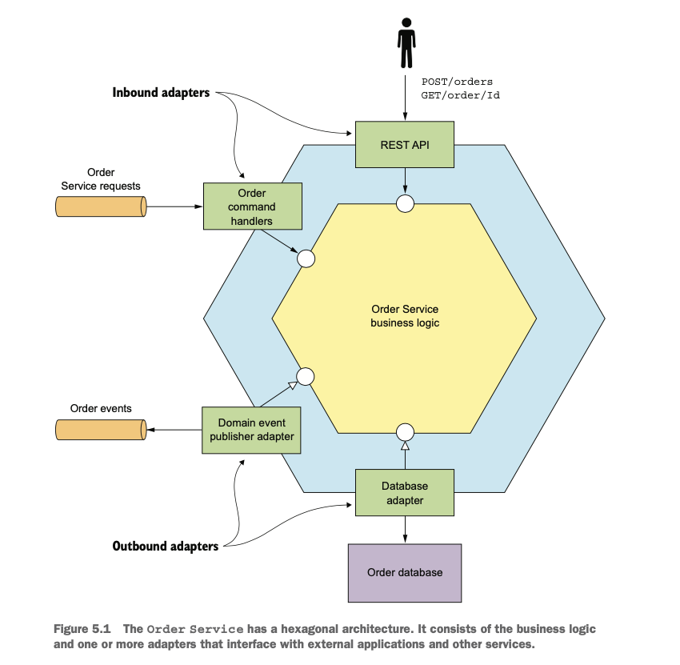
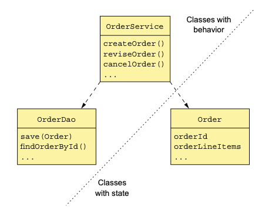
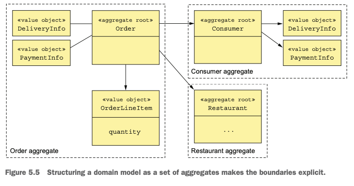

# Chapter 05 "비즈니스 로직 설계"

* 비즈니스 로직이 여러 서비스에 흩어져 있는 마이크로서비스 아키텍처는 복잡한 비즈니스 로직을 개발하기가 까다롭다.
    * 각 클래스들간에 연관관계가 복잡하다.
    * 서로 다른 서비스를 호출하며 트랜잭션을 넘나드는 상황이 발생한다. 
* → 서비스 비즈니스 로직을 여러 애그리거트로 구성하는 DDD 애그리거트 패턴으로 해결할 수 있다.
    * 애그리거트를 사용하면 객체가 서비스의 경계를 넘나들 일이 없다. <br>
    객체 대신 기본키를 이용해 애그리거트가 서로 참조하기 때문이다.
    * 한한 트랜잭션으로 하나의 애그리거트를 생성/수정할 수 있기 때문에 트랜잭션을 일관성있게 관리할 수 있다.

> MSA에서 비즈니스 로직을 어떤 관점으로 구성할지 알아보자.

## 1. 비즈니스 로직 구성 패턴



* 인바운드 어댑터: 클라이언트 요청을 받아 비즈니스 로직을 호출
    * REST API, Command Handlers, Web UI
* 아웃바운드 어댑터: 비즈니스 로직의 요청을 받아 다른 서비스 및 어플리케이션을 실행
    * DB Adapter, 도메인 이벤트 발행 어댑터(이벤트를 메시지 브로커에 발행)

### 1.1. 비즈니스 로직 설계: 트랜잭션 스크립트 패턴

* 객체 지향 설계를 하지 않고 트랜잭션 스크립트라는 메서드를 작성하여 표현 계층에서 들어온 요청을 처리
* 동작(behavior)이 구현된 클래스와 상태(state)를 보관하는 클래스가 따로 존재한다.
* [패턴] 트랜잭션 스크립트 패턴: 비즈니스 로직을 요청 타입별로 하나씩 매핑된 절차적 트랜잭션 스크립트 뭉치로 구성한다.
* 단순한 비즈니스 로직에 잘 맞다.



* OrderService에서 모든 행위를 관장하고, OrderRepository에게 DB를 호출하도록 함
* Order 객체는 Order의 상태만을 관리할 뿐, 객체 자체의 역할로써는 아무것도 하지 않음.

### 1.2. 비즈니스 로직 설계: 도메인 모델 패턴


* 프로그램의 복잡성이 점점 커지므로, 도메일 모델 패턴을 응용한 객체지향 설계를 하는 것이 좋다.
* [패턴] 도메인 모델 패턴: 비즈니스 로직을 상태와 동작을 가진 클래스로 구성된 객체 모델로 구성한다.
* 서비스 메서드가 단순해진다.
    * 행위를 호출하는 것은 그대로 OrderService의 역할이지만, <br>
    실제 행위를 처리하는 것은 상태를 가진 Order 객체가 처리하게 된다. (위임)
* OOD의 장점
    * 객체 지향 설계를 통해 설계를 이해/관리하기 쉽다.
    * 테스트, 확장성이 용이하다.
* 하지만 도메인 모델 패턴도 마이크로서비스패턴에는 해결해야 할 문제가 많기 때문에 이를 개선한 DDD가 필요하다.

### 1.3. 모데인 주도 설계 개요

* 에릭 에반스의 Domaion-Driven Design: 복잡한 비즈니스 로직을 개발하기 위해 OOD를 개선한 접근 방식
* 각 서비스는 자체 도메인을 가지며, 어플리케이션 전체를 도메인으로 다뤘을 때의 문제점을 방지할 수 있다.
* DDD에서 도메인 모델을 구축하는데 쓰이는 빌딩 블록 - 각 클래스가 도메인 모델에서 수행하는 역할과 클래스의 특징을 정의한다.
    * 엔터티(Entity): 영속화가 되어 데이터가 관리될 객체
        * 두 엔터티의 속성 값이 동일해도 엄연히 다른 갳게이다.
        * JPA @Eneity를 붙여 DDD 엔터티를 나타낸다.
    * 밸류 객체(Value Object): 여러 값을 모아 놓은 객체
        * 속성 값이 동일한 두 밸류 객체는 서로 바꾸어 사용할 수 있다.
    * 팩토리(Factroy): 일반 생성자로 직접 만들기에 복잡한 객체 생성 로직이 구현된 객체 OR 메서드
        * 인스턴스로 생성할 구상 클래스를 감출 수 있다.
        * 클래스의 정적 메서드로 구현할 수 있다.
    * 리파지터리(Repository): 엔터티를 저장하는 DB 접근 로직을 캡슐화한 객체
    * 서비스(Service): 엔터티, 밸류 객체에 속하지 않은 비즈니스 로직 구현 객체

## 2. 도메인 모델 설계: DDD 애그리거트 패턴

### 2.1. 불분명한 경계 문제

* 전통적인 도메인 모델은 서로 연관된 클래스가 복잡하게 얽혀 있고, 그 경게가 분명하지 않다.
* 경계가 불분명하면 비즈니스 객체를 업데이트 할때 MSA에서 문제가 생길 가능성이 높다.

### 2.2. 애그리거트는 경계가 분명하다

* 애그리거트: 한 단위로 취급 가능한 경계 내부의 도메인 객체들
    * 하나의 루트 엔터티와 하나 이상의 기타 엔터티 + 밸류 객체로 구성된다.
* 비즈니스 객체는 대부분 애그리거트로 모델링한다.
* 애그리거트는 도메인 모델을 개별적으로 이해하기 쉬운 덩어리로 분해한다.



* 일부가 아니라 전체 애그리거트를 업데이트 하므로 일관성 문제가 해소된다.
* DD 도메인 모델 설계의 핵심은 애그리거트와 그 경계, 그리고 루트를 식별하는 것이다.

### 2.3. 애그리거트 규칙

* 규칙 1) 애그리거트 루트만 참조하라
    * 외부 클래스는 반드시 애그리거트의 루트 엔터티만 참조할 수 있게 제한해야한다.<br>
    따라서 클라이언트는 애그리거트 루트 메서드만 호출하여 애그리거트를 업데이트 할 수 있다.
    * 무분별한 값 변경을 방지하기 위해서다.
* 규칙 2) 애그리거트 간 참조는 반드시 기본키를 사용하라
    * 애그리거트는 전체 레퍼런스 대신 기본키를 가지고 서로를 참조해야 한다. <br>
    (예: Order는 Consumer 객체 레퍼런스 대신 consumerId로 자신의 Consumer를 참조한다.)
    * 애그리거트는 느슨하게 결합되고, 애그리거트 간 경계가 분명해지기 때문에 혹여 실수로 다른 애그리거트를 업데이트할 일은 일어나지 않는다.
    * 애그리거트가 다른 서비스의 일부인 경우에도 여러 서비스에 걸친 객체 레퍼런스 문제가 없다.
    * 애그리거트는 그 자체가 저장 단위이므로 저장 로직도 간단해진다.
* 규칙 3) 하나의 트랜잭션으로 하나의 애그리거트를 생성/수정하라
    * 트랜젝션을 확실하게 서비스 내부에 담을 수 있다.
    * 데이터의 정합성을 위해 하나의 트랜잭션으로 프로세스가 이루어져야하고, 트랜잭션은 애그리거트 하나만 생성/수정 가능하므로 여러 애그리거트를 수정하려면 사가를 사용해야 한다. 사가는 각 단계마다 하나의 애그리거트를 생성/수정한다.

### 2.4. 애그리거트 분리

* 애그리거트는 작으면 작을수록 좋다. 그만큼 동시 처리 가능한 요청 개수가 늘고 확장성이 좋아진다.
* 애그리거트 경계는 고정 불변이 아니다. 도메인 모델을 개발할 때에는 경계선을 어디에 그을지 잘 선택해야 한다.

## 3. 도메인 이벤트 발행

* DDD 맥락에서 도메인 이벤트는 애그리거트에 발생한 사건이다.
* 도메인 이벤트는 도메인 모델에서는 클래스로 표현되며, 대부분 어떤 상태 변경을 나타낸다.
* 예: Order 애그리거트의 경우, 주문 생성됨/주문 취소됨/주문 배달됨 등 상태가 바뀌는 이벤트가 발생하는 것
* 애그리거트는 상태가 전이될 때마다 이에 관련된 컨슈머를 위해 이벤트를 발행한다.

### 3.1. 변경 이벤트를 발행하는 경우

* 다른 구성원(사용자, 다른 애플리케이션 또는 같은 애플리케이션 내부의 다른 컴포넌트)들이 애그리거트의 상태 변경을 궁금해 하기 때문에 도메인 이벤트는 유용하다.
* 애플리에키션 DB에서의 애그리거트 상태 전이가 알림을 트리거한다.

### 3.2. 도메인 이벤트란 무엇인가?

* 과거 분사형 동사로 명명한 클래스
* 이벤트에 의미를 부여하는 프로퍼티는 원시 값(primitive value) 또는 밸류 객체(value object)이다.
* 예) OrderCreated 이벤트 클래스에는 orderId 프로퍼티가 있다.
* 대부분 이벤트 ID. 타임스탬프와 같은 메타데이터도 있다.
* 변경을 일으킨 사용자의 신원 정보를 넣기도 하는데 감사(audit) 용도로 좋다.
* 메타데이터는 상위 클래스에 정의된 이벤트 객체의 일부이고ㅓ나, 이벤트 객체를 감싼 엔벨로프 객체(envelope object)에 있다.<br>
이벤트를 발생시킨 애그리거트 ID는 특정 이벤트 프로퍼티가 아닌 엔벨로프의 일부일 수 있다.

```java
// 자신을 구현한 클래스가 도메인 이벤트임을 알리는 마커 인터페이스(marker interface)
interface DomainEvent {}

// Order 애그리거트가 발행한 OrderCreatedEvent의 마커 인터페이스
interface OrderDomainEvent extends DomainEvent{}

// 주문 ID가 이벤트 엔벨로프의 일부이기 때문에 필드가 하나도 없음.
class OrderCreatedEvent implements OrderDomainEvent {}

// 이벤트 객체 및 메타 데이터를 조회하는 메서드가 있음.
interace DomainEventEnvelope<T extends DomainEvent> {
    String getAggregateId();
    Message getMessage();
    String getAggregateType();
    String getEventId();

    T getEvent();
}
```

### 3.3. 이벤트 강화

* 컨슈머를 작성할 때 이벤트 컨퓨머가 항상 서비스를 쿼리해서 애그리거트를 조회하는 것은 오버헤드를 유발한다.
* 그러므로, 이벤트를 발행할 때 컨슈머에 필요한 이벤트를 함께 가지고 다니도록 이벤트 강화 (event enrichment)기법을 적용한다.
* 이벤트를 발행한 서비스를 다시 쿼리해서 데이터를 가져올 필요가 없으니 이벤트 컨슈머가 간단해진다.

```java
class OrderCreatedEvent implements OrderEvent {
    private List<OrderLineItem> lineItems;
    private DeliveryInformation deliveryInformation; // 강화된 데이터, 컨슈머가 필요로 하는 데이터
    ...
}
```

* 상세한 주문 내역이 이미 OrderCreatedEvent 에 있기 때문에, 주문 이력 서비스 같은 이벤트 컨슈머는 따로 데이터를 조회할 필요가 없다.
* 컨슈머 요건이 바뀌면 이벤트 클래스도 함꼐 바꾸어주어야 한다.

### 3.4. 도메인 이벤트 식별

* 알림 요건은 곧 도메인 이벤트가 필요하다는 뜻이다.
* 요즘에는 이벤트 스토밍(event storming) 이라는 방법을 많이 사용하는 추세이다.<br>
이를 통해 애그리거트와 이벤트로 구성된 이벤트 중심적인 도메인 모델을 완성한다.

### 3.5. 도메인 이벤트 생성 및 발행

* 도메인 이벤트 생성
    * 비즈니스 로직이 도메인 이벤트를 메시지 브로커에 발행하려면 먼저 도메인 이벤트를 생성해야 한다.
    * 애그리거트는 상태 전이 시 이벤트를 생성하고, 애그리거트 메서드 반환값에 이벤트 목록을 넣어 반환한다.
* 도메인 이벤트를 확실하게 발행하는 방법
    * 서비스는 DB에서 애그리거트를 업데이트하는 트랜잭션의 일부로 이벤트를 발행하기 위해 트랜잭셔널 메시징을 사용해야 한다.

### 3.6. 도메인 이벤트 소비

* 도메인 이벤트는 결국 메시지로 바뀌어 아파치 카프카 같은 메시지 브로커에 발행된다.

## 4. 예제: 주방 서비스 비즈니스 로직

## 5. 예제: 주문 서비스 비즈니스 로직

## Reference

* https://medium.com/byungkyu-ju/%EB%A7%88%EC%9D%B4%ED%81%AC%EB%A1%9C%EC%84%9C%EB%B9%84%EC%8A%A4%ED%8C%A8%ED%84%B4-5-5%EC%9E%A5-f1f5ebdac05a