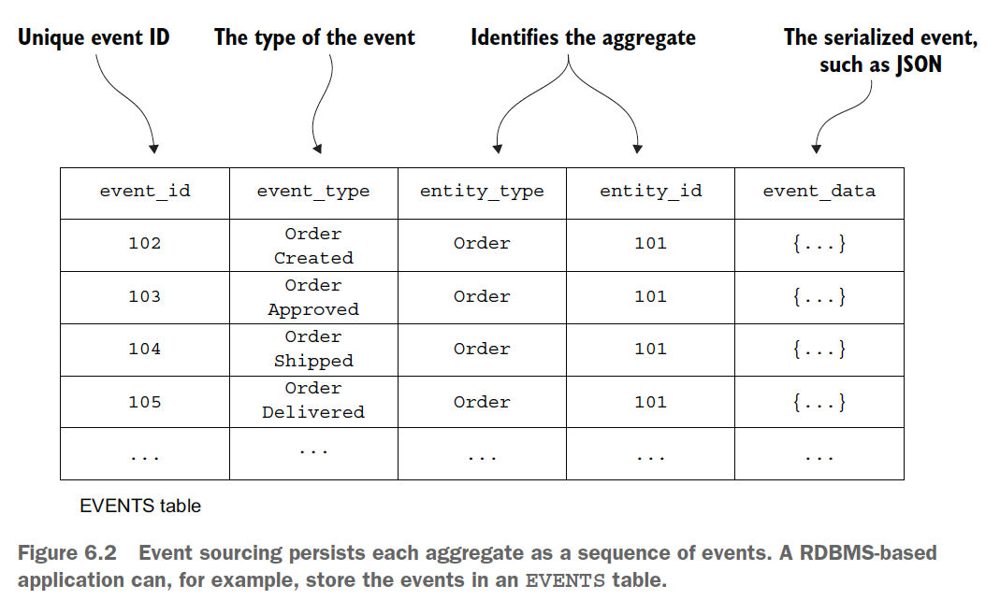
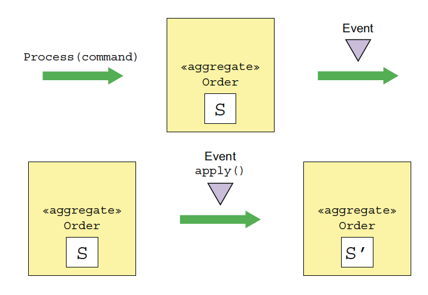
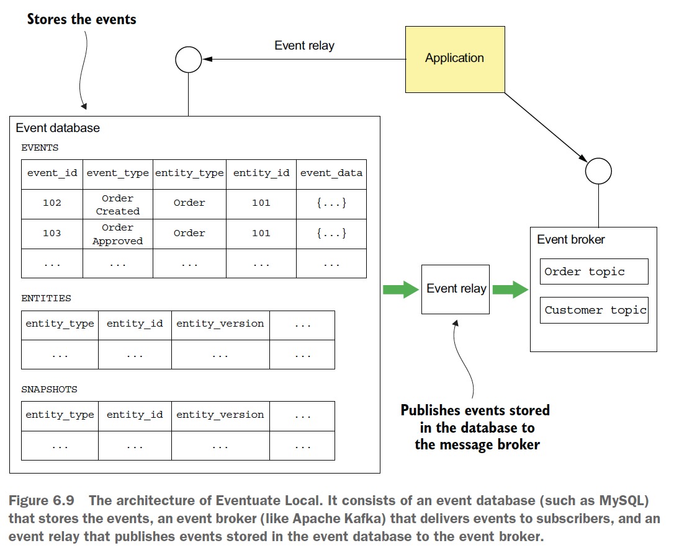

# Chapter 06 "비즈니스 로직 개발: 이벤트 소싱"

* 이벤트 소싱
    * 데이터 저장 방식 중 하나로, 발생한 이벤트를 저장하는 기법
    * 어플리케이션의 모든 상태 변화를 이벤트 순서에 따라 저장함.
* 이전의 이벤트 발행 로직은 비즈니스 로직에 추가되어 있기 때문에, 개발자가 실수로 이벤트 발행 로직을 빠뜨려도 비즈니스 로직은 그대로 진행 되는 구조였음.
* 그러나, 이벤트 소싱 기법을 활용하면 애그리거트가 생성/수정될 때마다 무조건 이벤트를 발행해서 프로그래밍 오류를 제거할 수 있음.

## 1. 이벤트 소싱 응용 비즈니스 로직 개발

* [패턴] 이벤트 소싱: 상태 변화를 나타내는 일련의 도메인 이벤트로 애그리거트를 저장한다.
* 애플리케이션은 이벤트를 재연(reply)하여 애그리거트의 현재 상태를 재생성한다.
* 장점
    * 애그리거트 이력이 보존되므로 감사/통제 용도로 가치가 있음.
    * 도메인 이벤트를 확실하게 발행할 수 있어서 마이크로 서비스 아키텍처에서 유용함.
* 단점
    * 비즈니스 로직을 작성하는 방법이 특이해서 학습 필요
    * 이벤트 저장소를 쿼리하기가 쉽지 않아 CQRS 패턴 필요(7장)

### 1.1. 기존 영속화의 문제점

* 기존 영속화 방식: 클래스는 DB 테이블에, 클래스 필드는 테이블 컬럼에, 클래스 인스턴스는 테이블 각 로우에 매핑하는 것 (JPA, myBATIS등...)
* 객체-관계 임피던스 부정합
    * OOP(객체)와 RDB(관계)간 기본 철학이 다름.
* 애그리거트 이력이 없음.
    * 기존 영속화 메커니즘은 현재 애그리거트의 상태만 저장함. 즉, 애그리거트가 업데이트되면 이전 상태는 사라짐.
* 감사 로깅을 구현하기가 번거로움.
    * 감사 로킹 코드 및 비즈니스 로직이 계속 분화하기 때문에 버그 가능성이 높음.
* 이벤트 발행 로직이 비즈니스에 추가됨.
    * 도메인 이벤트 발행을 지원하지 않음.<br>
    (도메인 이벤트는 애그리거트가 자신의 상태를 변경한 후 발행하는 이벤트임. 데이터를 동기화하고 알림을 전송하는 용도로 쓰임.)
    * ORM 프레임워크는 데이터 객체가 변경될 때 애플리케이션 수준의 콜백은 호출할 수 있지만, DB트랜잭션의 일부로 메시지를 자동 발행하는 기능은 없음.
    * 결국, 개발자가 이벤트 생성 로직을 추가해야 하는데, 비즈니스 로직과 동기화되지 않을 위험성이 있음.

### 1.2. 이벤트 소싱 개요

* 이벤트 소싱: 이벤트를 위주로 비즈니스 로직을 구견하고, 애그리거트를 DB에 일련의 이벤트로 저장하는 기법
* 각 이벤트는 애그리거트의 상태 변화를 나타냄.
* 애그리거트의 비즈니스 로직은 이벤트를 생산/소비하는 요건 중심으로 구성됨.

#### 이벤트를 이용하여 애그리거트를 저장

* 예) Order를 ORDER 테이블에 로우 단위로 저장하는 것이 아니라, Order 애그리거트를 EVENTS 테이블의 여러 로우로 저장함.<br>
* 각 로우는 도메인 이벤트임.



1. 애그리거트의 이벤트를 로드
1. 기본 생성자를 호출하여 애그리거트 인스턴스 생성
1. 이벤트를 하나씩 순회하며 apply()를 호출

#### 이벤트는 곧 상태 변화

* 도메인 이벤트: 애그리거트의 변경을 구독자에게 알리는 장치
* 이벤트는 상태 변경에 필요한 데이터를 갖고 있어야 함.

#### 애그리거트 메서드의 관심사는 오직 이벤트



* 비즈니스 로직을 처리하기 위한 커맨드 메서드를 호출하면, 애그리거트 상태 변경 없이 이벤트가 생성된다.
* 애그리거트는 이벤트를 적용해서 업데이트 한다.
* 2개 이상의 매서드로 분리
    * 메서드 1) 커맨드를 입력받아 이벤트를 반환함.
    * 메서드 2) 이벤트를 전달받아 애그리거트를 업데이트함.

### 1.3. 동시 업데이트: 낙관적 잠금

* 낙관적 잠금: 버전 컬럼을 이용하여 마지막으로 애그리거트를 읽은 이후 변경되었는지 감지하여 처리.
* 이벤트에 딸려온 버전 정보를 각 애그리거트 인스턴스마다 두고, 애플리케이션이 이벤트를 삽입할 때 이벤트 저장소가 버전 변경 여부를 체크하는 방식으로 DB의 동시 업데이트를 제한함.

### 1.4. 이벤트 소싱과 이벤트 발행

* 이벤트를 EVENTS 테이블에 저장한다고 가정할 때, 이벤트 발생 순서와 커밋 시점의 차이로 인해 순서가 뒤죽박죽 될 수도 있다. 
* 폴링
    * EVENTS 테이블에 이벤트 발행 여부를 추적할 수 있는 컬럼을 추가한다.
```sql
SELECT * FROM EVENTS WHERE PUBLISHED = 0 ORDER BY EVENT_ID;
UPDATE EVENTS SET PUBLISHED = 1 WHERE EVENT_ID = {eventId};
```
* 트랜잭션 로그 테일링
    * DB 트랜잭션 로그를 통해 EVENTS 테이블에 삽입된 이벤트를 읽어 메시지 브로커에 발생한다.

### 1.5.스냅샷을 통한 성능 개선

* 발행되는 이벤트 수가 맣은 경우, 주기적으로 애그리거트 상태의 스냅샷을 저장한다.
* 애플리케이션은 스냅샷과 그 이후에 발생한 이벤트만 로드하면 되므로, 성능이 개선된다.

### 1.6. 멱등한 메시지 처리

* 메시지 브로커가 동일한 메시지를 여러 번 전송할 가능성이 있으므로, 메시지 컨슈머가 동일한 메시지를 여러 번 호출해도 안전하도록 개발해야 한다.

### 1.7. 도메인 이벤트 발전시키기

* 어플리케이션에서 이벤트 재연 시, 여러 버전의 이벤트를 처리해야 할 수도 있기 때문에, 이벤트 발전을 다루는 일이 관건이다.
* 따라서, 이벤트 저장소에서 이벤트를 가져올 때 최근 버전으로 이벤트를 업그레이드하는 업캐스팅이 좋은 방법이다.

### 1.8. 이벤트 소싱의 장점

* 도메인 이벤트를 확실하게 발행한다.
* 애그리거트 이력이 보존된다.
* O/R 임피던스 불일치 문제를 대부분 방지할 수 있다.
* 애플리케이션 가동 중 발생한 모든 일을 기록한다.

### 1.9. 이벤트 소싱의 단점

* 초기 학습 시간이 필요하다.
* 메시징 기반 애플리케이션은 복잡하다.
* 이벤트를 발전시키기 어렵다.
* 데이터를 삭제하기가 어렵다. - 애그리거트의 이력 보존은 이벤트 소싱의 주요 목표 중 하나이기 때문에 데이터는 의도적으로 영구 저장된다.
* 이벤트 저장소를 쿼리하기가 어렵다.

## 2. 이벤트 저장소 구현

* 이벤트 저장소는 DB와 메시지 브로커를 합한 것이다.
* 이 책에서는 저자가 만든 Eventuate 로 구현 코드를 작성함.



* 이벤트 DB - 이벤트를 저장
* 이벤트 브로커 - 구독기에 이벤트를 전달 (예: 아파치 카프카)
* 이벤트 릴레이 - 이벤트 DB에 저장된 이벤트를 이벤트 브로커에 발행

## 3. 사가와 이벤트 소싱을 접목

* 여러 서비스에 걸쳐 데이터 일관성을 유지하기 위해서는, 서비스가 사가를 시작하거나 사가에 참여해야 할 경우가 많다.
* 따라서, 사가와 이벤트 소싱 기반의 비즈니스 로직을 연계해야 한다.

#### 사가에 필요한 단계들과 액션 (반드시 원자적으로 수행되어야 함)

* 사가 생성: 사가를 시작한 서비스는 원자적으로 애그리거트를 생성/수정하고, 사가 오케스트레이터를 생성해야 한다.
    * 예) 주문 서비스의 createOrder()는 Order 애그리거트와 CreateOrderSaga를 생성해야 한다.
* 사가 오케스트레이션: 사가 오케스트레이터는 원자적으로 응답을 소비하고, 자신의 상태를 업데이트한 후 커맨드 메시지를 전송해야 한다.
* 사가 참여자: 주방 서비스, 주문 서비스 등 사가 참여자는 원자적으로 메시지를 소비하고, 중복 메시지를 솎아 내고, 애그리거트를 생성/수정하고, 응답 메시지를 전송해야 한다.

### 3.1. 코레오그래피 사가 구현: 이벤트 소싱

* 4장의 예제에 해당.
* 이벤트 소싱 기반의 애그리거트가 발행한 이벤트를 리스닝하는 이벤트 핸들러가 서비스에 달려 있기 때문에, 코레오그래피 사가를 간단히 구현할 수 있음.
* 단점 - 애그리거트는 상태 변화가 없어도 무조건 이벤트를 발생시켜야 하는데, 사가 참여자가 애그리거트를 생성할 수 없는 경우 문제가 됨.

### 3.2. 오케스트레이션 사가 생성

* 서비스 매서드는 애그리거트를 생성/수정하고 사가 오케스트레이터를 생성하는 2가지 일을 함.

### 3.3. 이벤트 소싱 기반의 사가 참여자 구현

* 커맨드 메시지를 멱등하게 처리
    * 이벤트 소싱 기반의 사가 참여자가 중복 메시지를 솎아 낼 수 있는 수단을 마련해야 한다.
    * 메시지를 처리할 때 생성되는 이벤트에 메시지 ID를 기록하면, 사가 참여자는 애그리거트를 업데이트 하기 전에 이 메시지를 처리한 적이 있는지 확인.
* 응답 메시지를 원자적으로 전송
    1. 사가 커맨드 핸들러가 애그리거트를 생성/수정할 때, 애그리거트가 발생시킨 진짜 이벤트와 가짜 이벤트를 모두 이벤트 저장소에 저장한다.
    * 가짜 이벤트 핸들러는 이벤트에 포함된 데이터로 응답 메시지를 만들어 응답 채널에 출력한다.

### 3.4. 사가 오케스트레이션 구현: 이벤트 소싱

* 이벤트 소싱으로 사가 오케스트레이터 저장
    * SagaOrchestratorCreated/Updated 이벤트를 이용하여 사가를 저장
* 커맨드 메시지를 확실하게 전송
    * 전송할 커맨드를 나타낸 SagaCommandEvent를 저장하여, 이벤트 핸들러가 이 이벤트를 구독하여 적절한 채널로 각 커맨드 메시지를 전송하도록 함.
* 응답을 꼭 한 번만 처리
    * 오케스트레이터가 응답 메시지 ID를 이벤트에 보관하면 어느 메시지가 중복인지 분간할 수 있음.

## Reference
* https://medium.com/byungkyu-ju/%EB%A7%88%EC%9D%B4%ED%81%AC%EB%A1%9C%EC%84%9C%EB%B9%84%EC%8A%A4%ED%8C%A8%ED%84%B4-6-6%EC%9E%A5-6fd1ab0f4639
* https://june-coder.tistory.com/32

