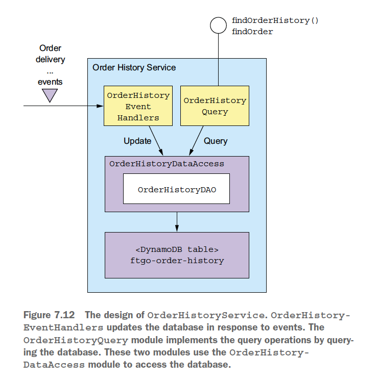

# Chapter 07 "마이크로서비스 쿼리 구현"

* DB가 하나뿐인 모놀리식 애플리케이션에서는 비교적 DB 접근이 단순했지만 
MSA에서는 여러 서비스에 흩어져있는, 분산되어있는 DB를 조회하기가 상대적으로 까다롭다.
* 따라서, 2가지 패턴으로 쿼리를 구현한다.
    * API 조합(composition) 패턴: 서비스 클라이언트가 데이터를 가진 여러 서비스를 직접 호출하여 그 결과를 조합한다. 가장 단순한 방법.
    * CQRS(커맨드 쿼리 책임 분산) 패턴: 쿼리만 지원하는 하나 이상의 뷰 전용 DB를 유지하는 패턴. 구현하기 복잡하다.

## 1. API 조합 패턴 응용 쿼리

### 1.1. findOrder() 쿼리

* 여러 서비스에 뿔뿔히 흩어져 있는 데이터를 조회하기 위해, 모든 서비스에 요청을 해야 한다.

### 1.2. API 조합 패턴 개요

* API 조합 패턴: 데이터를 가진 서비스를 호출한 후, 그 반환 결과를 조합해서 가져온다.
* API 조합기와 2개 이상의 프로바이더 서비스로 구성된다.
    * API 조합기: provider 서비스를 쿼리하여 데이터를 조회한다.
    * provider 서비스: 최종 결과로 반환할 데이터의 일부를 갖고 있는 서비스

### 1.3. API 조합 패턴으로 findOrder() 쿼리 구현

* 각 프로바이더 서비스는 애그리거트 하나에 해당하는 응답을 반환하는 REST endpoint를 제공한다.
* REST endpoint (GET /order/{orderId})가 구현된 주문 검색 조합기는 orderId로 각 서비스를 호출한 후 수신한 응답을 조인한다.

### 1.4. API 조합 설계 이슈

* 누가 API 조합기 역할을 맡을 것인가?
    1. 서비스 클라이언트를 API 조합기로 선정 (예: 웹어플리케이션)
        * 동일한 LAN에서 실행 중이라면, 가장 효율적으로 데이터 조회 가능
        * 클라이언트가 방화벽 외부에 있다면 실용적이지 않음.
    1. 애플리케이션의 외부 API가 구현된 API 게이트웨이를 API 조합기로 선정(예: 모바일 앱))
        * 쿼리 작업이 애플리케이션의 외부 API중 일부일때 타당.
        * 외부의 클라이언트가 API 호출 한번으로 여러 서비스의 데이터를 조회할수 있도록 하여 효율적.
    1. API 조합기를 스탠드얼론 서비스로 구현
        * 내부적으로 여러 서비스가 사용하는 쿼리 작업일 경우 효율적.
        * 취합 로직이 너무 복잡해서 API 게이트웨이 일부로 만들기는 곤란하고 외부에서 접근 가능한 쿼리 작업을 구현할 경우에 유용함.
* 어떻게 해야 효율적으로 취합 로직을 작성할 것인가?
    * 리액티브 프로그래밍 모델 사용
    * 쿼리 작업의 반응 시간을 줄이려면 가능한 한 API 조합기가 프로바이더 서비스를 병렬 호출해야 한다.

### 1.5. API 조합 패턴의 단점

* 오버헤드 증가
    * 결국 DB 쿼리를 여러번 실행해야 하기 때문에 네트워크 리소스가 더 많이 소모되고 애플리케이션 운영 비용도 늘어난다.
* 가용성 저하 우려
    * 작업의 가용성은 더 많은 서비스가 개입할수록 감소한다.
    * 해결 방법
        * 이전에 캐시한 데이터 반환
        * 불능 상태 서비스의 데이터만 제외한 나머지 미완성된 데이터 반환
* 데이터 일관성 결여
    * 여러 DB를 대상으로 여러 쿼리를 실행하기 때문에 일관되지 않은 데이터가 반환될 수 있다.

## 2. CQRS 패턴

* [패턴] CQRS(커맨드 쿼리 책임 분리) - 여러 서비스에 있는 데이터를 가져오는 쿼리는, 이벤트를 이용하여 해당 서비스의 데이터를 복제한 읽기 전용 뷰를 유지한다. 
    * 관심사의 분리/구분에 관한 패턴.
    * 즉, 하나 이상의 쿼리가 구현된 하나 이상의 뷰 DB를 유지한다.
* CQRS 패턴 이전에 기존 API조합패턴에서 DB는 조회를 효율적으로 지원하지 않는 DB에 데이터들을 넣거나, 값비싸고 비효율적인 인메모리 조인을 하거나, 쿼리작업에 불필요한 서비스가 호출되는 등의 많은 어려움들이 있었다.

### 2.1. CQRS의 필요성

* API를 조합하여 여러 서비스에 흩어진 데이터를 조회하려면 값비싸고 비효율적인 인-메모리 조인을 해야 한다.
*  데이터를 가진 서비스는 필요한 쿼리를 효율적으로 지원하징 않는 DB에, 또는 그런 형태로 데이터를 저장한다.
* 관심사를 분리할 필요가 있다는 것은, 데이터를 가진 서비스가 쿼리 작업을 구현할 장소로 적합하지 않다는 것이다.

### 2.2. CQRS 개요

* CQRS는 커맨드와 쿼리를 서로 분리한다.
    * 조회(R)기능(예: HTTP GET)은 쿼리 쪽 모듈 및 데이터 모델에, 
    생성/수정/삭제(CUD)기능(예: HTTP POST/PUT/DELETE)은 커맨드 쪽 모듈 및 데이터 모델에 구현한다.
    * 양쪽 데이터 모델 사이의 동기화는 커맨드 쪽에서 데이터가 바뀔 때마다 발행한 도메인 이벤트를 쿼리 쪽에서 구현하는 방식으로 이루어진다.

* CQRS와 쿼리 전용 서비스
    * 쿼리 서비스에는 커맨드 작업이 전혀 없는 오직 쿼리 작업만으로 구성된 API가 있고, 
    하나 이상의 다른 서비스가 발행한 이벤트를 구독하여 항상 최신 상태로 유지되는 DB를 쿼리하는 로직이 구현되어 있다.
    * 쿼리 쪽 서비스는 여러 서비스가 발행한 이벤트를 구독해서 구축된 뷰를 구현하기 좋은 방법이다.
    * 이런 뷰는 특정 서비스에 종속되지 않기 때문에 스탠드얼론 서비스로 구현하는 것이 타당하다.
    * 한 서비스가 가진 데이터를 복제한 뷰를 구현하는 수단으로도 유용하다.
    * CQRS는 RDBMS를 기록 시스템으로 활용하면서 텍스트 검색 엔진(예: 일래스틱 서치)을 이벤트로 일반화한 것이라고 볼 수 있다.
    * CQRS 쿼리 쪽 뷰는 이벤트를 구독해서 거의 실시간으로 업데이트 된다.

### 2.3. CQRS 장점

* MSA에서, 여러 서비스에서 데이터를 미리 조인해 놓는 CQRS 뷰를 이용하면 쿼리를 효율적으로 구현할 수 있다.
* 다양한 쿼리가 효율적으로 구현된 하나 이상의 뷰를 정의하여, 단일 데이터 저장소 한계를 극복할 수 있다.
* 이벤트 소싱 어플리케이션에서 쿼리가 가능하다.
    * 이벤트 소싱의 중요한 한계인 "이벤트 저장소는 기본키 쿼리만 지원한다"를 극복하게 한다.
    * CQRS 패턴은 하나 이상의 애그리거트 뷰를 정의하고, 이벤트 소싱 기반의 애그리거트가 발행한 이벤트 스트림을 구독해서 항상 최신 상태를 유지한다.
* 관심사가 더 분리된다.
    * 서비스의 커맨드/쿼리 쪽에 알맞은 코드 모듈과 DB 스키마를 별도로 정의하여 관리하기 간편하다.
    * 쿼리를 구현한 서비스와 데이터를 소유한 서비스를 따로 관리하여, 쿼리 서비스는 데이터를 소유한 서비스가 발행한 이벤트를 구독하는 방식으로 뷰를 관리한다.

### 2.4. CQRS 단점

* 아키텍처가 복잡하다.
* 복제 시차(replication lag)를 처리해야 한다.
    * 방법 01) 커맨드/쿼리 양쪽 API가 클라이언트에 버전 정보를 전달
    * 방법 02) 네이티브 모바일 앱이나 SPA 경우, 쿼리를 하지 않고 커맨드가 반환한 데이터로 자체 로컬 모델을 업데이트

## 3. CQRS 뷰 설계

* 이벤트 핸들러는 쿼리 API 모듈로 조회한 뷰 DB를 업데이트 한다.
* 쿼리 API 모듈은 데이터를 조회한다.

### 3.0. 뷰 모듈 개발시 필요한 설계 결정

* DB 선정과 스키마 설계
* DB 접근 모듈을 설계할 때 멱등성/동시 업데이트 등 다양한 문제를 고려해야한다.
* 기존 어플리케이션의 스키마 변경시 뷰도 효율적으로 변경될 수 있는 수단을 강구해야 한다.
* 뷰 클라이언트에서 복제 시차를 어떻게 처리할지 결정해야 한다.

### 3.1. 뷰 DB 선택

* SQL vs. NoSQL DB
* 이벤트 핸들러가 실행할 업데이트 작업을 지원해야 한다.
    * 외래키를 이용하여 레코드를 수정/삭제해야 하는 경우도 있다.

### 3.2. 데이터 접근 모듈 설계

* 동시성 처리
* 쿼리쪽 이벤트 핸들러는 중복 이벤트를 처리해도 결과는 동일해야 한다.(멱등성)
    * 이벤트 핸들러는 반드시 이벤트 ID를 기록하고 데이터 저장소를 원자적으로 업데이트 해야 한다.
* 클라이언트가 비일관성을 감지하게 하여(이벤트 감지), 애플리케이션이 최종 일관된 뷰를 사용할 수 있다.

### 3.3. CQRS 뷰 추가 및 업데이트

* 아카이빙된(=오래 보관된) 이벤트를 이용하여 CQRS 뷰를 구축한다. 
* CQRS 뷰를 단계적으로 구축 - 2단계 증분 알고리즘

## 4. CQRS 뷰 구현: AWS DynamoDB 응용

* OrderHistoryEventHandlers - 여러 서비스가 발행한 이벤트를 구독, OrderHistoryDAO를 호출
* OrderHistoryQuery API 모듈 - REST endpoint
* OrderHistoryDataAccess - DB 테이블 및 헬퍼 클래스를 조회/수정하는 메서드가 정의된 OrderHistoryDAO를 포함
* ftgo-order-history - DB table (NoSQL DB)
    * 
    * 각 Order를 테이블의 아이템 하나로 저장, Order 클래스의 필드는 각 아이템의 속성에 매핑된다.
    * findOrderHistory(최근 순서로 정렬된 주문 검색 결과) 쿼리 작업을 위해, 보조 인덱스를 쿼리한다.
        *  이 인덱스는 (consumerId, orderCreationDate)를 비유일 키로 갖고 있고, 이를 필터 용도로도 쓸 수 있다.

## 5. Summary

* 각 서비스 데이터는 프라이빗하기 때문에 여러 서비스의 데이터를 가져오는 쿼리는 구현하기 쉽지 않으므로, API 조합 패턴과 커맨드 쿼리 책임 분리(CQRS) 패턴으로 구현한다.
* API 조합 패턴 
    * 쿼리가 조금만 복잡해져도 대량 데이터를 인-메모리 조인해야 하므로 효율이 낮다.
* CQRS 패턴 
    * 뷰 전용 DB를 이용하여 쿼리한다.
    * CQRS 뷰 모듈은 중복 이벤트 솎아 내기/동시 업데이트 처리 기능을 갖추어야 하고, 클라이언트는 CQRS 뷰의 최종 일관성을 처리해야 한다.
    * 관심사 분리 관점에서 유리하다.

## Reference

* https://medium.com/byungkyu-ju/%EB%A7%88%EC%9D%B4%ED%81%AC%EB%A1%9C%EC%84%9C%EB%B9%84%EC%8A%A4%ED%8C%A8%ED%84%B4-7-7%EC%9E%A5-fffec505d6e4

