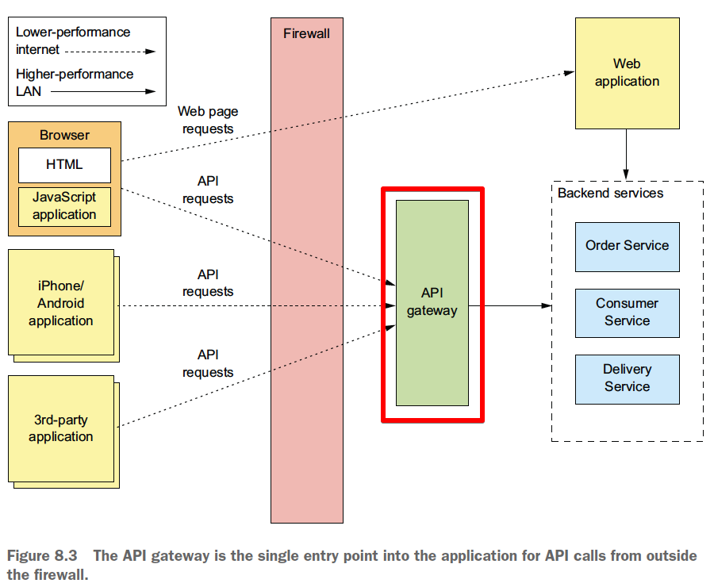
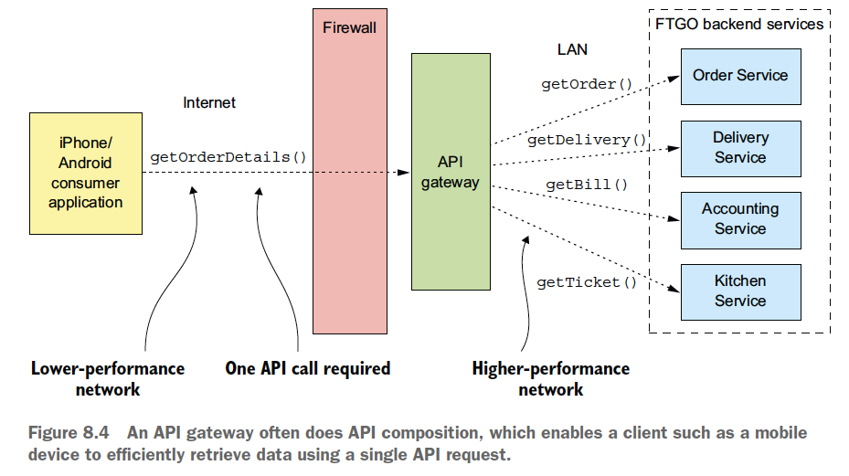
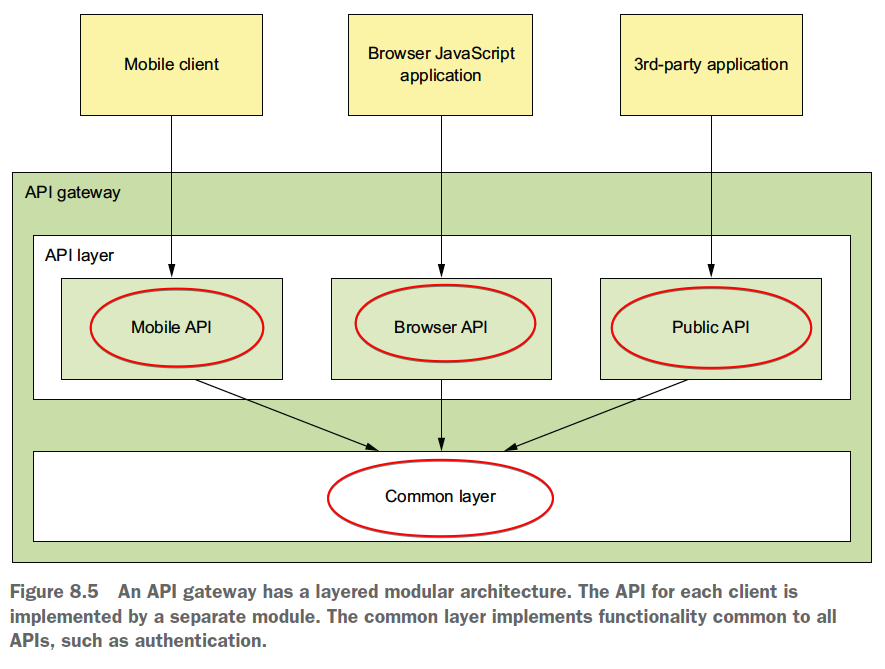
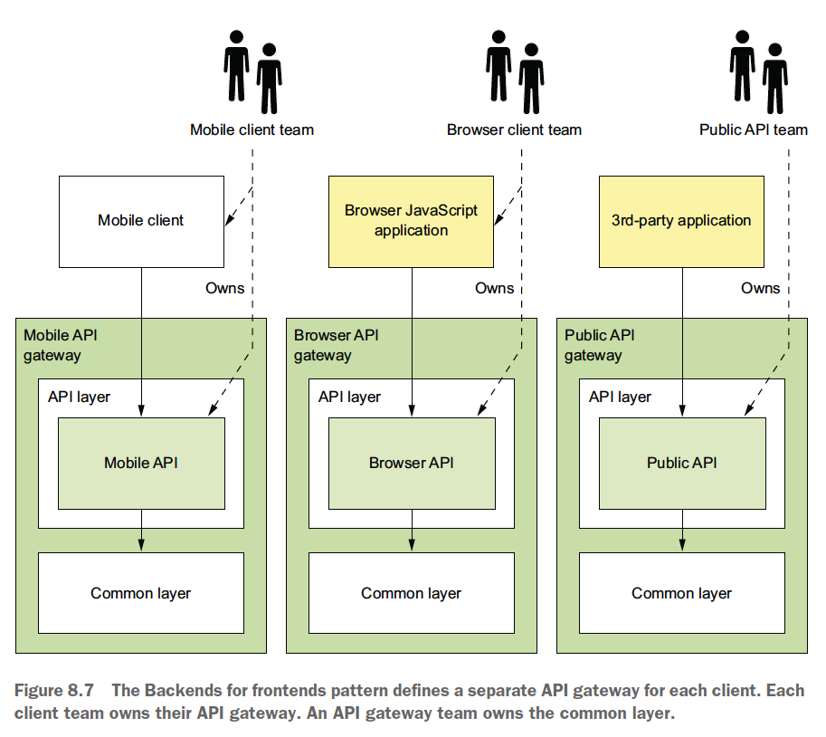
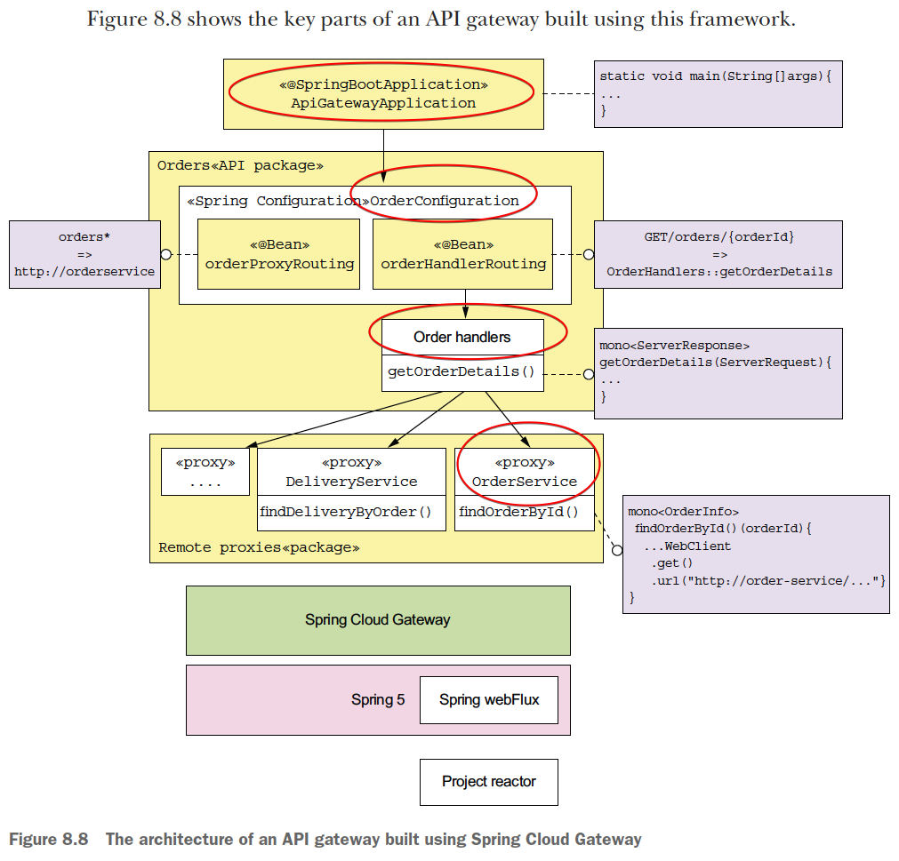
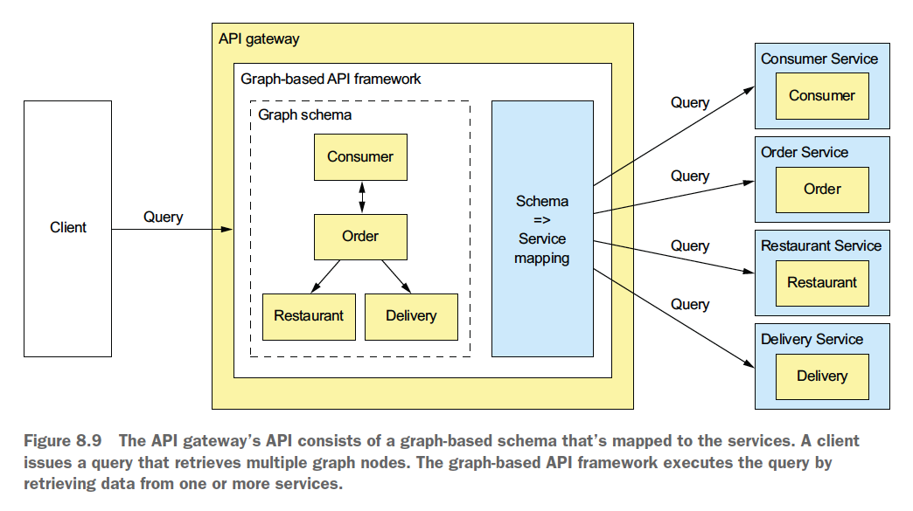

# Chapter 08 "외부 API 패턴"

* 애플리케이션의 외부 API는 클라이언트 종류가 다양한 만큼 설계하기가 어렵다.
* 이 장에서는, 다양한 외부 API 설계 이슈를 살펴보고, 두 가지 외부 API 패턴(API 게이트웨이, BFF) 및 그 설계/구현 방법을 설명한다.

## 1. 외부 API 설계 이슈

클라이언트가 서비스를 직접 호출하도록 API를 설계할 수도 있으나(모놀리식 애플리케이션),<br>
이런 방식은 MSA 에서 다음과 같은 단점이 있다.

* API가 잘게 나누어져있어 여러번 요청을 해야하는만큼 효율이 떨어지고 UX가 나빠진다.
* 클라이언트가 서비스 및 API를 알아야 하는 구조라서 캡슐화가 되지 않고, 추후 아키텍처와 API를 변경하기 어렵다.
    * 서비스에 관한 지식이 모바일 앱에 포함되어 있으면, 서비스 API 를 변경하기가 곤란해진다.
* 클라이언트(특히 방화벽 외부에 있는 클라이언트)가 사용하기에 불편하거나 실용적이지 못한 IPC를 서비스에서 사용중인 경우가 있다.
    * gRPC 기반 또는 AMQP같은 메시징 프로토콜은 내부에서는 잘 작동되지만, 모바일 클라이언트가 소비하기 어려운 경우가 많다.

## 2. API 게이트웨이 패턴

* [패턴] API 게이트웨이 - MSA에 외부 API 클라이언트의 진입점에 해당하는 서비스를 구현한다.

### 2.1. API 게이트웨이 패턴 개요



* API 게이트웨이: 방화벽 외부의 클라이언트가 애플리케이션에 API요청을 하는 단일 창구 역할을 하는 서비스
    * Facade 패턴
    * 내부 애플리케이션 아키텍처를 캡슐화하고 자신의 클라이언트에는 API를 제공한다.
    * 외부 클라이언트의 API 요청은 모두 API 게이트웨이로 향하고,<br>
    API 게이트웨이는 적절한 서비스로 요청을 보낸다.
* API 게이트웨이의 기능
    * 요청 라우팅
        * 요청이 들어오면 routing map을 찾아보고, 어느 서비스로 요청을 보낼지 결정
        * routing map: HTTP 메서드와 서비스의 HTTP URL을 매핑한 것 (nginx같은 웹 서버의 reverse proxy 개념)
    * API 조합<br>
        * 외부에서 API 게이트웨이에 요청을 한번 하면, API 게이트웨이는 여러 서비스에서 데이터를 조회하여 API 조합 패턴으로 데이터를 가져온다.
        * 대게 API를 조합하므로, 모바일 기기 등의 클라이언트는 대단위 API 요청 한 번으로 데이터를 효율적으로 조회할 수 있다.
    * 프로토콜 변환
        * 애플리케이션 내부에서 REST와 gRPC를 혼용할 경우에도 외부 클라이언트에는 REST API를 제공할 수 있다.
    * API 게이트웨이는 클라이언트마다 적합한 API를 제공한다.
        * BFF 패턴 - 클라이언트마다 API 게이트웨이를 따로 정의해서 클라이언트 맞춤 API 제공
    * 엣지(주변) 기능 구현(edge function)
        * 인증/인가/사용량 제한/캐싱/지표 수집/요청 로깅
        * 엣지 기능 구현 - 전용 엣지 서비스를 사용하되, 인증 같은 엣지 기능은 API 게이트웨이에 구현하는 방법이 간편하고 좋다.
            * 백엔드 서비스 
                * 요청이 서비스에 도달하기 전에 미리 애플리케이션이 요청을 인증하는 것이 안전
            * 외부 클라이언트와 직접 맞닿은 API 게이트웨이의 상류(upstream)
                * 요청이 API게이트웨이에 들어오기 전에 처리
            * 전용 엣지 서비스
                * 관심사 분리 가능 - API 게이트웨이는 API 라우팅/조합에 집중하고 중요한 엣지 기능을 중앙화한다.
                * 단점 - hop 카운트가 늘어나기 때문에 네트워크 지연 및 애플리케이션 복잡도가 증가한다.
* API 게이트웨이 아키텍처<br>
    * API 게이트웨이는 API 계층과 공통 계층으로 구성된 모듈 아키텍처 구조이다.
    * 클라이언트별 API는 별도 모듈로 구현하고, 인증처럼 전체 API 에 필요한 기능은 공통 계층에 구현한다.
* API 게이트웨이 소유권 모델 (개발/운영 담당자)
    * API 게이트웨이 팀은 공통 모듈 개발 및 게이트웨이 운영 이슈에 집중한다.
    * API가 표출된 모델은 해당 클라이언트 팀(모바일, 웹, 퍼블릭 API 팀)이 소유하고 그 API를 개발한 팀별로 권한을 부여한다.
    * 매끄러운 협업을 위해서는 API 게이트웨이 배포 파이프라인을 자동화 해야 한다.
* BFF 패턴 (Backends for Frontend, 프론트엔드를 위한 백엔드)<br>
    * cf) 모놀리식 API 게이트웨이 패턴
        * 여러 팀 사람들이 동일한 코드베이스에 소스를 커밋하고, API 게이트웨이 팀이 그 운영을 맡는 구조는 책임 소재가 불분명해지는 문제가 있다.
        * ‘if you build it,you own it’ (빌드한 사람이 주인이다.) 라는 마이크로서비스 아키텍처의 철학과 맞지 않게 된다.
        * → BFF 패턴으로 해결
    * 각 클라이언트마다 API 게이트웨이를 따로 구현한다.
    * 각 API 모듈을 하나의 클라이언트 팀이 개발/운영하는 Stand Alone API 게이트웨이가 되는 구조이다.
    * 이론적으로는 API 게이트웨이마다 다른 기술을 사용하여 개발할 수 있지만, 공통 기능 코드가 중복될 우려가 있기에 모든 API 게이트웨이에 동일한 기술 스택을 적용하는 것 좋다.
    * 장점
        * 책임을 명확히 하고, API 모듈이 서로 격리되어 신뢰성이 향상된다.
        * 각 API를 독립적으로 확장할 수 있다.
        * 더 작고 단순한 애플리케이션으로 만들 수 있어서 시동 시간도 단축된다.

### 2.2. API 게이트웨이의 장단점

* 장점 - 애플리케이션의 내부 구조 캡슐화
    * 클라이언트가 특정 서비스를 호출할 필요 없이 무조건 API 게이트웨이를 호출하면 된다. 
    * 클라이언트마다 최적의 API가 제공되므로, 외부서비스와의 트랜잭션 호출수가 줄어든다.
* 단점
    * 관리할 범위가 많아진다.
    * 하지만 BFF 패턴을 이용하여, 팀별로 API를 독립적으로 개발/배포할 수 있어 합리적이다.

### 2.3. API 게이트웨이 사례: 넷플릭스

* 기기별 API 가 따로 구현된 API 게이트웨이를 사용하며, API 구현 코드는 클라이언트 기기 팀이 소유/개발한다.
* Netflix Falcor 
    * 선언적으로 API를 동적 조합하는 기술
    * 서비스 API를 표출한 second API 게이트웨이를 호출한다.
    * 클라이언트는 요청 한 번으로 여러 서비스를 호출할 수 있다.

### 2.4. API 게이트웨이 설계 이슈

* 성능과 확장성
    * 모든 외부 요청은 모두 게이트웨이를 거쳐야만 하므로, API 게이트웨이가 동기/비동기를 지원할 것인지, 그에 따른 성능과 확장성 관리는 어떻게 할 것인지 고민해야 한다.
* 리액티브 프로그래밍 추상체를 이용하여 관리 가능한 코드 작성
    * 여러 API를 취합해서 전달해야하는 시스템에서는 각 API들의 경과 시간 전체 합산 시간만큼 필요하지만, 리액티브로 진행할 경우 여러 API 중 가장 긴 경과 시간이 전체 시간이 된다.
    * 따라서, 관리 가능한 동시성 코드를 개발하는 것이 관건이다.
    * [참고] [우아한 Tech 세미나 - 스프링리액티브프로그래밍](https://techblog.woowahan.com/2619/)
* 부분 실패 처리
    * 인스턴스 실패시 부하 분산기가 알아서 요청을 다른 인스턴스로 라우팅 하여 안정적으로 동작하게 해야 한다.
* 애플리케이션 아키텍처에서 선량한 시민 되기
    * 선량한 시민: 다른 사람에게 부정적인 영향을 끼치지 않고 자신이 맡은 바 임부를 충실히 수행하는 시민이라는 의미
    * API 게이트웨이 같은 서비스 클라이언트는 자신이 호출하는 서비스 인스턴스 위치를 파악할 수 있어야 한다. 
    * 즉, 서비스가 복잡해짐에도 불구하고 API 게이트웨이의 목적에 맞게 사용되어야 한다.

## 3. API 게이트웨이 구현

1. 기성 API 게이트웨이 제품/서비스 활용
1. API 게이트웨이 프레임워크 또는 웹 프레임워크를 기반으로 API를 직접 개발

### 3.1. 기성 API 게이트웨이 제품/서비스 활용

* AWS API 게이트웨이
    * API 조합을 지원하지 않으므로, 직접 백엔드 서비스에 조합 로직을 구현해야 한다.
* AWS ALB(Application Load Balancer)
* Kong, Traefik 등...

### 3.2. API 게이트웨이 자체 개발

* API 게이트웨이는 요청을 다른 서비스로 위임하는 웹 애플리케이션이므로 특별히 개발하기 어려운 부분은 없으나, 아래 2가지 이슈는 신중히 검토해야 한다.
    * 코딩 복잡도를 최소화할 수 있는 라우팅 규칙 정의 메커니즘을 구현한다.
    * HTTP 헤더 처리 등 HTTP 프록시 로직을 정확히 구현한다.
* Netflix Zuul
    * 라우팅, 사용량 제한, 인증 같은 엣지 기능이 탑재된 프레임워크이다.
    * 경로 기반의 라우팅만 지원된다. (예: GET /orders를 서비스 A로, POST /orders를 서비스 B로 라우팅하는 것은 불가능하다.)
    * 쿼리 아키텍처(CQRS)가 지원되지 않는다.
* Spring Cloud Gateway
    * Spring5, Spring Boot2, Project Reactor로 구축된 API Gateway 이다.
    * API 라우팅 및 보안, 모니터링/메트릭 등의 기능을 간단하고 효과적인 방법으로 제공한다. 
    * 
        * ApiGatewayApplicaion 클래스 - API 게이트웨이의 메인 프로그램(main 메서드)
        * OrderConfiguration 클래스 - 주문 관련 요청을 라우팅하는 스프링 빈이 정의된 클래스
        * OrderHandler 클래스 - API 조합을 비롯한 사용자 정의 로직이 구현된 요청 핸들러 메서드가 있다.
        * OrderServiceProxy 클래스 - WebClient로 서비스를 호출

### 3.3. API 게이트웨이 구현: GraphQL



* GraphQL: 데이터를 효율적으로 가져오도록 설계된 그래프 기반의 API 프레임워크
* API 게이트웨이의 API는 그래프 기반의 스키마로 구성한다.
* 클라이언트는 여러 그래프 노드를 조회하는 쿼리를 전송하며, 그래프 기반 API 프레임워크는 서비스 데이터를 조회한다.
* 장점
    * 클라이언트가 반환 데이터를 제어할 수 있어, 여러가지 클라이언트가 지원되는 유연한 단일 API를 개발할 수 있다.
    * 서버 쪽 코드를 쿼리 실행 프로임워크로 작성하기 때문에, 개발 수고를 덜 수 있다.
* 설계 핵심 요소
    * GraphQL 스키마  - 서버 쪽 데이터 모델 및 이 모델이 지원하는 쿼리를 정의한다.
    * 리졸버 함수 - 스키마 엘리먼트를 다양한 백엔드 서비스에 매핑한다.
    * 프록시 클래스 - 서비스를 호출한다.

#### glue 코드 구현

1. GraphQL 스키마 
    * 여기에 정의된 객체형은 각각 FTGO 애플리케이션의 Order, Restaurant, Consumer 엔터티와 대응된다.

```js
type Query {    // 클라이언트에서 실행 가능한 쿼리를 정의
  orders(consumerId : Int!): [Order]    // = orders()
  order(orderId : Int!): Order          // = order()
  consumer(consumerId : Int!): Consumer // = consumer()
}
type Order {
  orderId: ID,
  consumerId : Int,
  consumer: Consumer
  restaurant: Restaurant
  deliveryInfo : DeliveryInfo
}
type Restaurant {
  id: ID
  name: String
}
type Consumer {
  id: ID    // 소비자 식별용 ID
  firstName: String
  lastName: String
  orders: [Order]   // 한명의 소비자는 주문을 여러 건 할 수 있음.
}
```

2. GraphQL쿼리 실행
    * 클라이언트가 반환 데이터를 쿼리 언어로 자유롭게 제어할 수 있다.

```js
query {
    // 소비자 정보를 조회하는 consumer라는 쿼리를 지정
    consumer(consumerId:1) {    
        // 반환할 Consumer의 필드
        firstName
        lastName
    }
}
```

3. 스키마를 데이터에 연결
    * 스키마에 정의된 객체형 필드에 리졸버 함수를 붙이면 GraphQL스키마를 데이터 소스와 연결할 수 있다.
4. 서버쪽에서 배칭/캐싱으로 로딩 최적화
    * Node.js 에서는 데이터 로더 모듈 사용
5. 아폴로 GraphQL 서버와 익스프레스 프레임워크(Node.js) 연계
    * 아폴로 GraphQL 서버는 GraphQL 쿼리를 실행한다.
    * 클라이언트가 이 서버를 호출하려면 웹 프레임워크에 연계해야 한다.
6. GraphQL 클라이언트 작성
    * GraphQL 서버는 HTTP 기반의 API를 제공하므로, HTTP 라이브러리를 이용하여 요청한다.
    * 클라이언트가 원하는 데이터를 조회할 수 있다.

```js
findConsumer(consumerId) {
    return this.client.query({  
        variables: { cid: consumerId},  // $cid 값 제공
        query: gql`
            query foo($cid : Int!) {   // $cid를 int형 변수로 정의
                consumer(consumerId: $cid)  { // 쿼리 매개변수 consumerId 값을 $cid 로 셋팅
                    id 
                    firstName
                    lastName
                    orders { orderId restaurant { name } }
                 } 
            }  `,
    })
}
```

## 4. Summary

* API 게이트웨이: 방화벽 외부의 클라이언트가 애플리케이션에 API요청을 하는 단일 창구 역할을 하는 서비스
* API 게이트웨이의 기능
    * 요청 라우팅
    * API 조합
    * 프로토콜 변환
    * 엣지(주변) 기능 구현
* 클라이언트 유형마다 API 게이트웨이를 정의하는 BFF패턴을 적용하면, 클라이언트 팀이 API 게이트웨이를 자체적으로 개발/배포/운영할 수 있다.
* API 직접 구현 방법
    * Netflix Zuul
        * 경로 기반의 라우팅만 가능하다.
    * Spring Cloud Gateway
        * 요청을 직접 벡엔드 서비스나 사용자 정의 핸들러 메서드로 보낸다.
        * 사용자 정의 핸들러를 리액티브 스타일로 직접 개발할 수 있다.
    * GraphQL
        * 그래프 기반의 쿼리 언어를 제공하는 프레임워크
        * 그래프 지향 스키마를 작성하여 서버 쪽 데이터 모델과 쿼리를 기술한 후, 데이터를 조회하는 리졸버를 작성해서 스키마를 서비스에 매핑한다.
        * 클라이언트는 서버가 어떤 데이터를 반환해야 하는지를 기술한다.

## Reference

* https://medium.com/byungkyu-ju/%EB%A7%88%EC%9D%B4%ED%81%AC%EB%A1%9C%EC%84%9C%EB%B9%84%EC%8A%A4%ED%8C%A8%ED%84%B4-8-8%EC%9E%A5-3cbe2bcbd24c


