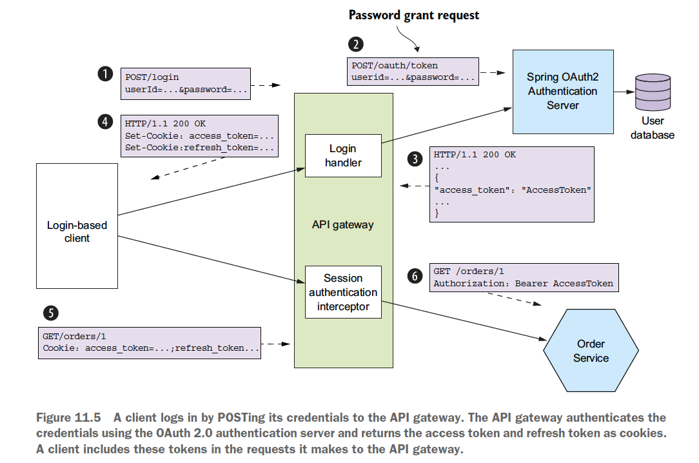
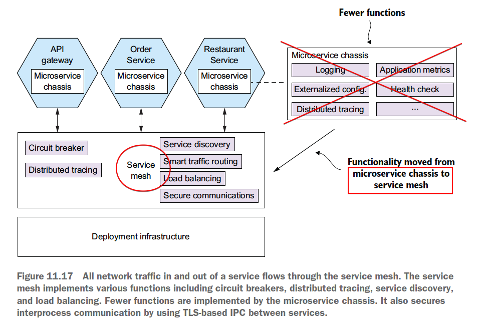

# Chapter 11 "프로덕션 레디 서비스 개발"

* 서비스를 프로덕션에 배포하려면, 세 가지 핵심 품질 속성 `보안, 구성성, 관측성`이 보장되어야 한다.

## 1. 보안 서비스 개발

* 인증(authentication): 신원 확인. 사용자 ID/패스워드나 애플리케이션 API 키/시크릿.
* 인가(authorizaion): 작엽 요청 권한이 있는지 확인.
* 감사(audition): qhdks dltb xkawl, zjavmffkdldjstm tlgod
* 보안 ICP: 모든 서비스를 드나드는 통신이 TLS(Transport Layer Security, 전송 계층 보안)를 경유하는 것이 가장 이상적이다.

### 1.1. 기존 모놀리식 애플리케이션의 보안

* 최초 로그인 시 세션 토큰(쿠키)를 획득하고, 그 다음부터는 세션 토큰을 넣어 요청한다.
* Session 
    * 주체의 ID와 역할은 세션에 보관한다.
    * 세션은 세션 토큰으로 식별하며, 클라이언트는 요청할 때마다 세션 토큰을 같이 넣어 보낸다.
* Security Context
    * 현재 요청을 보낸 사용자 정보를 보안 컨텍스트에 담는다.
    * 보안 컨텍스트를 thread local 변수에 저장해서, 모든 요청 핸들러 코드가 보안 컨텍스트에 접근할 수 있도록 한다.
* 인증/인가를 정확하게 구현하기는 어려우므로, 이미 검증된 보안 프레임워크를 사용하는 것이 좋다.
    * Java - Spring Security, Apache Shiro
    * Node.js - Passport

### 1.2. MSA에서의 보안 구현

* MSA에서 각 서비스 나름대로 보안을 구현하려면, 모놀리식 애플리케이션의 설계를 그대로 베껴 쓸 수가 없다.
    * 인-메모리 보안 컨텍스트 - 서비스는 메모리를 공유할 수 없으므로, 쓰레드 로컬 등의 인-메모리 보안 컨텍스트를 사용할 수 없다.
    * 중앙화 세션 - 인-메모리 세션을 사용할 수 없다.

#### 1.2.1. API 게이트웨이에서 인증 처리

* 방법 1) 서비스마다 알아서 사용자를 인증한다. (X)
    * 미인증 요청이 내부 네트워크로 들어올 수 있고, 모든 개발자가 제대로 보안을 구현한다는 보장이 없다.
* 방법 2) 요청을 서비스에 보내기 전에 API 게이트웨이가 요청을 인증한다. (O)
    * API 게이트웨이가 매번 서비스에 요청을 할 때마다 신원, 역할 등 사용자 정보가 담긴 토큰을 함께 넣어서 보낸다. 
    * API 게이트웨이에 인증 로직을 중앙화하면 나중에 문제가 생겨도 한 곳만 바로잡으면 되고, 복잡한 코드도 서비스에서 감출 수 있다.

#### 1.2.2. 인가 처리

* API 게이트웨이에 인가 로직을 두면 API 게이트웨이와 서비스가 단단히 결합하게 되고, API 게이트웨이로 개별 도메인 객체의 접근 권한을 제어하는 것은 무리이다.
* 따라서, 인가 로직은 서비스에 구현하는 것이 좋다.
    * 서비스가 직접 역할 기반으로 URL과 메서드를 인가하고, ACL(접근 제어 리스트) 으로 애그리거트 접근을 따로 관리한다.

#### 1.2.3. JWT로 사용자 신원/역할 전달

* API 게이트웨이가 어떤 종류의 토큰에 사용자 정보를 담아 서비스에 전달할지 결정해야 한다.
* 종류 1) 난독화 토큰 
    * UUID(Universally Unique Indentifier)를 많이 사용한다.
    * 토큰 수신자가 유쇼성을 검증하고 보안 서비스를 동기 RPC 호출해야 하기 때문에, 성능 및 가용성이 떨어진다.
* 종류 2) 투명 토큰
    * JWT (JSON Web Token)
    * 보안 서비스 호출이 필요 없다.
    * 사용자 정보, 만료일자 등 각종 메타데이터가 포함된 JSON 객체를 payload에 담아 JWT 생성자(예: API 게이트웨이)와 JWT 수신자(예: 서비스)만 알 수 있는 시크릿으로 서명한다.
    * JWT는 토큰 자체가 포함되어 있기 때문에 취소할 수 없으므로, 유효 기간이 짧은 JWT 를 발급한다.

#### 1.2.4. OAuth 2.0 응용

* JWT 를 통한 API 게이트웨이의 인가 처리와 같은 보안 인프라는 직접 개발할 필요 없이, OAuth 2.0 표준이 제대로 구현된 기성 서비스나 프레임워크를 사용하면 된다.
* OAuth 2.0의 핵심 개념
    * Authorizaion Server
    * Access Token - JWT
    * Refresh Token - 취소 가능하다.
    * Resource Server - 액세스 토큰으로 접근을 허가하는 서비스.MSA에서는 서비스가 곧 리소스 서버이다.
    * Client



* 인증 단계
    1. 클라이언트는 자격 증명을 API 게이트웨이에 POST 하여 로그인 한다.
    1. API 게이트웨이는 클라이언트가 준 자격 증명을 OAuth2.0 인증 서버로 인증 후, 액세스/리프레시 두 토큰을 쿠키로 반환하낟.
    1. 다음부터 클라이언트는 API게이트웨이에 요청할 때마다 이 2 토큰을 넣어 보낸다.
    1. API 게이트웨이의 세션 인증 인터셉터는 액세스 토큰을 검증 후 서비스에 토큰을 넣어 보낸다.
* 액세스 토큰을 세션 토큰처럼 이용하므로 세션 지향 클라이언트를 인증할 수 있다.

## 2. 구성 가능한 서비스 설계

* 각 서비스의 네트워크 위치, 자격 증명 등의 구성 프로퍼티를 profile 장치로 런타임에 프로퍼티 세트를 선택하는 구조는 보안에 취약하고 배포에 한계가 있어 적절하지 않다.
* [패턴] 외부화 구성: 런타임에 DB 자격증명, 네트워크 위치 등의 구성 프로퍼티 값을 서비스에 제공한다. 
* 외부화 구성 메커니즘의 구현 방식 2가지 모델
    * Push model: OS 환경 변수, 구성 파일 등을 통해 배포 인프라에서 서비스로 프로퍼티 값을 전달한다.
    * Pull Model: 서비스 인스턴스가 구성 서버에 접속해서 프로퍼티 값을 읽어온다.

### 2.1. Push 기반의 외부화 구성

* 서비스 인스턴스가 시작될 때 구성 프로퍼티 값을 읽어 온다.
* 예) 배포 인프라는 주문 이력 서비스 인스턴스 생성 시 외부화 구성이 포함된 환경 변수를 세팅하며, 이렇게 세팅된 변수 값을 주문 이력 서비스가 읽는다.
```java
public class OrderHistoryDynamoDBConfiguration {
    @Value("${aws.region}")
    private String awsRegion
    ...
}
```
* 단점 
    * 배포 인프라 구조상, 실행 중인 서비스의 외부화 구성을 서비스를 재시동하지 않고서는 바꿀 수 없는 경우가 있다. 
    * 구성 프로퍼티 값이 여러 서비스에 흩어져있다.
    * → Pull 모델을 검토해야 한다.

### 2.2. Pull 기반의 외부화 구성

* 서비스 인스턴스가 시동 시 자신이 필요한 값을 구성 전용 서버에 접속하여 읽는 방식이다.
* 구성 서버 구현 방법
    * 버전 관리 시스템
    * SQL/NoSQL
    * 전용 구성 서버(예: Spring Cloud Config Server), AWS 파라미터 스토어
        * Spring Cloud Config: 서버는 구성 프로퍼티를 저장하고, 클라이언트는 서버에서 구성 프로퍼티를 가져와 스프링 ApplicationContext에 주입하는 역할을 한다.
* 장점
    * 중앙화 구성 - 모든 구성 프로퍼티를 한 곳에서 관리하여, 전역 기본값을 정의하고 서비스 단위로 재정의하는 식으로 중복 구성 프로퍼티를 제거할 수 있다.
    * 민감한 데이터의 투명한 복호화 - 구성 서버는 프로퍼티를 자동 복호화해서 서비스에 전달하낟.
    * 동적 재구성 - 수정된 프로퍼티 값을 폴링 등으로 감지하여 자동 재구성한다.

## 3. 관측 가능한 서비스 설계

* 개발자는 서비스가 확실하게 관측될 수 있게 개발하고, 운영자는 서비스가 표출한 정보를 수집하는 인프라를 맡는다.
* 관측 가능한 서비스를 설계하는 패턴
    * Health Check API: 서비스 헬스를 반환하는 Enpoint를 표출한다.
    * 로그 수집: 중앙 로그 서버에 로그를 출력한다.
    * 분산 추적: 각 외부 요청에 ID를 하나씩 붙여 서비스 사이를 드나드는 과정을 추적한다.
    * 예외 추적: 예외 추적 서비스에 예외를 보고한다.
    * 애플리케이션 지표: 서비스는 카운터, 게이지 등 지표를 유지하고, 수집한 데이터를 지표 서버에 표출한다.
    * 감사 로깅: 사용자 액션을 로깅한다.

### 3.1. 헬스 체크 API 패턴

* 서비스는 서비스 상태를 반환하는 GET /health 등의 헬스 체크 API endpoint를 표출한다.
* 배포 인프라는 서비스 인스턴스 상태를 계속 살피고 문제가 있으면 즉시 조치를 할 수 있도록 주기적으로 비스에 구현된 헬스 체크 endpoint 를 호출한다.
* 스프링 부트 액추에이터

### 3.2. 로그 수집 패턴

* 모든 서비스 인스턴스가 남긴 로그를 로그 수집 파이프라인을 통해 중앙 로깅 서버로 보내, 검색/알림 기능을 제공한다.
* 서비스 로그 생성시 적합할 로깅 라이브러리 선택 후, 로그 항목을 어디에 출력할지 정해야 한다.
* 로그 수집 인프라 선택 
    * 예: ELK (Elastic Search / Logstash / Kibana)

### 3.3. 분산 추적 패턴

* 외부 요청마다 유일한 ID를 하나씩 부여해서 한 서비스에서 다음 서비스로 흘러가는 과정을 기록하고, 시각화/분석 기능을 제공하는 중앙화 서버에 자료를 남긴다.
* 각 요청은 하나의 trace 로 표시되며, 프레이스는 하나 이상의 span(작업)으로 구성된다.
* 인스트루멘테이션 라이브러리 
    * 스팬 트리를 만들어 분산 추적 서버로 보낸다.
    * 비즈니스 로직과 얽힐 수 있으므로 인터셉터나 AOP를 이용하는 것이 깔끔하다.
* 분산 추적 서버
    * 인슽으루멘테이션 라이브러리는 분산 추적 서버에 스팬을 전송하고, 분산 추적 서버는 전달받은 스팬을 짜깁기하여 완전한 트레이스 형태로 만든 후 DB에 저장한다.
    * Open Zipkin

### 3.4. 애플리케이션 지표 패턴

* 서비스는 수집, 시각화, 알림 기능을 제공하는 중앙 서버로 지표를 보고한다.
* 서비스가 자신의 동작에 관한 지표를 수집하도록 구현해야 한다.
* 지표 서비스는 수집한 지표를 push or pull 방식으로 메트릭스 서비스에 전달한다.

### 3.5. 예외 추적 패턴

* 예외 추적 서비스를 따로 두어, 중복된 예외를 제거하고, 알림을 생성하고, 예외 해결 과정을 관리한다.
* 여타 서비스에 예외가 발생하면 REST API, 라이브러리 등으로 무조건 예외 추적 서비스에 보고하도록 구성한다.

### 3.6. 감사 로깅 패턴

* 고객 지원, 컴플라이언스 준수, 수상한 동작 감지를 위해 사용자 액션을 DB에 저장한다.
* 구현 방법
    * 감사 로깅 코드를 비즈니스 로직에 추가한다.
        * 비즈니스 로직과 섞여 관리하기가 쉽지 않다.
    * AOP를 활용한다.
        * 서비스 메서드가 호출된 때마다 자롱 기로되지만, 어떤 비즈니스 객체를 대상으로 액션이 이루어지는지 판단하기는 어렵다.
    * 이벤트 소싱을 이용한다. 
        * 이벤트 소싱은 생성/수정 작업의 감사 로그를 자동으로 제공하는 기능이 있다.

## 4. 서비스 개발: 마이크로서비스 섀시 패턴

* [패턴] 마이크로서비스 섀시: 예외 추적, 로깅, 헬스 체크, 외부화 구성, 분산 추적 등의 횡단 관심사를 처리하는 프레임워크이다.

### 4.1. 마이크로서비스 섀시

* 개발자가 작성해야 할 코드가 줄어서, 서비스 비즈니스 로직 개발에만 전념할 수 있다.
* 정해진 요건에 알맞게 마이크로서비스 섀시를 구성해야 한다.
    * 예) FTGO: 스프링 부트(외부화 구성) + 스프링 클라우드(회로차단기 기능)

### 4.2. 이제는 서비스 메시로

* [패턴] 서비스 메시: 회로 차단기, 분산 추적, 서비스 디스커버리, 부하분산, 룰 기반 트래픽 라우팅 등 다양한 관심사가 구현된 네트워킹 계층을 통해 서비스를 드나드는 모든 네트워크 트래픽을 라우팅한다.
* 서비스 메시는 한 서비스와 다른 서비스, 그리고 외부 애플리케이션 간의 소통을 조정하는 인프라이다.
* 서비스를 드나드는 네트워크 트래픽은 모두 서비스 메시를 통과한다.



## 5. 마치며

* MSA에서는 API 게이트웨이에서 클라이언트를 인증하여 서비스를 요청할 때마다 투명토큰(JWT)를 같이 넣어 보내고, 서비스는 이 정보를 가져와 리소스 접근을 승인한다. (OAuth 2.0)
* 외부 서비스별 네트워크 위치와 자격 증명은 서비스 실행 환경마다 다르기 때문에, 외부화 구성 패턴을 적용하여 런타임에 구성 프로퍼티를 서비스에 공급해야 한다.
* 운영자는 로그 수집, 지표, 예외 추적, 분산 추적을 처리하는 관측성 인프라를 담당하고, 개발자는 본인이 개발한 서비스가 관측 가능하도록 보장해야 한다.
* 개발을 단순화/가속화하려면 서비스를 마이크로서비스 섀시 기반으로 개발하는 것이 좋다. 향후 마이크로서비스 섀시의 네트워킹 관련 기능은 서비스 메시 (전체 서비스 네트워크 트래픽이 흐르는 인프라 소프트웨어 계층)로 옮아갈 전망이다.


