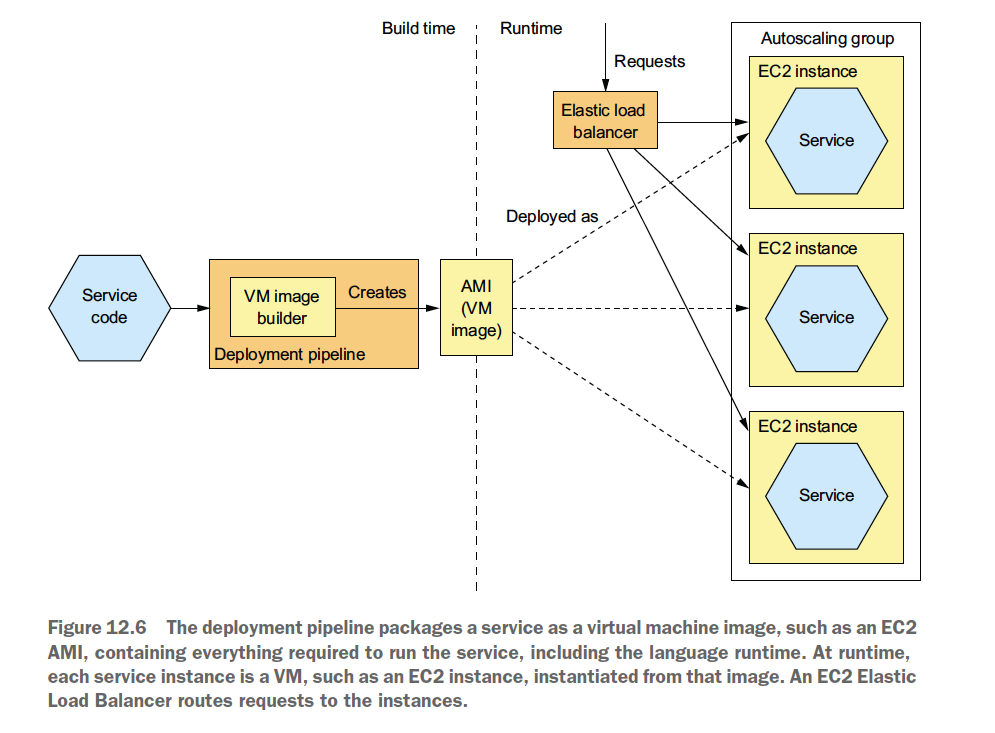
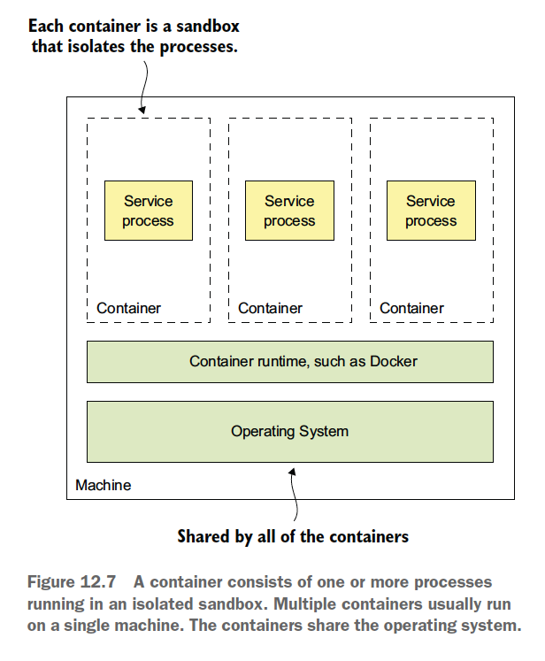
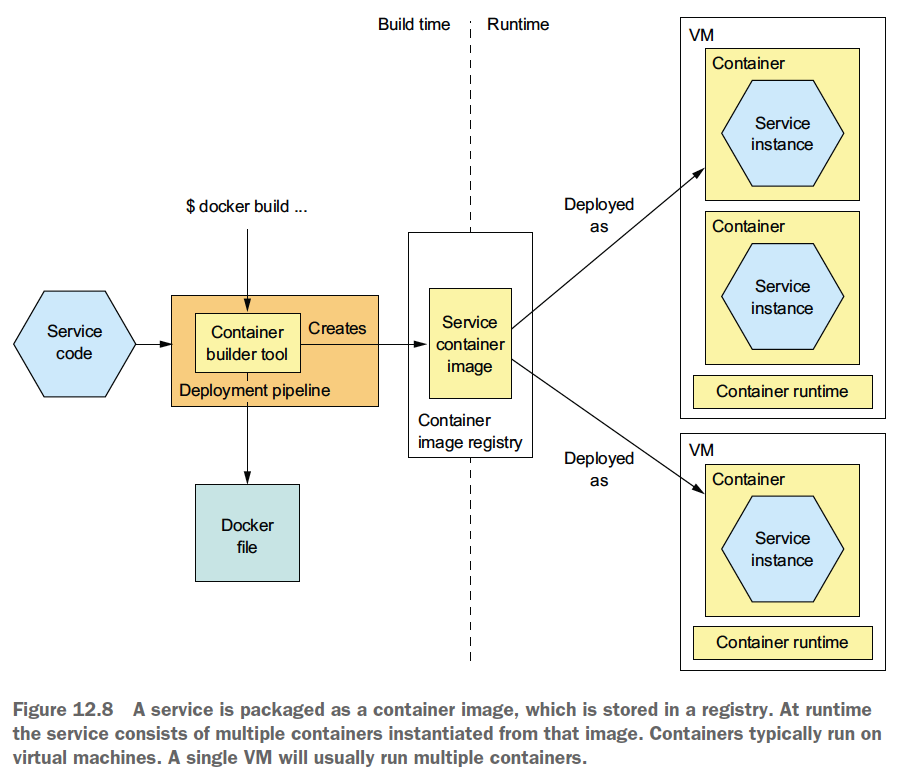
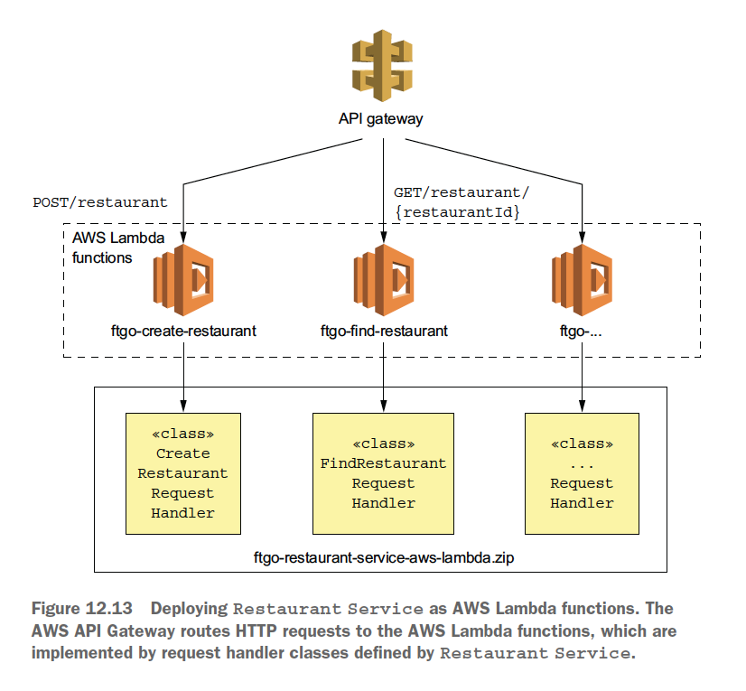

# Chapter 12 "마이크로서비스 배포"

* 배포는 프로세스와 아키텍처, 두 상호 연관된 개념의 조합이다.
    * 배포 프로세스 - 소프트웨어를 프로덕션에 반영하기 위해 사람이 해야 하는 단계들로 구성된다.
    * 배포 아키텍처 - 소프트웨어가 실행되는 환경의 구성을 정의한다.
* 프로덕션 환경의 4대 필수 기능
    * 서비스 관리 인터페이스
        * 개발자가 본인이 담당한 서비스를 배포/관리하는 인터페이스를 제공한다.
        * CLI나 GUI 배포 툴에서 호출하는 REST API가 가장 좋다.
    * 런타임 서비스 관리
        * 서비스 인스턴스가 항상 적정한 개수만큼 실행되도록 한다.
    * 모니터링
        * 서비스가 무슨 일을 하고 있는지, 로그 파일 및 지표를 개발자가 관찰할 수 있게 해야 한다.
    * 요청 라우팅
        * 사용자 요청을 서비스로 보낸다.
* 4가지 주요 배포 옵션
    * 언어에 특정한 패키지로 서비스를 배포(예: JAR/WAR 파일) (X)
    * 서비스를 가상 머신 이미지로 묶어서 배포 
        * 서비스의 기술 스택을 캡슐화 할 수 있다.
    * 서비스를 컨테이너로 배포
        * 컨테이너는 가상 머신보다 가볍다. 
        * 예) 쿠버네티스
    * 서비스를 서버리스 배포 기술로 배포
        * 컨테이너보다 최신 기술이다.
        * 예) AWS 람다

## 1. 서비스 배포: 언어에 특정한 패키징 포맷 패턴

* 코드와 필요한 런타임을 모두 언어에 특정한 패키지(JAR/WAR 파일)에 넣고 OS에 배포한다.
* 런타임(예: JDK) & 웹 컨테이너(예: 아파치 톰캣)
* 과거에 무겁고 값비싼 애플리케이션 서버(예: 웹로직, 웹스피어)에서 자유 사용했던 애플리케이션 배포 방식

### 1.1. 장점

* 호스트에 서비스를 복사해서 그냥 시동하면 되므로, 서비스 인스턴스를 배포하는 속도가 빠르다.
* 여러 서비스 인스턴스가 머신과 OS를 공유하므로 리소스를 효율적으로 활용할 수 있다. (특히 같은 머신이나 같은 프로세스 내에서 여러 인스턴스를 실행할 때.)

### 1.2. 단점

* 기술 스택을 캡슐화할 수 없다.
    * 서비스별로 런타임 버전이 정해져있고, 패키지 버전이 상이할 수 있으므로 운영자가 정확하게 구분해서 설치해야 한다.
* 서비스 인스턴스가 소비하는 리소스를 제한할 방법이 없다.
    * 버그 등으로, 한 프로세스가 전체 CPU/메모리를 다 소모하는 현상이 발생할 수 있다.
* 여러 서비스 인스턴스가 동일 머신에서 실행될 경우 서로 격리할 수 없다.
* 서비스 인스턴스를 어디에 둘지 자동으로 결정하기 어렵다.
    * VM 기반의 클라우드 및 컨테이너 오케스트레이션 프레임워크는 이러한 일을 자동으로 이러한 일을 처리한다.

## 2. 서비스 배포: 가상 머신 패턴

* 서비스를 VM 이미지로 묶어 프로덕션에 배포한다. 각 서비스 인스턴스가 하나의 VM이다.

* 서비스의 배포 파이프라인은 언어 런타임을 포함하여 서비스 가동에 필요한 모든 요소가 포함된 가상 머신 이미지(예: EC2 AMI) 형태로 서비스를 패키징한다.
* 각 서비스 인스턴스는 이렇게 패키징한 이미지를 토대로 런타임시 VM 인스턴스(예: EC2 인스턴스)를 만든다.
* EC2 일래스틱 부하 분산기는 들어온 요청을 각 인스턴스로 고루 분산한다.

### 2.1. 장점

* VM 이미지로 기술 스택을 캡슐화한다.
    * 서비스와 연관된 디펜던시를 모두 VM 이미지에 담을 수 있다.
    * VM 이미지는 따로 수정할 필요 없이 어디라도 배포할 수 있다.
* 서비스 인스턴스가 격리된다.
    * 정해진 CPU/메모리 리소스가 가상 머신마다 배정되므로 다른 서비스에 있는 리소스를 빼앗아 올 수가 없다.
* 성숙한 클라우드 인프라를 활용한다. (예: AWS)

### 2.2. 단점

* 리소스를 효율적으로 활용할 수 없다.
     * 서비스 인스턴스마다 OS를 포함한 전체 가상 머신의 오버헤드가 있다.
* 배포가 비교적 느리다.
    * VM 이미지는 대부분 크기가 커서 빌드 시간이 몇 분 정도 걸리고, 네트워크를 통해 이동하는 데이터양도 많은 편이다.
* 시스템 관리 오버헤드가 발생한다.
    * OS/런타임 패치가 필요하다. (cf. 서버리스 배포시에는 필요 없다.)

## 3. 서비스 배포: 컨테이너 패턴

* 서비스를 컨테이너 이미지로 묶어 프로덕션에 배포한다. 각 서비스 인스턴스가 곧 하나의 컨테이너다.
* 컨테이너는 다른 컨테이너들과 격리된 샌드박스에서 하나 OR 여러개의 프로세스로 실행된다. (프로세스 입장에서 컨테이너는 마치 자체 머신에서 실행되는 것처럼 실행된다.)
* 일반적으로 하나의 머신에 여러 컨테이너가 실행되며, 컨테이너는 모두 동일한 OS를 공유한다.
* 고유한 IP 주소를 갖고 있으므로 충돌 가능성이 없다.
* 컨테이너마다 자체 루트 파일 시스템을 갖고 있다.

### 3.0. 서비스를 컨테이너로 배포하는 과정

* 컨테이너 이미지로 패키징된 서비스는 레지스트리에 저장된다.
* 이렇게 저장된 이미지를 토대로 런타임에 여러 컨테이너가 인스턴스를 만들어 서비스를 구성한다.
* 컨테이너는 대부분 가상 머신에서 실행되고 하나의 VM이 여러 컨테이너를 실행한다.

### 3.1. 서비스를 도커로 배포

* 서비스를 컨테이너로 배포하려면 반드시 컨테이너 이미지로 묶어야 한다.
* 컨테이너 이미지: 애플리케이션과 서비스 구동에 필요한 모든 소프트웨어로 구성된 파일 시스템 이미지
    * 대부분 리눅스 루트 파일 시스템
    * 예) 스프링 부트 서비스는 실행 가능한 서비스 JAR 파일, 정확한 버전의 JDK가 들어 있는 컨테이너 이미지를 빌드해서 배포한다.

#### 배포 단계

1. 도커 이미지 빌드
    * 도커 컨테이너 이미지를 빌드하는 방법이 기술된 도커 파일을 생성한다.
2. 도커 이미지를 레지스트리에 푸시
    * Docker Registry: 자바 라비르러리가 집합된 메이브 저장소 같은 것.
3. 도커 컨테이너 실행
    * 컨테이너 인프라는 이미지를 레지스트리에서 프로덕션 서버로 당겨 오고, 이 이미지로부터 컨테이너를 하나 이상 만든다.
    * 각 컨테이너가 바로 하나의 서비스 인스턴스가 된다.

### 3.2. 장점 (VM 의 장점과 동일)

* 기술 스택을 캡슐화한다. 서비스 관리 API가 곧 컨테이너 API가 된다.
* 서비스 인스턴스가 격리된다.
* 서비스 인스턴스의 리소스를 제한할 수 있다.
* 빌드가 빠르다. 컨테이너가 시동될 떄 실행하는 것은 서비스가 전부이다.

### 3.3. 단점

* 컨테이너 이미지를 직접 관리해야 하는 부담이 있다.

## 4. FTGO 애플리케이션 배포: 쿠버네티스

* 쿠버네티스: 도커 오케스트레이션 프레임워크. 도커를 기반으로 여러 머신을 하나의 서비스 실행 리소스 풀로 전환하는 소프트웨어 계층이다.

### 3.1. 쿠버네티스 개요

* 쿠버네티스: 도커가 실행되는 여러 머신을 하나의 리소스 풀로 취급하는 도커 오케스트레이션 프레임워크
* 주요 기능
    * 리소스 관리: 여러 머신을 CPU, 메모리, 스토리지 볼륨을 묶어 놓은 하나의 리소스 풀로 취급한다.
    * 스케줄링: 컨테이너를 실행할 머신을 선택하는 데 있어서 유사성을 찾아내 여러 컨테이너를 같은 노드에 배치하거나, 반대로 반유사성을 발견하여 컨테이너를 다른 노드에 옮기기도 한다.
    * 서비스 관리: 정상 인스턴스를 적정 개수만큼 가동시키고 요청 부하를 인스턴스에 고루 분산한다.
* 쿠버네티스 아키텍처
    * 쿠버네티스 클러스터는 클러스터를 관리하는 마스터와 서비스를 실행하는 노드들루 구성된다.
    * 개발자, 배포 파이프라인은 API 서버를 통해 쿠버네티스와 상호작용한다.
* 쿠버네티스 핵심 개념
    * 파드(pod): 쿠버네티스의 기본 배포 단위. IP 주소, 스토리지 볼륨을 구성하는 하나 이상의 컨테이너로 구성된다.
    * 디플로이먼트(deployment): 파드 인스턴스(서비스 인스턴스)를 원하는 개수만큼 실행시키는 컨트롤러
    * 서비스(service): IP 주소와 이 주소로 해석되는 DNS명이 할당된 서비스는 TCP/UDP 트래픽을 하나 이상의 파드에 고루 분산한다.
    * 컨피그맵(ConfigMap): 컨테이너 환경 변수를 정의

## 5. 서비스 배포: 서버리스 패턴

* 언어에 특정한 패키징/VM/컨테이너 배포 패턴의 공통 단점
    * 컴퓨팅 리소스를 사전에 프로비저닝 해야 한다.
    * 사람이 직접 시스템 관리를 해야한다.
* → 서버리스 배포: 퍼블릭 클라우드에서 제공하는 서버리스 배포 메커니즘을 이용하여 서비스를 배포한다.

* 서비스를 AWS 람다 버전으로 설계
    * 스프링 MVC 컨트롤러 대신 AWS 람다 요청 핸들러 클래스가 있을 뿐, 나머지 비즈니스 로직은 그대로이다.
    * AWS API 게이트웨이는 HTTP 요청을 AWS 람다 함수로 라우팅한다.
    * AWS 람다 함수는 음식점 서비스에 정의된 요청 핸들러 클래스로 구현한다.