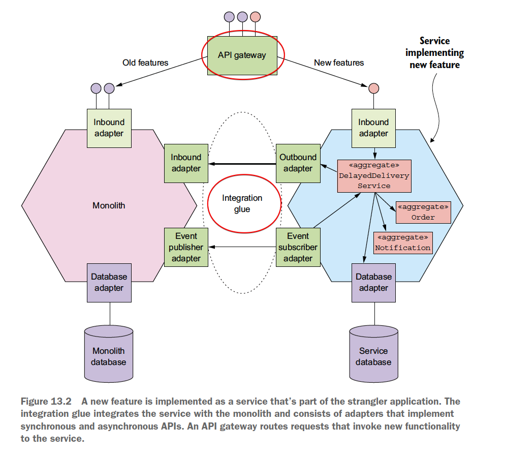
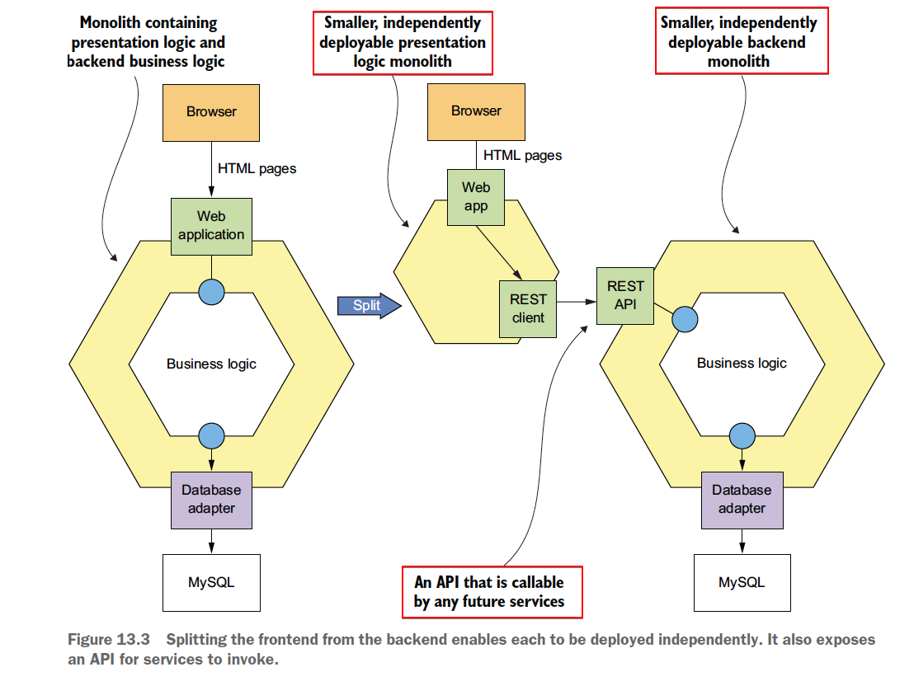
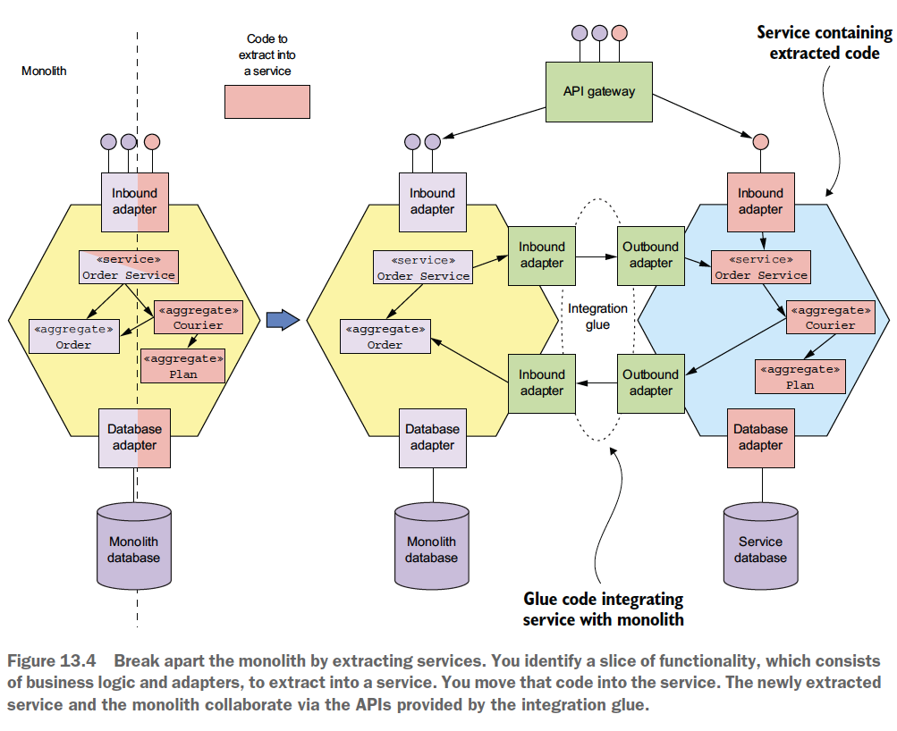
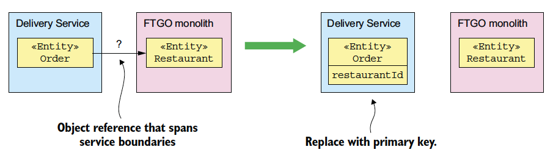
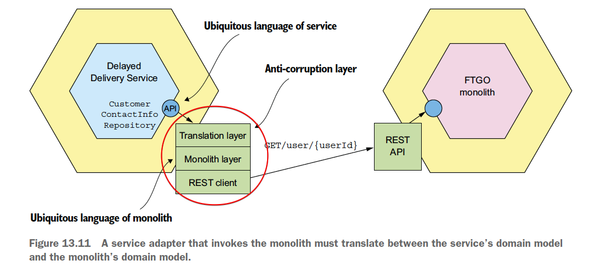
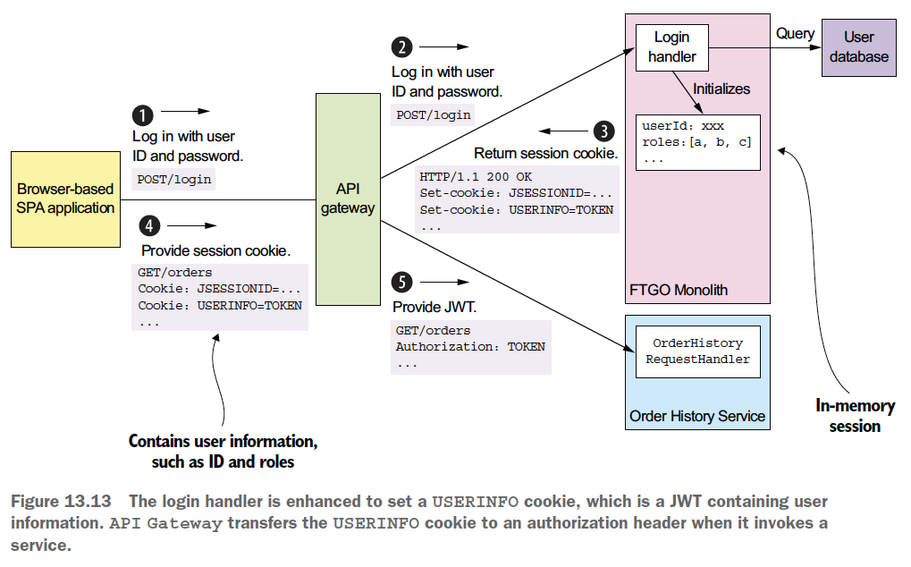

# Chapter 13 "마이크로서비스 리팩토링"

* 스트랭글러 애플리케이션(strangler application)을 개발해서 단계적으로 모놀리식을 마이크로 서비스로 전환하면, 처음부터 뜯어고치지 않고서도 모놀리식 지옥에서 벗어날 수 있다.

## 1. 마이크로서비스 리팩터링 개요

### 1.1. 모놀리스를 왜 리팩터링 하는가?

* 애플리케이션을 이해, 관리, 테스트하기가 어려워서 개발자 생산성이 떨어진다.
* 테스트가 결여되어 소프트웨어 릴리스가 버그 투성이일 때가 많다. (대부분 소프트웨어 개발 프로세스가 낙후되었기 때문에)
* 리소스 요건이 전혀 다른 모듈을 하나의 컴포넌트로 조합해두었기 때문에 확장이 어렵다.

### 1.2. 모놀리스를 단계적으로 리팩터링 하라

* 리스크가 커서 결국 실패하기 쉬우므로, 완전히 뜯어고치기(big bang rewrite)를 삼가하라!
* → 단계적으로 리팩터링 하라!<br>
기존 애플리케이션과 함께 실행되면서 새로운 마이크로서비스 애플리케이션을 조금씩 빌드한 스트랭글러 애플리케이션을 개발하여, 최종적으로 교체되도록 한다.
* 특징 및 주의할 점
    * 가치를 일찍 전달해서 입증하므로 투자에 따른 보상을 즉시 받을 수 있다. 
        * 조금씩 리팩터링하면서 새로운 기술 스택과 최신 데브옵스 스타일을 반영할 수 있다.
    * 모놀리스 변경 범위를 줄이는 전략을 통해, 작업량을 줄인다.
        * 전략 1) 추출된 서비스에 있는 데이터를 모놀리스 DB에 도로 복제한다.
        * 전략 2) 영향도를 줄이기 위해 서비스 추출 순서를 조정한다.
    * 기술 배포 인프라에 집착하여 막대한 선행 투자를 하지 않도록 하며, 이는 경험을 쌓은 후에 해도 늦지 않다.

## 2. 모놀리스 → 마이크로서비스 리팩터링 3대 전략

### 2.1. 새 기능을 서비스로 구현한다.

* 모놀리스의 성장을 중단시키는 전략이다.
* 마이크로 서비스 전환을 간접적으로 계속 지원하면서 그 가치를 신속하게 입증하는 수단이다.

#### 2.1.1. 새 서비스를 모놀리스에 연계



* API 게이트웨이: 새 기능의 요청은 새 서비스로, 기존 요청은 모놀리스로 각각 라우팅한다.
* 통합 글루 코드: 서비스가 모놀리스 데이터에 접근하고 모놀리스에 구현된 기능을 호출할 수 있게 서비스를 모놀리스에 통합한다.

#### 2.1.2. 새 기능을 서비스로 구현하는 시점

* 아래 경우, 일단 모놀리스에 새로운 기능을 구현한다.
    * 기능 자체가 너무 작은 경우
    * 새 기능이 기존 모놀리스 코드에 너무 단단히 매여 있는 경우
    * 데이터 일관성을 유지하는 것이 어려운 경우
* 나중에 다른 관련 기능과 함께 해당 기능을 자체 서비스로 추출한다.

### 2.2. 표현 계층과 백엔드를 분리한다.

* 표현 계층을 비즈니스 로직과 데이터 접근 계층에서 분리하면, 모놀리식 애플리케이션의 덩치를 줄일 수 있다.
* 엔터프라이즈 애플리케이션의 일반적인 3계층
    * 표현 계층: HTTP 요청을 처리해서 웹 UI에 전달할 HTML 페이지를 생성하는 모듈로 구성된다.
    * 비즈니스 로직
        * 비즈니스 로직을 캡슐화한, 하나 이상의 퍼사드로 구성된 대단위 API가 있다.<br>
        이 API가 바로 모놀리스를 더 작은 두 애플리케이션으로 쪼갤 수 있는 틈새에 해당한다.
    * 데이터 접근 로직: DB, 메시지 브로커 등 인프라 서비스에 접근하는 모듈로 구성된다.



* 표현 계층 애플리케이션 A와 비즈니스/데이터 접근 로직이 포함된 애플리케이션 B로 나누어, A가 B를 원격 호출하도록 한다.
* 장점
    * 두 애플리케이션을 서로 독립적으로 개발, 배포, 확장할 수 있다.
    * 나중에 개발할 마이크로서비스가 호출할 수 있는 원격 API가 표출된다.

### 2.3. 기능을 여러 서비스로 추출한다.

* 모놀리스가 가진 비즈니스 능력을 하나씩 서비스로 옮기는 분해 전략을 구사해야 한다.
* 서비스로 추출해야 할 기능 4 가지
    * API endpoint가 구현된 인바운드 어댑터
    * 도메인 로직
    * DB 접근 로직 등이 구현된 아웃바운드 어댑터
    * 모놀리스의 DB 스키마



* 비즈니스 로직과 어댑터로 구성된 기능 덩이를 찾아내 서비스로 추출한다. (즉, 코드를 서비스 내부로 이전한다.)
* 새로 추출된 서비스와 몬놀리스는 통합 글루가 제공한 API를 통해 협동한다.
* 비즈니스에 가장 중요하고 계속 발전하는 서비스를 가장 먼저 추출하는 것이 좋다.

#### 2.3.1. 도메인 모델 분리

* 모놀리스 도메인 모델에서 서비스의 도메인 모델을 추출한다.
* 서비스 인스턴스는 보통 하나의 프로ㅓ세스이기 때문에 서비스 경계를 넘나드는 객체 레퍼런스는 있을 수 없다. 이런 객체 레퍼런스는 솎아 내야 한다.
* DDD 애그리거트 관점으로, 객체 레퍼런스 대신 기본키로 서로를 참조하게 한다.
* 예) Order 클래스의 Restaurant 레퍼런스를 Restaurant의 기본키로 대체한다.



#### 2.3.2. DB 리팩터링

* 도메인 모델의 클래스는 대부분 영속적이라서 필드가 DB 스키마에 매핑되어 있다. 
* 따라서, 모놀리스에서 서비스를 추출한다는 것은 데이터도 함께 이전한다는 것을 의미하며, 모놀리스에 있던 DB 테이블도 서비스 DB로 옮겨야 한다.
* 엔터티를 나눌 경우, 해당 DB 테이블도 분리하여 서비스로 이전해야 한다.

#### 2.3.3. 변경 범위를 줄이기 위해 데이터를 복제

* DB 리팩터링에서 가장 큰 장애물은 전체 DB 클라이언트가 새 스키마를 사용하도록 바꾸는 일이다.
* 전이 기간 동안에는 원본 스키마를 유지하되, 원본 스키마와 신규 스키마를 동기화하는 트리거를 사용하여 클라이언트가 구 스키마에서 신 스키마로 조금씩 옮아 갈 수 있도록 한다. (즉, 데이터를 복제하여 DB 클라이언트가 새 스키마를 사용하도록 단계적으로 업데이트한다.)

#### 2.3.4. 어떤 서비스를 언제 추출하나

* 모놀리스 개발을 사실상 동결하고, 필요한 서비스를 추출해서 고쳐 쓴다.
* 계획적인 접근 방법으로, 서비스 추출 시 기대되는 혜택을 애플리케이션 모듈별로 순위를 매긴다.
    * 개발 분량이 많을 것으로 예상되는 파트는 서비스로 전환하면 개발 속도가 빨라진다.
    * 애플리케이션 성능, 확장성에 문제가 있거나 신뢰성이 낮은 부분이라면 서비스로 전환하여 문제를 해결할 수 있다.
    * 한 서비스를 추출하면 모듈 간 디펜던시 때문에 다른 서비스의 추출이 단순해지는 경우도 있다.

## 3. 서비스와 모놀리스 간 협동 설계

* 서비스와 모놀리스 사이의 데이터 일관성을 유지하는 것이 중요하다.

### 3.1. 통합 글루 설계

* 통합 글루는 특정 IPC를 이용하는 코드를 서비스 및 모놀리스 양쪽에 구성한다.

#### 3.1.1. 통합 글루 API 설계

* 도메인 로직에 어떤 API를 제공할지 결정해야 한다.
* 내부적으로 어떤 IPC를 쓰는지는 비즈니스 로직이 알 필요가 없으므로 인터페이스로 캡슐화하는 것이 좋다.

#### 3.1.2. 상호 작용 스타일과 IPC 선택


* 데이터 컨슈머가 데이터 레플리카(즉, CQRS 뷰)를 유지하는방법
    * 통합 글루는 데이터를 서비스로 복제한다.
    * 모놀리스는 도메인 이벤트를 발행하며, 서비스에 구현된 이벤트 핸들러는 이 이벤트를 ㅂ다아 서비스 DB를 업데이트 한다.

#### 3.1.3. 부패-방지 계층 구현



* 서비스와 모놀리스가 서로 소통하기 위해서, 모놀리스를 호출하는 서비스 어댑터는 서비스 도메인 모델과 모놀리스 도메인 모델 간 변환을 해주어야 한다.
* [패턴] 부패-방지 계층: 상이한 두 도메인 모델이 서로 상대편을 더럽히지 않도록 변환해 주는 소프트웨어 계층

### 3.2. 서비스와 모놀리스에 걸쳐 데이터 일관성 유지

* 모놀리스에서 보상 트랜잭션(UNDO)을 구현하기는 어렵다.
    * 기존 단일 ACID 트랜잭션을 사가로 대체하기 위해, 기존 엔터티에 상태(예: APPROVAL_PENDING)를 추가하면<br>
    이것 때문에 고쳐야 할 모놀리스 코드가 많아 개발 리소스가 낭비되고 테스트가 어려워 위험성이 높다.
* 모놀리스에 보상 트랜잭션을 구현할 필요가 없는 사가를 설계한다.
    * 각 트랜잭션이 피봇/재시도 가능 트랜잭션이라면 보상 트랜잭션이 실행될 일이 없으므로, 모놀리스 변경 작업을 최소화 할 수 있다.
    * 모놀리스 트랜잭션을 가운데 피봇 트랜잭션으로 두고 마지막 트랜잭션을 실패할 일이 없게 만들어, 모놀리스 트랜잭션을 롤백 시킬 필요가 없게 한다.
```
1. 주문 서비스
    - 주문을 APPROVAL_PENDING 상태로 생성한다.
2. 소비자 서비스
    - 주문 가능한 소비자인지 확인한다.
3. 모놀리스
    - 주문 내역을 확인하고 티켓을 생성한다.
    - 소비자 신용카드를 확인한다.
4. 주문 서비스
    - 주문 서비스를 APPROVED로 변경한다.
```
* 위와 같이, 서비스 추출 순서를 조정하면 보상 트랜잭션을 모놀리스에 구현하지 않아도 된다.

### 3.3. 인증/인가 처리



* 모놀리식 보안 메커니즘과 JWT 기반의 보안 메커니즘을 동시 지원하는 일이 관건이다.
* 로그인 핸들러를 수정하여 사용자 정보가 포함된 USERINFO 쿠키(JWT)를 세팅한다.
* API 게이트웨이는 이 쿠키를 서비스 호출 시 인증 헤더에 실어 서비스에 전달한다.
