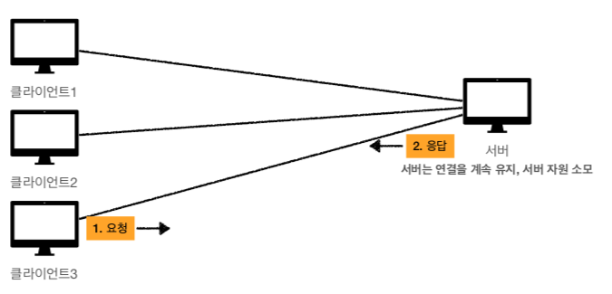
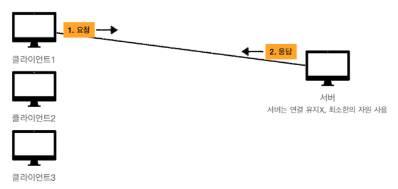
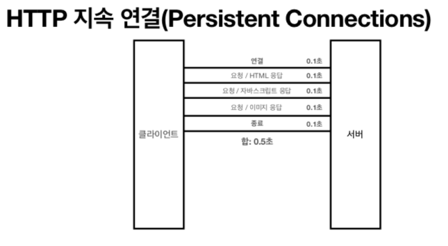
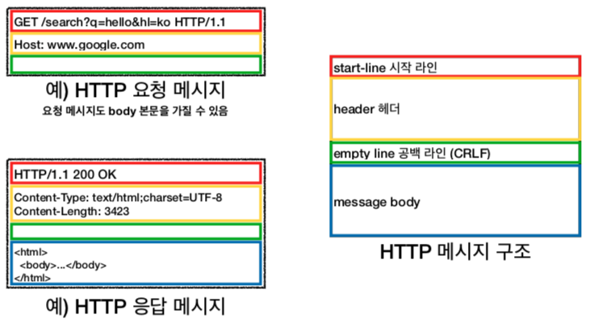

# Chapter 03 "HTTP 기본 동작과 특징"

## 01. 모든 것이 HTTP(HyperText Transfer Protocol) 

### HTTP 메시지에 모든 것을 전송
* HTML, TEXT / IMAGE, 음성, 영상, 파일 / JSON, XML (API)
* 거의 모든 형태의 데이터 전송 가능
* 서버간에 데이터를 주고 받을 때도 대부분 HTTP 사용

### HTTP 역사
* **HTTP/1.1 1997년: 가장 많이 사용, 우리에게 가장 중요한 버전**
    * RFC2068 (1997) -> RFC2616 (1999) -> RFC7230~7235 (2014)
* TTP/2 2015년: 성능 개선
* HTTP/3 진행중: TCP 대신에 UDP 사용, 성능 개선

### 기반 프로토콜
* TCP: HTTP/1.1, HTTP/2 
* UDP: HTTP/3
* 현재 HTTP/1.1 주로 사용
    * HTTP/2, HTTP/3 도 점점 증가

### HTTP 특징
* 클라이언트 서버 구조
* 무상태 프로토콜(Stateless), 비연결성 
* HTTP 메시지를 통하여 통신
* 단순함, 확장 가능

## 02. 클라이언트 서버 구조
 
* Request Response 구조
* 클라이언트는 서버에 요청을 보내고, 응답을 대기 
* 서버가 요청에 대한 결과를 만들어서 응답

> 클라이언트/서버를 개념적으로 분리한다는 것의 의의<br>
> : 비지니스 로직이나 데이터는 서버에서 처리하고, 클라이언트는 사용성과 UI에 집중<br>
> → 클라이언트와 서버가 각각 독립적으로 진화할 수 있음.

## 03. Stateful, Stateless

### 무상태 프로토콜 - 스테이스리스(Stateless)
* 서버가 클라이언트의 상태를 보존X 
* 장점: 서버 확장성 높음(스케일 아웃) 
* 단점: 클라이언트가 추가 데이터 전송

### Stateful, Stateless 차이 - (예시)구매시 고객과 점원의 대화 
* Stateful: 중간에 다른 점원으로 바뀌면 안된다.
 <br>
    * 중간에 다른 점원으로 바뀔 때 상태 정보를 다른 점원에게 미리 알려줘야 한다.
* Stateless: 중간에 다른 점원으로 바뀌어도 된다.
    * 갑자기 고객이 증가해도 점원을 대거 투입할 수 있다.
    * 갑자기 클라이언트 요청이 증가해도 서버를 대거 투입할 수 있다. 
    * **무상태는 응답 서버를 쉽게 바꿀 수 있다. -> 무한한 서버 증설 가능**

### 상태 유지 - Stateful
* 항상 같은 서버가 유지되어야 함.
* 중간에 서버가 장애나면? 다시 요청해야함.

### 무상태 - Stateless
* 클라이언트가 요청시 정보를 담아서 보냄, 서버는 상태를 보관하지 않음.
* 스케일 아웃 - 수평 확장 유리 (예: 이벤트 진행시)
* 실무 한계 - 모든 것을 무상태로 설계 할 수 있는 경우도 있고(예: 로그인이 필요 없는 단순한 서비스 소개 화면) 없는 경우도 있음.
    * 상태 유지 필요한 예 - 로그인한 사용자의 경우 로그인 했다는 상태를 서버에 유지
    * 일반적으로 브라우저 쿠키와 서버 세션등을 사용해서 상태 유지 
    * 상태 유지는 최소한만 사용
* 단점 - 전송하는 데이터 양이 많을수밖에 없음.
> 웹 애플리케이션 설계 할 때에는 최대한 무상태로 설계 한다.<br>
> 어쩔 수 없는 경우에만 상태 유지를 한다.

## 04. 비 연결성(connectionless)

### 모델 비교
* 연결을 유지하는 모델
    * 서버는 연결을 계속 유지, 서버 자원 소모
    
* 연결을 유지하지 않는 모델
    * 서버는 연결 유지 X, 최소한의 자원 유지
    

### 비 연결성 - HTTP는 기본적으로 연결을 유지하지 않는 모델
* 일반적으로 초 단위의 이하의 빠른 속도로 응답
* 1시간 동안 수천명이 서비스를 사용해도 실제 서버에서 동시에 처리하는 요청은 수십개 이하로 매우 작음
    * 예) 웹 브라우저에서 계속 연속해서 검색 버튼을 누르지는 않는다. 
* → 서버 자원을 매우 효율적으로 사용할 수 있음

### 비 연결성 - 한계와 극복
* TCP/IP 연결을 새로 맺어야 함 - 3 way handshake 시간 추가
* 웹 브라우저로 사이트를 요청하면 HTML 뿐만 아니라 자바스크립트, css, 추가 이미지 등의 수많은 자원이 함께 다운로드
* 지금은 HTTP 지속 연결(Persistent Connections)로 문제 해결 
    * HTTP 초기 - 연결/응답/종료의 반복으로 연결, 연결/종료 낭비 발생
    * 
* HTTP/2, HTTP/3에서 더 많은 최적화

### 서버 개발자라면 Stateless 를 기억하자
* 같은 시간에 딱 맞추어 발생하는 대용량 트래픽
* 예) 선착순 이벤트, 명절 KTX 예약, 학과 수업 등록

## 05. HTTP 메시지

### HTTP 메시지 구조

> [공식 스펙](https://datatracker.ietf.org/doc/html/rfc7230#section-3)
```html
3.  Message Format

   All HTTP/1.1 messages consist of a start-line followed by a sequence
   of octets in a format similar to the Internet Message Format
   [RFC5322]: zero or more header fields (collectively referred to as
   the "headers" or the "header section"), an empty line indicating the
   end of the header section, and an optional message body.

     HTTP-message   = start-line
                      *( header-field CRLF )
                      CRLF
                      [ message-body ]
```

### 시작 라인

#### 요청 메시지 - request-line

```html
GET /search?q=hello&hl=ko HTTP/1.1 
```

* start-line = **request-line** / status-line
* **request-line** = method SP(공백) request-target SP HTTP-version CRLF(엔터)

> * HTTP 메서드: 서버가 수행해야 할 동작 지정 (GET: 리소스 조회, POST: 요청 내역 처리...)<br>
> * 요청 대상 (/search?q=hello&hl=ko)<br>
> * HTTP Version(HTTP/1.1)

#### 응답 메시지 - status-line
```html
HTTP/1.1 200 OK
```
* start-line = request-line / **status-line**
* **status-line** = HTTP-version SP status-code SP reason-phrase CRLF

> * HTTP Version
> * HTTP 상태 코드 (200: 성공, 400: 클라이언트 요청 오류, 500: 서버 내부 오류)
> * 이유 문구: 사람이 이해할 수 있는 짧은 상태 코드 설명 글

### HTTP 헤더
```html
# 요청 메시지
Host: www.google.com

# 응답 메시지
Content-Type: text/html;charset=UTF-8
Content-Length: 3423
```
* header-field = field-name ":" OWS field-value OWS (OWS: 띄어쓰기 허용)
* field-name은 대소문자 구분 없음.

> HTTP 헤더: HTTP 전송에 필요한 모든 부가정보를 포함하고 있음.

* 메타정보 예) 메시지 바디의 내용, 메시지 바디의 크기, 압축, 인증, 요청 클라이언트(브라우저) 정보, 서버 애플리케이션 정보, 캐시 관리 정보...
* [표준 헤더가 너무 많음](https://en.wikipedia.org/wiki/List_of_HTTP_header_fields)
* 필요시 임의의 헤더 추가 가능, 예) helloworld: hihi

### HTTP 메시지 바디
```html
<html>
<body>...</body>
</html>
```
* 실제 전송할 데이터
* HTML 문서, 이미지, 영상, JSON 등등 byte로 표현할 수 있는 모든 데이터 전송 가능

### HTTP의 특징 - 단순함 & 확장 가능
* HTTP는 단순하다.
* HTTP 메시지도 매우 단순하다.
* 결국, 크게 성공하는 표준 기술은 단순하지만 확장 가능한 기술이다.

