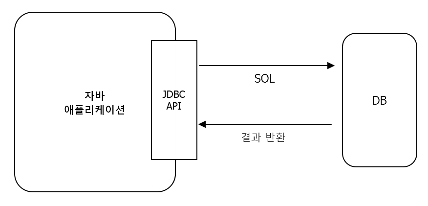

# Chapter 1 "JPA 소개"

## 1. SQL을 직접 다룰 때 발생하는 문제점

* JDBC API 와 SQL의 연관관계<br>

  * 자바로 작성한 애플리케이션은 JDBC API를 이용해서 SQL을 DB에 전달한다.
  * DB는 객체구조와는 다른 데이터 중심의 구조를 가지므로 개발자가 객체 지향 애플리케이션과 DB 중간에서 SQL과 JDBC API를 이용해서 변환 작업을 직접 해줘야 한다.

* 반복, 반복 그리고 반복
  * 객체를 데이터베이스에 CRUD하려면 너무 많은 SQL과 JDBC API 코드로 작성해야 하고, 테이블 마다 이런 비슷한 일을 반복해야 한다.
* SQL에 의존적인 개발
  * JDBC API를 사용할때 조회, 추가, 수정 삭제에 대해서 요구사항이 바뀌면 SQL문과 JDBC API를 수정해줘야하기 때문에 SQL에 의존적인 개발을 할 수 밖에 없다. (ex. 컬럼 하나 추가되면 관련 쿼리 뿐만 아니라 DTO 등 하나하나 찾아서 수정해야 함)

> ### ⇒ 이 두가지 문제를 요약하자면 다음과 같다
> * 진정한 의미의 계층 분할이 어렵다.
> * 엔티티를 신뢰할 수 없다. (dao를 열어서 어떤 SQL이 실행되고, 이 SQL을 일일이 확인해야한다.)
> * SQL에 의존적인 개발을 피하기 어렵다.
>
> ### 그렇다면 어떻게 이러한 문제를 해결할 수 있을까?
> ### ⇒ JPA를 사용하자!
> * JPA를 사용하면 객체를 데이터베이스에 저장하고 관리할 때, 개발자가 직접 SQL을 작성하는 것이 아니라 JPA가 제공하는 API를 사용하면 된다.
> * JPA가 개발자 대신 적절한 SQL을 생성해서 DB에 전달한다.

```java
// 저장기능
// JPA가 객체와 매핑정보를 보고 적절한 INSERT SQL을 생성해서 데이터베이스에 전달한다.
jpa.persist(member);

// 조회기능
// JPA가 객체와 매핑정보를 보고 적절한 SELECT SQL을 생성해서 데이터 베이스에 전달하고 그 결과로 Member 객체를 생성해서 반환한다.
String memberId = "HelloID";
Member member = jpa.find(Member.class, memberId);

// 수정기능
// JPA는 별도의 수정 메소드를 제공하지 않는 대신 객체를 조회해서 값을 변경하면 트랜잭션을 커밋할 때 데이터베이스에 적절한 UPDATE SQL이전달된다.
Member member = jpa.find(Member.class, memberId);
member.setName("이름변경");

// 연관된 객체조회
Member member = jpa.find(Member.class, memberId);
Team team = member.getTeam
```

## 2. 패러다임의 불일치

* 현재 자바에서 추구하는 객체지향 프로그래밍은 추상화/캡슐화/정보은닉/상속/다형성 등 시스템의 복잡성을 제어할 수 있는 다양한 장치들을 제공한다. 그래서 현대의 복잡한 애플리케이션은 대부분 객체지향 언어로 개발 한다.
* 하지만, JPA를 사용하지 않고 관계형 데이터베이스를 사용하면 데이터 중심으로 구조화가 되고, 집합적인 사고를 요구하며, 객체지향에서 이야기하는 추상화/상속/다형성의 개념을 사용하지 않는다.
* 이러한 이유로 개발자가 중간에서 패러다임의 불일치를 해결해줘야 한다.
* → JPA는 패러다임의 불일치 문제를 해결해주고 정교한 객체 모델링을 유지하게 도와준다.

## 1.3 JPA란 무엇인가?


* 자바 진영의 ORM 기술에 대한 API 표준 명세이다. 그림과 같이 애플리케이션과 JDBC 사이에서 동작한다.

  

    - **ORM (Object-Relational Mapping) :** 객체와 관계형 데이터베이스를 매핑
    - 객체와 테이블을 매핑해서 패러다임의 불일치 문제를 개발자 대신 해결한다.
        - 객체를 DB에 저장할 때 개발자는 객체를 자바 컬렉션에 저장하듯이 ORM 프레임워크에 저장한다.
        - 조회할 때에도 JPA를 통해 객체를 직접 조회한다.
        - 개발자는 데이터 중심인 관계형 데이터베이스를 사용해도 객체지향 애플리케이션 개발에 집중할 수 있다.
    - **하이버네이트(Hibernate)** : 자바 진영의 다양한 ORM 프레임워크 중 하나
- JPA는 인터페이스를 모아둔 것이고, JPA를 사용하기 위해 JPA를 구현한 ORM 프레임워크(Hibernate, EclipseLink, DataNucleus 등)를 선택해야 한다.

  

- JPA라는 표준(일반적이고 공통적인 기능의 모음)이 있어서 특정 구현 기술에 대한 의존도를 줄일 수 있고 다른 구현 기술로 손쉽게 이동 가능하다.
- JPA의 강점
    - 생산성 : 지루하고 반복적인 코드와 CRUD용 SQL을 개발자가 직접 작성하지 않아도된다.
    - 유지보수 : 변경이 생기더라도 SQL과 JDBC API 코드를 개발자 대신 처리해준다.
    - 상속, 연관관계, 객체 그래프 탐색, 비교하기와 같은 패러다임의 불일치 문제를 해결한다.
    - 성능
        - 같은 트랜잭션 안에서 조회시 SELECT SQL을 한번만 DB에 전달하고 두 번째는 조회한 객체를 재사용한다.
        ```java
		String memberId = "helloId";
        Member member1 = jpa.find(memberId);
        Member member2 = jpa.find(memberId); // 위에서 조회한 객체 사용
       ```
        - 하이버네이트는 SQL 힌트를 넣을 수 있는 기능도 제공한다.
    - 데이터 접근 추상화와 벤더 독립성
        - 애플리케이션과 데이터베이스 사이에 추상화된 데이터 접근 계층 제공한다.
        - 벤더마다 사용법이 다르더라도 데이터베이스를 변경할 때 JPA에게 다른 데이터베이스를 사용한다고 알려주기만 하면 된다.

    


## 4. Q&A

- 통계 쿼리처럼 매우 복잡한 SQL은 어떻게 하나요?<br>
  ⇒ JPA는 통계 쿼리 같이 복잡한 쿼리보다는 실시간 처리용 쿼리에 더 최적화되어 있다.<br>
    JPA가 제공하는 네이티브 SQL을 사용하거나 SQL 매퍼 형태의 프레임워크 혼용하는 것도 좋은 방법이다.