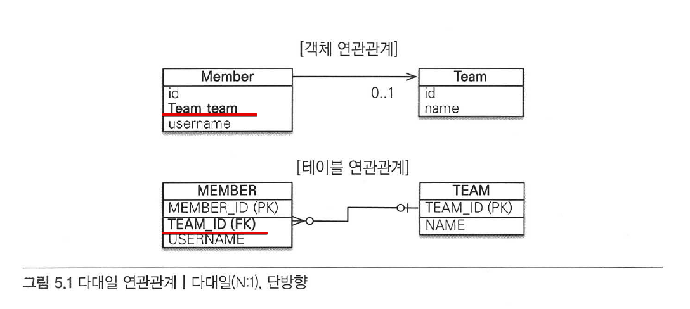
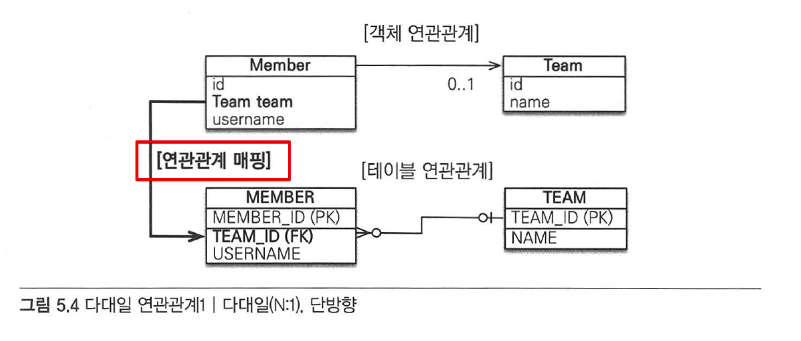
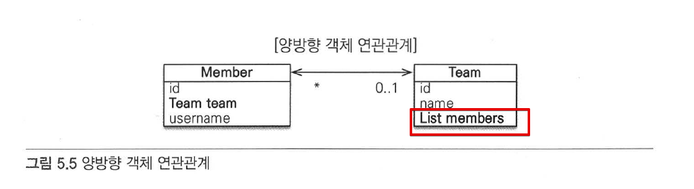
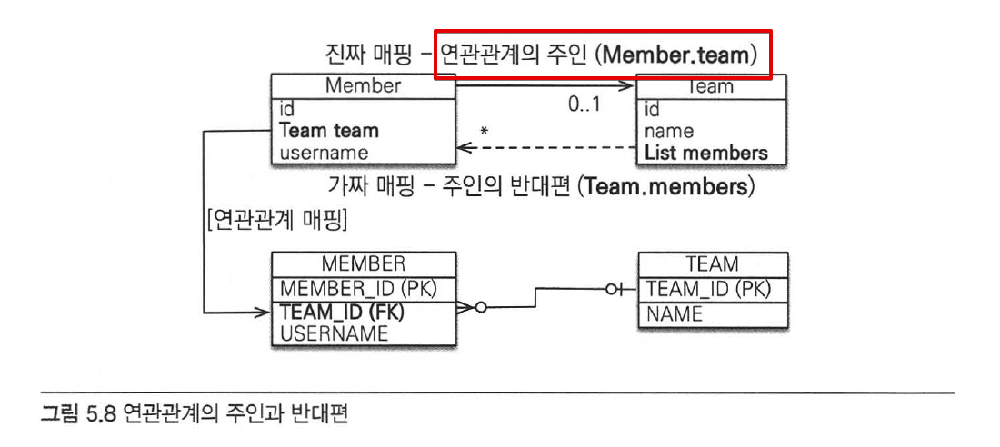
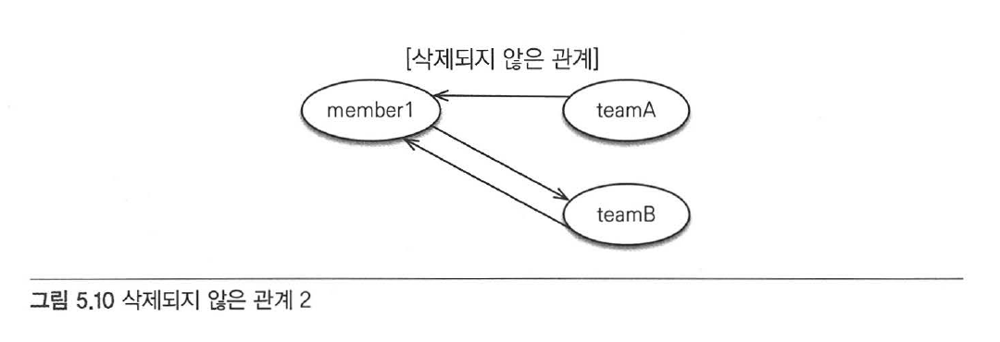

# Chapter 5 "연관관계 매핑 기초"

> * 객체는 참조(주소)를 사용해서 관계를 맺고, 테이블은 외래 키를 사용해서 관계를 맺는다.<br>
→ 객체 연관관계와 테이블 연관관계를 매핑하자! (객체의 참조와 테이블의 외래 키를 매핑하자)<br>
> * 키워드
>   * 방향 - 단방향 / 양방향
>   * 다중성 - N:1 / 1:1 / N:M
>   * 연관 관계의 주인 (객체가 양방향 연관관계일 때)

## 1. N:1 단방향 연관관계

### 1) 단방향 연관관계



* 객체 연관관계
    * Member 객체는 Member.team 필드로 팀 객체와 연관관계를 맺는다.
    * Member과 Team 객체는 단방향 관계이다.
        * member → team 조회는 가능하지만 (member.getTeam()), 반대 방향으로 접근하는 필드는 없다.
* 테이블 연관관계
    * MEMBER 테이블은 TEAM_ID 외래 키로 팀 테이블과 연관관계를 맺는다.
    * MEMBER과 TEAM 테이블은 양방향 관계이다.
        * MEMBER 테이블의 TEAM_ID 외래 키를 통해 MEMBER와 TEAM 테이블 모두 JOIN 할수 있다.
* 객체 연관관계 vs. 테이블 연관관계
    * 객체는 참조(주소)로 연관관계를 맺는다 - 단방향
    * 테이블은 외래 키로 연관관계를 맺는다 - 양방향
    * 객체를 양방향으로 참조하려면, 단방향 연관관계를 2개 만들어야 한다.
        * 참조를 통한 연관관계는 언제나 단방향이다. 객체 간에 연관관계를 양방향으로 만들고 싶으면, 반대쪽에도 필드를 추가해서 참조를 보관해야 한다. → 서로 다른 단방향 관계 2개가 생긴다.

```java
// 양방향 연관관계라는 것은, 단방향 연관관계 2개를 말한다.
class A {   // A -> B
    B b;
}
class B {   // B -> A
    A a;
}
```

### 2) JPA 를 사용한 객체 관계 매핑



* 객체 연관관계: Member 객체의 Member.team 필드 사용
* 테이블 연관관계: MEMBER 테이블의 MEMBER.TEAM_ID 외래 키 컬럼을 사용
> → 연관관계 매핑: Member.team 과 MEMBER.TEAM_ID를 매핑하는 것

```java
@Entity
@Getter
@Setter
public class Member {

    @Id @GeneratedValue
    @Column(name = "MEMBER_ID")
    private String id;

    private String username;

    // 연관관계 매핑
    @ManyToOne  // 다대일(N:1)
    @JoinColumn(name="TEAM_ID")
    private Team team;
}

@Entity
@Getter
@Setter
public class Team {
    @Id
    @Column(name="TEAM_ID")
    private String id;

    private String name;
}
```

* `@ManyToOne` : 다대일(N:1) 관계. 연관관계를 매핑할 때, 다중성을 나타내는 어노테이션은 필수
* `@JoinColumn(name="TEAM_ID")` : 외래 키를 매핑할 때 사용 (생략 가능)

## 2. 연관관계를 사용한 CRUD

* 저장

```java
public static void testSave(EntityManager em) {
    // 팀 정보 저장
    Team team1 = new Team("team1", "팀1");
    em.persist(team1);

    // 회원 정보 저장
    Member member1 = new Member("member1", "회원1", team1);   // 연관관계 설정 member1 -> team1
    em.persist(member1);
    Member member2 = new Member("member2", "회원2", team1);   // 연관관계 설정 member1 -> team1
    em.persist(member2);
}
```

* 조회 1 - 객체를 참조해서 연관관계를 조회한다. (객체 그래프 탐색)

```java
public static void testRead(EntityManager em) {
    Member member = em.find(Member.class, "member1");
    Team team = member.getTeam();
    System.out.println("팀 이름 === " + team.getName());
}
```

* 조회 2 - 객체지향 쿼리인 JPQL 사용
    * SQL과 달리, 객체(엔티티)를 대상으로 한다.

```java
// 객체지향 쿼리 JPQL 사용
public static void queryLogicJoin(EntityManager em) {
    String jpql = "select m from Member m join m.team t where t.name = :teamName";  // 파라미터 바인딩
    List<Member> resultList = em.createQuery(jpql, Member.class)
            .setParameter("teamName", "팀1")
            .getResultList();
    for (Member member : resultList) {
        System.out.println("[query] member.username = " + member.getUsername());
    }
}
```

* 연관관계 수정

```java
public static void updateRelation(EntityManager em) {
    Team team2 = new Team("team2", "팀2");
    em.persist(team2);

    // 새로운 팀 설정
    Member member = em.find(Member.class, "member1");
    member.setTeam(team2);
}
```

* 연관관계 제거

```java
public static void deleteRelation(EntityManager em) {
    Member member = em.find(Member.class, "member1");
    member.setTeam(null);
}
```

## 3. 양방향 연관관계



* 객체에서 여러 건과 연관 관계를 맺을 수 있도록 Team.members를 List 컬렉션으로 추가한다. <br>
(JPA는 List, Collection, Set, Map 등 다양한 컬렉션을 지원한다.)
* DB 테이블은 이미 외래 키 하나로 양방향으로 조인, 조회가 가능하기 때문에 추가해줄 것이 따로 없다.

```java
public class Team {
    @Id
    @Column(name = "TEAM_ID")
    @NonNull
    private String id;

    @NonNull
    private String name;

    // 팀:회원=1:N 관계이므로 팀 엔티티에 컬렉션을 추가했다.
    @OneToMany(mappedBy = "team")
    private List<Member> members = new ArrayList<Member>();
}
```

* `mappedBy` 속성: 양방향 매핑일 때, 반대쪽 매핑의 필드 이름을 값으로 준다.

```java
// 일대다 컬렉션 조회
public static void biDirection(EntityManager em) {
    Team team = em.find(Team.class, "team1");
    List<Member> members = team.getMembers();   // 팀 -> 회원 찾기 (객체 그래프 탐색)

    for (Member member : members) {
        System.out.println("member.username = " + member.getUsername());
    }
}
```

## 4. 연관관계의 주인 

* 엔티티를 양방향 연관관계로 설정하면 객체의 참조는 둘인데 외래 키는 하나여서, 둘 사이에 차이가 발생한다.<br>
→ 두 객체 연관관계 중 하나를 정해서 테이블의 외래키를 관리해야 한다. (연관관계의 주인)
* 연관관계의 주인만이 데이터베이스 연관관계와 매핑되고 외래 키를 관리(등록, 수정, 삭제)할 수 있다.
    * 주인은 mappedBy 속성을 사용하지 않는다.
* 주인이 아닌 쪽은 읽기만 할 수 있고, 외래 키를 변경하지는 못한다.
    * 주인이 아니면 mappedBy 속성을 사용해서, 속성의 값으로 연관관계의 주인을 지정해야 한다.



> 연관관계의 주인은 단순히 외래 키 관리자 정도의 의미만 부여해야 하고, 외래 키의 위치와 관련해서 정해야지 비즈니스 중요도로 접근하면 안된다.

* 연관관계의 주인은 테이블에 외래 키가 있는 곳으로 정해야 한다.<br>(자기 테이블에 있는 외래 키를 관리하면 되므로)
* MEMBER 테이블이 TEAM_ID라는 외래 키를 가지고 있으므로, Member.team이 주인이 된다.
* 다대일, 일대 다 관계에서는 항상 "다" 쪽이 외래 키를 가진다.
* 주인이 아닌 곳에 입력된 값은 외래 키에 영향을 주지 않고, DB 에 저장할 떄 무시된다.

```java
team.getMembers().add(member1); // 연관관계의 주인이 아니므로, TEAM_ID가 null 로 저장된다.
```

## 5. 양방향 연관관계의 주의점

* 객체 관점에서, 주인/주인 아닌 곳 양쪽 방향에 모두 값을 입력해주는 것이 안전하다.
    * JPA를 사용하지 않는 순수한 객체를 구현할 때에, 양쪽 다 관계를 설정해야 양방향 연관관계 의도대로 동작한다. (예: 엔티티에 대한 테스트 코드 작성시)
* 한번에 양방향 관계를 설정하여 사용하는 것이 안전하다. 

```java
// setter Method Refactoring
public class Member {
    private Team team;

    // setTeam() 메소드 하나로 양방향 관계를 모두 설정하도록 변경함.
    public void setTeam(Team team) {
        this.team = team;
        team.getMembers().add(this);
    }
}
```

* 연관관계를 변경할 때는 기존 연관관계를 삭제하는 코드를 추가해야 한다.

```java
member1.setTeam(teamA);
member1.setTeam(teamB);
Member member = teaA.getMember();   // member1이 여전히 조회된다.
```



```java
public void setTeam(Team team) {
    // 기존 팀과 관계를 제거
    if (this.team != null) {
        this.team.getMembers().remove(this);
    }

    this.team = team;
    team.getMembers().add(this);
}
```

