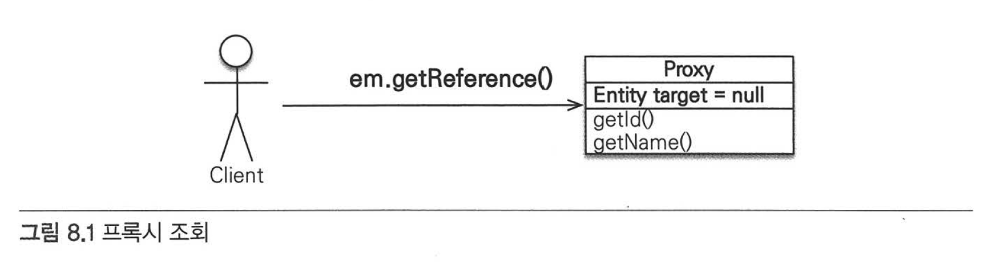
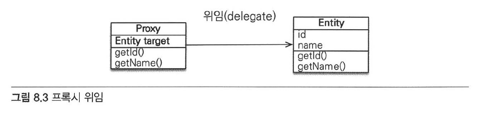
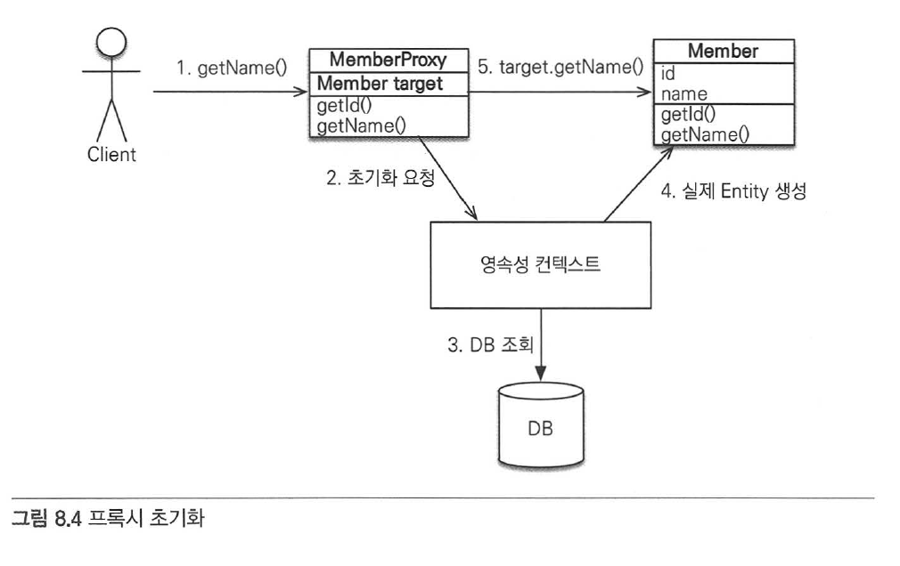
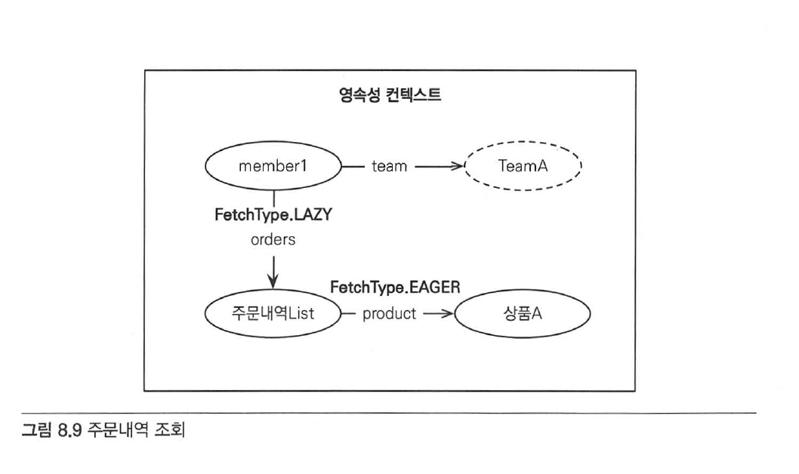
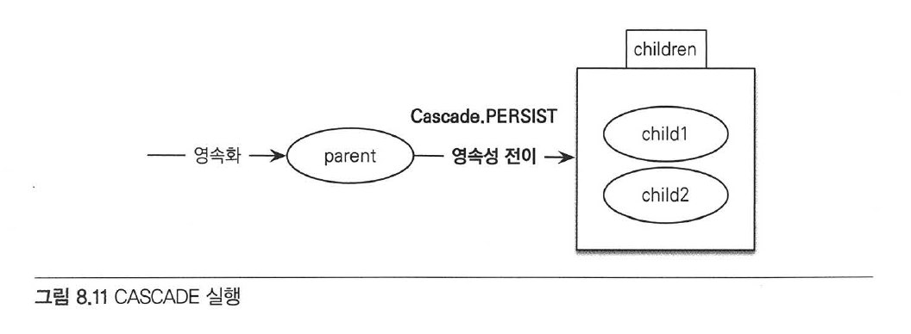

# Chapter 8 "프록시와 연관관계 관리"

## 0. Summary

* 프록시와 즉시 로딩/지연 로딩
    * 객체 그래프로 연관된 객체들을 탐색할 때에, 프록시를 사용하면 연관된 객체를 처음부터 DB에서 조회하는 것이 아니라, 실제 사용하는 시점에 DB에서 조회할 수 있다.
    * 연관된 엔티티의 조회 시점을 선택할 수 있도록 즉시 로딩/지연 로딩의 방법을 제공한다.
* 영속성 전이와 고아 객체
    * JPA는 연관된 객체를 함께 저장하거나 함께 삭제할 수 있는 기능을 제공한다.

## 1. 프록시

```java
public static void testRead(EntityManager em) {
    Member member = em.find(Member.class, "member1");
    // team.getName()이 필요하지 않은데, em.find()로 회원 엔티티를 조회할때
    // 회원과 연관된 팀 엔티티(Member.team)까지 DB에서 조회하는 것은 효율적이지 않다.
    // Team team = member.getTeam();
    System.out.println(System.out.println("member.username = " + member.getUsername()));
}
```

* 위 코드처럼, 비효율성을 해결하기 위해 엔티티가 실제 사용될 때까지 데이터 베이스 조회를 지연한다. (지연 로딩)
* → 지연 로딩 기능을 사용하려면, 실제 엔티티 객체 대신에 DB조회를 지연할 수 있는 가짜 객체가 필요하다. (프로기 객체)

### 1) 프록시 기초

```java
Member member = em.find(Member.class, "member1");
Member member = em.getReference(Member.class, "member1");
```
* `EntityManager.getReference()`
    * 
    * 위 메소드를 사용하여 엔티티를 실제 사용하는 시점까지 DB조회를 미룬다.
    * JPA는 DB를 조회하지 않고 실제 엔티티 객체도 생성하지 않는다. <br>
    대신에 DB 접근을 위임한 프록시 객체를 반환한다.
* 프록시
    * 
    * 프록시 클래스 - 타깃의 기능을 확장하거나 접근을 제어하기 위한 목적으로 사용 (타깃 코드의 수정 없이, 타깃의 기능을 확장하거나 부가 기능을 추가할 수 있음)
    * 실제 클래스를 상속 받아서 만들어지므로 실제 클래스와 겉 모양이 같음.
    * 프록시 객체는 실제 객체에 대한 참조(target)을 보관하고, 프록시 객체의 메소드를 호출하면 프록시 객체는 실제 객체의 메소드를 호출함.
* 프록시 객체의 초기화 - 프록시 객체는 실제 엔티티가 생성되어 있지 않으면, 영속성 컨텍스트에 실제 엔티티 생성을 요청한다.
    * 
    ```java
    // 1. getName()을 호출하여 실제 데이터 조회 요청
    Member member = em.getReference(Member.class, "member1");
    member.getName();
    // 프록시 클래스 동작 예상 로직
    class MemberProxy extends Member {
        Member target = null;   // 실제 엔티티 참조
        public String getName() {
            if (target == null) {
                // 2. 실제 엔티티가 생성되어 있지 않으면, 영속성 컨텍스트에 실제 엔티티 생성을 요청 (프록시 초기화)
                // 3. DB 조회하여 실제 엔티티 객체 생성
                // 4. 실제 엔티티 생성 & 생성된 실제 엔티티의 참조를 Member target 멤버변수에 보관한다.
            }
            // 5. 실제 엔티티 객체의 getName()을 호출하여 결과를 반환
            return target.getName();
        }
    }
    ```
* 프록시의 특징
    * 프록시 객체가 초기화되면 프록시 객체를 통해서 실제 엔티티에 접근할 수 있다.
    * 초기화는 영속성 컨텍스트의 도움을 받아야 가능하다.
        * 예를 들어, em.close(); 로 영속성 컨텍스트를 종료한 후에 member.getName()을 호출하여 준 영속 상태로 프록시 초기화를 시도하면, 예외가 발생한다.

### 2) 프록시와 식별자

* 엔티티를 프록시로 조회할때 식별자(PK) 값을 파라미터로 전달하는데, 프록시 객체는 이 식별자 값을 보관한다.
* → 연관 관계를 설정할때는 식별자 값만 사용하므로, 프록시를 사용하여 DB접근 횟수를 줄일 수 있다.

```java
Member member = em.find(Member.class, "member1");
Tema team = em.getReference(Team.class, "team1");   // SQL을 실행하지 않음.
member.setTeam(team);
```

### 3) 프록시 확인

* 프록시 인스턴스의 초기화 여부를 확인할 수 있다.

```java
// 초기화 여부 확인
boolean isLoad = em.getEntityManagerFactory().getPersistenceUnitUtil().isLoade(entity);

// 조회한 엔티티가 진짜 엔티티인지 프록시로 조회한 것인지 확인
System.out.println("memberProxy === " + member.getClass().getName());
```

## 2. 즉시 로딩과 지연 로딩

* 연관된 엔티티의 조회 시점을 선택할 수 있는데, 상황에 따라 효율적인 방법을 선택하자.

||즉시 로딩|지연 로딩|
|----------------|-------------------------------|-----------------------------|
|조회 시점|* 엔티티를 조회할 때 연관된 엔티티도 함께 조회한다.(조인을 사용해서 한번에 조회)|연관된 엔티티를 실제 사용할때 조회한다.(연관된 엔티티를 프록시로 조회하고, 프록시를 실제 사용할 때 초기화하면서 DB를 조회한다.)|
|예시|em.find(...)를 호출할 때 회원 엔티티와 연관된 팀 엔티티도 함께 조회|member.getTeam().getName()처럼 조회한 팀 엔티티를 실제 사용하는 시점에 JPA가 SQL을 호출해서 팀 엔티티를 조회한다. |
|설정 방법|`@ManyToOne(fetch=FetchType.EAGER)` |`@ManyToOne(fetch=FetchType.LAZY)`|

## 3. 지연 로딩 활용 (예제)

### 1) 프록시와 컬렉션 래퍼



```java
// 주문 내역 조회 (지연 로딩)
Member member = em.find(Member.class, "member1");
List<Order> orders = member.getOrders();
System.out.println("orders === " + orders.getClass().getName());
// 결과: orders === org.hibernate.collection.internal.PersistentBag // 컬랙션 래퍼
```

* 컬렉션 래퍼 - 하이버네이트는 엔티티를 영속 상태로 만들 때, 엔티티에 컬렉션이 있으면<br>
컬렉션을 추적하고 관리할 목적으로, 원본 컬렉션을 하이버네이트가 제공하는 내장 컬렉션으로 변경한다.
* 엔티티를 지연 로딩 - 프로시 객체가 처리<br>
컬렉션을 지연 로딩(예: 주문 내역) - 컬랙션 래퍼가 처리
* 컬렉션은 컬렉션에서 실제 데이터를 조회할 때 DB를 조회하여 초기화한다.
    ```java
    member.getOrders()  // 컬렉션은 초기화되지 않음
    member.getOrders().get(0)   // DB 조회하여 초기화됨
    ```

### 2) JPA 기본 페치 전략

* fetch 속성의 기본 설정값
    * @ManyToOne, @OneToOne: 즉시 로딩(FetchType.EAGER) / 연관된 엔티티가 하나일 때
    * @OneToMany, @ManyToMany: 지연 로딩(FetchType.LAZY) / 컬렉션일 떄 (비용과 성능)
* 모든 연관관계에 지연 로딩을 사용하고, 애플리케이션 개발이 어느 정도 완료단계에 왓을 때 실제 사용하는 상황을 보고 꼭 필요한 곳에만 즉시 로딩을 사용하도록 최적화하자.

### 3) 컬렉션에 FetchType.EAGER 사용 시 주의점

* 컬렉션을 하나 이상 즉시 로딩하는 것은 권장하지 않는다. 성능이 저하될 수 있다.
* 컬렉션 즉시 로딩은 항상 OUTER JOIN 을 사요한다. NULL을 고려하기 위함이다.

## 4. 영속성 전이: CASCADE

* 특정 엔티티를 영속 상태로 만들 때, 연관된 엔티티도 함꼐 영속 상태로 만들수 있다.
* JPA에서 엔티티를 저장할 때 연관된 모든 엔티티는 영속 상태여야 하는데, 부모만 영속 상태로 만들면 연관된 자식까지 한 번에 영속 상태로 만들 수 있다. (부모 엔티티를 저장할 때 자식 엔티티도 함께 저장할 수 있다.)

### 1) 영속성 전이: 저장

```java
// CASCADE 옵션 적용
@Entity
public class Parent {
    @OneToMany(mappedBy = "parent", cascade = CascadeType.PERSIST)
    private List<Child> children = new ArrayList<Child>();
}

// 부모 자식 저장
private static void saveWithCascade(EntityManager em){
    Parent parent = new Parent();
    Child child1 = new Child();
    Child child2 = new Child();

    // em.persist(parent)

    // 연관관계 설정
    child1.setParent(parent);
    parent.getChildren.add(child1);
    // em.persist(child1); 
    child2.setParent(parent);
    parent.getChildren.add(child2);
    // em.persist(child2); 

    // 부모를 저장하면, 연관된 자식들까지 한번에 저장할 수 있다.
    em.persist(parent);
}
```



### 2) 영속성 전이: 삭제

* CascadeType.REMOVE 설정

```java
Parent findParent = em.find(Parent.class, 1L);
em.remove(findParent);
```

* 위 코드 실행시 DELETE SQL문을 3번 실행하여, 부모 + 연관된 자식도 모두 삭제한다. 

### 3) CASCADE 종류

* 다양한 옵션이 있고, 여러 속성을 같이 사용할 수 있다.

```java
public enum CascadeType {
    ALL,
    PERSIST,
    MERGE,
    REMOVE,
    REFRESH,
    DELETE,
    DETACH;
}
```

## 5. 고아 객체

* 고아 객체 제거 - JPA는 부모 엔티티와 연관관계가 끊어진 자식 엔티리를 자동으로 삭제하는 기능을 제공한다.
* 부모 엔티티의 컬렉션에서 자식 엔티티의 참조만 제거하면 자식 엔티티가 자동으로 삭제된다.

```java
@Entity
public class Parent {
    @OneToMany(mappedBy = "parent", orphanRemoval = true)
    private List<Child> children = new ArrayList<Child>();
}

Parent findParent = em.find(Parent.class, 1L);
findParent.getChildren().remove(0); // 자식 엔티티를 컬렉션에서 제거하면 DELETE FROM CHILDE WHERE ID=? 가 수행된다.
```

* 참조가 제거된 엔티티는 다른 곳에서 참조하지 않는 고아 객체로 보고 삭제한다.
* 따라서, 참조하는 곳이 하나일 떄만 사용해야 하므로, @OneToOne/@OneToMany 에서만 사용할 수 있다.
* 부모를 제거하면 자식은 고아가 되므로, 자식도 같이 제거된다. CascadeType.REMOVE 를 설정한 것과 같다.

## 6. 영속성 전이 + 고아 객체, 생명주기

* `CascadeType.ALL` + `orpahnRemoval = true`를 동시에 사용하면, 부모 엔티티를 통해서 자식의 생명 주기를 관리할 수 있다.

```java
// 자식을 저장하려면 부모에 등록만 하면 된다. (CASCADE)
Parent parent = em.find(Parent.class, 1L);
parent.addChild(child1);

// 자식을 삭제하려면 부모에서 제거하면 된다. (orpahnRemoval = true)
Parent parent = em.find(Parent.class, 1L);
parent.getChilderen().remove(removeObject);
```

