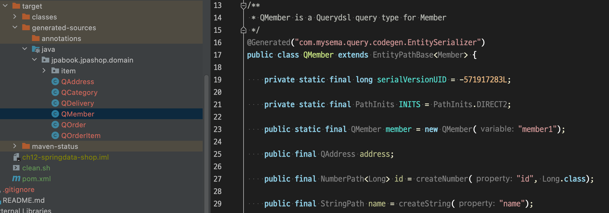
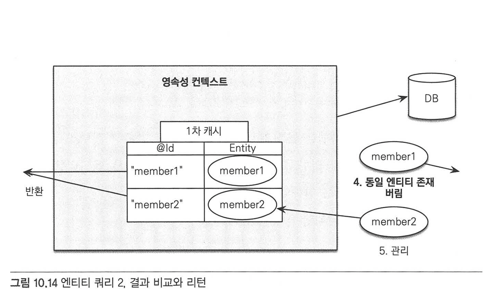

# Chapter 10 "객체지향 쿼리 언어"

* 10장에서 배울 내용
    * 객체지향 쿼리 소개
    * JPQL
    * Criteria
    * ✔️ **QueryDSL**
    * ✔️ **네이티브 SQL** - JPQL을 쓰더라도 특정 벤더에 종속적인 쿼리를     사용해야하는 경우 사용
    * ✔️ **객체지향 쿼리 심화**
* JPA는 다양한 쿼리방법을 지원한다. JPQL로 웬만해선 다 해결되기는 한다.

## 4. QueryDSL

* 문자가 아닌 자바 코드로 JPQL을 작성할 수 있는 JPA Criteria는 너무 복잡하고 어렵다. 
* Criteria 와 비슷한 역할을 하는 `QueryDSL`은 쿼리를 문자가 아닌 코드로 작성해도 쉽고 간결하며, 모양도 쿼리와 비슷하게 개발할수 있다.
* JPQL 빌더 역할
* 오픈 소스 프로젝트 http://querydsl.com/static/querydsl/5.0.0/reference/html_single/
* 쿼리 즉 데이터를 조회하는 데 기능이 특화되어 있다.

### 4.1. Query DSL 설정

#### 1) 라이브러리 추가

```xml
<!-- QueryDSL JPA 라이브러리 -->
<dependency>
	<groupId>com.mysema.querydsl</groupId>
	<artifactId>querydsl-jpa</artifactId>
	<version>3.6.3</version>
</dependency>
<!-- 쿼리 타입(Q)을 생성할 때 필요한 라이브러리 -->
<dependency>
	<groupId>com.mysema.querydsl</groupId>
	<artifactId>querydsl-apt</artifactId>
	<version>3.6.3</version>
    <scope>provided</scope>
</dependency>
```

#### 2) 환경설정

* Criteria의 메타 모델처럼 엔티티를 기반으로 `쿼리타입`이라는 쿼리용 클래스를 생성해야 한다.
    * Criteria 메타 모델 API란? Criteria는 코드 기반이므로 컴파일 시점에 오류를 발견할 수 있지만,<br>
    m.get("age") 대신에 "eage" 처럼 잘못 적어도 문자이기 때문에 컴파일 시점에 에러를 발견하지 못한다.<br>
    → 이런 부분까지 코드로 작성하려면 메타 모델 클래스를 만들어서 문자 기반이 아닌 코드 기반으로 변경하여 사용할 수 있다.
        ```java
        // 메타 모델 API 적용 전
        cq.select(m)
            .where(cb.gt(m.<Integer>get("username"), 20))
            .orderBy(cb.desc(m.get("age")));

        // 메타 모델 API 적용 후
        // Member_클래스가 메타모델 글래스이다.
        cq.select(m)
            .where(cb.gt(m.get(Member_.age), 20))
            .orderBy(cb.desc(m.get(Member.age));
        ```
    * 코드 생성기가 모든 엔티티 클래스를 찾아서 "엔티티명_(언더라인).java" 모양의 메타클래스를 생성해준다.
* 쿼리 타입 생성용 플러그인을 pom.xml 에 추가한다.
* mvn compile을 하면 outputDirectory에 QMember.java 처럼 Q로 시작하는 쿼리 타입들이 생성된다.<br>


### 4.2. Query DSL 시작하기

#### 1) Query DSL 기본 사용

```java
public class queryDSL {
    public static void main(String[] args) {
        EntityManagerFactory emf = Persistence.createEntityManagerFactory("jpabook");
        EntityManager em = emf.createEntityManager();

        JPAQuery query = new JPAQuery(em);  // 엔티티 매니저를 생성자에 넘겨준다.
        QMember qMember = new QMember("m"); // 쿼리 타입(Q) 생성하고 별칭을 준다. (JPQL에서 별칭으로 사용)
        List<Member> members = query.from(qMember)
                .where(qMember.username.eq("회원1"))
                .orderBy(qMember.username.desc())
                .list(qMember);

        for (Member member : members) {
            System.out.println(member.toString());
        }
    }
}
```

```
[main] DEBUG com.mysema.query.jpa.impl.JPAQuery - select m from Member m where m.username = ?1 order by m.username desc
```

#### 2) 기본 Q 생성

* 쿼리 타입(Q)는 사용하기 편하도록 기본 인스턴스를 보관하고 있다.

```java
public class QMember extends EntityPathBase<Member> {
    public static final QMember member = new QMember("member1");
    ...
}
```
* 같은 엔티티를 조인하거나 같은 엔티티를 서브쿼리에 사용하면 같은 별칭이 사용되므로 이 때는 별칭을 직접 지정해야 한다.

```java
// 쿼리 타입 사용
QMember qMember = new QMember("m"); // 별칭 m 지정
QMember qMember = QMember.member;   // 기본 인스턴스 사용
```

### 4.3. 검색 조건 쿼리

```java
QItem item = QItem.item;
List<Item> items = query.from(item)
        .where(item.name.eq("좋은상품").and(item.price.gt(20000)))
        .list(item);    // 조회할 프로젝션 지정
```

```
[main] DEBUG com.mysema.query.jpa.impl.JPAQuery - select item from Item item where item.name = ?1 and item.price > ?2
```

* 쿼리 타입의 필드는 between/contains/startsWith 등 대부분의 메소드를 명시적으로 제공한다. 

### 4.4. 결과 조회 메소드

결과 조회 API 는 com.mysema.query.Projectable 에 정의되어 있다.

* uniqueResult(): 결과 조회가 한 건일때 사용한다. 결과가 없으면 null을 반환하고 결과가 하나 이상이면 com.mysema.query.NonUniqueResultException 예외가 발생한다.
* singleResult(): uniqueResult()와 같음. 결과가 하나 이상이면 처음 데이터만 반환한다.
* list(): 결과가 하나 이상일 때 사용한다.

### 4.5. 페이징과 정렬

```java
// 기본
List<Member> pagedMembers = query.fro(qMember)
        .orderBy(qMember.username.desc())
        .offset(0).limit(20) // 페이징
        .list(qMember);

// QueryModifiers 사용
QueryModifiers queryModifiers = newQueryModifiers(20L, 10L);   // limit,offset
List<Member> members = query.fro(qMember)
        .restrict(queryModifiers)
        .list(qMember);
```

* 실제 페이징 처리를 할 때에는 전체 데이터 수를 알아야 하므로 list() 대신 listResults()를 사용한다.
    * listResults()를 사용하면 전체 데이터 조회를 위한 count 쿼리를 한 번 더 실행하고 SearchResults를 반환한다. 

```java
// listResults() 사용
SearchResults<Member> result = query.from(qMember)
        .listResults(qMember);

System.out.println("검색된 데이터 전체 수:" + result.getTotal());
System.out.println(result.getLimit());
System.out.println(result.getOffset());
// 조회된 데이터
List<Member> members = result.getResult();
```

### 4.6. 그룹

```java
query.from(item)
    .groupBy(item.price)
    .having(item.price.gt(1000))
    .list(item);
```

### 4.7. 조인

* innerJoin/leftJoin/rightJoin/fullJoin/fetch 조인 사용 가능.
* 첫 번째 파라미터에 조인 대상을 지정하고, 두 번째 파라미터에 alias로 사용할 쿼리 타입을 지정한다.

```
join(join 대상, 별칭으로 사용할 쿼리 타입)
```

```java
// 기본 조인
QMember member = QMember.member;
QTeam team = QTeam.team;
List<Member> members = query.from(member)
        .join(member.team, team)
        .where(team.name.eq("팀1"))
        .list(member);
```

```sql
[main] DEBUG org.hibernate.SQL - 
    select
        team0_.TEAM_ID as TEAM_ID1_2_0_,
        team0_.name as name2_2_0_ 
    from
        TEAM team0_ 
    where
        team0_.TEAM_ID=?
Hibernate: 
    select
        team0_.TEAM_ID as TEAM_ID1_2_0_,
        team0_.name as name2_2_0_ 
    from
        TEAM team0_ 
    where
        team0_.TEAM_ID=?
```

### 4.8. 서브 쿼리

* com.mysema.query.jpa.JPASubQuery를 생성하여 사용한다.
* 결과가 하나면 unique(), 여러 건이면 list()를 사용한다.

```java
// 한 건
QMember member = QMember.member;
QMember memberSub = new QMembe("memberSub");

List<Member> members = query.from(member)
        .where(member.id.eq(
                new JPASubQuery().from(memberSub).unique(memberSub.id.max())
        ))
        .list(member);
```

### 4.9. 프로젝션과 결과 반환

* 프로젝션: select 절에 조회 대상을 지정하는 것

#### 1) 프로젝션 대상이 하나인 경우

* 해당 타입으로 반환한다.

```java
QItem item = QItem.item;
List<String> result = query.from(item).list(item.name);
```

#### 2) 여러 컬럼 반환시 튜플 사용

* 프로젝션 대상으로 여러 필드를 선택하면, 기본적으로 com.mysema.query.Tuple 을 사용한다. (Map 과 비슷)
* 조회 결과는 `tuple.get()` 메소드에 조회한 쿼리 타입을 지정한다.

```java
QMember member = QMember.member;
QMember memberSub = new QMembe("memberSub");
List<Tuple> result = query.from(member)
        .where(member.id.eq(
                new JPASubQuery().from(memberSub).unique(memberSub.id.max())
        ))
        .list(member.id, member.username);
for (Tuple tuple : result) {
    System.out.println("id: "+ tuple.get(member.id));
    System.out.println("username: "+ tuple.get(member.username));
}
```

#### 3) 빈 생성 (Bean population)

* 쿼리 결과를 엔티티가 아닌 특정 객체로 받는다.
* com.mysema.query.types.Projections를 사용하여 원하는 방법을 지정한다.

```java
// Item DTO 에 값 채우기
public class ItemDTO {
    private String username;
    private int price;
}

// 방법 1) 프로퍼티 접근
// Projections.bean() 은 수정자(Setter)를 사용하여 값을 채운다.
QItem item = QItem.item;
List<ItemDTO> result = query.from(item).list(
    Projections.bean(itemDTO.class, item.name.as("username"), item.price)   // as 로 별칭 지정
);

// 방법 2) 필드에 직접 접근
// 필드를 private 으로 설정해도 동작한다.
QItem item = QItem.item;
List<ItemDTO> result = query.from(item).list(
    Projections.fields(itemDTO.class, item.name.as("username"), item.price)
);

// 방법 3) 생성자 사용
// 지정한 프로젝션과 파라미터 순서가 같은 생성자가 필요하다.
QItem item = QItem.item;
List<ItemDTO> result = query.from(item).list(
    Projections.constructor(itemDTO.class, item.name, item.price)
);

```

#### 4) DISTINCT

```java
query.distinct().from(item)...
```

### 4.10. 수정, 삭제 배치 쿼리

* JPQL 배치 쿼리와 같이 영속성 컨텍스트를 무시하고 데이터베이스를 직접 쿼리한다. (10.6.1장)

#### 1) 수정 배치 쿼리

* com.mysema.query.jpa.impl.JPAUpdateClause 사용

```java
QItem item = QItem.item;
JPAUpdateClause updateClause = new JPAUpdateClause(em, item);

//상품 가격 100원 증가
long count = updateClause.where(item.name.eq("시골개발자의 JPA 책"))
    .set(item.price, item.price.add(100))
    .execute();
```

#### 2)  삭제 배치 쿼리

* com.mysema.query.jpa.impl.JPADeleteClause 사용

```java
QItem item = QItem.item;
JPADeleteClause deleteClause = new JPADeleteClause(em, item);

//이름이 같은 상품 삭제
long count = deleteClause.where(item.name.eq("시골개발자의 JPA 책"))
    .execute();
```

### 4.11. 동적 쿼리

* com.mysema.query.BooleanBuilder : 특정 조건에 따른 동적 쿼리 생성

```java
// 상품 이름과 가격 유무에 따라 동적으로 쿼리를 생성
SearchParam param = new SearchParam();
param.setName("시골개발자");
param.setPrice(10000);

QItem item = QItem.item;

BooleanBuilder builder = new BooleanBuilder();
if(StringUtils.hasText(param.getName())) {
    builder.and(item.name.contains(param.getName()));
}
if(param.getPrice() != null) {
    builder.and(item.price.gt(param.getPrice()));
}
List<Item> result = query.from(item).where(builder).list(item);
```

### 4.12. 메소드 위임(Delegate methods)

* 쿼리 타입에 검색 조건을 직접 정의할 수 있다.

```java
// 검색 조건 정의
public class ItemExpression {

    // 정적 메소드를 만들어, 이 기능을 적용할 엔티티를 지정한다.
    @QueryDelegate(Item.class)
    // 첫번째 파라미터에 대상 엔티티의 쿼리 타입(Q)을 지정하고, 나머지 필요한 것들을 정의한다.
    public static BooleanExpression isExpensive(QItem item, Integer price) {
        return item.price.gt(price);
    }
}

// 위 메서드를 만들면, 쿼리 타입에 기능이 추가된다.
public class QItem extends EntityPathBase<Item> {
    ...
    public com.mysema.query.types.expr.BooleanExpression isExpensive(Integer price) {
        return ItemExpression.isExpensive(this, price);
    }
}

// 위 기능 사용
List<Item> list = query.from(item).where(item.isExpensive(30000)).list(item);
```

## 5. 네이티브 SQL

* JPQL은 특정 데이터베이스에 종속적인 기능은 지원하지 않는다.
    * 특정 DB에서만 지원하는 함수, 문법, SQL 쿼리 힌트
    * 인라인 뷰(From 절에서 사용하는 서브쿼리), UNION, INTERSECT
    * Stored Procedure
* 때로는 특정 DB에 종속적인 기능이 필요하여, 다양한 방법을 지원한다.
    * 특정 DB에서만 사용하는 함수
        * JPQL에서 SQL 함수 호출 가능, 데이터베이스 방언
    * 특정 DB에서만 지원하는 SQL 쿼리 힌트 
        * 하이버네이트를 포함한 몇몇 JPA 구현체
    * 인라인 뷰, UNION, INTERSECT
        * 하이버네이트를 제외한 일부 JPA 구현체들에서 지원
    * Stored Procedure
        * JPQL 에서 호출 가능
    * 특정 데이터베이스만 지원하는 문법
        * 특정 데이터베이스에 너무 종속적인 SQL 문법은 지원 하지 않고, 네이티브 SQL을 사용해야 한다.(예: 오라클의 CONNECT BY)
* 네이티브 SQL
    * JPQL을 사용할 수 없을 때 JPA가 SQL을 직접 사용할 수 있도록 제공하는 기능. 
    * JPQL은 JPA가 SQL을 생성하지만, 네이티브 SQL은 개발자가 SQL을 직접 정의한다.
    * 네이티브 SQL vs JDBC API 직접 사용
    |네이티브 SQL|JDBC API 직접 사용|
    |--|--|
    |엔티티 조회 가능|단순히 데이터의 나열을 조회할 뿐|
    |JPA가 지원하는 영속성 컨텍스트의 기능을 그대로 사용할 수 있다.||


### 5.1. 네이티브 SQL 사용

* 네이티브 쿼리 API 3가지

```java
//결과 타입 정의(엔티티 조회)
public Query createNativeQuery(String sqlString, Class resultClass);

//결과 타입 정의 불가능 할 때(값 조회)
public Query createNativeQuery(String sqlString);

//결과 매핑 사용
public Query createNativeQuery(String sqlString, String resultSetMapping);
```

#### 1) 엔티티 조회

```java
em.createNativeQuery(네이티브 SQL, 조회할 엔티티 클래스의 타입)
```

```java
// SQL 정의
String sql = "SELECT ID, AGE, NAME, TEAM_ID FROM MEMBER WHERE AGE > ?";
Query nativeQuery = em.createNativeQuery(sql, Member.class)
                      .setParameter(1, 20);                     
List<Member> resultList = netiveQuery.getResultList();
```

* 네이티브 SQL로 SQL만 직접 사용할 뿐, 나머지는 JPQL 사용과 동일하다. 조회한 엔티티도 영속성 컨텍스트에서 관리된다.
* JPA는 네이티브 SQL에서 위치 기반 파라미터만 지원한다.

#### 2) 값 조회

```java
em.createNativeQuery(네이티브 SQL)
```

```java
//SQL 정의
String sql = "SELECT ID, AGE, NAME, TEAM_ID FROM MEMBER WHERE AGE > ?";

Query nativeQuery = em.createNativeQuery(sql)
                      .setParameter(1, 10);

// 값을 Object[]에 반환  
List<Object[]> resultList = netiveQuery.getResultList();
for (Object[] row : resultList) {
    System.out.println("id = " + row[0]);
    System.out.println("age = " + row[1]);
    System.out.println("name = " + row[2]);
    System.out.println("team_id = " + row[3]);
}
```

* 스칼라 값들을 조회했을 뿐이므로, 결과를 영속성 컨텍스트가 관리하지 않는다. (JDC로 데이터를 조회한 것과 비슷)

#### 3) 결과 매핑 사용

* 매핑이 복잡해지면 `@SqlResultMapping`를 정의해서 결과의 매핑을 지정한다.

```java
//  회원 엔티티와 회원이 주문한 상품 수 조회
//SQL 정의
String sql =
    "SELECT M.ID, AGE, NAME, TEAM_ID, I.ORDER_COUNT " +
    "FROM MEMBER M " +
    "LEFT JOIN " +
    "    (SELECT IM.ID, COUNT(*) AS ORDER_COUNT " +
    "    FROM ORDERS O, MEMBER IM " +
    "    WHERE O.MEMBER_ID = IM.ID) I " +
    "ON M.ID = I.ID";

// 결과 매핑을 정의 - 회원 엔티티와 ORDER_COUNT 컬럼 매핑
@Entity
@SqlResultSetMapping(
    name = "memberWithOrderCount",
    entities = {@EntityResult(entityClass = Member.class)},
    columns = {@ColumnResult(name = "ORDER_COUNT")}
)
public class Member {
...
}
   
//두 번째 파라미터에 결과 매핑 정보의 이름 사용
Query nativeQuery = em.createNativeQuery(sql, "memberWithOrderCount");

List<Object[]> resultList = nativeQuery.getResultList();
for(Object[] row : resultList) {
    Member member = (Member) row[0];
    BigInteger orderCount = (BigInteger)row[1];
    
    System.out.println("member = " + member);
    System.out.println("orderCount = " + orderCount);
}
```

### 5.2. Named 네이티브 SQL

* 정적 SQL을 작성할 때 사용한다.

```java
// 엔티티 조회
@Entity
@NamedNativeQuery(  // Named 네이티브 SQL 등록
    name = "Member.memberSQL",
    query = "SELECT ID, AGE, NAME, TEAM_ID FROM MEMBER WHERE AGE > ?",
    resultClass = Member.class
)
public class Member {
...
}

// Named 네이티브 SQL 사용
TypedQuery<Member> nativeQuery =
    em.createNamedQuery("Member.memberSQL", Member.class)
      .setParameter(1, 20);

// 결과 매핑 사용
@Entity
@SqlResultSetMapping(
    name = "memberWithOrderCount"
    entities = {@EntityResult(entityClass = Member.class)},
    columns = {@ColumnResult(name = "ORDER_COUNT")}
)
@NamedNativeQuery(
    name = "Member.memberWithOrderCount",
    query = "SELECT M.ID, AGE, NAME, TEAM_ID, I.ORDER_COUNT" +
            "FROM MEMBER M " +
            "LEFT JOIN" +
            "    (SELECT IM.ID, COUNT(*) AS ORDER_COUNT " +
            "    FROM ORDERS O, MEMBER IM " +
            "ON M.ID = I.ID",
    resultSetMapping = "memberWithOrderCount"  //조회 결과 매핑 대상 지정
)
public class Member {
...
}

// Named 네이티브 쿼리 사용
List<Object[]> resultList =
    em.createNamedQuery("Member.memberWithOrderCount")
      .getResultList();
```

### 5.3. 네이티브 SQL XML에 정의

```xml
<!-- ormMember.xml -->
<entity-mappings ...>

    <named-native-query name="Member.memberWithOrderCountXml"
        result-set-mapping="memberWithOrderCountResultMap">
        <query><CDATA[
            SELECT M.ID, AGE, NAME, TEAM_ID, I.ORDER_COUNT
            FROM MEMBER M
            LEFT JOIN
                (SELECT IM.ID, COUNT(*) AS ORDER_COUNT
                 FROM ORDERS O, MEMBER IM
                 WHERE O.MEMBER_ID = IM.ID) I
            ON M.ID = I.ID
        ]></query>
    </named-native-query>
    
    <sql-result-set-mapping name="memberWithOrderCountResultMap">
        <entity-result entity-class="jpabook.domain.Member" />
        <column-result name="ORDER_COUNT" />
    </sql-result-set-mapping>
    
</entity-mapping>
```
* 반드시 <named-native-query>를 먼저 정의한 후 <sql-result-set-mapping>를 정의해야 한다.

```java
// 사용
List<Object[]> resultList =
    em.createNativeQuery("Member.memberWithOrderCount")
      .getResultList();
```

### 5.4. 네이티브 SQL 정리

#### 1) 사용

* 네이티브 SQL을 사용하는 경우
    * JPQL로 작성하기 어려운 복잡한 SQL 쿼리 작성 시
    * SQL을 최적화하여 데이터베이스 성능을 향상시킬 때
* → 위 경우, 쿼리가 복잡하고 길다.
* → 어노테이션 보다는 XML을 사용하는 것이 여러모로 편리하다. (SQL을 바로 붙여넣을 수 있으므로)

#### 2) 단점

* 자주 사용하면 특정 DB에 종속적인 쿼리가 증가해서 이식성이 떨어진다.
* 될 수 있으면 표준 JPQL을 사용하고, 기능이 부족하면 차선책으로 JPA 구현체가 제공하는 기능 사용하며, 최후의 방법으로 네이티브 SQL 사용하는 것을 권장한다.

### 5.5 스토어드 프로시저

#### 1) 스토어드 프로시저 사용

```java
CREATE PROCEDURE proc-multiply 
(INOUT inParam INT, INOUT outParam INT)
...

/**
 * 순서 기반 파라미터 호출
 */ 
// 사용할 프로시저 이름 입력
StoredProcedureQuery spq =
    em.createStoredProcedureQuery("proc_multiply");  

//프로시저에서 사용할 파라미터를 순서, 타입, 파라미터 모드 순으로 정의
spq.registerStoredProcedureParameter(1, Integer.class, ParameterMode.IN);
spq.registerStoredProcedureParameter(2, Integer.class, ParameterMode.OUT);

spq.setParameter(1, 100);
// spq.setParameter("inParam", 100);    // 이름 가능
spq.execute();

Integer out = (Integer)spq.getOutputParameterValue(2);
System.out.println("out = " + out);  //결과 = 200
```

#### 2) Named 스토어드 프로시저 사용

* Named 스토어드 프로시저: 스토어드 프로시저 쿼리에 이름을 부여해서 사용하는 것
* 어노테이션에도, xml에도 정의할 수 있다.

```java
// 어노테이션에 정의
@NamedStoredProcedureQuery(  //정의
    name = "multiply",  //이름 부여
    procedureName = "proc_multiply",  //실제 호출할 프로시저 이름
    parameters = {
        @StoredProcedureParameter(  //파라미터 정보 정의
            name = "inParam",
            mode = ParameterMode.IN,
            type = Integer.class
        ),
        @StoredProcedureParameter(
            name = "outParam",
            mode = ParameterMode.OUT,
            type = Integer.class
        )
    }
)
@Entity
public class Member {
...
}

// 사용
toredProcedureQuery spq = 
    em.createNamedStoredProcedureQuery("multiply"); // Named 스토어드 프로시저 이름
    
spq.setParameter("inParam", 100);
spq.execute();

Integer out = (Integer) spq.getOutputParamterValue("outParam");
System.out.println("out = " + out);
```

## 6. 객체지향 쿼리 심화

### 6.1. 벌크 연산

* 여러 건을 한 번에 수정하거나 삭제하는 연산
* executeUpdate()

```java
/*재고가 10개 미만인 모든 상품 가격 10% 상승*/
String qlString =
    "update Product p " +
    "set p.price = p.price * 1.1 " +
    "where p.stockAmount < :stockAmount";
    
int resultCount = em.createQuery(qlString)
                    .setParameter("stockAmount", 10)
                    .executeUpdate();
```

* [주의!] 사용 시 영속성 컨텍스트를 통하지 않고/2차 캐시를 무시하고 데이터베이스에 직접 실행한다.<br>
따라서, 영속성 컨텍스트와 DB 간에 차이가 발생할 수 있다.

```java
//상품A 조회(상품A의 가격: 1000원)
//조회된 상품A → 영속성 컨텍스트에서 관리
Product productA =
    em.createQuery("select p from Product p where p.name = :name", Product.class);
      .setParameter("name", "productA")
      .getSingleResult();
      
//출력 결과: 1000
System.out.println("productA 수정 전 = " + productA.getPrice());

//벌크 연산 수행으로 모든 상품 가격 10% 상승
//예상 결과값 : 1100원
em.createQuery("update Product p set p.price = p.price * 1.1")
  .executeQuery();

//출력 결과: 1000
//예상 결과값인 1100원과 다름
System.out.println("productA 수정 후 = " + productA.getPrice());
```

* 위 문제 해결 방법
    * em.refresh() 사용하여 DB에서 상품 A 다시 조회
    * 벌크 연산 먼저 실행 - 가장 실용적. JPA와 JDBC 함께 사용할때에도 유용하다.
    * 벌크 연산 수행 후 영속성 컨텍스트 초기화
* [권장] 가능하면 벌크 연산을 가장 먼저 수행하고, 상황에 따라 영속성 컨텍스트를 초기화하자.

### 6.2. 영속성 컨텍스트와 JPQL

#### 1) 쿼리 후 영속 상태인 것과 아닌 것

* JPQL로 조회한 엔티티만 영속성 컨텍스크가 관리한다. ( 엔티티가 아니면 영속성 컨텍스트에서 관리되지 않는다.)

```java
select m from Member m  // 엔티티 조회(관리O)
select o.address from Order o  // 임베디드 타입 조회(관리 x)
select m.id, m.username from Member m  // 단순 필드 조회(관리 x)
```

* 예: 임베디드 타입은 조회해서 값을 변경해도 영속성 컨텍스트가 관리하지 않으므로, 변경 감지에 의한 수정이 발생하지 않는다.

#### 2) JPQL로 조회한 엔티티와 영속성 컨텍스트

```java
/**
 * 영속성 컨텍스트에 회원 1이 이미 있는데, 
 * JPQL로 회원 1을 다시 조회하면 어떻게 될까?
 */
em.find(Member.class, "member1");  //회원1 조회

//엔티티 쿼리 조회 결과가 회원1, 회원2
List<Member> resultList =
    em.createQuery("select m from Member m", Member.class)
      .getResultList();
```

* JPQL로 데이터베이스에서 조회한 엔티티가 영속성 컨텍스트에 이미 존재하는 경우
    * JPQL로 데이터베이스에서 조회한 결과를 버리고 영속성 컨텍스트에 있던 엔티티를 반환한다.
    * 이때, 식별자 값을 사용하여 비교한다.



* JPQL로 조회한 엔티티는 영속 상태이다.
* 영속성 컨텍스트에 이미 엔티티 존재하면, 기존 엔티티를 반환한다.
* 즉, 영속성 컨텍스트는 영속 상태인 엔티티의 동일성을 보장한다.(em.find()로 조회하든 JPQL을 사용하든, 영속성 컨텍스트가 같으면동일한 엔티티를 반환한다.)

#### 3) find() vs JPQL

* em.find()
    * 엔티티를 영속성 컨텍스트에서 먼저 조회, 없으면 데이터베이스에서 조회한다.
    * 영속성 컨텍스트에 해당 엔티티 존재 시 메모리에서 바로 조회하여 성능상 이점이 있다.(1차 캐시)
    ```java
    //최초 조회, 데이터베이스에서 조회
    Member member1 = em.find(Member.class, 1L);
    //두 번째 조회, 영속성 컨텍스트에 존재하므로    데이터베이스를 조회하지 않음.
    Member member2 = em.find(Member.class, 1L);

    //member1 == member2 → 주소 값이 같은 인스턴스
    ```
* JPQL
    * 항상 데이터베이스에 SQL 실행하여 결과를 조회한다.<br>(같은 쿼리를 두번 호출하면, 두번 모두 DB를 조회한다.)
    * 데이터베이스를 먼저 조회한다.
    ```java
    // 첫 번째 호출: 데이터베이스에서 조회
    // DB에서 회원 엔티티 조회 후 영속성 컨텍스트에    등록
    Member member 1 =
        em.createQuery("...", Member.class)
          .setParameter("id", 1L)
          .getSingleResult();

    // 두 번째 호출: 데이터베이스에서 조회
    // DB에서 같은 회원 엔티티 조회, 이미 조회한   동일한 엔티티 존재
    // → 새로 검색한 엔티티 버리고 영속성 컨텍스트에 존재하는 기존 엔티티 반환
    Member member2 =
        em.createQuery("select m from Member m where    m.id = :id", Member.class)
          .setParameter("id", 1L)
          .getSingleResult();

    //member1 == member2 → 주소 값이 같은 인스턴스
    ```
* JPQL의 특징
    * JPQL은 항상 데이터베이스 조회
    * JPQL로 조회한 엔티티는 영속 상태
    * 영속성 컨텍스트에 엔티티가 이미 존재시 기존 엔티티 반환

#### 3) JPQL과 플러시 모드

* 쿼리와 플러시 모드
    * JPQL은 영속성 컨텍스트에 있는 데이터를 고려하지 않고 DB에서 데이터를 조회한다.
    * 따라서, JPQL을 실행하기 전에 영속성 컨텍스트의 내용을 DB에 반영해야 한다.
    ```java
    // 가격을 1000→2000원으로 변경
    // 데이터베이스에는 1000원인 상태
    product.setPrice(2000);

    // 가격이 2000원인 상품 조회
    // default 플러시 모드가 AUTO → 쿼리 직전에 영속성 컨텍스트가 플러시되어, 위 업데이트한 상품 조회 가능
    Product product2 =
        em.createQuery("select p from Product p     where p.price = 2000")
          .getSingleResult();
    ```
    * 플러시 모드
        * default AUTO - 쿼리 실행 직전에 영속성 컨텍스트가 플러시된다.
        * COMMIT - 직접 em.flush()를 호출하거나 Query 객체에 플러시 모드를 설정해주어야 한다.
* 플러시 모드와 최적화
    ```java
    em.setFlushMode(FlushModeType.COMMIT)
    ```
    * 트랜잭션을 커밋할 때만 플러시하고 쿼리를 실행할 때에는 플러시하지 않는다.
    * 단점 - 영속성 컨텍스트와 DB 데이터 간에 차이가 발생할 수 있다. (데이터 무결성) 
    * 장점 - 플러시가 자주 일어나는 로직에 이 모드를 사용하면 성능을 최적화할 수 있다.

## 7. 마치며...

* 동적 쿼리 작성에 편리고 직관적인 QueryDSL 은 JPQL을 만들어주는 빌더 역할을 할 뿐이므로, 핵심은 JPQL을 잘 알아야 한다.

## Reference

* https://velog.io/@yu-jin-song/JPA-Chapter-10.-객체지향-쿼리-언어-3-네이티브-SQL