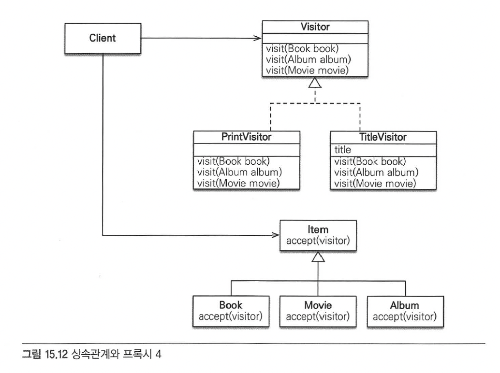
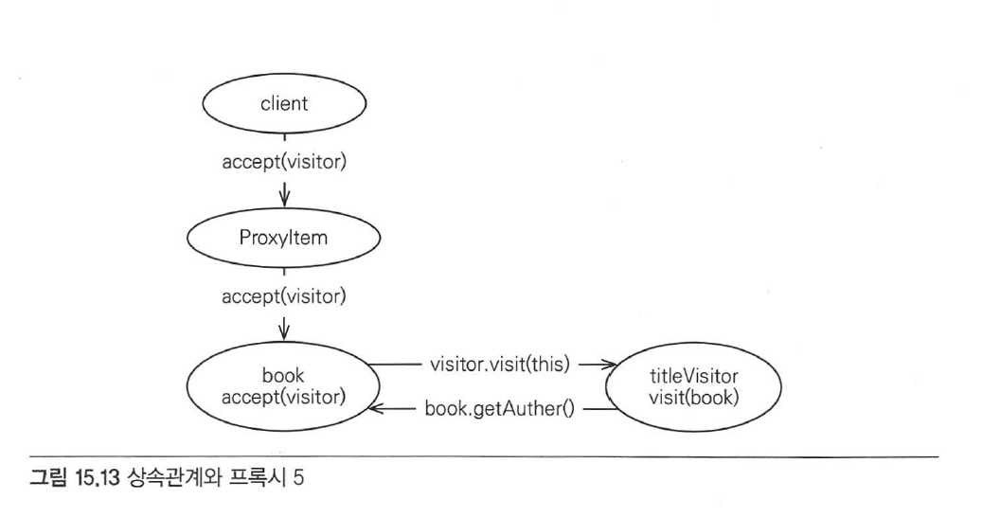

# Chapter 15 "고급 주제와 성능 최적화"

## 3. 프록시 심화 주제

### 3.4. 상속관계와 프록시

> 프록시를 부모 타입으로 조회하면 문제가 발생한다.
> * 해결 1) JPQL로 대상 직접 조회
> * 해결 2) 프록시 벗기기
> * 해결 3) 기능을 위한 별도의 인터페이스 제공
> * 해결 4) 비지터 패턴 사용 

#### # 비지터 패턴 사용

* 비지터 패턴
    * 데이터 처리와 구조를 분리한다.
    * 비지터(방문자. 데이터 구조 안을 돌아다니는 주체) 클래스를 준비해서 처리를 맡긴다.
    * 새로운 처리를 추가하고 싶을 때에는 새로운 비지터를 만들고 데이터 구조는 비지터를 받아들이면 된다.



* 비지터 패턴은 Visitor 와 Visitor를 받아들이는 대상 클래스로 구성된다.
* Item은 `accepct(visotr)`를 사용해 Visitor을 받아들이기만 하고 실제 로직은 Visitor가 처리한다.

#### [Visitor 정의와 구현]

* Visitor 인터페이스
    ```java
    // visit()이라는 메소드를 정의하고 모든 대상 클래스를 받아들이도록 작성한다. 
    public interface Visitor {
		void visit(Book book);
		void visit(Album album);
		void visit(Movie movie);
    }
    ```

* Visitor 구현
    ```java
    // Visitor의 구현 클래스/
    public class PrintVisitor implements Visitor {
		@Override
		public void visit(Book book) {
				//넘어오는 book은 Proxy가 아닌 원본 엔티티
				System.out.println("book.class = " + book.getClass());
				System.out.println("[PrintVisitor] [제목: " + book.getName() + 
						"저자 :" + book.getAutor() + "]");
		}

		@Override
		public void visit(Album album) {...}

		@Override
		public void visit(Movie album) {...}
    }

    public class TitleVisitor implements Visitor {
		private String title;
		
		public String getTitle() {
				return title;
		}

		@Override
		public void visit(Book book) {
				title = "[제목:" + book.getName() + "저자:" + book.getAuthor() + "]";
		}

		@Override
		public void visit(Album album) {...}

		@Override
		public void visit(Movie movie) {...}
    }
    ```

* Visitor 대상 클래스
    ```java
    @Entity
    @Inheritance(strategy = InheritanceType.Single_TABLE)
    @DiscriminatorColumn(name = "DTYPE")
    public abstract class Item {
		@Id @GeneratedValue
		@Column(name = "ITEM_ID")
		private Long id;
        ...
        // Item애 Visitor를 받아들일 수 있도록 accept(visitor) 메소드를 추가.
		public abstract void accept(Visitor visitor);
    }

    @Entity
    @DiscriminatorValue("B")
    public class Book extends Item {
		private String author;
		private String isbn;
        ...
        // 파라미터로 넘어온 Visitor의 visit(this)를 호출해 자신(this)을 파라미터로 넘겨 처리
        // 실제 로직 처리를 visitor에 위임한다.
		@Override
		public void accept(Visitor visitor) {
				visitor.visit(this);
		}
    }

    @Entity
    @DiscriminatorValue("M")
    public class Movie extends Item {
		...

		@Override
		public void accept(Visitor visitor) {
				visitor.visit(this);
		}
    }

    @Entity
    @DiscriminatorValue("A")
    public class Album extends Item {
		...

		@Override
		public void accept(Visitor visitor) {
				visitor.visit(this);
		}
    }
    ```

* 비지터 패턴 실행
    ```java
    @Test
    public void 상속관계와_프록시_VisitorPattern() {
		...
		OrderItem orderItem = em.find(OrderItem.class, orderItemId);
		Item item = orderItem.getItem();

		//PrintVisitor
		item.accept(new PrintVisitor());
    }

    //출력 결과 - 실제 원본 엔티티
    book.class = class jpabook.advanced.item.Book
    [PrintVisitor] [제목:jpabook 저자:kim]
    ```

* 수행 단계 확인<br>

    1. item.accept()를 호출하면서 파라미터 PrintVisitor를 전달한다.
    2. item은 프록시이므로 먼저 프록시가 accept()를 받고, 원본 엔티티의 accept()를 실행한다.
    3. 원본 엔티티는 코드를 실행해 자신(this)을 visitor에 파라미터로 전달
        ```java
        public void accept(Visitor visitor) {
	    	visitor.visit(this); //this는 프록시가 아닌 원본
        }
        ```
    4. visitor가 PrintVisitor타입이므로 PrintVisitor.visit(this)가 실행되는데<br>
    this가 Book 타입이므로 visit(Book book)가 실행된다.

* 비지터 패턴을 사용하면 프록시에 대한 걱정 없이 안전하게 원본 엔티티에 접근 가능하다.
* instanceof나 타입캐스팅 없이 코드를 구현할수 있는 장점이 있다.

#### [비지터 패턴과 확장성]

```java
//TitleVisitor
TitleVisitor titleVisitor = new TitleVisitor();
item.accept(titleVisitor);

String title = titleVisitor.getTitle();
System.out.println("TITLE=" + title);

//출력 결과
book.class = class jpabook.advanced.item.Book
TITLE=[제목:jpabook 저자:kim]
```

* 비지터 패턴은 새로운 기능이 필요할 때 Visitor만 추가하면 된다.
* 기존 코드의 구조를 변경하지 않고 기능을 추가할 수 있는 장점이 있다.

#### [비지터 패턴 정리]

* 장점
    * 프록시에 대한 걱정 없이 안전하게 원본 엔티티에 접근 가능하다.
    * instanceof와 타입캐스팅 없이 코드를 구현할수 있다.
    * 알고리즘과 객체 구조를 분리해서 구조를 수정하지 않고 새로운 동작을 추가할 수 있다.
* 단점
    * 너무 복잡하고 더블 디스패치를 사용하기 떄문에 이해하기 어렵다.
    * 객체 구조가 변경되면 모든 Visitor를 수정해야 한다.

## 4. 성능 최적화 - 성능 문제와 해결 방안

### 4.1. N+1 문제

* JPA로 애플리케이션을 개발할 때 성능상 가장 주의해야할 점은 N+1문제이다.

#### # 즉시 로딩과 N+1

```java
// 예제)
// 회원과 주문은 1:N, N:1 양방향 연관관계이다.
// Members.orders를 즉시 로딩으로 설정
```

* 특정 회원 하나를 em.find()로 조회하면 즉시 로딩으로 설정한 주문정보도 함꼐 조회된다.
    * SQL을 두번 실행하는 것이 아니라, 조인을 사용해서 한 번의 SQL로 회원과 주문정보를 함께 조회한다.

```java
em.find(Member.class, id);

//실행 SQL
SELECT M.*, O.*
FROM 
		MEMBER M
OUTER JOIN ORDERS O ON M.ID = O.MEMBER_ID
```

* 한번에 가져오는 것만 보면 좋아보이지만, JPQL을 사용할 때 문제가 발생한다.
    * 이 때, JPA는 즉시 로딩과 지연로딩에 대해 신경 쓰지 않고 JPQL만 사용해서 SQL을 생성한다.

```java
List<Member> members = 
		em.createQuery("select m from Member m", Member.class)
		.getResultList();

//실행 SQL
SELECT * FROM MEMBER
```

* SQL의 실행 결과로 회원 엔티티를 애플리케이션에 로딩 하고<br>
회원 엔티티와 연관된 주문 컬렉션이 즉시 로딩으로 설정되어 있으므로 JPA는 주문 컬렉션을 즉시 로딩하기 위해 SQL을 추가 실행한다.

```sql
SELECT * FROM MEMBER //1번 실행으로 회원 여러명 조회
SELECT * FROM ORDERS WHERE MEMBER_ID = 1; //회원과 연관된 주문
SELECT * FROM ORDERS WHERE MEMBER_ID = 2; //회원과 연관된 주문
...
```

#### # 지연 로딩과 N+1

* 지연 로딩으로 설정 (예시)
```java
@Entity
public class Member {
	@Id @GeneratedValue
	private Long id;

	@OneToMany(mappedBy = "member", fetch = FetchType.LAZY)
	private List<Order> orders = new ArrayList<Order>();
	...
}
```
* 지연 로딩으로 설정하면 JPQL에서는 N+1 문제가 발생하지 않고,<br>
이후 비즈니스 로직에서 주문 컬렉션을 실제 사용할 때 지연 로딩이 발생한다.
```java
// 1) 지연 로딩이므로 회원만 조회
List<Member> members = 
	em.createQuery("select m from Member m", Member.class)
	.getResultList();
// SELECT * FROM MEMBER

// 2) 비즈니스 로직에서 주문 컬렉션을 실제 사용할 때 지연 로딩 발생
firstMember = members.get(0);
firstMember.getOrders().size(); //지연 로딩 초기화
// SELECT * FROM ORDERS WHERE MEMBER_ID = ?
```

* 문제는, 모든 회원에 대해 연관된 주문 컬렉션을 사용할 때 즉시 로딩(EAGER)과 동일한 현상이 발생한다.

```java
for (Member member : members) {
		//지연 로딩 초기화
		System.out.println("member = ", member.getOrders().size());
}
// 주문 컬렉션을 초기화하는 수만큼 SQL이 실행될 수 있다.
SELECT * FROM ORDERS WHERE MEMBER_ID = 1; //회원과 연관된 주문
SELECT * FROM ORDERS WHERE MEMBER_ID = 2; //회원과 연관된 주문
...
```

* 즉, N+1 문제는 즉시 로딩과 지연 로딩일 때 모두 발생할 수 있다.

#### # N+1 문제를 피할 수 있는 방법

#### [1. 페치 조인 사용]

* N+1 문제를 해결하는 가장 일반적인 방법

```sql
//페치 조인 JPQL
select m from Member m join fetch m.orders

//실행된 SQL
SELECT M.*, O.* FROM MEMBER M
INNER JOIN ORDERS O ON M.ID=O.MEMBER_ID
```

* 일대다 조인을 했으므로 중복 결과가 발생할 수 있어, JPQL DISTINCT를 사용해 중복 제거하는 것이 좋다.

#### [2. 하이버네이트 @BatchSize]

* 하이버네이트가 제공하는 `@BatchSize`을 사용하면 size만큼 SQL의 IN절을 사용해서 조회한다.

```java
@Entity
public class Member {
	...
	@org.hibernate.annotaions.BatchSize(size = 5)
	@OneToMany(mappedBy = "member", fetch = FetchType.EAGER)
	private List<Order> orders = new ArrayList<Order>();
	...
}

// SQL 실행
SELECT * FROM ORDERS
WHERE MEMBER_ID IN (
		?, ?, ?, ?, ?
)
```

* hibernate.default_batch_fetch_size 속성을 사용하면 전체에 기본으로 `@BatchSize` 적용 가능하다.
```xml
<property name="hibernate.default_batch_fetch_size" value="5" />
```

#### [3. 하이버네이트 @Fetch(FetchMode.SUBSELECT)]

* 연관된 데이터를 조회할 때 서브 쿼리를 이용해서 N+1 문제를 해결한다.

```java
@Entity
public class Member {
	...
	@org.hibernate.annotations.Fetch(FetchMode.SUBSELECT)
	@OneToMany(mappedBy = "member", fetch = FetchType.EAGER)
	private List<Order> orders = new ArrayList<Order>();
	...
}
```

```sql
// JPQL로 식별자가 값이 10을 초과하는 회원을 모두 조회
select m from Member m where m.id > 10

// 즉시 로딩으로 설정하면 조회시점에,
// 지연 로딩으로 설정하면 엔티티를 사용하는 시점에 SQL 실행된다.
SELECT O FROM ORDERS O 
	WHERE O.MEMBER_ID IN (
			SELECT 
					M.ID
			FROM
					MEMBER M
			WHERE M.ID > 10
)
```

#### N+1 정리

* 즉시 로딩과 지연로딩 중 추천하는 방법은 `지연 로딩`만 사용하는 것
* 즉시 로딩 전략 문제점
    * N+1 문제
    * 비즈니스 로직에 필요하지 않은 엔티티를 로딩해야 함.
    * 성능 최적화가 어려움
* 따라서, 모두 지연로딩으로 설정하고 성능 최적화가 필요한 곳에는 JPQL 페치 조인을 사용하는 것이 좋다.

### 4.2. 읽기 전용 쿼리의 성능 최적화

* 엔티티가 영속성 컨텍스트에 관리되면
    * 장점) 캐시부터 변경 감지까지 얻을 수 있는 혜택이 많다.
    * 단점) 변경 감지를 위해 스냅샷 인스턴스를 보관하므로 많은 메모리를 사용한다.
* 한번만 읽어서 화면에 출력해야할때 등, 엔티티를 다시 조회할 일이 없을 때에는<br 
읽기 전용으로 조회하여 메모리 사용량을 최적화할 수 있다.

```sql
// 예시
select o from Order o
```

#### # 방법1. 스칼라 타입으로 조회

```sql
select o.id, o.name, o.price from Order p
```

* 가장 확실한 방법은 엔티티가 아닌 스칼라 타입으로 모든 필드를 조회하는 방법이다.
* 스칼라 타입은 영속성 컨텍스트가 관리하지 않는다.

#### # 방법2. 읽기 전용 쿼리 힌트 사용

```java
TypedQuery<Order> query = em.createQuery("select o from Order o", Order.class);
query.setHint("org.hibernate.readOnly", true);
```

* 하이버네이트 전용 힌트인 org.hibernate.readOnly를 사용하여 읽기 전용 모드로 설정한다.
* 읽기 전용이므로 스냅샷 보관을 하지 않고, 메모리 사용량 최적화가 가능하다.
* 단, 스냅샷이 없으므로 엔티티를 수정해도 데이터베이스 반영되지 않는다.

#### # 방법3. 읽기 전용 트랜잭션 사용

* 스프링 프레임워크를 사용하면 트랜잭션 읽기 전용 모드 설정이 가능하다.

```java
@Transactional(readOnly = true)
```

* 스프링 프레임워크가 하이버네이트 세션 플러시 모두를 MANUAL로 설정하여, 강제로 플러시를 호출하지 않는 한 플러시가 발생하지 않는다.
* 트랜잭션을 커밋해도 영속성 컨텍스트는 플러시하지 않으므로, 엔티티의 등록, 수정, 삭제가 동작하지 않는다.
* 플러시할때 일어나는 무거운 로직이 수행되지 않아 성능이 향상된다.
* 영속성 컨텍스트를 플러시 하지 않을 뿐 트랜잭션 시작, 로직 수행, 커밋 과정은 동일하게 진행된다.

#### # 방법4. 트랜잭션 밖에서 읽기

* 트랜잭션 없이 엔티티를 조회한다.
* JPA에선 데이터 변경을 위해 트랜잭션은 필수이므로, 조회가 목적일 때만 사용 가능하다.

```java
// Spring Framework
@Transactional(propagation = Propagation.NOT_SUPROTED)

// J2EE 표준 컨테이너
@TransactionAttribute(TransactionAttributeType.NOT_SUPPORTED)
```

* 트랜잭션을 사용하지 않으면 플러시가 일어나지 않으므로 조회 성능이 향상된다.
	* 트랜잭션 자체가 존재하지 않으므로 트랜잭션을 커밋할 일이 없다.
	* JPQL쿼리도 트랜잭션 없이 실행하면 플러시를 호출하지 않는다.

#### # 정리 - 읽기 전용 데이터를 조회할 때

* 메모리를 최적화 하는 방법
	* 스칼라 타입으로 조회
	* 하이버네이트가 제공하는 읽기 전용 쿼리 힌트 사용
* 플러시 호출을 막아서 속도를 최적화 하는 방법
	* 읽기 전용 트랜잭션 - 스프링 프레임워크를 사용하면, 읽기 전용 트랜잭션을 사용하는 것이 편리하다.
	* 트랜잭션 밖에서 읽기
* "읽기 전용 트랜잭션 OR 트랜잭션 밖에서 읽기"와 "읽기 전용 쿼리 힌트 OR 스칼라 타입으로 조회"를 동시에 사용하는 것이 가장 효과적이다.

```java
 //읽기 전용 트랜잭션 - 플러시를 작동하지 않도록 해서 성능 향상
@Transactional(readOnly = true)
public List<DataEntity> findDatas() {
	return em.createQuery("select d from DataEntity d", DataEntity.class)
			//읽기 전용 쿼리 힌트 - 엔티티를 읽기 전용으로 조회해서 메모리 절약
			.setHint("org.hibernate.readOnly", true) 
			.getResultList();
}
```

### 4.3. 배치 처리

* 수천에서 수만 건 이상의 엔티티를 등록할때는 영속성 컨텍스트에 엔티티가 계속 쌓이면서 메모리 부족 오류가 발생한다. <br>
따라서, 일정 단위마다 영속성 컨텍스트의 엔티티를 DB에 플러시하고 초기화하는 작업이 필요하다.
* 2차 캐시를 사용하고 있다면, 2차 캐시에 엔티티를 보관하지 않도록 주의해야 한다.

#### 1) JPA 등록 배치

```java
EntityManager em = entityManagerFactory.createEntityManager();
EntityTransaction tx = em.getTransaction();
tx.begin();

for(int i = 0; i < 100000; i++) {
	Product product = new Product("item" + i, 10000);
	em.persist(product);

	//100건마다 플러시와 영속성 컨텍스트 초기화
	if (i % 100 == 0) {
		em.flush();
		em.clear();
	}
}

tx.commit();
em.close();
```

#### 2) JPA 수정 배치

* 수많은 데이터를 한번에 메모리에 올려둘 수 없어서 2가지 방법을 주로 사용한다.
	* 페이징 처리: 데이터베이스 페이징 기능을 사용
	* 커서(CURSOR): 데이터베이스가 지원하는 커서 기능을 사용

#### 2-1) JPA 페이징 배치 처리

* 페이지 단위마다 영속성 컨텍스트를 플러시하고 초기화 처리gksek.

```java
int pageSize = 100;
for(int i=0; i<10; i++) {
	List<Product> resultList = em.createQuery("select p from Product p", Product.class)
							.setFirstResult(i * pageSize)
							.setMaxResult(pageSize)
							.getResultList();


	for(Product product : resultList) {
			product.setPrice(product.getPrice() + 100);
	}
		
	em.flush();
	em.clear();
}
```

#### 2-2) 하이버네이트 scroll 사용

* JPA는 JDBC 커서를 지원하지 않는다. 따라서 커서를 사용하려면 하이버네이트 세션을 사용해야 한다.
* 하이버네이트는 scroll 이라는 이름으로 JDBC 커서를 지원한다. (scroll은 하이버네이트 전용 기능이다.)

```java
EntityTransaction tx = em.getTransaction();
// em.unwrap() 메소드를 사용해 하이버네이트 세션을 구한다.
Session session = em.unwrap(Session.class);	

tx.begin();
ScrollableResults scroll = session.createQuery("select p from Product p")
			.setCacheMode(CacheMode.IGNORE) //2차 캐시 기능을 끈다.
			.scroll(ScrollMode.FORWARD_ONLY);

int count = 0;

while(scroll.next()) {
	Product p = (Product) scroll.get(0);
	p.setPrice(p.getPrice() + 100);

	count++;
	if(count % 100 == 0) {
		session.flush(); //플러시
		session.clear(); //영속성 컨텍스트 초기화
	}
}
tx.commit();
session.close();
```

#### 2-3) 하이버네이트 무상태 세션 사용

* 하이버네이트의 무상태 세션 - 영속성 컨텍스트를 만들지 않고 심지어 2차 캐시도 사용하지 않는 상태를 의미한다.
* 무상태 세션에는 영속성 컨텍스트가 없고, 엔티티를 수정하려면 무상태 세션이 제공하는 update() 메소드를 직접 호출해야 한다.

```java
SessionFactory sessionFactory = 
		entityManagerFactory.unwrap(SessionFactory.class);
StatelessSession session = sessionFactory.openStatelessSession();	//무상태 세션
Transaction tx = session.beginTransaction();
ScrollableResults scroll = session.createQuery("select p from Product p").scroll();

while(scroll.next()) {
	Product p = (Product)scroll.get(0);
	p.setPrice(p.getPrice() + 100);
	session.update(p); //직접 update를 호출
}
```

### 4.4. SQL 쿼리 힌트 사용

* JPA는 데이터베이스 SQL 힌트 기능을 제공하지 않는다.
* SQL 힌트는 하이버네이트 쿼리가 제공하는 addQueryHint() 메서드를 사용해야 한다.

```java
Session session = em.unwrap(Session.class); //하이버네이트 직접 사용

List<Member> list = session.createQuery("select m from Member m")
		.addQueryHint("FULL (MEMBER)") //SQL HINT추가
		.list();

//실행된 SQL
select	/*+ FULL (MEMBER) */ 
		m.id, m.name
from	Member m
```

### 4.5. 트랜잭션을 지원하는 쓰기 지연과 성능 최적화

#### # 트랜잭션을 지원하는 쓰기 지연과 JDBC 배치

* 네트워크 호출 한 번은 단순한 메소드를 수만 번 호출하는 것보다 큰 비용이 소모되므로, 여러 개의 INSERT SQL을 모아서 한 번에 데이터베이스로 보내는 것이 필요하다.
* JDBC가 제공하는 SQL 배치 기능을 사용하면 SQL을 모아서 DB에 보내는 것이 가능하다.
	* 그러나, SQL 배치 기능을 사용하려면 코드 많은 부분을 수정해야 한다.
	* 그래서, 보통은 수백 수천 건 이상의 데이터를 변경하는 특수한 상황에 SQL 배치 기능을 사용한다.
* JPA는 플러시 기능이 있으므로 SQL 배치 기능을 효과적으로 사용할 수 있다.
* SQL 배치 최적화 전략은 구현체 마다 다르다.

```xml
<!-- 하이버네이트는 SQL 배치 기능 설정 -->
<!-- 등록, 수정, 삭제할 때 SQL 배치 기능을 사용-->
<property name="hibernate.jdbc.batch_size" value="50"/>
```

* SQL 배치는 같은 SQL 일 떄만 유효하고, 중간에 다른 처리가 들어가면 SQL 배치를 다시 시작한다. 

```java
em.persist(new Member()); //1
em.persist(new Member()); //2
em.persist(new Member()); //3
em.persist(new Member()); //4
em.persist(new Child());  //5, 다른연산
em.persist(new Member()); //6
em.persist(new Member()); //7
```

#### # 트랜잭션을 지원하는 쓰기 지연과 애플리케이션 확장성

* 트랜잭션을 지원하는 쓰기지연과 변경 감지 기능은 개발의 편의성을 제공한다.
* 하지만 진짜 강점은 데이터베이스 테이블 로우에 락이 걸리는 시간을 최소화한다는 점이다.
* 트랜잭션을 커밋해서 영속성 컨텍스트를 플러시하기 전까지는 데이터 베이스에 데이터를 등록, 수정, 삭제하지 않는다.

```java
update(memberA); //UPDATE SQL A
비즈니스로직A(); //UPDATE SQL ...
비즈니스로직B(); //INSERT SQL ...
commit();
```

* 위 예제의 경우, JPA를 사용하지 않고 SQL을 직접 다루면 update에서 DB 테이블 로우에 락을 걸고 commit 할 때까지 유지된다.
* JPA는 커밋을 해야 플러시를 호출하고 DB에 수정 쿼리를 보내므로, 락이 걸리는 시간을 최소화하고 동시에 더 많은 트랜잭션을 처리할 수 있다.

## Reference

* https://milenote.tistory.com/154
* https://milenote.tistory.com/155