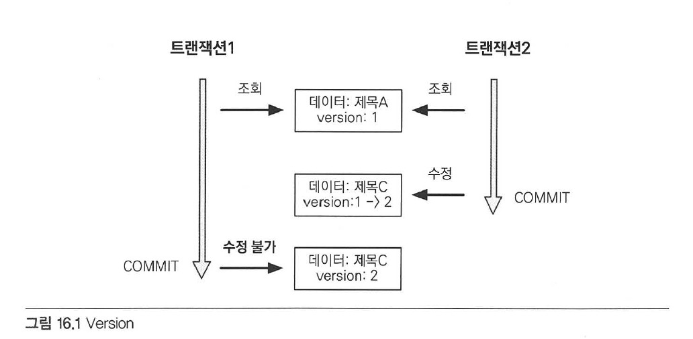
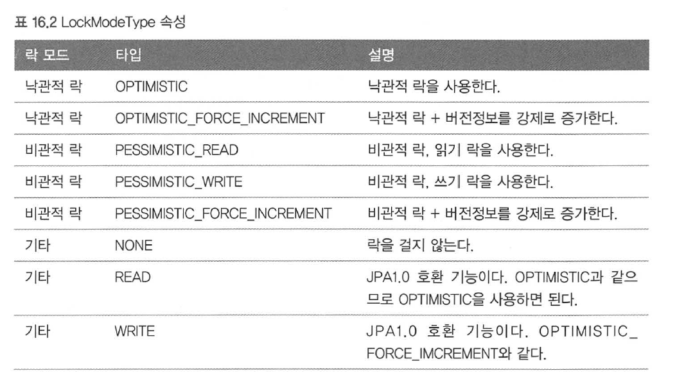
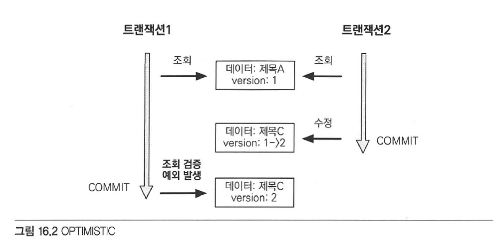
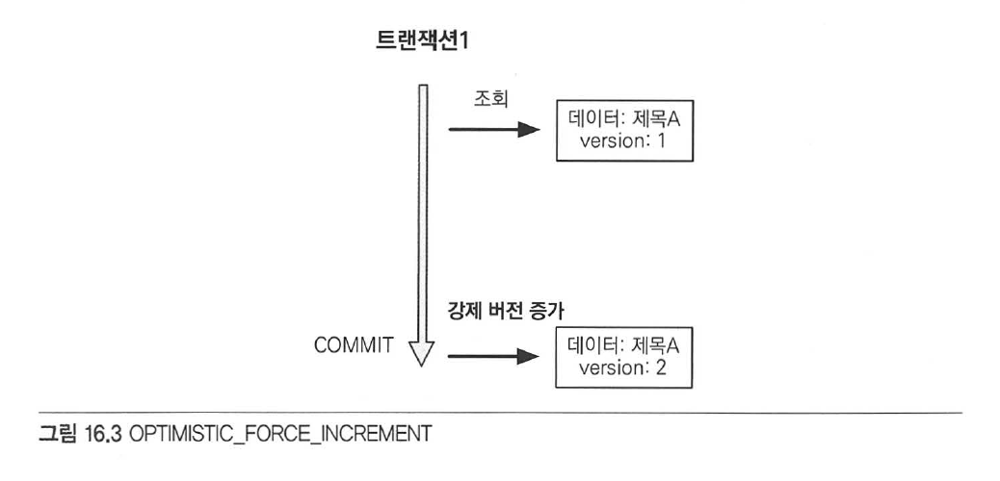

# Chapter 16 "고급 주제와 성능 최적화"

## 1. 트랜잭션과 락

### 1.1 트랜잭션과 격리 수준

* 트랜잭션은 ACID를 보장해야 한다.
    * Atomicity (원자성) - 트랜잭션 내에서 실행한 작업들은 마치 하나의 작업인 것처럼 모두 성공 OR 실패해야 한다.
    * Consistency (일관성) - 모든 트랜잭션은 일관성 있는 DB 상태를 유지해야 한다. 
        * 예) DB에서 정한 무결성 제약 조건을 항상 만족해야 한다.
    * Isolation (격리성) - 동시에 실행되는 트랜잭션들이 서로에게 영향을 미치지 않도록 격리해야 한다.
        * 예) 동시에 같은 데이터를 수정하지 못하도록 해야 한다.
        * 격리성은 동시성과 관련된 성능 이슈로 인해 격리 수준을 선택할 수 있다.
    * Durability (지속성) - 트랜잭션을 성공적으로 끝내면 그 결과가 항상 기록(저장) 되어야 한다.
        * 중간에 시스템 문제가 발생해도 DB 로그 등을 사용해 성공한 트랜잭션 내용 복구가 가능해야 한다.
* `격리성과 동시성 처리 성능은 반대로 작용한다.`
* 트랜잭션 격리 수준과 문제점

|격리 수준|설명|DIRTY DEAD|NON_REPEATABLE READ|PHONTOM READ|
|-|-|-|-|-|
|READ UNCOMMITTED|커밋되지 않은 읽기. 격리수준 낮음. 더 많은 문제 발생 가능.|0|0|0|
|READ COMMITTED|커밋된 읽기.||0|0|
|REPEATABLE READ|반복 가능한 읽기.|||0|
|SERIALIZABLE|직렬화 가능. 격리수준 높음.||||

* 격리 수준에 따른 문제점
    * READ UNCOMMITTED - 커밋하지 않은 데이터를 읽을 수 있다. (DIRT READ)
        * 예) 트랜잭션 1이 데이터를 수정하고 있는데, 트랜잭션 2가 수정 중인 데이터를 조회할 수 있다.
    * READ COMMITTED - 커밋한 데이터만 읽을 수 있다. 
        * NON_REPEATABLE READ - 반복해서 같은 데이터를 읽을 수 없는 상태
        * 예) 트랜잭션 1이 회원 A를 조회중인데 트랜잭션 2가 회원 A를 수정하고 커밋하면, 트랜잭션 1이 다시 회원 A를 조회했을 때 수정된 데이터가 조회된다.
    * REPEATABLE READ - 한 번 조회한 데이터를 반복해서 조회해도 같은 데이터가 조회되니만, PHONTOM READ 가 발생할 수 있다.
        * PHONTOM READ - 다른 트랜잭션에서 수행한 변경 작업에 의해 레코드가 보였다가 안 보였다가 하는 현상. 
        * 예) 트랜잭션 1이 10살 이하의 회원을 조회했는데 트랜잭션 2가 5살 회원을 추가하고 커밋하면, 트랜잭션1이 다시 10살 이하의 회원을 조회했을 때 회원 하나가 추가된 상태로 조회된다.
    * SERIALIZABLE - 가장 엄격한 트랜잭션 격리 수준 / 동시성 처리 성능이 급격히 떨어질 수 있다.
* 애플리케이션은 대부분 동시성 처리가 가장 중요하므로, DB는 보통 READ COMMITTED 격리 수준을 기본으로 사용한다.
* 트랜잭션 격리 수준에 따른 동작 방식은 DB마다 다르게 처리하는데, 최근에는 동시성 처리를 위해 락보다는 MVCC 를 사용한다.<br>
(MVCC - DB 내에 다중 버전의 데이터를 저장)

### 1.2. 낙관적 락과 비관적 락 기초

* JPA 영속성 컨텍스트(1차 캐시)를 적절히 활용하면 READ COMMITTED 격리 수준이어도 애플리케이션 레벨에선 REPETABLE READ가 가능하ㅑ다.
* 엔티티가 아닌 스칼라 값을 직접 조회하면 반복 가능한 읽기 불가능하다. (영속성 컨텍스트 관리 X)

> JPA는 DB 트랜잭션 격리 수준을 READ COMITTED 정도로 가정하고, 일부 로직에 더 높은 격리 수준이 필요하면 낙관적 락과 비관적 락 중 하나를 사용한다.

* 낙관적 락
    * 트랜잭션 대부분은 충돌이 발생하지 않는다고 낙관적으로 가정하는 방법
    * DB가 제공하는 락 기능을 사용하는 것이 아니라 JPA가 제공하는 버전 관리 기능을 사용한다. 즉, 간단히 애플리케이션이 제공하는 락을 사용하는 것.
    * 트랜잭션을 커밋하기 전까지는 트랜잭션의 충돌을 알수 없다.
* 비관적 락
    * 트랜잭션의 충돌이 발생한다고 가정하고 우선 락을 걸고 보는 방법
    * DB가 제공하는 락 기능을 사용
    * 대표적으로 select for update 구문
* DB 트랜잭션 범위를 넘어서는 문제 "두번의 갱신 분실 문제(second lost updates probelem)
    * 예) A와 B가 동시에 같은 게시물을 수정할 때, A가 먼저 수정완료를 누른 후 B가 수정을 한다면 A의 수정사항은 사라지고 B가 수정한 것만 남는 현상
    * 트랜잭션 범위를 넘어선 것이므로, 트랜잭션만으로는 문제를 해결할 수 없다.
    * 해결 방법 3가지
        * 마지막 커밋만 인정 : A의 내용은 무시하고 마지막 B의 내용만 인정
        * 최초 커밋만 인정 : A가 이미 수정을 완료했으므로 B가 수정완료 할땐 오류 발생
        * 충돌하는 갱신 내용 병합 : 사용자 A와 사용자B의 수정사항을 병합
    * 기본은 마지막 커밋만 인정하기가 사용되지만, 상황에 따라 최초 커밋이 합리적일 수 있다.

### 1.3. @Version

* JPA가 제공하는 낙관적 락을 사용하려면 `@Version`을 사용해서 버전관리 기능을 추가해야 한다.

```java
@Entity
public class Board {
	@Id
	private String id;
	private String title;

    // 엔티티에 버전 관리용 필드를 추가하고, @Version 을 붙인다.
	@Version
	private Integer version;
}
```

* 엔티티를 수정할 때 마다 버전이 하나씩 자동으로 증가한다.
* 엔티티를 수정할 때 조회 시점의 버전과 수정 시점의 버전이 다르면 예외가 발생한다.



* 버전 정보를 사용하면 최초 커밋만 인정하기가 적용된다.
* 버전 정보 비교 방법
    * 엔티티를 수정하고 트랜잭션을 커밋하면 영속성 컨텍스트를 플러시하면서 UPDATE 쿼리를 실행한다.
        ```sql
        UPDATE BOARD
        SET
	    	TITLE=?
            -- DB버전과 엔티티 버전이 같으면 데이터를 수정하면서 동시에 버전도 하나 증가시킨다.
	    	VERSION=? (버전 + 1 증가)
        WHERE
	    	ID=?
            -- 버전을 사용하는 엔티티면 검색 조건에 엔티티의 버전 정보를 추가한다.
	    	AND VERSION=? (버전비교)
        ```
    * 버전은 엔티티의 값을 변경하면 증가한다.
        * 연관관계 필드는 외래 키를 관리하는 연관관계의 주인 필드를 수정할 때 버전이 증가한다.
* `@Version`으로 추가한 버전 관리 필드는 JPA가 관리하므로 임의 수정로 수정하면 안된다. (벌크 연산 제외)
* 벌크 연산은 버전을 무시한다. 벌크 연산에서 버전을 증가시키려면 버전 필드를 강제로 증가시켜야 한다.
```sql
update Member m set m.name = '변경' m.version = m.version + 1
```

### 1.4. JPA 락 사용

* JPA를 사용할 때 추천하는 전략은 `추천하는 전략은 READ COMMITTED + 낙관적 버전관리 (두 번의 갱신내역 분실 문제 예방)`
* 락을 적용할 수 있는 위치
    * EntityManager.lock(), EntityManger.find(), EntityManger.refresh()
    * Query.setLockMode() (TypeQuery 포함)
    * @NamedQuery
    ```java
    // 조회하면서 즉시 락 걸기
    Board board = em.find(Board.class, id, LockModeType.OPTIMSTIC);

    // 필요할 때 락 걸기
    Board board = em.find(Board.class, id);
    ...
    em.lock(board, LockModeType.OPTIMISTIC);
    ```
* JPA가 제공하는 락 옵션은 javax.persistence.LockModeType에 정의되어 있다.<br>


### 1.5. JPA 낙관적 락

* JPA가 제공하는 낙관적 락은 버전(@Version)을 사용한다.
* 트랜잭션을 커밋하는 시점에 충돌을 알 수 있는 특징이 있다.
* 낙관적 락에서 발생하는 예외
    * javax.persistence.OptimisticLockException (JPA 예외)
    * org.hibernate.StaleObjectStateException (하이버네이트 예외)
    * org.springframework.orm.ObjectOptimisticLockingFailureException (스프링 예외 추상화)
* 일부 JPA 구현체는 @Version 컬럼 없이 낙관적 락을 허용하지만 추천하지 않는다.
* 락 옵션으로 더 세밀하게 적용할수 있다. 락 옵션 없이 @Version만 있어도 낙관적 락이 적용되긴 한다.
    * NONE
        * 용도: 조회한 엔티티를 수정할 때 다른 트랜잭션에 의해 변경되지 않아야 한다. 조회 시점부터 수정 시점까지를 보장한다.
        * 동작: 엔티티를 수정할 때 버전을 체크하면서 버전을 증가한다. (UPDATE 쿼리 사용) 이때 DB의 버전 값이 현재 버전이 아니면 예외가 발생한다.
        * 이점: 두 번의 갱신 분실 문제를 예방한다.
    * OPTIMISTIC 
        * @Version만 적용하면 엔티티 수정 시 버전을 체크하지만 이 옵션을 추가하면 조회만 해도 버전을 체크한다.
        * 용도: 한 번 조회한 엔티티는 트랜잭션을 종료할 때까지 다른 트랜잭션에서 변경하지 않음을 보장한다.
        * 동작: 트랜잭션을 커밋할 때 버전 정보를 조회해서(SELECT 쿼리 사용) 현재 엔티티의 버전과 같은지 검증하고 같지 않으면 예외가 발생한다.
        * 이점: DIRTY READ와 NON-REPEATABLE READ를 방지한다.
        * 
        * 락 옵션이 NONE 이면 엔티티를 수정해야 버전 정보를 확인하지만, OPTIMISTIC 옵션을 사용하면 엔티티를 수정하지 않고 단순히 조회만 해도 버전을 확인한다.
    * OPTIMISTIC_FORCE_INCREMENT
        * 낙관적 락을 사용하면서 버전 정보를 강제로 증가한다.
        * 용도: 논리적인 단위의 엔티티 묶음을 관리할 수 있다.
            * 예) 게시물과 첨부파일이 일대다, 다대일의 양방향 연관관계일때, 단순 첨부파일만 추가하면 게시물 버전은 증가하지 않는다.<br>
            게시물은 물리적으로는 변경되지 않았지만 논리적으론 변경된 것이르모, 이때 게시물의 버전도 강제로 증가하려면 OPTIMISTIC_FORCE_INCREMENT를 사용
        * 동작: 엔티티를 수정하지 않아도 트랜잭션을 커밋할 때 UPDATE쿼리를 사용해 강제로 버전 정보를 증가시킨다.<br>
        이때 DB의 버전이 엔티티의 버전과 다르면 예외가 발생한다.<br>
        추가로 엔티티를 수정하면 수정시 UPDATE가 발생하여 총 2번의 버전 증가가 나타날 수 있다.
        * 이점: 강제로 버전을 증가해서 논리적인 단위의 엔티티 묶음을 버전 관리할 수 있다.
        * 

### 1.6. JPA 비관적 락

* 비관적 락은 DB 트랜잭션 락 메커니즘에 의존하는 방법이다.
* 주로 SQL 쿼리에 select for update 구문을 사용하면서 시작하고, 버전 정보는 사용하지 않는다.
* 비관적 락은 주로 PESSIMISTIC_WRITE 모드를 사용한다.
* 특징
    * 엔티티가 아닌 스칼라 타입을 조회할 때도 사용 가능하다.
    * 데이터를 수정하는 즉시 트랜잭션 충돌을 감지할 수 있다.
* 비관적 락에서 발생하는 예외
    * javax.persistence.PessimisticLockException(JPA 예외)
    * org.springframework.dao.PessimisticLockingFailureException(스프링 예외 추상화)
* 비관적 락의 옵션들
    * PESSIMISTIC_WRITE 
        * DB에 쓰기 락을 걸 때 사용한다. (대부분의 DB는 방언에 의해 이 옵션으로 동작함)
        * 용도: 데이터베이스에 쓰기 락을 설정
        * 동작: 데이터베이스 select for update를 사용해서 락을 설정
        * 이점: NON-REPEATABLE READ를 방지, 락이 걸린 로우는 다른 트랜잭션이 수정 못함
    * PESSIMISTIC_READ
        * 데이터를 반복 읽기만 하고 수정하지 않는 용도로 락을 걸 떄 사용 (일반적으로 잘 사용하지 않음)
        * 적용
            * MySQL: lock in share mode
            * PostgreSQL: for share
    * PESSIMISTIC_FORCE_INCREMENT
        * 비관적 락 중 유일하게 버전 정보를 사용하고, 버전 정보를 강제로 증가시킨다.
        * 적용
            * 오라클: for update nowait
            * PostgreSQL: for update nowait
            * nowiat를 지원하지 않으면 for update를 사용

### 1.7. 비관적 락과 타임아웃

* 비관적 락을 사용하면 락을 획득할 때까지 트랜잭션이 대기한다.

```java
Map<String, Object> properties = new HashMap<String, Object>();

//타임아웃 10초까지 대기 설정
properties.put("javax.persistence.lock.timeout", 10000);

// 10초간 대기해서 응답이 없으면 LockTimeoutException 예외 발생
Board board = em.find(Board.class, "boardId",
		LockModeTpye.PESSMISTIC_WRITE, properties);
```

* 타임아웃은 DB 특성에 따라 동작 하지 않을 수 있다.


## Reference

* https://milenote.tistory.com/156
* https://nesoy.github.io/articles/2019-05/Database-Transaction-isolation