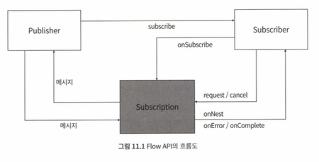

# Week09 "유용한 새 기능들"

## 1. Intro
* 예외 처리(Java 7)

## 2. 예외 처리의 발전

### 2.1. 예외 처리의 기본 개념
* 오류 발생 가능성에 대비 - 문제 발생 시 원인을 잘 인지하여 사용자에게 신뢰 제공
* 예외 처리를 위한 중복 코드 발생 (파일, 인터페이스) → try catch 문 개선
```java
// finally절에서 해당 객체를 종료시키기 위해, 자원의 생성을 try catch 밖에서 선언 → 객체의 생명 관리 측면에서 좋지 않음
BufferedReader br = null;
try {
    // Reader를 생성한다.
    br = new BufferedReader(new FileReader(FILENAME));

    String sCurrentLine;

    // 라인별로 읽어들이고 출력한다.
    while ((sCurrentLine = br.readLine()) != null) {
        System.out.println(sCurrentLine);
    }
} 
catch (IOException e) {
    e.printStackTrace();
} 
finally {
    // finally 실수로 누락하면, 메모리 누수 문제가 있지만 
    // 컴파일도 정상적으로 되고 한두 번의 테스트에서도 정상적으로 실행되기 때문에 놓치기 쉬움
    if (br != null) try { br.close(); } catch(IOException e) {}
}
```

### 2.2. try 문의 개선 "try with resource"
* I/O와 관련된 클래스에서 유용 - 사용한 후에 꼭 닫아주어 resources 반환
* 별도의 finally 문장에 자원을 종료하고 회수하는 코드를 작성하지 않아도 됨
* 따로 close()를 호출하지 않아도, try블럭을 벗어나는 순간 자동적으로 close()가 호출됨, 그 다음에 catch, finally 블럭 수행 
```java
/**
 * try 뒤에 소괄호를 열고, 그 내부에 자원 생성 코드 기술
 */
try (BufferedReader br = new BufferedReader(new FileReader(FILENAME))) {
...
} 
/**
 * 생성해야 하는 입출력 객체가 여러 개일 때 → ;로 구분, 순서대로 객체 생성
 */
try (
    // public interface Connection  extends Wrapper, AutoCloseable { ...
    Connection con = getConnection();
    PreparedStatement pstmt = con.prepareStatement("SELECT EMP_NO, EMP_NAME FROM EMP");
    ResultSet result = pstmt.executeQuery();) {
 ...
}
```
* **클래스가 AutoClosable 인터페이스를 구현한 것이어야지만, 자동 종료 대상(java 7에서 추가, java.lang 패키지)**
    * 오직 close 메서드 하나만 제공
    * try 문장의 종료 시점에 AutoCloseable 인터페이스의 close 메서드 호출됨
```java
public interface AutoCloseable {
    void close() throws Exception;
}
```

* try with resource 구문의 중괄호 안에 객체 생성시 제약 조건
    * AutoCloseable 인터페이스를 구현한 클래스
    * 자원은 final 및 final과 유사한 조건에 맞는 객체여야 함. 즉, 한 번 생성한 다음에는 수정할 수 없음
    * 사용할 자원은 반드시 중괄호 안에서 변수를 선언하고 객체화해야 함 (java 9에서 폐지)
        * 많은 자원을 관리, 선언하기 위해서는 중괄호 안에 모든 것을 코딩하기 어려움
        * 중괄호 안에는 반드시 AutoCloseable 클래스만 올 수 있는데, 다른 클래스나 인터페이스를 사용할 필요가 생김

```java
/**
 * 객체를 사전에 생성하고 try ()에는 관리할 자원의 변수명만 기술해도 자동으로 객체 종료 
 * 다만, 변수는 외부에서 선언하고 객체는 중괄호 안에서 생성하면 컴파일 에러 발생
 */ 

// 외부에서 사전에 객체 생성
BufferedReader br = new BufferedReader(new FileReader(FILENAME));

// resource 구문 안에 변수 지정
try (br) {
    String sCurrentLine;

    while ((sCurrentLine = br.readLine()) != null) {
        System.out.println(sCurrentLine);
    }
} 
catch (IOException e) {
    e.printStackTrace();
} 
```

### 2.3. AutoCloseable 인터페이스는 어떻게 동작하는가?
* 기존 '자원 종료 방법=  close 메서드 호출', java 7에서 AutoCloseable 추가 → 자동 종료처리

```java
class AutoCloseableImplA implements AutoCloseable{
    @Override
    public void close() throws Exception {
        System.out.println(this.getClass().getName() + "는 종료되었습니다. ");
    }
}

class AutoCloseableImplB implements AutoCloseable{
    private AutoCloseableImplA a;

    public AutoCloseableImplB(AutoCloseableImplA a) {
        this.a = a;
    }

    @Override
    public void close() throws Exception {
        System.out.println(this.getClass().getName() + "는 종료되었습니다.");
    }
}

public class AutoCloseableImpl {
    public static void main(String[] args) {
//      try(AutoCloseableImplB b = new AutoCloseableImplB(new AutoCloseableImplA()) ) {
        try(AutoCloseableImplA a = new AutoCloseableImplA();
            AutoCloseableImplB b = new AutoCloseableImplB(a);) {
            System.out.println("try with resource Test Completed.");
        } catch(Exception e) {
            e.printStackTrace();
        }
    }
}
====================
try with resource Test Completed.
com.bakeryblueprint.modernjava.week09.AutoCloseableImplB는 종료되었습니다.
→ AutoCloseableImplA 가 try() 안에서 생성되긴 했지만, 변수선언이 없었기 때문에
try 문장은 이를 관리해야 할 자원으로 인지하지 못함
====================
try with resource Test Completed.
com.bakeryblueprint.modernjava.week09.AutoCloseableImplB는 종료되었습니다.
com.bakeryblueprint.modernjava.week09.AutoCloseableImplA는 종료되었습니다. 
```

* AutoCloseable의 동작 방식
> 1. 변수를 선언하고 생성한 AutoCloseable 객체만 자원 관리의 대상이 됨.
> 2. close 메서드가 호출되는 순서는 객체를 생성한 순서의 역순.  

* 개발자들이 어떻게 하면 문서대로 close 메서드를 잘 종료할 수 있을까?
    * AutoCloseableImplB 클래스의 close 메서드를 호출하면, 연관된 AutoCloseableImplA 클래스의 close 메서드도 호출하여 자원 정확히 종료되도록 배려
```java
@Override
public void close() throws Exception {
    System.out.println(this.getClass().getName() + "는 종료되었습니다.");
    // AutoCloseableImplA 도 종료 처리함
    a.close();
}
```
* close 메서드가 두 번 호출될 때에는? "멱등(idempotent)"
    * 멱등성 - 연산을 여러 번 적용하더라도 결과가 달라지지 않음 (close 메서드를 여러 번 실행해도...)
    * AutoCloseable.close() 메서드는 멱등성을 유지하는 것이 필수적이지는 않지만 유지할 수 있도록 메서드를 구현하는 것을 추천 <br>
      (이 말인즉슨 AutoCloseable.close() 메서드를 최초 한 번 호출 이후 다시 호출 했을 때 side effect 가 발생할 수 있음)

### 2.4. catch 문의 문제점과 개선 "멀티 catch 문"
* 반복적이고 코드 중복성이 높은 catch를 해결하기 위해 멀티 catch 문 제공 (java 7)
* catch 절의 코드량을 줄일 수 있고, 코드의 가독성 높임
```java
try {
...
} catch(ClassNotFoundException | SQLException e ) { // JDBC 오류 대응
...
} catch(Exception e) { // 그 외 오류 대응
...
}
```

## 3. 로컬 변수 타입 추론
* 타입 추론: 변수의 타입을 개발자가 직접 선언하지 않아도, SW가 실행되는 시점에 할당되는 값을 추론하여 그 타입을 결정 <br>
(java 5 제네릭, java8 람다... 변수 선언에서의 타입 추론은 java 10 등장)
```java
/**
 * 특정 메서드의 내부에서만 사용, 클래스의 멤버 변수나 메서드를 정의하고 생성자를 정의하는 용도 등으로는 사용 불가
 */
var list = new ArrayList<String>(); // ArrayList<String>으로 추론
var stream = list.stream(); // Stream<String>으로 추론

/**
 * for loop 내에서 사용
 */
for (var i=0; i<10; i++) {
    var test = "Hello" + i;
    System.out.println(test);
}
```

* 로컬 변수에 대한 타입 추론 제약 - 편리함은 제공하되, 너무 많은 모호성을 만들지 않기 위함
<br>(위반시 컴파일 에러 발생)
> 1. 타입 추론은 로컬 변수로 제한됨
> 1. 로컬 변수는 메서드 내부에 선언된 변수, for loop의 초기화 변수, for or while loop 내에서 선언된 변수
> 1. 메서드의 리턴 타입과 입력 파라미터 타입으로 선언할 수 없음
> 1. 생성자의 입력 파라미터 타입으로 선언할 수 없음
> 1. 클래스의 멤버 변수, static 변수에서 사용할 수 없음 

* 컴파일러가 추측할 수 없도록 작성한 코드는 컴파일 에러가 발생
    * 로컬 변수의 타입 추론: 로컬 변수에 할당되는 명확한 데이터 유형을 바탕으로 컴파일러가 추측해서 생성
    * 로컬 변수에 명확한 데이터 타입을 초기화하여 사용해야 함
> 1. 타입을 추론할 수 없는 애매모호한 경우는 var 변수 선언 불가
> 1. 클래스의 외부에서 참조할 가능성이 있는 속성에 대해서는 var 변수 선언 불가 (클래스의 속성, static 변수) → 로컬 변수로 제한
```java
/**
 * 변수를 선언하고 초기화하지 않음
 */
var myVariable; // 초기화하지 않음

/**
 * null값을 할당하여 타입 초기화 할 수 없음 (명확한 값을 초기화해야 함)
 */
var myVariable = null; // 타입 추론 불가

/**
 * 람다 표혀식은 타입 추론을 기반으로 하기 때문에, 
 * var 변수를 혼합하면 어떤 타입을 사용해야 하는지 추론할 수 없음
 */
var f = () -> {};   // 타입 추론 불가

/**
 * 메서드 참조, 배열도 var 변수로 선언할 수 없음
 */
var k = {1, 2};     // 타입 추론 불가
```

## 4. 반응형 스트림 Flow API

### Reactive Programming
* 끊임없이 요청/변경되는 데이터에 반응, 비동기적 데FirstSubscriber.java이터 처리 
* RxJava 라이브러리의 도움 없이도 Reactive Programming 가능(java 9)

#### Flow API (java 9)
* java.util.concurrent 패키지 (컨커런트 API) - 병렬/비동기 처리의 유형
* 5 핵심 인터페이스


####  "흐름(Flow)" - 이벤트가 발생되어 구독자들에게 전달되는 진행 과정
> * Publisher: 정보 생성
> * Subscriber: 정보 소비
1. Publisher - 메시지를 제공, 흐름의 시작 지점에 해당
    * 해당 메시지를 받을 Subscriber를 등록하기 위한 메서드 제공
    * 반드시 Publisher 인터페이스를 구현해야 함
1. Subscriber - Publisher에 메시지를 요청하고 수신 받음
    * 반드시 Subscriber 인터페이스를 구현해야 함
    * Publisher가 생성한 데이터를 Subscriber가 받아서 처리하면 최종적으로 데이터 흐름 종료됨
1. Processor - Publisher 에서 메시지를 수신 받아서 → 변환 → Subscriber에 전달
    * 메시지를 수신/전달하는 역할을 하기 때문에 Publihser/Subscriber의 특징을 모두 가짐



#### 구현 방식
> * Pull: 데이터를 직접 받아옴
> * Push: 전달된 데이터에 반응
* Pull 방식: Subscriber가 서버에 요청, 그 결과를 확인하기 위해 주기적으로 체크
    * 장점: 데이터의 흐름과 처리를 Publisher 에서 결정 가능 / 구현이 쉽고 익숙함
    * 단점: 결과를 주기적으로 확인해야 하기 때문에 자원의 낭비가 생길 수 있고, 처리가 완료된 시점과 결과를 확인하는 시점 사이에 시간 차이가 발생할 수 있어 불필요한 요소가 발생
    * 예: 배열을 돌거나, Iterable 객체를 사용
* Push 방식: Subsriber가 Publisher 에 요청한 후, 처리가 완료되면 Publihser가 그 결과를 Subscriber에 전달
    * 장점: 처리의 결과를 주기적으로 확인하지 않아도 되기 때문에 Publisher의 부하를 줄일 수 있음
    * 단점: Subscriber의 요청을 받기 위해 Publisher 에 별도의 대기 스레드가 존재해야 함 / Publisher와 Subscriber가 항상 연결되어 있어야 함

### 4.1. Subscriber
* Subscriber는 Publisher와 무관하게 개발이 가능하지만, Publisher는 Subscriber에 영향을 받음

#### Subscriber 인터페이스의 메서드 
* onSubscribe: 최초 Publisher에 등록되었을 때 호출
    * 한 번만 호출됨
    * Subsriber의 초기 설정 작업을 하거나 기록에 남기는 등의 작업 수행
* onNext: Publisher로부터 메시지를 수신받았을 때 호출
    * 10개의 메시지를 수신 받으면, 메시지가 10번 호출됨
    * 메시지 수신이 끝날 때까지 계속 호출됨
* onError: Publisher에 오류가 발생했을 때 호출
    * 더이상 다른 메서드가 호출되지 않으며, 자동적으로 Subscriber 종료
* onComplete: 에러가 발생하지 않은 상태에서 정상적으로 메시지 수신이 종료되었을 경우 호출 (정상 종료)

```java
package com.bakeryblueprint.modernjava.week09.flowapi;

import java.util.concurrent.Flow;
import java.util.concurrent.TimeUnit;
import java.util.concurrent.Flow.Subscription;
import java.util.concurrent.atomic.AtomicInteger;

public class FirstSubscriber<T> implements Flow.Subscriber<String> {
    private AtomicInteger maxNumber;
    private String subscriberName;
    private Subscription subscription;

    public FirstSubscriber(String subscriberName, int maxRequest) {
        this.subscriberName = subscriberName;
        this.maxNumber = new AtomicInteger(maxRequest);
    }

    /**
     * 1. 최초 Publisher에 등록되었을 때 호출되는 메소드
     * Subscription 은 Publisher와 Subscriber 사이에서 메시지 중계
     *
     * @param subscription - Subscription 객체는 주로 Publisher 가 외부에서 생성하고 호출
     */
    @Override
    public void onSubscribe(Subscription subscription) {
        this.subscription = subscription;
        subscription.request(1); // Publisher 에게 메시지를 요청, 몇 번 호출할지 지정
    }

    /**
     * 2. Publisher로 부터 메시지를 수신했을 때 호출되는 메소드
     * 메시지 수신 이후의 작업 정의 (수신한 메서드를 자신의 비즈니스 요건에 맞게 내용 구현)
     *
     * @param item
     */
    @Override
    public void onNext(String item) {
        System.out.println(subscriberName + ", 수신 항목 : " + item);

        // 최대 호출 값을 하나 줄인다.
        maxNumber.decrementAndGet();
        // -1이 되기 전까지 반복해서 Publisher에게 데이터를 요청한다.(별다른 조건 없으면 무한으로 메시지 요청)
        if(maxNumber.get() > -1) {
            // 1초 대기 후 요청
            try {
                TimeUnit.SECONDS.sleep(1);
            } catch (InterruptedException e) {
                e.printStackTrace();
            }
            subscription.request(1);
        }
        else {
            subscription.cancel();
        }
    }

    /**
     * 4. 에러가 발생했을 때 호출되는 메소드
     * cancel 메서드를 호출할 필요는 없음 (이미 Publihser에 복구할 수 없는 에러가 발생하여 연결이 끊어졌으므로)
     *
     * @param throwable
     */
    @Override
    public void onError(Throwable throwable) {
        throwable.printStackTrace();
    }

    /**
     * 3. 종료되었을 때 호출되는 메소드
     * 종료를 위한 자원의 해제 - cancel()
     */
    @Override
    public void onComplete() {
        System.out.println(subscriberName + ", 완료");
        subscription.cancel();  // Subscription 종료되어 메시지 흐름과 관련된 모든 객체의 관계가 끊어짐
    }
}
```

### 4.2. Publisher - 메시지 전달
> Publisher는 Subscriber를 관리하고 메시지를 제작하여 전송함
><br>이때 Subscription도 같이 정의해야 함
* Publisher가 Subscriber로부터 받는 요청 - 메시지를 달라고 요청하는 오직 정숫값 하나
* Publisher가 Subscriber에게 메시지 전달할때 - 자바 객체 형태, 제약 없음

#### Subscription - Flow.Subscription 인터페이스 구현
* request: Subscriber가 Publisher에 메시지를 전달해달라고 요청할 때 사용
* cancel: Subscriber가 Publisher에 더 이상 메시지를 수신하지 않겠다고 사용 

#### 순차 처리 방식의 구현
```java
package com.bakeryblueprint.modernjava.week09.flowapi;

import java.util.concurrent.Flow;
import java.util.concurrent.Flow.Subscriber;

/**
 * Publisher 개발 예제
 */
public class FirstPublisher<T> implements Flow.Publisher<String> {

    /**
     * Subscriber 객체를 Publisher에 등록, Publisher에서 관리하고 있는 Subscription 객체를 Subscriber 에 전달
     * → Subscription을 기준으로, Publisher과 Subscriber의 관계를 정의하고 프로그램이 종료할 때까지 연결을 유지
     * → 이후의 모든 작업은 Subscription 객체를 통해 구현
     * @param subscriber
     */
    @Override
    public void subscribe(Subscriber<? super String> subscriber) {
        subscriber.onSubscribe(new MySubscription(subscriber));
    }

    public static void main(String[] args) throws Exception {
        FirstPublisher<String> publisher = new FirstPublisher<>();
        publisher.subscribe(new FirstSubscriber<>("Subscriber 1", 10));
        publisher.subscribe(new FirstSubscriber<>("Subscriber 2", 10));
    }

    /**
     * Subscription 구현
     * Subscriber 에서 호출한 request, cancel 메서드는 모두 Subscription 을 구현한 클래스에 정의함
     */
    class MySubscription implements Flow.Subscription {
        private Subscriber<? super String> subscriber;

        public MySubscription(Subscriber<? super String> subscriber) {
            this.subscriber = subscriber;
        }

        @Override
        public void request(long n) {
            publishItems(n);
        }

        @Override
        public void cancel() {
            System.out.println("Canceled");
        }

        private void publishItems(long n) {
            // n번 반복해서 메시지를 전송한다.
            for (var i = 0; i < n; i++) {
                subscriber.onNext("Hello Subscriber!! " + n);
            }
        }
    }
}
```

#### 병렬 처리 방식의 구현 - ExecutorService 이용
```java
package com.bakeryblueprint.modernjava.week09.flowapi;

import java.util.concurrent.ExecutorService;
import java.util.concurrent.Flow;
import java.util.concurrent.Flow.Subscriber;
import java.util.concurrent.ForkJoinPool;
import java.util.concurrent.Future;
import java.util.concurrent.TimeUnit;

/**
 * 병렬 처리 가능한 Publisher를 구현한 예제 - ExecutorService 이용
 */
public class ConcurrentPublisher<T> implements Flow.Publisher<String> {
    // ExecutorService 객체 생성
    // Subscription을 구현한 클래스에서 생성하면 스레드 풀을 관리하지 못하고 오직 하나의 Subscriber에만 대응하기 때문에
    // 반드시 Publisher 에서 생성한 후 전달해야 함
    private final ExecutorService executor = ForkJoinPool.commonPool();

    @Override
    public synchronized void subscribe(Subscriber<? super String> subscriber) {
        MySubscription subscription = new MySubscription(subscriber, executor);
        subscriber.onSubscribe(subscription);
    }

    /**
     * request 메서드에서 Subscriber 에 직접 메시지 전달하지 않고
     * ExecutorService 이용하여 비동기로 호출
     */
    public static void main(String[] args) throws Exception {
        ConcurrentPublisher<String> publisher = new ConcurrentPublisher<>();
        publisher.subscribe(new FirstSubscriber<>("Subscriber 1", 10));
        publisher.subscribe(new FirstSubscriber<>("Subscriber 2", 10));

        TimeUnit.SECONDS.sleep(10);
    }

    class MySubscription implements Flow.Subscription {
        // ExecutorService 이용하여 병렬 처리
        private ExecutorService executor;
        private Subscriber<? super String> subscriber;
        private Future<?> future;

        public MySubscription(Subscriber<? super String> subscriber, ExecutorService executor) {
            this.subscriber = subscriber;
            this.executor = executor;   // Publisher로부터 Executor Service 전달 받음
        }

        public Future<?> getFuture() {
            return future;
        }

        @Override
        public void request(long n) {   // 비동기 호출
            future = executor.submit(() -> publishItems(n));
        }

        @Override
        public void cancel() {
            if(future != null) future.cancel(false);
            System.out.println("Canceled");
        }

        private void publishItems(long n) {
            // n번 반복해서 메시지를 전송한다.
            for (var i = 0; i < n; i++) {
                subscriber.onNext("Hello Subscriber!! " + n);
            }
        }
    }
}
```

## 3. Processor - 데이터의 변환, 전달
```java
// Processor - Publisher와 Subscriber 처럼 동작할 수 있는 컴포넌트 
public static interface Processor<T,R> extends Subscriber<T>, Publisher<R> {
}
```
> Publisher -(데이터 흐름)→ Processor -(데이터 흐름)→ Subscriber<br>
> Publisher에서 전송한 메시지를 받아 변환/필터링/여러 개의 Processor 연결 가능

```java
package com.bakeryblueprint.modernjava.week09.flowapi;

import java.util.concurrent.Flow;
import java.util.concurrent.SubmissionPublisher;
import java.util.concurrent.TimeUnit;
import java.util.function.Function;

/**
 * Processor는 Subscriber와 Publisher의 기능을 모두 가진다.
 */
public class FirstProcessor<T, R> extends SubmissionPublisher<R> implements Flow.Processor<T, R> {
    private Function<T, R> function;
    private Flow.Subscription subscription;

    public FirstProcessor(Function<T, R> function) {
        this.function = function;
    }

    @Override
    public void onSubscribe(Flow.Subscription subscription) {
        this.subscription = subscription;
        subscription.request(1);
    }

    @Override
    public void onNext(T item) {
        submit(function.apply(item));
        subscription.request(1);
    }

    @Override
    public void onError(Throwable t) {
        t.printStackTrace();
    }

    @Override
    public void onComplete() {
        close();
    }

    public static void main(String[] args) throws Exception {
        ConcurrentPublisher<String> publisher = new ConcurrentPublisher<>();
        FirstProcessor<String, String> processor = new FirstProcessor(name -> name + "값을 변환");

        FirstSubscriber<String> subscriber1 = new FirstSubscriber<>("Subscriber 1", 10);
        FirstSubscriber<String> subscriber2 = new FirstSubscriber<>("Subscriber 2", 10);

        /**
         * ConcurrentPublihser 입장에서의 구독자는 FirstProcessor, FirstProcessor 입장에서의 구독자는 FirstScriber
         */
        // Publisher에 Processor 등록
        publisher.subscribe(processor);
        // Processor에 Subscriber 등록
        processor.subscribe(subscriber1);
        processor.subscribe(subscriber2);

        TimeUnit.SECONDS.sleep(10);
    }
}
```
