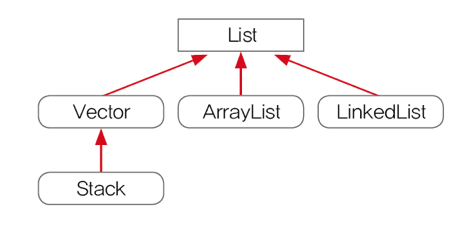
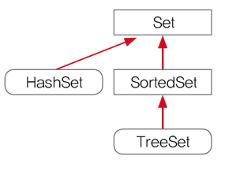
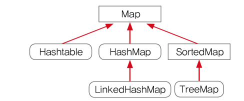
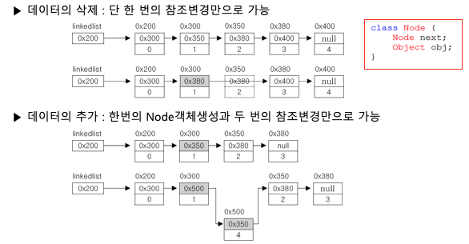
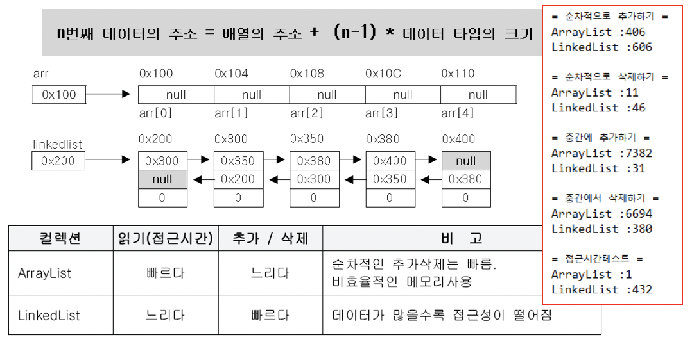
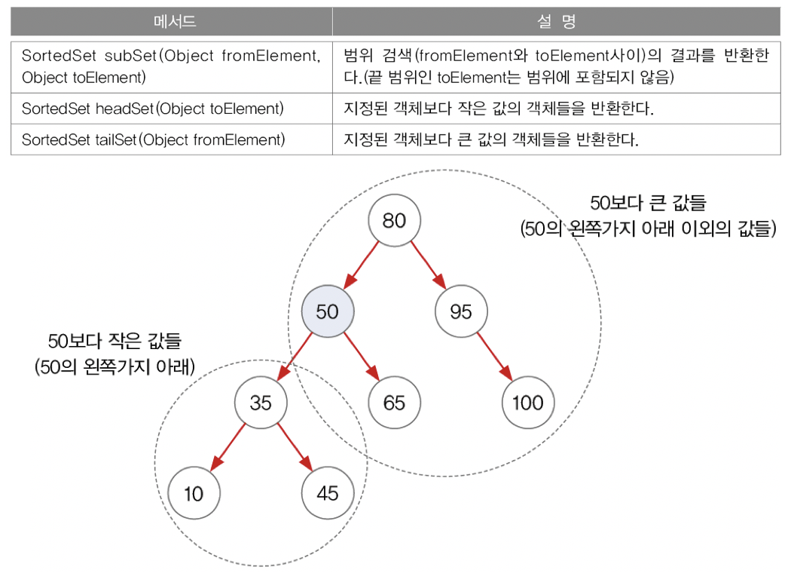
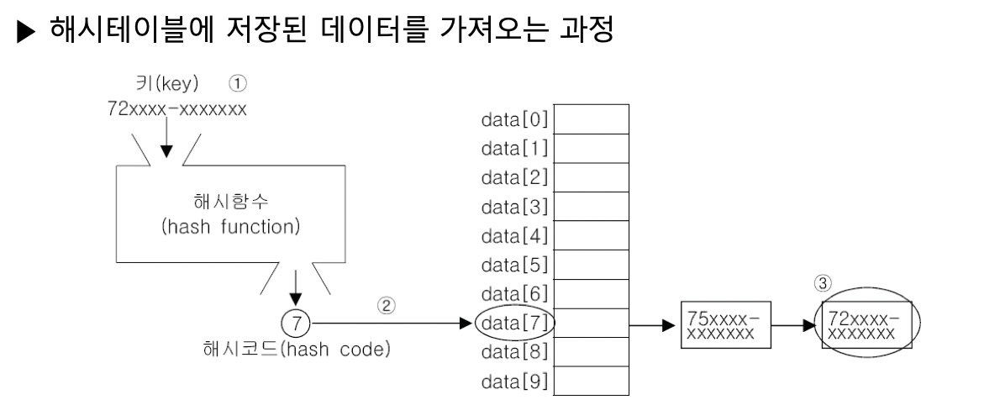

# Chapter 11 "Collection Framework"

## 1. 핵심 인터페이스 -  List / Set / Map

```
Collection 
    ㄴ List
    ㄴ Set
Map
```

>* List: 순서 Y, 데이터의 중복 Y
>* Set: 순서 N, 데이터의 중복 N
>* Map; Key-value 형식, 순서 N, 키 중복 N, 값 중복 Y 





* Map.Entry 인터페이스: Map 인터페이스의 내부 인터페이스
    * Map 에 저장되는 key-value 쌍을 다루기 위해 내부적으로 Entry 인터페이스를 정의해 둠.

```java
public interface Map<K, V> {
    ...
    interface Entry<K, V> {
        /**
         * Returns the key corresponding to this entry.
         *
         * @return the key corresponding to this entry
         * @throws IllegalStateException implementations may, but are not
         *         required to, throw this exception if the entry has been
         *         removed from the backing map.
         */
        K getKey();

        /**
         * Returns the value corresponding to this entry.  If the mapping
         * has been removed from the backing map (by the iterator's
         * {@code remove} operation), the results of this call are undefined.
         *
         * @return the value corresponding to this entry
         * @throws IllegalStateException implementations may, but are not
         *         required to, throw this exception if the entry has been
         *         removed from the backing map.
         */
        V getValue();
    ...
    }
}
```

## 2. ArrayList

* 데이터의 저장 공간으로 배열을 사용한다. (배열 기반)
* 장점: 구조가 간단하고 데이터를 읽는 데 걸리는 시간(Access Time)이 짧다.
* 단점
    * 크기를 변경할 수 없다.
        * 크기를 변경해야 하는 경우, 새로운 배열을 생성한 후 데이터를 복사해야 함.
        * 크기 변경을 피하기 위해 충분히 큰 배열을 생성하면, 메모리가 낭비됨.
    * 비 순차적인 데이터의 추가, 삭제에 시간이 많이 걸린다.
        * 데이터 추가/삭제를 위해, 다른 데이터를 옮겨야 함.
        * 그러나 순차적인 데이터 추가(끝에 추가)와 삭제(끝부터 삭제)는 빠르다.

## 3. LinkedList

* 배열의 단점을 보완, 불연속적으로 존재하는 데이터를 서로 연결(link)한 형태로 구성
* 배열처럼 데이터를 이동하기 위해 복사하는 과정이 없기 때문에 처리 속도가 매우 빠름.
* 이동 방향이 단방향임 - 다음 요소에 대한 접근은 쉽지만 이전 요소에 대한 접근은 어려움.<br>
→ double linked list




```java
Class Node {
    Node next;  // 다음 요소의 주소를 저장
    Object obj; // 데이터를 저장
}
```

### 3.1. ArrayList vs. LinkedList – 성능 비교

* 순차적으로 데이터를 추가/삭제 - ArrayList가 빠름
    * ArrayList는 순차적으로 데이터를 삭제한다. :  마지막 데이터부터 역순으로 삭제해나간다. 즉, 각 요소들의 재배치가 필요하지 않음.
* 비순차적으로 데이터를 추가/삭제 - LinkedList가 빠름
    * LinkedList 는 각 요소들간의 연결만 변경해주면 된다.
* 접근 시간(access time) -  ArrayList가 빠름

    * LinkedList - 처음부터 n번째 데이터까지 차례로 따라가야만 원하는 값을 얻을 수 있다.

## 4. Stack과 Queue

* Stack: LIFO (구현: ArrayList와 같은 배열 기반의 클래스)
* Queue: FIFO (구현: 데이터의 추가/삭제가 쉬운 LinkedList)

## 5. Iterator, ListIterator, Enumeration

* 컬렉션에 저장된 데이터를 접근하는데 사용되는 인터페이스

### 5.1. Iterator

* iterator() 는 Collection 인터페이스에 정의된 메서드이므로, Collection IF의 자손인 List와 Set에도 포함되어 있다.

```java

public interface Iterator<E> {
    boolean hasNext();
    E next();
    default void remove() {
        throw new UnsupportedOperationException("remove");
    }

    /**
     * @param action The action to be performed for each element
     * @throws NullPointerException if the specified action is null
     * @since 1.8
     */
    default void forEachRemaining(Consumer<? super E> action) {
        Objects.requireNonNull(action);
        while (hasNext())
            action.accept(next());
    }
}

public interface Collection<E> extends Iterable<E> {
    ...
    Iterator<E> iterator();
}
```

* Map 인터페이스를 구현한 컬렉션 클래스는 key-value를 쌍으로 저장하고 있어 iterator()를 직접 호출할 수 없고, <br>
keySet()이나 entrySet()과 같은 메서드를 통해서 key-value를 각각 따로 Set의 형태로 얻어온 후에 다시 iterator()를 호출해야 한다.

```java
public class IteratorTest {
    public static void main(String[] args) {
        // 참조 변수의 type을 ArrayList가 아닌, List로 한 이유 - 다른 컬렉션으로 변경할 때에는 이 부분만 고치면 된다.
        // 그러나 이 경우에는, List에 정의된 메서드만 사용 가능하다.
        List list = new ArrayList();
        list.add(1);
        list.add(2);

        Iterator it = list.iterator();
        while (it.hasNext()) {
            System.out.println(it.next());
        }

        // Set 클래스들은 각 요소간의 순서가 유지 되지 않기 때문에 순서가 보장되지 않음.
        Map map = new HashMap();
        map.put(1, "hi");
        map.put(2, "hola");
        Set entrySet = map.entrySet();
        Set keySet = map.keySet();
        Iterator mapList = map.entrySet().iterator();
        Iterator keyList = map.keySet().iterator();
        while (mapList.hasNext()) {
            System.out.println(mapList.next());
        }
        // iterator는 재사용이 안됨 -> 아래 결과는 null
        while (mapList.hasNext()) {
            System.out.println(mapList.next());
        }
        while (keyList.hasNext()) {
            Object obj = keyList.next();
            System.out.println(obj);
        }
    }
}
```

### 5.2. ListIterator – Iterator의 기능을 확장(상속)
* Iterator에 양 방향 조회 기능을 추가

## 6. Arrays

* 배열을 다루기 편리한 메서드 제공, Arrays에 정의된 메서드는 모두 static 메서드이다.
* 복사 - copyOf(), copyOfRange()
* 채우기 - fill(), setAll()
* 정렬과 검색 - sort(), binarySearch()
    * binarySearch()는 배열이 정렬된 상태여야만 올바른 결과를 얻는다.
* 문자열 비교와 출력 - equals(), toString(), deepEquals(), deepToString()
    * toString()은 일차원 배열에만 사용, deepToString()은 다차원 배열에 사용
    * equals()는 일차원 배열에, deepEquals()는 다차원 배열에 사용
* 배열을 List로 변환 - asList(Object... a)
    * asList()가 반환한 List의 크기는 변경할 수 없음. 즉, 추가 삭제는 불가능함.
```java
public class ArraysTest {
    public static void main(String[] args) {
        // asList()가 반환한 배열의 크기는 변경할 수 없음.
        List list = Arrays.asList(new Integer[]{1, 2, 3, 4, 5});
        // list.add(6);    // UnsupportedOperationException 발생

        // 배열의 크기를 변경하기 위해서는 ArrayList로 생성
        List list2 = new ArrayList(Arrays.asList(new Integer[]{1, 2, 3, 4, 5}));
        list2.add(6);
        System.out.println(list2.toString());   // [1, 2, 3, 4, 5, 6]
    }
}
```

## 7. Comparator와 Comparable

* 객체를 정렬하는데 필요한 메서드를 정의한 인터페이스(정렬기준을 제공)
    * Comparable: 기본 정렬 기준을 구현하는데 사용, 기본적으로 오름차순 (java.util 패키지)
    * Comparator: 기본 정렬 기준 외에 다른 기준으로 정렬하고자 할 때 사용 (java.lang 패키지)
* Comparable 을 구현한 클래스는 정렬이 가능하다.

```java
public interface Comparable<T> {
    public int compareTo(T o);
}

@FunctionalInterface
public interface Comparator<T> {
    int compare(T o1, T o2);    // 같으면 0, 작으면 음수, 크면 양수 반환
    boolean equals(Object obj); // 오버라이딩이 필요하다는 것을 알리기 위한 것 뿐
}
```

```java
import java.util.*;

public class ComparatorTest {
    public static void main(String[] args) {
        String[] strArr = {"cat", "Dog", "lion", "tiger"};

        // String 의 Comparable 구현에 의한 정렬
        Arrays.sort(strArr);
        System.out.println(Arrays.toString(strArr));    // [Dog, cat, lion, tiger]

        // 대소문자 구분 안함.
        Arrays.sort(strArr, String.CASE_INSENSITIVE_ORDER);
        System.out.println(Arrays.toString(strArr));    // [cat, Dog, lion, tiger]

        // 역순 정렬 구현
        Arrays.sort(strArr, new Descending());
        System.out.println(Arrays.toString(strArr));    // [tiger, lion, cat, Dog]
    }
}

class Descending implements Comparator {
    @Override
    public int compare(Object o1, Object o2) {
        // compare()의 매개변수가 Object 타입이기 때문에 compareTo를 바로 호출할 수 없고, 형변환 필요
        Comparable c1 = (Comparable) o1;
        Comparable c2 = (Comparable) o2;
        return c1.compareTo(c2) * -1;   // -1을 곱해서, 기본 정렬방식 역으로 변경.
        // return c2.compareT0(c1); 도 동일한 결과
    }
}
```

## 8. HashSet

* 내부적으로 Hash 기법을 사용하지만, Set Interface를 구현함.
* HashSet은 저장 순서를 유히자지 않으므로, 저장 순서를 유지하고자 한다면 LinkedHashSet을 사용
* HashSet은 객체를 저장하기 전에, 기존에 같은 객체가 있는지 확인한다. (같은 객체가 없으면 저장하고, 있으면 저장하지 않음.)
* boolean add(Object o)는 저장할 객체의 equals()와 hashCode()를 호출한다.<br>
→ equals()와 hashCode()가 오버라이딩 되어 있어야 한다.

```java
public class HashSetEqualsTest {
    public static void main(String[] args) {
        HashSet set = new HashSet();

        set.add("abc");
        set.add(new String("abc"));
        set.add(new Person("hola", 20));
        set.add(new Person("hola", 20));

        System.out.println(set.toString());
    }
}

class Person {
    String name;
    int age;

    public Person(String name, int age) {
        this.name = name;
        this.age = age;
    }

    // 기존에 저장된 요소와 같은 것인지 판별
    @Override
    public boolean equals(Object obj) {
        if (obj instanceof Person) {
            Person tmp = (Person) obj;
            return name.equals(tmp.name) && age == tmp.age;
        }
        return false;
    }

    @Override
    public int hashCode() {
        // return (name + age).hashCode(); // String 클래스의 hashCode() 사용
        return Objects.hash(name, age); // java.util.Objects 클래스의 hash() 사용, int hash(Object... values) 
    }

    @Override
    public String toString() {
        return name + " : " + age;
    }

}
```

### 8.1. HashCode()의 오버라이딩 조건

* 동일 객체에 대해서 여러 번 hashCode()를 호출해도 동일한 int 값을 반환해야 한다.

```java
Person p = new Person("David", 10);
int hashCode1 = p.hashCode();
int hashCode2 = p.hashCode();
p.age = 20;
int hashCode3 = p.hashCode();

System.out.println("hashCode1 === " + hashCode1);   // 동일
System.out.println("hashCode2 === " + hashCode2);   // 동일
System.out.println("hashCode3 === " + hashCode3);   // 다름
```

* equals()로 비교해서 true를 얻은 두 객체의 hashCode() 값은 일치해야 한다.

```java
Person p = new Person("David", 20);
Person p2 = new Person("David", 20);
System.out.println(p.equals(p2));   // true
System.out.println(p.hashCode());   // 동일 
System.out.println(p2.hashCode());  // 동일
```

* equals()로 비교한 결과가 false인 두 객체의 hashCode()값이 같을 수도 있다. <br>
그러나 성능 향상을 위해 가능하면 서로 다른 값을 반환하도록 작성하자.
    * 두 객체에 대해 equals()결과가 true면, 두 객체의 해시 코드가 같아야 하지만<br>
    반대가 반드시 성립하는 것은 아니다.
* 서로 다른 객체에 대해서 해시 코드 값(=hashCode()를 호출한 결과)이 중복되는 경우가 많아질수록,<br>
해싱을 사용하는 Hashtable, HashMap과 같은 컬렉션의 검색 속도가 떨어진다.

## 9. TreeSet - 정렬, 검색, 범위검색

* binary search tree 형태로 데이터를 저장
    * 링크드 리스트처럼 각 요소(node)가  나무(tree)형태로 연결된 구조
    * 왼쪽에는 부모노드의 값보다 작은 값의 자식노드를, 오른쪽에는 큰 값의 자식노드를 저장
    * 정렬된 상태를 유지 → 단일 값 검색과 범위 검색이 매우 빠르다.
* Set 인터페이스 구현 - 중복 데이터 N, 저장 순서 유지 N
* HashSet 보다 데이터 추가, 삭제에 시간이 더 걸림 (순차적으로 저장 N, 반복적인 비교 후 저장)

```java
class TreeNode {
    TreeNode left;  // 왼쪽 자식 노드
    Object element; // 객체를 저장하기 위한 참조 변수
    TreeNode right; // 오른쪽 자식 노드
}
```

* 범위 검색 - subSet(), headSet(), tailSet()


## 10. HashMap(동기화 보장되지 않음)과 HashTable(동기화 보장됨)

* hashing 기법으로 데이터를 저장, 데이터가 많아도 검색이 빠르다.
* HashTable보다 HashMap이 새로운 버전임
    * hashTable은 key/value 로 null 허용하지 않지만, HashMap은 허용함.
* Map 인터페이스 구현. 
* Entry(데이터)를 key-value 쌍으로 묶어서 저장

```java
Entry[] table;
class Etnry {
    Object key;
    Object value;
}
```

* entrySet() - 키와 값을 함께 읽어오기
* keySet() - 키
* values() - 값

```java
public class HashMapTest {
    public static void main(String[] args) {
        HashMap map = new HashMap();
        map.put("김자바", new Integer(90));
        map.put("김자바", new Integer(100));
        map.put("이자바", new Integer(100));
        map.put("강자바", new Integer(80));
        map.put("안자바", new Integer(90));

        Set set = map.entrySet();
        Iterator it = set.iterator();
        System.out.println(set.toString()); // [안자바=90, 김자바=100, 강자바=80, 이자바=100]
        while (it.hasNext()) {
            Map.Entry e = (Map.Entry) it.next();
            System.out.println("이름: " + e.getKey() + ", 점수: " + e.getValue());
        }

        set = map.keySet();
        System.out.println(set.toString()); // [안자바, 김자바, 강자바, 이자바]

        Collection values = map.values();
        System.out.println(values.toString());  // [90, 100, 80, 100]
        it = values.iterator();
        int total = values.stream()
                .mapToInt(e -> (int) e)
                .sum();
        System.out.println("total: " + total);
    }
}
```

> [예제] 참고하기

* HashMap은 데이터의 키와 값을 모두 Object 로 저장 → HashMap의 value에 HashMap 다시 저장 가능하다.<br>
→ 하나의 키에 복수개의 데이터 저장 가능하다.

```java
public class HashMapPhoneBookTest {
    static HashMap<String, HashMap> phoneBook = new HashMap();

    public static void main(String[] args) {
        addPhoneNo("친구", "이자바", "010-111-1111");
        addPhoneNo("친구", "김자바", "010-222-2222");
        addPhoneNo("친구", "김자바", "010-333-3333");
        addPhoneNo("회사", "김대리", "010-444-4444");
        addPhoneNo("회사", "김대리", "010-555-5555");
        addPhoneNo("회사", "박대리", "010-666-6666");
        addPhoneNo("회사", "이과장", "010-777-7777");
        addPhoneNo("세탁", "010-888-8888");

        printList();
    }

    // 번호 추가 메서드
    static void addPhoneNo(String groupName, String name, String tell) {
        addGroup(groupName);
        HashMap group = (HashMap) phoneBook.get(groupName); // null 올 수 있음.
        group.put(tell, name);  // 이름은 중복될 수 있으니, 전화번호를 key로 저장한다.
    }

    static void addPhoneNo(String name, String tell) {// overloading
        addPhoneNo("기타", name, tell);
    }

    // 그룹 추가 메서드
    static void addGroup(String groupName) {
        if (!phoneBook.containsKey(groupName)) {
            phoneBook.put(groupName, new HashMap());
        }
    }

    // 전화번호부 전체를 출력하는 메서드
    static void printList() {
        Set set = phoneBook.entrySet();
        Iterator it = set.iterator();

        while (it.hasNext()) {
            Map.Entry e = (Map.Entry) it.next();

            Set subSet = ((HashMap) e.getValue()).entrySet();
            Iterator subIt = subSet.iterator();

            System.out.println(" * " + e.getKey() + "[" + subSet.size() + "]");

            while (subIt.hasNext()) {
                Map.Entry subE = (Map.Entry) subIt.next();
                String telNo = (String) subE.getKey();
                String name = (String) subE.getValue();
                System.out.println(name + " " + telNo);
            }
            System.out.println();
        }
    }
}
```

### 10.1. 해싱과 해시 함수

* hashing: hash function 을 이용하여 데이터를 hash table에 저장하고 검색하는 기법
* 해시 함수: 데이터가 저장되어 있는 곳을 알려줌.
* 해싱을 구현한 컬렉션 클래스 - HashSet, HashMap, Hashtable

* 해시 테이블에 저장된 데이터를 가져오는 과정

    1. 검색하고자 하는 값의 키로 해시 함수를 호출
    1. 해시 함수의 계산 결과인 해시 코드를 이용해서, 해당 값이 저장되어 있는 링크드 리스트를 검색
    1. 링크드 리스트에서 검색한 키와 일치하는 데이터를 찾는다.

## 11. TreeMap

* 이진 검색 트리의 구조로 key/value 저장 → 검색과 정렬에 적합
* 검색에 관한 대부분의 경우에서 HashMap이 TreeMap 보다 더 뛰어나므로, HashMap을 사용하는 것이 좋음.<br>
다만, 점위 검색이나 정렬이 필요한 경우에는 TreeMap을 사용하자.


