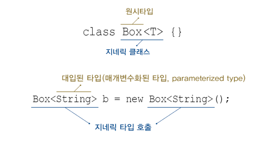

# Chapter 12-01 "Generics"
* 클래스에 사용할 type을 디자인 할 때에 지정하는 것이 아니라, class를 사용할 때 지정한 후 사용함.

## 1. Generics
> 객체의 타입을 미리 명시해줌으로써 번거로운 형변환을 줄여준다.
* 다양한 타입의 객체들을 다루는 메서드나 컬렉션 클래스에 컴파일시의 타입 체크(compile-time type check)를 해주는 기능
* 장점
    * 객체의 타입 안정성을 제공함.
       * 의도하지 않은 타입의 객체가 저장되는 것을 막음.
       * 저장된 객체를 꺼내올 때 원래의 타입과 다른 타입으로 잘못 형변환되어 발생할 수 있는 오류를 줄여줌.
    * 타입 체크와 형변환을 생략할 수 있음 → 코드가 간결해짐.

## 2. Generic 클래스의 선언

### 2.1. 타입 파라미터 - '임의의 참조형 타입'을 의미
* T(Type): 주로 VO나 엔티티형 클래스에서 원하는 데이터 타입을 제네릭 형태로 선언하고 싶을 때
* E(Elements): 주로 컬렉션 프레임워크 같은 목록성 데이터를 관리하는 클래스
* K(Key): 이름과 값으로 구성된 데이터(예: HashTable, HashMap 등)를 관리하는 클래스
* V(Value): K와 조합하여 사용, 주로 <K, V>와 같은 형태
* N(Number)
* R(Return): 메서드의 리턴 타입 지정하고 싶을 때
```java
/**
 * Generic Class
 * Box<T> 클래스는 어떤 타입이든 한 가지 타입을 정해서 담을 수 있음.
 */
class Box<T> {
    T item;
    void setItem(T item){ this.item = item; }
    T getItem(){ return item; } 
}

/**
 * Generic 클래스의 객체를 생성할 때에는, T 대신 실제 타입을 지정해 주어야 함
 */
Box<String> b = new Box<String>();  // 타입 T 대신, 실제 타입 지정
b.setItem(new Object());            // Error. String 이외의 타입은 지정 불가
b.setItem("Ssookie");               // OK.
String item = (String) b.getItem(); // (String) No! 형 변환 필요 없음 
```
* 제네릭 도입되기 이전의 코드와 호환을 위해, 제네릭 클리스임에도 예전의 방식으로 객체를 생성하는 것이 허용됨.
    * [unchecked or unsafe operation](https://www.oops4u.com/2240) - 제네릭 클래스나 인터페이스를 선언하거나 생성할 때 자료형을 명시해 주지 않으면 에러 발생
    * 단, 컴파일 시 이러한 에러가 나더라도 실행하면 정상적으로 작동이 되므로 크게 신경쓰지 않아도 됨.
```java
Box b = new Box();          // OK. T는 Object로 간주됨
b.setItem("Ssookie");       // WARN. unchecked or unsafe operation
b.setItem(new Object());    // WARN. unchecked or unsafe operation

// 타입 변수 T에 Object 타입을 지정하면, 경고 발생하지 않음(타입을 지정하지 않은 것이 아니라 알고 적은 것이므로)
```

### 2.2. 제네릭스 용어
```java
class Box<T>{}
```
>* Box<T>: 제네릭 클래스
>* T: 타입 파라미터
>* Box: 원시 타입(raw type)


* 제네릭 타입 호출 - 타입 파라미터에 타입을 지정하는 것
* 매개변수화된 타입(대입화된 타입) - 지정된 타입을 지칭
* 컴파일 하면 제네릭 타입이 제거되고 모두 raw type(예: Box)로 바뀜.
    * 예) Box<String>과 Box<Integer>는 제네릭 클래스 Box<T>에 서로 다른 타입을 대입하여 호출한 것일 뿐, 별개의 클래스가 아님

### 2.2. 제네릭스의 제한
* static 멤버에는 타입 변수 T를 사용할 수 없음
    * static 멤버 - 모든 객체에 대해 동일하게 동작해야 함
    * T - 인스턴스 변수로 간주됨
* 제네릭 타입의 배열 T[] 생성 허용되지 않음
    * new 연산자 - 컴파일 시점에 타입 T가 무엇인지 정확히 알아야 하기 때문
    * instanceof 연산자도 마찬가지임
    * 반드시 제네릭 배열 생성이 필요한 경우
        * new 대신에 Reflection API의 newInstance()와 같이 동적으로 생성
        * Object 배열을 생성하여 복사한 다음에 T[]로 형변환
```java
class Box<T> {
    T[] itemArray;   // OK. T 타입의 배열을 위한 참조 변수 선언은 가능
    T[] toArray() {
        T[] tmpArr = new T[itemArray.length]; // ERROR. 제네릭 배열 생성 불가
        ...
        return tmpArr;
    }
}
```

## 3. Generic 클래스의 객체 생성과 사용
* 참조 변수와 생성자에 대입된 타입(매개변수화된 타입)이 일치해야 함
* 상속 관계일 때, 대입된 타입이 같은 것은 괜찮음
* 추정이 가능한 경우, 타입 생략 가능
```java
class Box<T> {
    void add (T item) { list.add(item); }
}

// Apple이 Fuit의 자손일 때
Box<Fruit> appleBox = new Box<Apple>(); // ERROR. 대입된 타입이 다름

// FruitBox가 Box의 자손일 때
Box<Apple> appleBox = new FruitBox<Apple>();    // OK. 다형성

// JDK 1.7부터는 추정이 가능한 경우, 타입 생략 가능. 생성자에 반복해서 타입 지정해주지 않아도 됨
Box<Apple> appleBox = new Box<>(); // OK.
```
* 대입된 타입과 다른 타입의 객체는 추가할 수 없음.
```java
/** 
 * Apple이 Fruit의 자손일 때...
 * 타입 T가 Fruit인 경우, void add(Fruit item)이 되므로
 * Fruit의 자손들은 이 메서드의 매개 변수가 될 수 있음
 */
Box<Fruit> fruitBox = new Box<Fruit>();
fruitBox.add(new Fruit());  // OK
fruitBox.add(new Apple());  // OK. void add(Fruit item)
```
## 4. 제한된 Generic 클래스 - 타입 파라미터의 종류 제한
* extends - 특정 타입의 자손들만 대입할 수 있도록 제한
* 매개변수화된 타입의 자손 타입도 가능(다형성)
    * 타입 파라미터 T에 Object를 대입하면, 모든 종류의 객체를 저장할 수 있음.
* 인터페이스의 경우에도 implements가 아닌 extends를 사용
```java
/**
 * Fruit의 자손만 타입으로 지정 가능
 */
class FruitBox<T extneds Fruit> { 
    ...
}

/**
 * add() 의 매개변수의 타입 T도 Fruit과 그 자손 타입이 될 수 있음
 */
FruitBox<Fruit> fruitBox = new FruitBox<Fruit>();
fruitBox.add(new Apple());  // OK. Apple이 Fruit의 자손임
fruitBox.add(new Grape());  // OK. Grape가 Fruit의 자손임

/**
 * 클래스 Fruit의 자손이면서 Eatable 인터페이스도 구현 (&기호로 연결)
 */
class FruitBox<T extends Fruit & Eatable> extends Box<T>{...}
```
## 5. 와일드 카드 '?' - 어떤 타입도 될 수 있음!
* 여러 타입 대입 가능함
* ?만으로는 Object타입과 동일하므로, extends(upper bound)와 super(lower bound)로 제한
* <? extends T&E>와 같이 & 사용 불가

### 5.1. 와일드 카드가 필요한 이유
```java
class Juicer {
    // Juicer 는 제네릭 클래스 아님 & static 메서드에는 타입 파라미터 T 사용 불가 -> 사용시 특정 타입 지정해주어야 함
    static Juice makeJuice(FruitBox<Fruit> box) {
        String tmp = "";

        for(Fruit f : box.getList())
            tmp += f + " ";
        return new Juice(tmp);
    }

    FruitBox<Fruit> fruitBox = new FruitBox<Fruit>();
    FruitBox<Apple> appleBox = new FruitBox<Apple>();
    ...
    System.out.println(Juicer.makeJuice(fruitBox)); // OK. FruitBox<Fruit>
    System.out.println(Juicer.makeJuice(appleBox)); // ERROR. FruitBox<Apple>
}
```
* 제네릭 타입을 FruitBox<Fruit> 으로 고정해 놓으면, FruitBox<Apple> 타입의 객체는 makeJuice()의 매개 변수가 될 수 없음.
* 그러나, 여러 가지 타입의 매개변수를 갖는 makeJuice()를 만들게 되면, 메서드 중복 정의 발생
    * 아래의 경우, 컴파일 에러 발생
    * 제네릭 타입이 다른 것만으로는 오버로딩이 아니라 메서드 중복 정의이기 때문
    * __제네릭 타입은 컴파일러가 컴파일 할 때만 사용하고 제거해버림__
```java
    static Juice makeJuice(FruitBox<Fruit> box) {
        String tmp = "";
        for(Fruit f : box.getList()) tmp += f + " ";
        return new Juice(tmp);
    }
    static Juice makeJuice(FruitBox<Apple> box) {
        ...// 내용 동일
    }
```

* 따라서, 와일드 카드를 사용하여 makeJuice()의 타입 파라미터를 FruitBox<? extends Fruit>으로 변경
* 타입 파라미터를 FruitBox<? extends Object>로 하면, 모든 종류의 FruitBox가 타입 파라미터로 가능함

### 5.2. 와일드 카드의 제한
```java
<? extends T>   upper bound / T와 그 자손들만 가능
<? super T>     lower bound / T와 그 조상들만 가능
<?>             제한 없음, 모든 타입 가능 / <? extends Object>와 동일 
```

* Comparator에는 항상 <? super T>가 습관적으로 따라 붙음
```java
static <T> void sort(List<T> list, Comparator<? supert T> c)
```

## 6. 제네릭 메서드
### 6.1. 제네릭 메서드란?
> 메서드의 선언부에 제네릭 타입이 선언된 메서드 (예) Collections.sort()
* 선언 위치: 반환 타입 바로 앞
* 클래스의 타입 매개변수<T>와 메서드의 타입 파라미터 <T>는 별개, 같은 타입 문자 T를 사용할 뿐
    * 내부 클래스에 선언된 타입 문자가 외부 클래스의 타입 문자와 같아도 구분 가능
* 제네릭 메서드는 제네릭 클래스가 아닌 클래스에도 정의 가능
* static 메서드에 제네릭 타입 선언/사용은 가능
    * 메서드에 선언된 제네릭 타입은 지역 변수를 선언한 것과 같은 의미

### 6.2. 제네릭 메서드의 사용
> 제네릭 메서드를 호출할 때, 타입 파라미터에 타입을 대입해야 한다. <br>
> 그러나 대부분의 경우, 추정이 가능하므로 생략할 수 있음
```java
// 제네릭 메서드로 바꾸기
static Juice makeJuice(FruitBox<? extends Fruit> box) { ... }
static<T extends Fruit> Juice makeJuice(FruitBox<T> box) { ... }    // 메서드 선언부에 제네릭 타입 선언

// 제네릭 메서드 호출하기
FruitBox<Fruit> fruitBox = new FruitBox<Fruit>();
FruitBox<Apple> appleBox = new FruitBox<Apple>();
...
System.out.println(Juicer.<Fruit>makeJuice(fruitBox));
System.out.println(Juicer.<Apple>makeJuice(appleBox));
System.out.println(Juicer.makeJuice(appleBox)); // 컴파일러 추정 가능한 경우, 대입된 타입 생략 가능
```
```java
/**
 * 제네릭 메서드 예시
 */
public static <T extends Comparable<? super T>> void sort(List<T> list)

// 위 메서드를 이해하기 위해, 와일드 카드 걷어내면
// -> List<T>의 요소가 Comparable 인터페이스를 구현한 것이어야 함
public static <T extends Comparable<T>> void sort(List<T> list)
```

# 7. 제네릭 타입의 형변환
* 제네릭 타입과 원시 타입간의 형변환 가능
* 대입된 타입이 다른 제네릭 타입 간에는 형변환 불가능
* 와일드 카드가 사용된 제네릭 타입으로는 형변환 가능
```java
Box<? extends Object> wBox = new Box<String>(); // OK

// 참고: <? extends Object>를 줄여서 <?>로 쓸 수 있음
```

# 8. 제네릭 타입의 제거
* 컴파일러는 제네릭 타입을 제거함: 제네릭 타입을 이용해 소스 파일 체크 → 필요한 곳에 형변환을 넣어줌 
* 제네릭 JDK 1.5 도입, 이전 소스 코드와의 호환성 유지를 위해

> [참고]
>* https://jinbroing.tistory.com/228