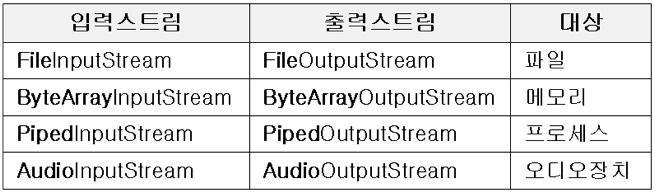
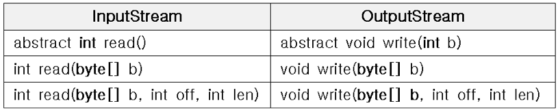
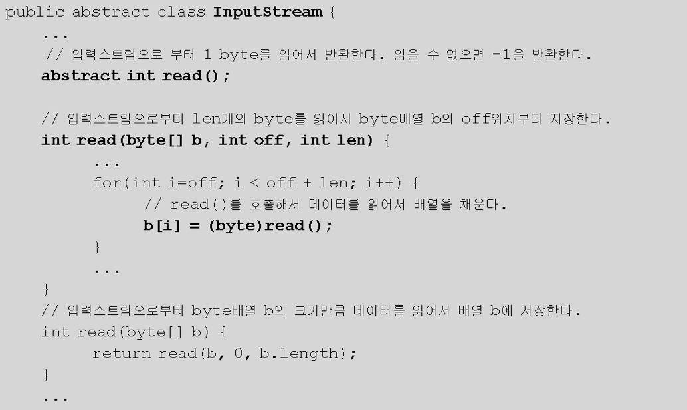
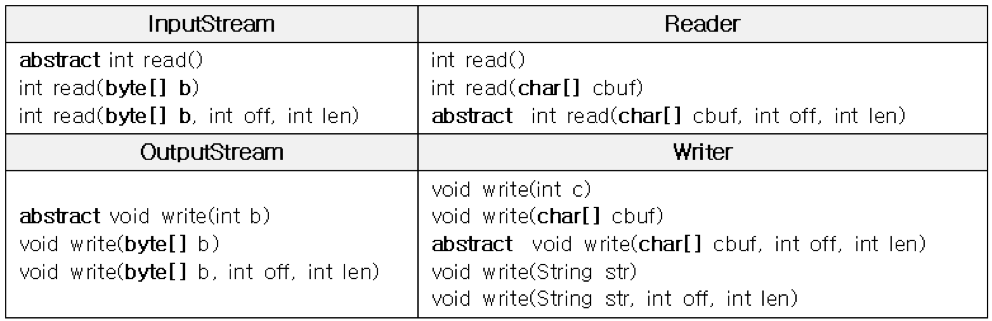

# Chapter 15 "입출력 I/O"

## 1. 자바에서의 입출력

### 1.1. 입출력
* Input/Output
* System.out.println()

### 1.2. stream
* stream: 대상을 연결하고 데이터를 전송할 수 있는 연결통로
* 단방향 통신만 가능 → 하나의 스트림으로 입/출력 동시에 처리할 수 없음.
* FIFO

### 1.3. 바이트기반 스트림 - InputStream, OutputStream
* 데이터를 byte 단위로 전송
* 입/출력 스트림의 종류

* InputStream과 OutputStream에 정의된 메서드

    * read(), write() 는 입출력의 대상에 따라 읽고 쓰는 방법이 다를 것이므로 추상 메서드로 정의 (상황 맞게 구현)
    * 나머지 메서드는 read(), write()를 이용하여 구현한 것들
 
        * read()는 반드시 구현되어야 하는 핵심적인 메서드임
        * read()의 return type이 byte가 아니라 int인 이유는, read() 반환값의 범위가 -1 ~ 255 이기 때문
 
### 1.4. 보조 스트림
* 실제 데이터를 주고 받는 스트림이 아님 → 독립적으로 입출력 수행 못함
* 스트림을 향상시키거나 새로운 기능을 추가하기 위해 사용
* 스트림을 먼저 생성한 다음에 이를 이용하여 보조스트림 생성해야 함
* 버퍼를 사용한 입출력의 성능이 더 좋음
```java
// 먼저 기반 스트림 생성 - 실제 입력기능 수행
FileInputStream fis = new FileInputStream("tset.txt");

// 기반 스트림을 이용하여 보조 스트림 생성 - 버퍼만을 제공
BufferedInputStream bis = new BufferedInputStream(fis);

// 보조 스트림인 BufferedInputStream 로부터 데이터를 읽음
bis.read();
```

### 1.5. 문자기반 스트림 - Reader, Writer
* 입출력 단위가 문자(char, 2 byte)인 스트림
    * Java에서는 한 문자를 의미하는 char 형이 2 byte → 바이트 기반 스트림으로 문자를 처리하는데 어려움
* 문자 기반 스트림의 최고 조상
* 사용
    * InputStream -> Reader
    * OutputStream -> Writer
    

## 2. 바이트기반 스트림

### 2.1. InputStream과 OutputStream
* 바이트 기반 스트림의 조상
* 스트림을 사용한 후 close()를 호출하여 반드시 닫아주어야 함
* 닫아줄 필요 없는 스트림
    * 메모리를 사용하는 스트림 - ByteArrayInputStream ...
    * 표준 입출력 스트림 - System.in, System.out ...

### 2.1. InputStream과 OutputStream
* 바이트배열(byte[])에 데이터를 입출력하는 바이트기반 스트림
* 바이트 배열은 사용하는 자원이 메모리밖에 없음 → 가비지 컬렉터에 의해 자동적으로 자원을 반환함 → close() 호출하여 닫지 않아도 됨


