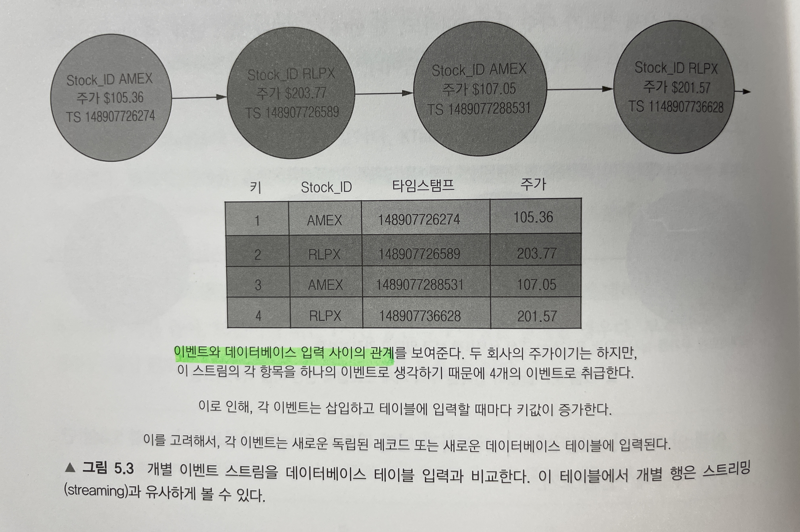
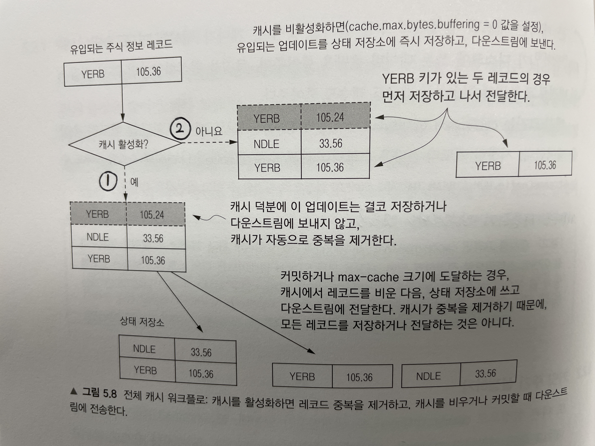
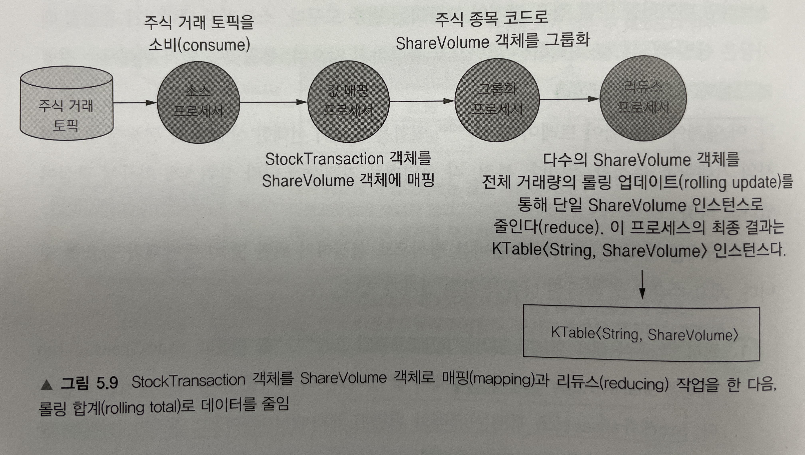
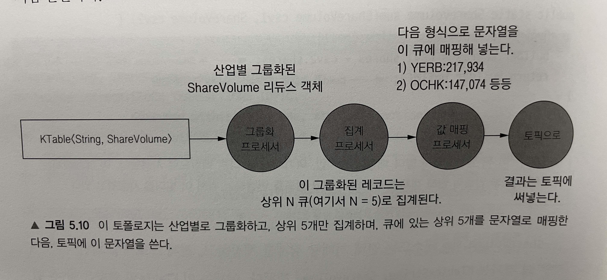
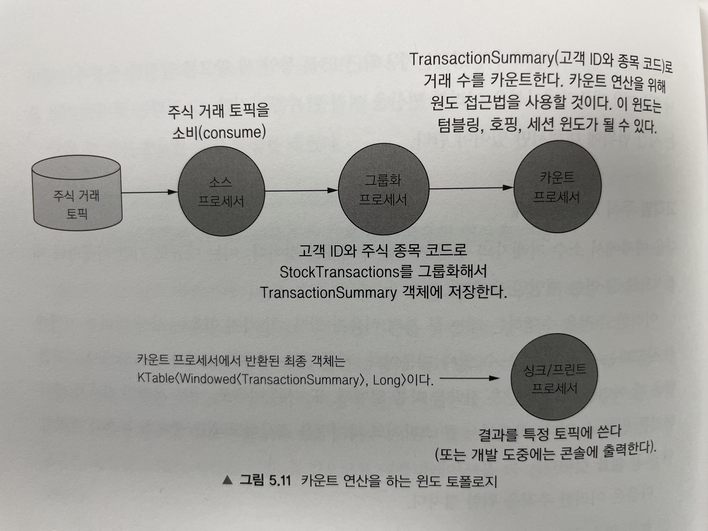
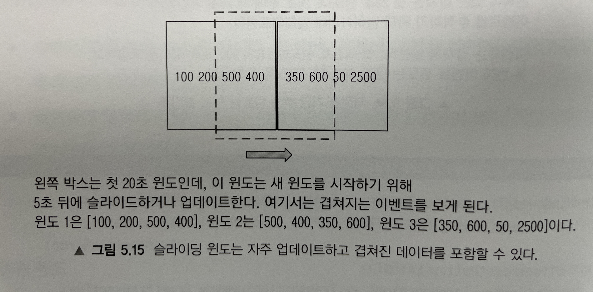

# Chapter 05 "KTable API"

* Stream은 끊임없는 이벤트의 흐름이다.
* Table은 어떤 처리(집계)등을 통해서 현재 상태를 보여주는 역할을 하며, Stream과 Join하면서 Stream에 또 다른 문맥을 추가해주는 역할을 할 수 있다. 

## 1. 스트림과 테이블의 관계

### 1.1. 이벤트와 데이터베이스 입력 사이의 관계



* 테이블 삽입과 이벤트 스트림을 같은 색상으로 함께 볼 수 있다.
* 위 테이블에서 

### 1.2. 레코드와 변경로그 업데이트


* 로그와 변경로그 둘 다 파일의 끝에 추가된 유입 레코드를 의미한다.
* 로그의 경우 모든 레코드를 볼 수 있지만, 변경로그의 경우에는 주어진 어떤 키에 대한 최신 레코드만 유지된다.
* 키별로 최신 레코드를 유지하는 동안, 로그를 잘라내기 위해 `로그 압축`을 사용할 수 있다.
    * 마지막 값만 고려하기 때문에 오래된 키/값 쌍을 제거할 수 있다.
    * 각 키에 대한 최신 값만 유지해서 결과적으로 로그의 크기가 작아진다.

### 1.3. 이벤트 스트림과 업데이트 스트림 비교

* 이벤트 스트림(KStream)은 메세지마다 모두 출력이 되는 반면, 업데이트 스트림(KTable)은 변경된 최신값만 출력 해준다.
* 예를 들어 총 9개의 메세지가 발송되었을 때, KStream은 9개의 값이 모두 출력되지만, KTable은 원본 레코드 3건과 두차례 업데이트를 받아 마지막에 변경되었던 최신값인 3개만 업데이트가 된다. <br>
이 때, 마지막 KStream 이벤트와 KTable 업데이트 값은 같다.
* 즉, KStream은 레코드를 각 레코드를 개별적으로 다루고, KTable은 이전 레코드에 대한 업데이트로 다룬다.
* KStream에서 같은 키를 가진 스트림 레코드는 업데이트 레코드일 뿐, 새 레코드가 아니다.

## 2. 레코드 업데이트와 KTable 구성 for 집계/리듀스

* KTable은 레코드를 어디에 저장하는가?
    ```java
    KTable<String, StockTickerData> stockTickerTable = builder.table(STOCK_TICKER_TABLE_TOPIC);
    ```
    * StreamBuilder는 KTable 인스턴스를 만들고,<br>
    동시에 그 내부에 스트림 상태를 추적하는 상태 저장소(StateStore)를 만들어 업데이트 스트림을 만든다.
    * 즉, KTable은 카프카 스트림즈와 통합된 로컬 상태 저장소를 저장 공간으로 사용한다.
* KTable은 레코드를 내보내는(emit) 결정을 어떻게 하는가?
    * 레코드의 수와 키 값에 따라 → 제어할 수 없다.
        * 애플리케이션에 유입되는 레코드 수 - 높은 데이터 유입률은 업데이트된 레코드를 내보내는 비율을 높일 수 있다.
        * 데이터의 distinct key 의 수 - 구별되는 키 개수가 많다면 다운 스트림에 더 많은 업데이트를 보내게 된다.
    * 구성 매개변수 → 제어할 수 있다.
        * `cache.max.bytes.buffering`
        * `commit.interval.ms`

### 2.1. 캐시 버퍼 크기 설정하기 (cache.max.bytes.buffering)

* KTable 캐시는 같은 키가 있는 레코드의 중복을 의미한다.
* KTable 캐시는 같은 키가 있는 레코드 업데이트의 중복을 제거하고, 캐시를 비우거나 커밋할 때 다운스트림에 전송하여 토폴로지에 있는 자식 노드에 연속적인 업데이트가 흐르는 것을 방지한다.
* cache.max.bytes.buffering
    * 레코드 캐시에 할당할 메모리 총량을 제어한다.
    * 지정한 메모리 총량은 스트림 스레드 수로 균등하게 나눠진다.
* 캐시를 사용하지 않는다는 것은? 
    * cache.max.bytes.buffering에 0을 설정.
    * 사실상 모든 KTable 업데이트를 하위 스트림에 보내게 된다. 만약 스트림의 모든 레코드를 처리해야 한다면, 이벤트 스트림인 KStream을 사용하는게 낫다.
    * 캐시를 사용하지 않는다는 것은, 영구 저장소가 최근 업데이트만 쓰는게 아니라 개별 업데이트를 쓴다는 의미가 된다.

### 2.2. 커밋 주기 설정하기 (commit.interval.ms)

* 프로세서 상태를 얼마나 자주 저장할지 지정한다.
* 프로세서 상태를 저장(commit) 할 때, 캐시를 강제로 베우고 중복 제거된 마지막 업데이트 레코드를 다운스트림에 저장한다.

#### 레코드를 다운스트림에 보내는 방법




* 캐시 활성화 - 커밋하거나 캐시가 최대 크기에 도달하면 레코드를 다운스트림에 전송한다.
    * KTable을 사용할 때 캐시를 활성화하는게 좋다.
* 캐시 비활성화 - 중복된 키를 포함한 모든 레코드를 다운스트림에 전송한다.

#### 캐시 크기와 커밋 시간 사이에 균형을 유지해야 한다.

* 커밋 시간이 짧은 캐시는 자주 업데이트 되고,<br>
커밋 간격이 길어지면 여유 공간 확보를 위해 캐시 추출이 발생하므로 업데이트가 줄어들 수 있다.
* 그러나, KTable이 전송하는 변경로그 레코드 비율은 구성 가능하므로, 시행 착오를 통해서 최적의 결과를 만들 수 있다.

## 3. 집계와 윈도 작업

### 3.1. 업계별 거래량 집계

* 스트리밍 데이터를 다룰 경우, 단일 레코드를 처리하는 것ㅁ나으로 충분하지 않으며 집계와 그룹하는 필수 도구이다.

#### [예시 프로세스] 산업별 상위 5개 회사의 거래량 추적

1. Raw 주식 거래 정보가 입력된 토픽으로부터 Source를 만든다.
    * 전체 거래 데이터(StockTransaction) 중 거래와 관련된 거래량(ShareVolume)만 필요하므로<br>
    mapValues()를 이용해서 StockTransaction 객체를 ShareVolume 객체에 매핑해준다.
2. 종목 코드로 ShareVolume 그룹을 만든다.
    * 전체 주식 거래량에서 그룹별 거래량으로 데이터를 줄일 수 있다.



```java
KTable<String, ShareVolume> shareVolume = builder.stream(STOCK_TRANSACTIONS_TOPIC,
        Consumed.with(stringSerde, stockTransactionSerde)
                // 특정 토픽을 소비하는 소스 프로세서
                .withOffsetResetPolicy(EARLIEST))
        // StockTranscation 객체를 ShareVolume 객체로 매핑
        .mapValues(st -> ShareVolume.newBuilder(st).build())
        // 주식 종목 코드에 따른 ShareVolume 객체를 그룹화
        .groupBy((k, v) -> v.getSymbol(), Serialized.with(stringSerde,shareVolumeSerde))
        // 거래량을 롤링 집계하기 위한 ShareVolume 객체 리듀스
        .reduce(ShareVolume::sum);
...
// 전체 거래량 집계
public static ShareVolume sum(ShareVolume csv1, ShareVolume csv2) {
    Builder builder = newBuilder(csv1);
    builder.shares = csv1.shares + csv2.shares;
    return builder.build();
}
```

* ShareVolume 객체가 들어오면 연관된 KTable은 가장 최근 업데이트를 유지한다.
* 개별 업데이트를 다운스트림에 내보내는 것이 아니라, 모든 업데이트가 앞의 ShareVolumeKTebla에 반영되었다.




3. 산업별로 ShareVolume 객체를 그룹화하는 또 다른 groupBy 작업을 수행한다.
4. 집계 객체는 고정 크기의 우선순위 큐로 사용하여, 거래량에 의한 상위 5개 회사만 유지한다.

```java
// fixedQueue 변수에 거래량의 내림차순으로 상위 N개 결과를 유지한다.
FixedSizePriorityQueue<ShareVolume> fixedQueue = new FixedSizePriorityQueue<>(comparator, 5);

// 산업별로 그룹화하고 필요한 serdes 제공
shareVolume.groupBy((k, v) -> KeyValue.pair(v.getIndustry(), v),
                Serialized.with(stringSerde, shareVolumeSerde))
        .aggregate(() -> fixedQueue,
                (k, v, agg) -> agg.add(v),  // 집계의 add 메소드가 새 업데이트를 추가
                (k, v, agg) -> agg.remove(v),   // 집계의 remove가 기존 업데이트를 제거
                Materialized.with(stringSerde, fixedSizePriorityQueueSerde))    // 집계를 위한 serde
        .mapValues(valueMapper) // valueMapper 가 집계를 리포팅에 사용되는 문자열로 반환한다.
        .toStream().peek((k, v) -> LOG.info("Stock volume by industry {} {}", k, v))    // 결과 출력을 위해 toStream()을 호출
        .to("stock-volume-by-company", Produced.with(stringSerde, stringSerde));    // 토픽에 결과 쓰기
```

*  KTable은 기존 레코드를 새 레코드로 교체한다.

> Summary
> * KTable에서 공통된 키로 값을 그룹화 할 수 있다.
> * 이러한 그룹화한 값으로 리듀스와 집계 같은 유용한 연사을 수행한다.

### 3.2. 윈도 연산

* 특정 기간에 걸쳐 집계형 연산을 수행한다.

#### [예시 프로세스] 소수 거래자의 주식 거래 추적




#### 윈도 유형 - 세션 윈도

* 시간에 엄격하게 제한받지 않고, 사용자 활동 / 추적하려는 활동과 관련이 있다.
* 지정된 시간 윈도 동안 레코드를 집계한다. (집계, 리듀스, 카운트)

```java
// groupBy와 count() 호출로 KTable 생성
KTable<Windowed<TransactionSummary>, Long> customerTransactionCounts =
        // topic으로부터 stream을 생성한다.
         builder.stream(STOCK_TRANSACTIONS_TOPIC, Consumed.with(stringSerde, transactionSerde).withOffsetResetPolicy(LATEST))
        .groupBy((noKey, transaction) ->
                // TransactionSummary 객체에 저장된 고객 ID와 주식 종목으로 레코드를 그룹화한다.
                TransactionSummary.from(transaction),
                Serialized.with(transactionKeySerde, transactionSerde))
         // 비활성 시간 20초, 유지 시간 15분의 SessionWindow로 그룹을 윈도 처리 후, count() 집계를 수행한다.
        .windowedBy(SessionWindows.with(twentySeconds).until(fifteenMinutes)).count();
```
* with 호출 - 20초의 비활성화 간격을 만든다.<br>
→ 현재 세션이 종료되거나 활성 세션 내의 시작 시간부터 20초 내에 도달하는 레코드를 애플리케이션이 포함한다.
* until 메소드 - 15분의 유지 기간을 만든다.

#### 윈도 유형 - 텀블링 윈도 / 고정 윈도


* 지정한 기간 내의 이벤트를 추적한다.

```java
// 15분 유지 기간, 20초 텀블링 윈도
.windowedBy(TimeWindows.of(twentySeconds).until(fifteenMinutes)).count();
```

#### 윈도 유형 - 슬라이딩 윈도 / 호핑 윈도



* 최근 이벤트를 처리할 새 윈도를 시작하기 전에 그 윈도 전체 시간을 기다리지 않는다.
* 전체 윈도 유지 기간보다는 더 짧은 간격 동안 기다린 후 새 연산을 수행한다.
* 위 그림의 경우, 겹쳐진 데이터가 있는 3개 결과 윈도가 생긴다.

```java
// 5초마다 이동하는 20초 간격의 호핑 윈도
// advanceBy() 메소드로 텀블링 윈도를 호핑 윈도로 변환한다.
.windowedBy(TimeWindows.of(twentySeconds).advanceBy(fiveSeconds).until(fifteenMinutes)).count();
```

> 윈도 유형 Summary
> * 세션 윈도 - 시간에 의해 고정되지 않고, 사용자 활동으로 유도된다.
> * 텀블링 윈도 - 지정된 시간 프레임 내에서 이벤트의 상황을 보게 한다.
> * 호핑 윈도 - 고정 길이지만, 자주 업데이트 되며, 개별 윈도에 겹치는 레코드가 들어있을 수 있다.

### 3.3. KStream과 KTable 조인하기

* KStream은 레코드 스트림이고 KTable은 레코드 업데이트 스트림인데,<br>
가끔 KTable의 업데이트를 이용해 레코드 스트림에 부가적인 문맥을 추가해야 할 수도 있다.

#### [예시 프로세스] 주식 거래 카운트를 가져와서 관련 산업 분야의 금융 뉴스와 조인하자.

1. 주식 거래 카운트 KTable을, 키가 주식 종목인 산업별 카운트로 변경한 KStream에 반환해 넣는다.

```java
// 1) KTable.toStream() 메서드를 호출한다.
// 2) 키를 산업명으로 바꾸기 위해 KSteam.map 호출을 이용한다.
KStream<String, TransactionSummary> countStream = customerTransactionCounts.toStream().map((window, count) -> {
            // 윈도 인스턴스로부터 TranscationSummary 객체를 추출한다.
            TransactionSummary transactionSummary = window.key();
            // 키를 주식 구매 분야의 산업 분야로 설정한다.
            String newKey = transactionSummary.getIndustry();
            // 집계를 통해 카운트 값을 가져와서 TransactionSummary 객체에 둔다.
            transactionSummary.setSummaryCount(count);
            // KStream을 위한 새 KeyValue 쌍을 반환한다.
            return KeyValue.pair(newKey, transactionSummary);
});
```

2. 금융 관련 토픽 뉴스를 읽어 KTable을 만든다. 새 KTable은 산업별로 분류될 것이다.

```java
KTable<String, String> financialNews = builder.table( "financial-news", Consumed.with(EARLIEST));
```

3. 위 뉴스 업데이트를 산업별 주식 거래 카운트와 조인한다.

```java
// ValueJoiner는 조인 결과로부터 값을 결합한다.
ValueJoiner<TransactionSummary, String, String> valueJoiner = (txnct, news) ->
        String.format("%d shares purchased %s related news [%s]", txnct.getSummaryCount(), txnct.getStockTicker(), news);

// countStream (KStream)과 financialNews (KTable) Join 구문
KStream<String,String> joined = countStream.leftJoin(financialNews, valueJoiner, Joined.with(stringSerde,transactionKeySerde, stringSerde));

// 결과 출력
joined.print(Printed.<String, String>toSysOut().withLabel("Transactions and News"));
```

## Reference

* https://ojt90902.tistory.com/1124