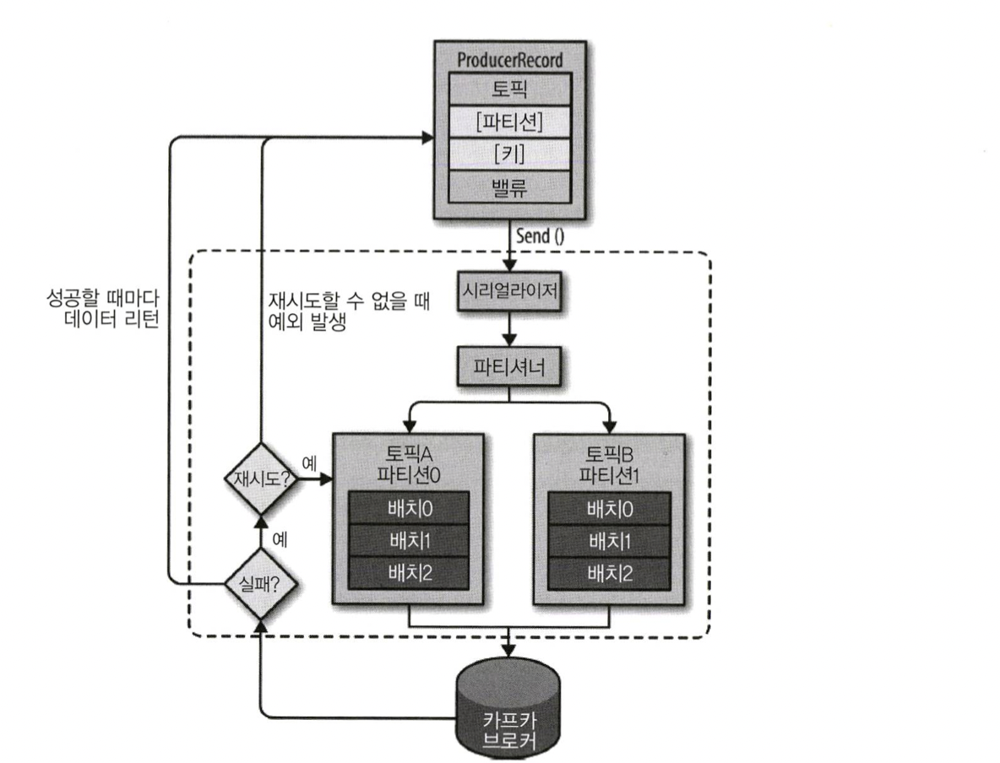

# Chapter 04 "카프카의 내부 동작 원리와 구현"

## 1. 카프카 리플리케이션

### 1.1. 리플리케이션 동작 개요 

* 리플리케이션: 각 메시지들을 여러 개로 복제해서 카프카 클러스터 내 브로커들에 분산시키는 동작
* 하나의 브로커가 종료되더라도 카프카는 안정성을 유지할 수 있다.
* 리클리케이션 팩터 수가 커지면 안정성은 높아지지만, 반대로 브로커 리소스는 많이 사용하게 되므로 최대한 효율적으로 사용해야 한다.
    * 테스트/개발 환경 : 1
    * 운영 환경의 로그성 메시지 : 2 (약간의 유실 허용)
    * 운영 환경 : 3 (유실 허용하지 않음)

### 1.2. 파티션

* 파티션: 토픽 하나를 여러 개로 나누어 병렬 처리가 가능하게 만든다.
* 파티션 수는 초기 생성 후 언제든지 늘릴 수 있지만, 반대로 한번 늘린 파티션 수는 절대로 줄일 수 없다.
* 컨슈머의 LAG = 프로듀서가 보낸 메시지 수(카프카에 남아있는 메시지 수) - 컨슈머가 가져간 메시지 수
* → LAG을 통해 지연을 확인할 수 있으므로, 초기 파티션 생성시 파티션 수를 작게 2, 4 정도로 생성한 후, LAG 모니터링 하면서 조금씩 늘려가는 방법이 좋다.
    
### 1.3. 세그먼트


* 메시지는 토픽의 파티션에 저장되고, 각 메시지들은 세그먼트라는 로그 파일의 형태로 브로커의 로컬 디스크에 저장된다.

## 2. 카프카의 핵심 개념 - 높은 처리량, 빠른 응답 속도, 안정성

* 분산 시스템
    * 높은 성능
    * 장애 대응 - 장애 발생 시 다른 서버나 노드가 대신 처리
    * 시스템 확장 - 브로커를 추가하는 방식으로 확장 가능

* 페이지 캐시
    * 직접 디스크에 읽고 쓰는 대신, 물리 메모리 중 애플리케이션이 사용하지 않는 일부 잔여 메모리를 활용한다.
    * 디스크 I/O에 대한 접근이 줄어들어 성능을 높일 수 있다.

* 배치 전송 처리
    * 통신을 묶어서 처리하여, 빠르고 효율적으로 처리할 수 있다.

* 압축 전송
    * 압축만으로도 네트워크 대역 폭이나 회선 비용 들을 줄일 수 있다.

* 토픽, 파티션, 오프셋<br>

    * 토픽과 파티션 - 카프카는 토픽이라는 곳에 데이터를 저장하고, 토픽은 병렬 처리를 위해 여러 개의 파티션이라는 단위로 다시 나뉜다.
    * 오프셋 - 파티션의 메시지가 저장되어 있는 위치. 
        * 각 파티션에서의 오프셋은 고유한 숫자이다. (순차적으로 증가하는 64비트 정수)
        * 카프카에서는 오프셋을 통해 메시지의 순서를 보장하고, 컨슈머에서는 마지막까지 읽은 위치를 알 수 있다.

* 고가용성 보장 - 리플리케이션
    * 리플리케이션은 토픽 자체를 복제하는 것이 아니라, 토픽의 파티션을 복제한다.
    * 리더 / 팔로워 (예: 리플리케이션 팩터 수가 3이면 리더 1, 팔로워 2)
        * 리더 - 프로듀서, 컨슈머로부터 오는 모든 읽기와 쓰기 요청 처리
        * 팔로워 - 리더로부터 리플리케이션
        * 팔로워의 수만큼 브로커의 디스크 공간이 소비되므로, 효율적으로 팩터 수를 사용해야 한다. 3 권장.

* 주키퍼
    * 카프카의 메타 정보를 기록하고 브로커의 노드/토픽/컨트롤러를 관리한다.

## 3. 프로듀서 - 카프카의 토픽으로 메시지를 전송

### 3.1. 프로듀서 디자인



1. ProducerRecord - 카프카로 전송하기 위한 실제 데이터 (토픽과 밸류값 필수)
1. send() 메소드를 통해 파티션으로 레코드를 전달한다.
1. send() 메소드 동작 이후 레코드들을 파티션별로 잠시 모아두고 있다가 배치 전송을 한다.

### 3.2. 프로듀서의 주요 옵션

* 필수 옵션
    * bootstrap.servers: 카프카 클러스터의 브로커 정보를 설정한다.
    * key.serializer/value.serializer: 레코드의 메시지 키/값을 직렬화하는 클래스를 지정한다.
* 선택 옵션
    * acks: 전송 성공 여부 확인
    * buffer.memory
    * retries
    * batch.size
    * linger.ms
    * partitioner.class
    * enable.impotence
    * transactional.id

### 3.3. 프로듀서 예제

#### 1) 메시지를 보내고 확인하지 않기

* send()메소드를 사용하여 메시지를 전송 후 Java Future Ojbect로 RecordMetadata를 리턴 받지만, 리턴값을 무시하므로 메시지가 성공적으로 전송되었는지 알 수 없다.

```java
/**
 * 카프카 프로듀서 프로젝트를 생성하여 레코드를 전송한다.
 */
public class ProducerFireForgot {
    public static void main(String[] args) {
        // 프로듀서 옵션들을 key/value 값으로 선언한다.
        Properties props = new Properties(); 
        // 브로커 리스트
        props.put("bootstrap.servers", "peter-kafka01.foo.bar:9092,peter-kafka02.foo.bar:9092,peter-kafka03.foo.bar:9092"); 
        // 문자열인 메시지 키, 값을 직렬화하기 위해 StringSerializer를 지정. (String 객체 전송)
        props.put("key.serializer",
                "org.apache.kafka.common.serialization.StringSerializer"); 
        props.put("value.serializer",
                "org.apache.kafka.common.serialization.StringSerializer");

        // KafkaProducer 인스턴스를 생성하여 ProducerRecord를 전송할때 사용한다.
        Producer<String, String> producer = new KafkaProducer<>(props);

        try {
            for (int i = 0; i < 10; i++) {
                // 카프카 브로커로 데이터를 보내기 위해 ProducerRecord 를 생성한다.
                ProducerRecord<String, String> record = new ProducerRecord<>("peter-basic01", "Apache Kafka is a distributed streaming platform - " + i);

                // send(): 즉각적인 전송은 아니고, record를 프로듀서 내부에 가지고 있다가 배치 형태로 묶어서 브로커에 전송한다. (배치 전송)
                // 리턴값을 무시하므로 메시지가 성공적으로 전송되었는지 알 수 없음. 
                producer.send(record); 
            }
        } catch (Exception e){
            // 카프카 브로커에게 메시지를 전송한 후의 에러는 무시하지만, 전송 전 에러가 발생하면 예외를 처리할 수 있음.
            e.printStackTrace();
        } finally {
            // 프로듀서 종료
            producer.close(); 
        }
    }
}
```

#### 2) 동기 전송

* get() 메소드를 이용해 카프카의 응답을 기다린다.
* 메시지가 성공적으로 전송되지 않으면 예외가 발생하고, 에러가 없다면 RecordMetadata를 얻는다. (파티션, 오프셋 정보)
* 신뢰성이 필요한 데이터 전송시 사용한다.

```java
public class ProducerSync {
    public static void main(String[] args) {
        ...
        try {
            for (int i = 0; i < 3; i++) {
                ProducerRecord<String, String> record = new ProducerRecord<>("peter-basic01", "Apache Kafka is a distributed streaming platform - " + i); 

                // //get() 메소드를 이용해 카프카의 응답을 기다린다.
                // 메시지가 성공적으로 전송되지 않으면 예외가 발생하고, 에러가 없다면 RecordMetadata를 얻는다.
                RecordMetadata metadata = producer.send(record).get(); 
            
                System.out.printf("Topic: %s, Partition: %d, Offset: %d, Key: %s, Received Message: %s\n", metadata.topic(), metadata.partition()
                        , metadata.offset(), record.key(), record.value());
            }
        } catch (Exception e){
            //카프카로 메시지를 보내기 전과 보내는 동안 에러가 발생하면 예외가 발생함.
            e.printStackTrace(); 
        } finally {
            producer.close();
        }
    }
}
```

#### 3) 비동기 전송

* 프로듀서에서 레코드를 보낼 때 콜백 오브젝트를 같이 보낸다.
* 빠른 전송이 가능하다.
* 메시지 전송이 실패한 경우라도 예외를 처리할 수 있다.

```java
public class ProducerAsync {
    public static void main(String[] args) {
        ...
        try {
            for (int i = 0; i < 3; i++) {
                ProducerRecord<String, String> record = new ProducerRecord<>("peter-basic01", "Apache Kafka is a distributed streaming platform - " + i); 

                // 프로듀서에서 레코드를 보낼 때 콜백 오브젝트를 같이 보낸다.
                producer.send(record, new PeterProducerCallback(record)); 
            }
        } catch (Exception e){
            e.printStackTrace();
        } finally {
            producer.close(); 
        }
    }
}
/**
 * 콜백을 사용하기 위해 org.apache.kafka.clients.producer.Callback를 구현하는 클래스가 필요하다.
 */
public class PeterProducerCallback implements Callback { 
    private ProducerRecord<String, String> record;

    public PeterProducerCallback(ProducerRecord<String, String> record) {
        this.record = record;
    }

    @Override
    public void onCompletion(RecordMetadata metadata, Exception e) {
        if (e != null) {
            //카프카가 오류를 리턴하면 onCompletion()은 예외를 갖게 된다.
            e.printStackTrace(); 
        } else {
            System.out.printf("Topic: %s, Partition: %d, Offset: %d, Key: %s, Received Message: %s\n", metadata.topic(), metadata.partition()
                    , metadata.offset(), record.key(), record.value());
        }
    }
}
```

## 4. 컨슈머 - 카프카의 토픽에 저장되어 있는 메시지 읽기

### 4.1. 컨슈머 기본 동작

* 프로듀서가 카프카의 토픽으로 메시지를 전송하면 해당 메시지들은 브로커들의 로컬 디스크에 저장된다.
* 컨슈머를 이용해 토픽에 저장된 메시지를 가져와서 처리한다.

### 4.2. 컨슈머의 주요 옵션

* 필수 옵션
    * bootstrap.servers
    * key.deserializer
    * value.deserializer
* 선택 옵션
    * group.id - subscribe() 메서드로 토픽 구독시 필수
    * auto.offset.reset - 저장된 오프셋이 없을 때 어느 오프셋부터 읽을 지 선택 (latest/earliest/none)
    * enable.auto.commit
    * auto.commit.interval.ms
    * max.poll.records
    * session.timeout.ms
    * heartbeat.interval.ms
    * max.poll.interval.ms
    * isolation.level

### 4.3. 컨슈머 예제

#### 1) 오토 커밋

* 오프셋을 주기적으로 커밋하므로 관리자가 오프셋을 따로 관리하지 않아도 된다.

```java
public class ConsumerAuto {
    public static void main(String[] args) {
        Properties props = new Properties();
        props.put("bootstrap.servers", "peter-kafka01.foo.bar:9092,peter-kafka02.foo.bar:9092,peter-kafka03.foo.bar:9092"); 
        props.put("group.id", "peter-consumer01");  // 컨슈머 그룹 아이디
        props.put("enable.auto.commit", "true");    // 오토 커밋 사용
        props.put("auto.offset.reset", "latest");   // 컨슈머 오프셋을 찾지 못하는 경우 latest로 초기화. 가장 최근부터 메시지를 가져옴.
        props.put("key.deserializer", "org.apache.kafka.common.serialization.StringDeserializer"); 
        props.put("value.deserializer", "org.apache.kafka.common.serialization.StringDeserializer");

        // KafkaConsumer 인스턴스를 생성하여 데이터를 가져온다.
        KafkaConsumer<String, String> consumer = new KafkaConsumer<>(props); 

        // 컨슈머에게 토픽을 할당한다. 구독할 토픽 지정.
        consumer.subscribe(Arrays.asList("peter-basic01")); 

        try {
            while (true) { //무한 루프 시작. 메시지를 가져오기 위해 카프카에 지속적으로 poll()을 함.
                // 컨슈머는 폴링하는 것을 계속 유지하며, 타임 아웃 주기를 설정. 해당 시간만큼 블럭
                ConsumerRecords<String, String> records = consumer.poll(1000); 

                // poll()은 레코드 전체를 리턴하고, 하나의 메시지만 가져오는 것이 아니므로 반복문 처리한다.
                for (ConsumerRecord<String, String> record : records) { 
                    System.out.printf("Topic: %s, Partition: %s, Offset: %d, Key: %s, Value: %s\n",
                            record.topic(), record.partition(), record.offset(), record.key(), record.value());
                }
            }
        } catch (Exception e){
            e.printStackTrace();
        } finally {
            // 컨슈머 종료
            consumer.close(); 
        }
    }
}
```

#### 2) 동기 가져오기

* commitSync()
* poll()을 이용해 메시지를 가져온 후, 처리까지 완료하고 현재의 오프셋을 커밋한다.
* 속도는 느리지만 메시지 손실은 거의 발생하지 않으므로, 메시지가 손실되면 안 되는 중요한 처리 작업에 권장한다.

```java
public class ConsumerSync {
    public static void main(String[] args) {
        ...
        try {
            while (true) {
                ConsumerRecords<String, String> records = consumer.poll(1000); 
                for (ConsumerRecord<String, String> record : records) { 
                    System.out.printf("Topic: %s, Partition: %s, Offset: %d, Key: %s, Value: %s\n",
                            record.topic(), record.partition(), record.offset(), record.key(), record.value());
                }

                // 현재 배치를 통해 읽은 모든 메시지들을 처리한 후, 추가 메시지를 폴링하기 전 현재의 오프셋을 동기 커밋한다.
                consumer.commitSync();
            }
        } catch (Exception e){
            e.printStackTrace();
        } finally {
            consumer.close(); 
        }
    }
}
```

#### 3) 비동기 가져오기

* commitAsync() - commitSync()와 달리 오프셋 커밋을 실패하더라도 재시도하지 않는다.
* 비동기 커밋이 계속 실패하더라도 마지막의 비동기 커밋만 성공한다면 안정적으로 오프셋을 커밋하게 되어, 메시지를 중복으로 읽어오지 않도록 한다.

```java
public class ConsumerAsync {
    public static void main(String[] args) {
        ...
        try {
            while (true) { 
                ConsumerRecords<String, String> records = consumer.poll(1000); 
                for (ConsumerRecord<String, String> record : records) { 
                    System.out.printf("Topic: %s, Partition: %s, Offset: %d, Key: %s, Value: %s\n",
                            record.topic(), record.partition(), record.offset(), record.key(), record.value());
                }

                // 현재 배치를 통해 읽은 모든 메시지들을 처리한 후, 추가 메시지를 폴링하기 전 현재의 오프셋을 비동기 커밋한다.
                consumer.commitAsync(); 
            }
        } catch (Exception e){
            e.printStackTrace();
        } finally {
            consumer.close(); 
        }
    }
}
```

### 4.4. 컨슈머 그룹

* 컨슈머들은 컨슈머 그룹 안에 속해 있다.
