# Chapter 05 "프로듀서의 내부 동작 원리와 구현"

## 1. 파티셔너

* 프로듀서는 토픽으로 메시지를 보낼 때, 파티셔너를 통해 해당 토픽의 어느 파티션으로 메시지를 보내야 할지를 결정한다.
* 파티션을 결정 알고리즘 - 메시지(레코드)의 키를 해시 처리하여 파티션을 구한다.
    * 메시지의 키 값이 동일하면 해당 메시지들은 모두 같은 파티션으로 전송된다.
    * 파티션 수를 늘리면 메시지 키와 매핑된 해시 테이블도 변경되므로, 프로듀서가 동일한 메시지의 키를 이용해 메시지를 전송하더라도 다른 파티션으로 전송될 수 있다.
    * 따라서, 메시지의 키를 이용해 카프카로 메시지를 전송하는 경우, 되도록 파티션 수를 변경하지 않는 것이 좋다.

### 1.1. 라운드 로빈 전략

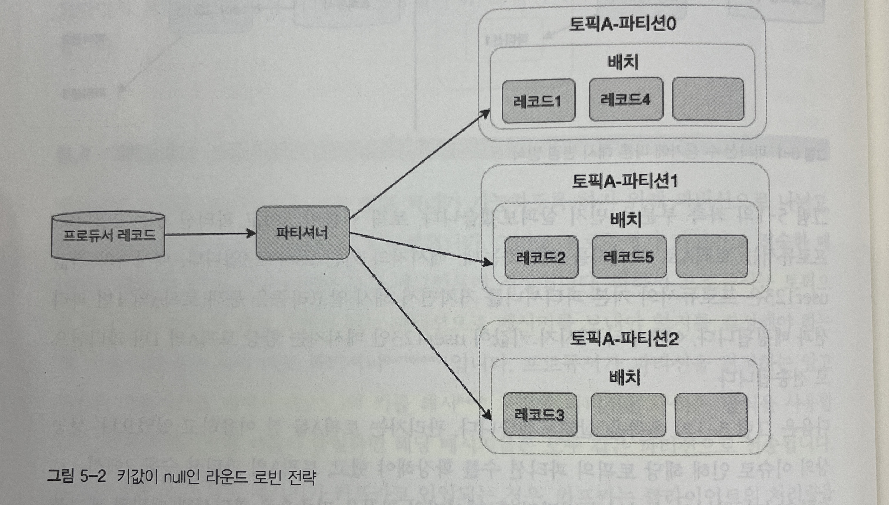

* 레코드의 키값을 지정하지 않고 메시지를 전송할 때에는 (키 값이 null) 라운드 로빈 알고리즘을 사용하여 파티션에 랜덤 전송한다.
* 파티셔너를 거친 후의 레코드들은 배치 처리를 위해 프로듀서의 버퍼 메모리 영역에서 잠시 대시간 후 카프카로 전송 된다.
* 이 때, 배치 전송을 위한 최소 레코드 수를 충족시킨 후에 전송 되므로 비효율적이다.

### 1.2. 스티키 파티셔닝 전략

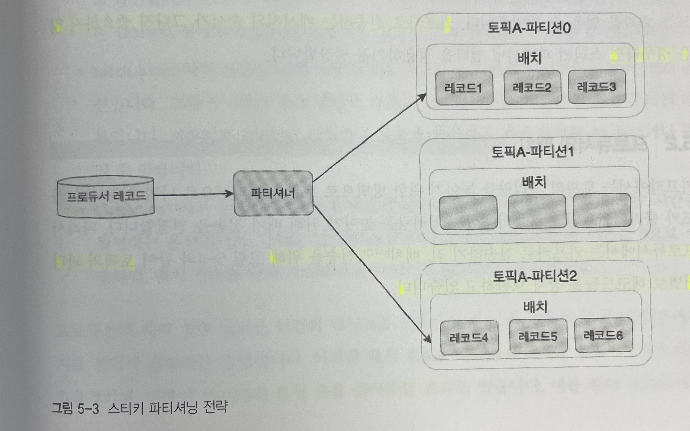

* 하나의 파티션에 레코드 수를 먼저 채워서 카프카로 빠르게 배치 전송한다.
* 라운드 로빈 방식의 비효율적인 전송을 개선하기 위한 전략이다. (지연시간 약 30% 감소)
* 카프카로 전송하는 메시지의 순서가 그다지 중요하지 않은 경우에 권장한다.

## 2. 프로듀서의 배치

* 프로듀서는 처리량을 높이기 위해, 토픽의 파티션별로 레코드들을 잠시 보관한 후에 한번에 다량의 메시지를 묶어서 카프카로 전송한다.
* 프로듀서의 배치 구성도<br>
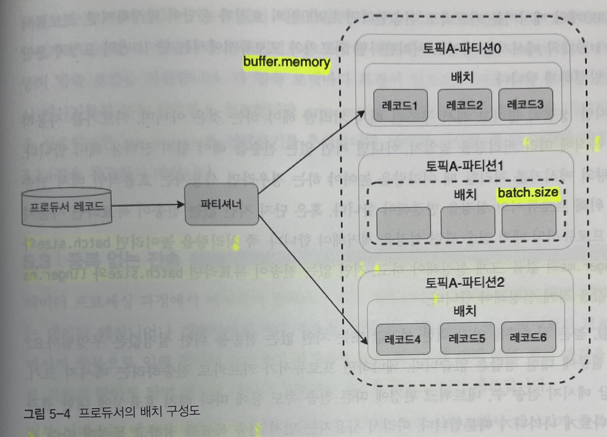
    * buffer.memory - 카프카로 메시지들을 전송하기 위해 담아두는 프로듀서의 버퍼 메모리
    * batch.size - 배치 전송을 위해 메시지들을 묶는 단위 설정
    * linger.ms - 배치 전송을 위해 버퍼 메모리에서 대기하는 메시지들의 최대 대기 시간 설정
* 장점
    * 불필요한 I/O 감소
    * 카프카의 요청 수 감소
* 그러나, 전송 목표를 정하고 목적에 따라 프로듀서의 옵션값을 조금씩 조정해가면서 최적의 값을 찾아가야 한다.
    * 처리량을 높이려면 batch.size와 linger.ms 의 값을 크게 절정해야 한다.
    * 지연이 없는 전송이 목표라면 batch.size와 linger.ms 의 값을 작게 설정해야 한다.
* 압축 기능 지원
    * gzip, zstd - 높은 압축률
    * lz4, snappy - 낮은 지연 시간

## 3. 중복 없는 전송

* 카프카는 `중복 없는 전송` 기능을 지원한다. (멱등성 전송)
    * 멱등성: 동일한 작업을 여러 번 수행하더라도 결과가 달라지지 않는다.
    * 메시지가 중복되지 않고 처리된다면, 데이터 프로세싱 과정에서 따로 중복 처리 과정을 거치지 않아도 되고, 별도로 데이터 정합성 체크를 할 필요도 없다.

### 1) 전송 방식 비교 - 적어도 한 번 전송
 
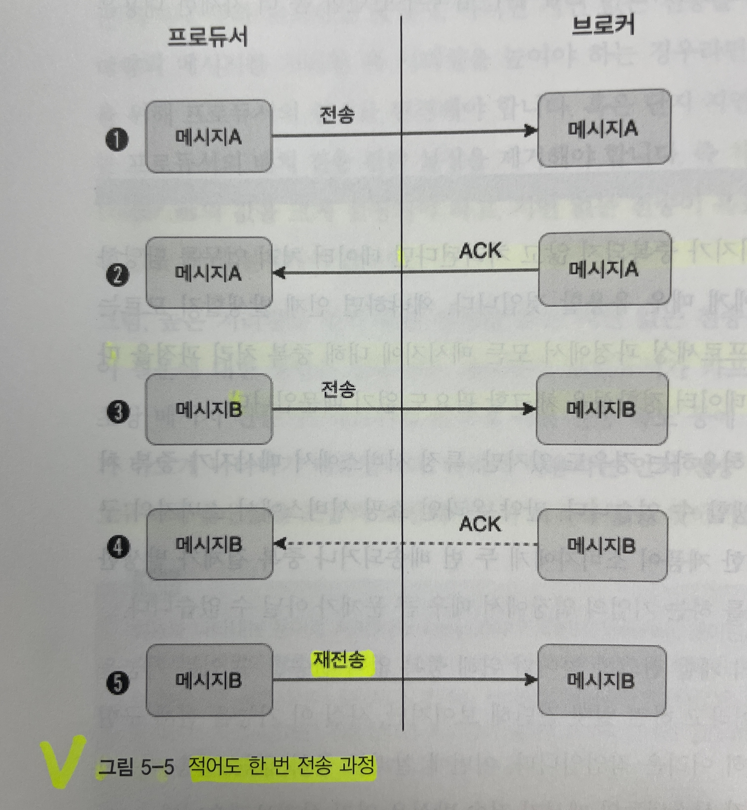

* 일부 메시지 중복이 발생할 수는 있지만, 최소한 하나의 메시지는 반드시 보장한다.

### 2) 전송 방식 비교 - 최대 한 번 전송
 
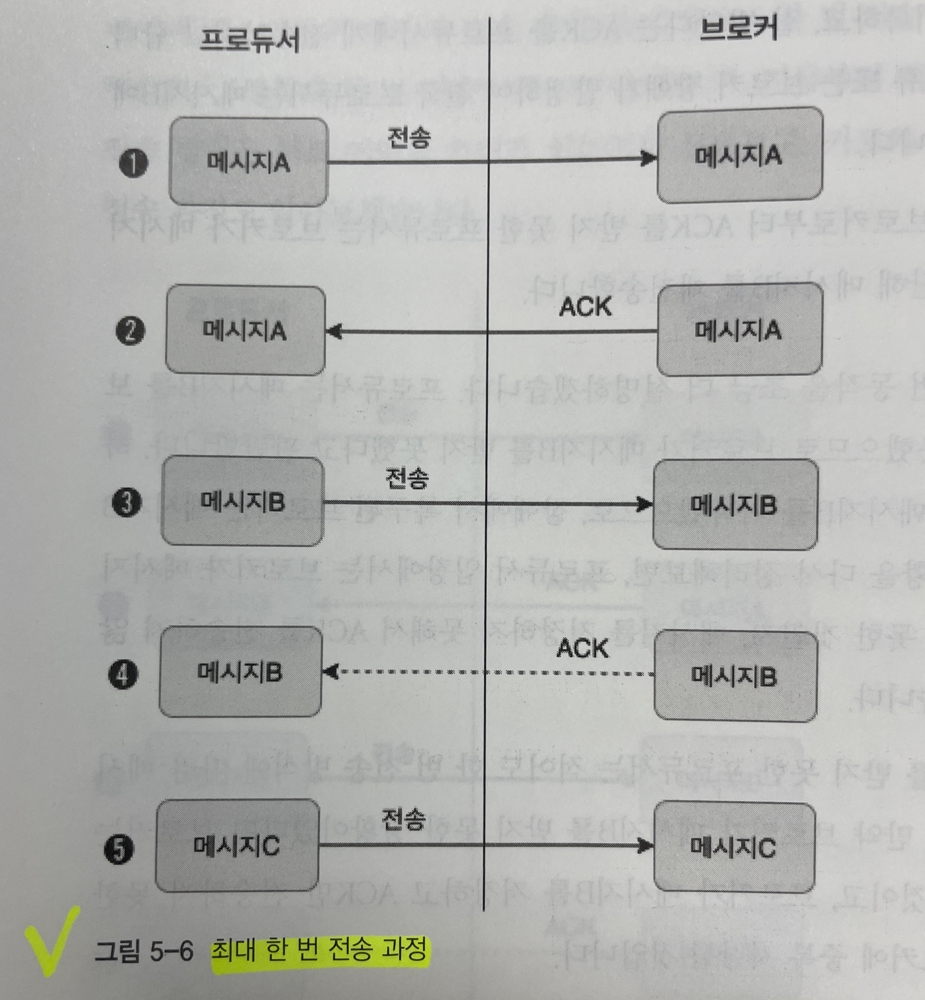

* ACK 을 받지 못하더라도 재전송을 하지 않는다.
* 일부 메시지의 손실을 감안하더라도 중복 전송은 하지 않는다.
* 높은 처리량을 필요로 하는 대량의 로그 수집이나 IoT 같은 환경에서 사용한다.

### 3) 전송 방식 비교 - 중복 없는 전송

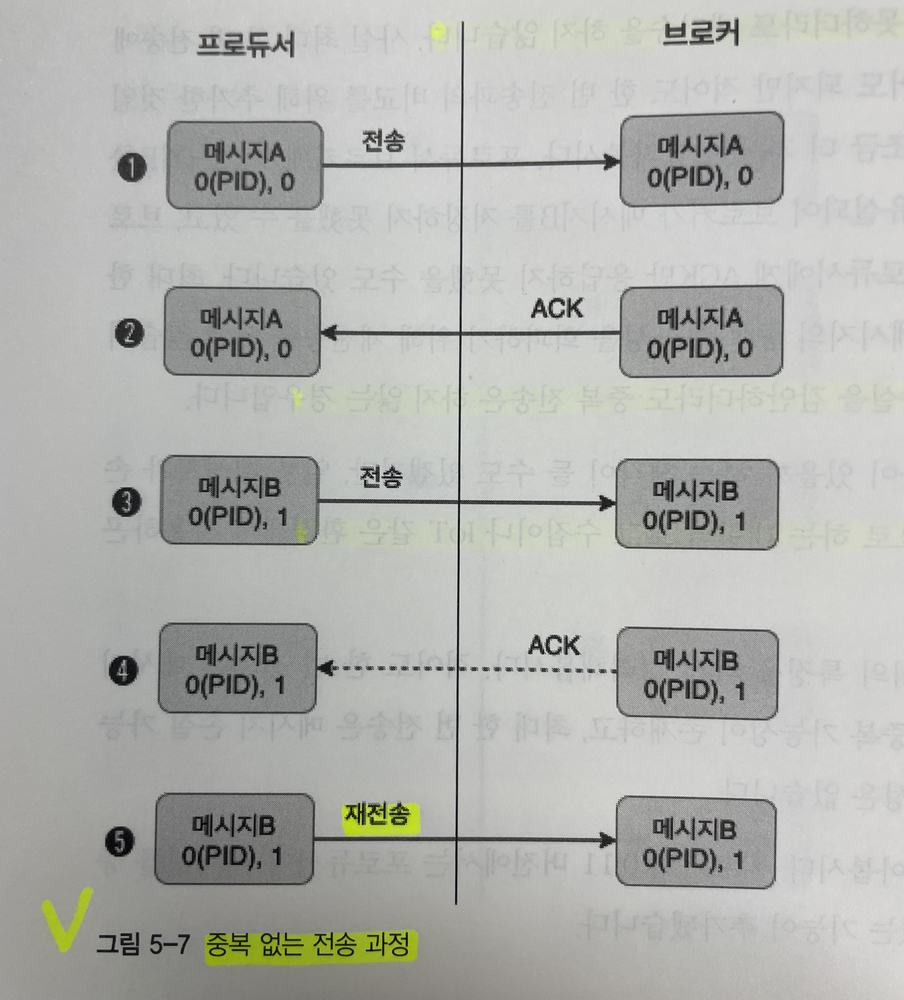

* `Producer ID`와 `메시지 번호`를 헤더에 포함해 함께 전송한다.
    * 브로커에서는 각 메시지마다 PID 값과 메시지의 시퀀스 번호를 메모리에 유지하여, 메시지 중복 여부를 확인한다.
    * PID는 사용자가 별도로 생성하는 것이 아니라, 프로듀서에 의해 자동 생성된다. 
    * PID와 시퀀스 번호는 브로커의 메모리에 유지되고, 리플리케이션 로그에도 저장된다.<br>
    → 장애 등으로 리더가 변경되는 일이 발생하더라도 새로운 리더가 PID와 시퀀스 번호를 알 수 있으므로 중복 없는 메시지 전송이 가능하다.
* 프로듀서가 재전송한 메시지B의 헤더에서 PID과 메시지번호를 비교해서 이미 브로커에 저장되어 있는 것을 확인하면, 브로커는 메시지를 중복 저장하지 않고  ACK만 보낸다.
* 중복을 피하기 위한 메시지 비교 동작에는 오버헤드가 존재할 수 밖에 없으므로, 전송 성능에 그다지 민감하지 않는 상황에서 사용한다. (성능 감소 약 20%)
* 중복 없는 전송을 위한 프로듀서 설정
    * enable.idempotence
    * max.in.flight.requests.per.connection
    * acks
    * retries

## 4. 정확히 한 번 전송

* 카프카의 `정확히 한 번 전송` 은 트랜잭션과 같은 전체 프로세스 처리를 의미한다.
    * '중복 없는 전송'은 '정확히 한 번 전송'의 일부 기능이다.
    * 메시지를 정확히 한 번 처리해야 하는 사례 - 은행의 출금/입금
* 트랜잭션 API - 카프카에서는 정확히 한 번 처리를 담당하는 별도의 프로세스가 존재한다.

### 4.1. 구현을 위한 디자인과 개념

* 프로듀서가 카프카로 정확히 한 번 방식으로 메시지를 전송할 떄, 프로듀서가 보내는 메시지들은 원자적으로 처리되어 전송에 성공/실패한다.
* 카프카 서버의 `트랜잭션 코디네이터`를 프로듀서에 의해 전송된 메시지를 관리하며, 커밋 또는 중단 등을 표시한다.
* 트랜잭션 로그는 카프카의 내부 토픽인 `__transaction_state`에 저장한다. (카프카의 내부 토픽)
    * 프로듀서가 해당 토픽에 트랜잭션 로그를 직접 기록하는 것이 아니다.
    * 프로듀서는 트랜잭션 관련 정보를 트랜잭션 코디네이터에게 알리고, 모든 정보의 로그는 트랜잭션 코디네이터가 직젖ㅂ 기록하낟.
* `컨트롤 메시지`를 통해, 카프카의 메시지들을 다루는 클라이언트들이 해당 메시지가 정상적으로 커밋된 것인지/실패한 것인지를 식별한다.
    * 컨트롤 메시지는 페이로드에 메시지 밸류를 포함하지 않으며, 애플리케이션들에게 노출되지 않는다.
    * 오직 클라이언트 통신에서만 사용된다.

### 3.2. 프로듀서 예제 코드

* TRANSACTIONAL_ID_CONFIG 옵션은 실행하는 프로듀서 프로세스마다 고유한 아이디로 설정해야 한다.

```java
public class ExactlyOnceProducer {
    public static void main(String[] args) {
        String bootstrapServers = "peter-kafka01.foo.bar:9092";
        Properties props = new Properties();
        props.setProperty(ProducerConfig.BOOTSTRAP_SERVERS_CONFIG, bootstrapServers);
        props.setProperty(ProducerConfig.KEY_SERIALIZER_CLASS_CONFIG, StringSerializer.class.getName());
        props.setProperty(ProducerConfig.VALUE_SERIALIZER_CLASS_CONFIG, StringSerializer.class.getName());
        // 정확히 한 번 전송을 위한 설정
        props.setProperty(ProducerConfig.ENABLE_IDEMPOTENCE_CONFIG, "true");
        props.setProperty(ProducerConfig.ACKS_CONFIG, "all"); 
        props.setProperty(ProducerConfig.MAX_IN_FLIGHT_REQUESTS_PER_CONNECTION, "5"); 
        props.setProperty(ProducerConfig.RETRIES_CONFIG, "5"); 
        props.setProperty(ProducerConfig.TRANSACTIONAL_ID_CONFIG, "peter-transaction-01"); 

        Producer<String, String> producer = new KafkaProducer<>(props);

        producer.initTransactions(); // 프로듀서 트랜잭션 초기화
        producer.beginTransaction(); // 프로듀서 트랜잭션 시작
        try {
            for (int i = 0; i < 1; i++) {
                ProducerRecord<String, String> record = new ProducerRecord<>("peter-test05", "Apache Kafka is a distributed streaming platform - " + i);
                producer.send(record);
                producer.flush();
                System.out.println("Message sent successfully");
            }
        } catch (Exception e){
            producer.abortTransaction(); // 프로듀서 트랜잭션 중단
            e.printStackTrace();
        } finally {
            producer.commitTransaction(); // 프로듀서 트랜잭션 커밋
            producer.close();
        }
    }
}
```

### 3.3. 단계별 동작

#### 1) 트랜잭션 코디네이터 찾기

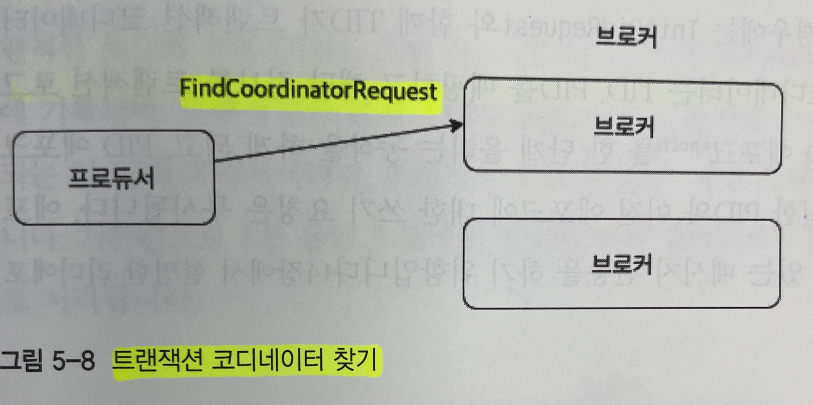

* `트랜잭션 코디네이터` - 브로커에 위치하며, PID와 transactional.id를 매핑하고 해당 트랜잭션 전체를 관리한다.
* 정확히 한 번 전송을 위해서는 트랜잭션 API를 이용해야 하므로, 가장 먼저 트랜잭션 코디네이터를 찾아야 한다.
* 프로듀서는 브로커에게 FindCoordinatorRequest를 보내서 트랜잭션 코디네이터의 위치를 찾는다.

#### 2) 프로듀서 초기화

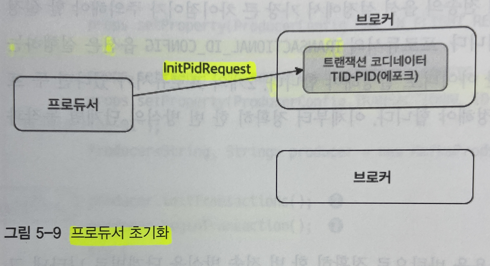

* 프로듀서는 initTransactions() 메소드를 이용해 트랜잭션 전송을 위한 InitPidRequest를 트랜잭션 코디네이터로 보낸다. 
* 트랜잭션 코디네이터는 TID, PID를 매핑하고 해당 정보를 트랜잭션 로그에 기록한다.
* 이후 PID 에포크를 한 단계 올리고, PID 에포크가 올라감에 따라 이전의 동일한 PID와 이전 에포크에 대한 쓰기 요청은 무시된다. (신뢰성 있는 메시지 전송을 하기 위해서)

#### 3) 트랜잭션 시작

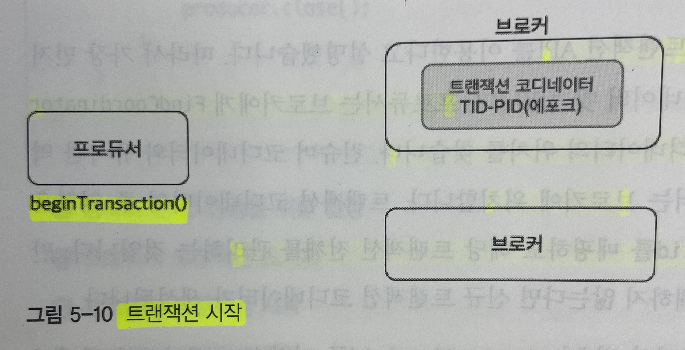

* 프로듀서는 beginTransaction() 메소드를 이용해 새로운 트랜잭션의 시작을 알린다.
* 프로듀서는 내부적으로 트랜잭션이 시작됐음을 기록하지만, 트랜잭션 코디네이터 관점에서는 첫 번째 레코드가 전송될 때까지 트랜잭션이 시작된 것은 아닌 상황이다.

#### 4) 트랜잭션 상태 추가

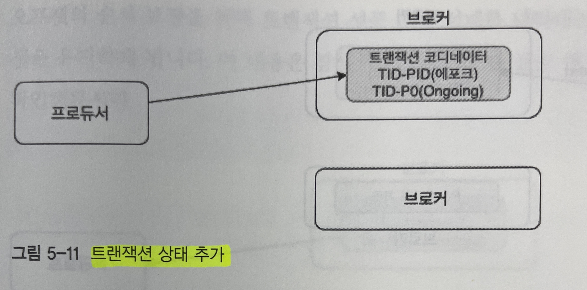

* 트랜잭션 코디네이터는 전체 트랜잭션을 관리하고, 각 트랜잭션 상태를 기록한다.
* 프로듀서는 토픽 파티션 정보를 트랜잭션 코디네이터에게 전달하고, 트랜잭션 코디네이터는 해당 정보를 트랜잭션 로그에 기록한다.
* TID와 P0의 정보가 트랜잭션 로그에 기록되며, 트랜잭션의 현재 상태를 Ongoing으로 표시한다.
* 특정 시간 내에 트랜잭션 상태에 대한 업데이트가 없다면, 해당 트랜잭션은 실패로 처리된다.

#### 5) 메시지 전송

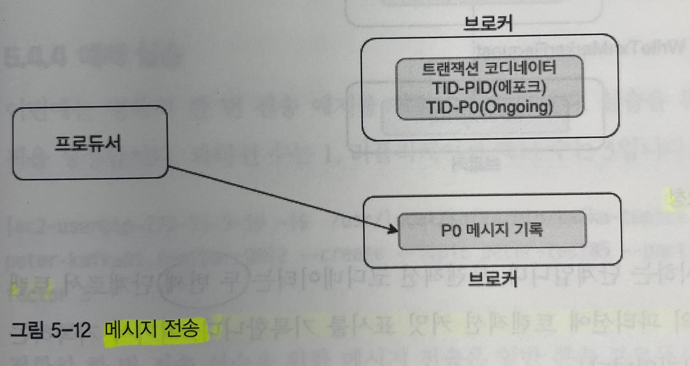

* 프로듀서는 대상 토픽의 파티션으로 메시지를 전송한다.
* 해당 메시지에는 PID, 에포크, 시퀀스 번호가 함께 포함되어 전송된다.

#### 6) 트랜잭션 종료 요청

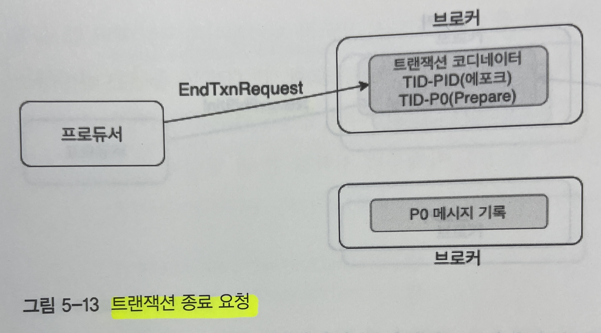

* 메시지 전송을 완료한 프로듀서는 commitTransaction() 메소드 또는 abortTransaction() 메소드 중 하나를 반드시 호출하여, 트랜잭션이 완료된 것을 트랜잭션 코디네이터에게 알린다.
* 트랜잭션 코디네이터는 2 단계의 커밋 과정을 진행한다.
    1. 트랜잭션 로그에 해당 트랜잭션에 대한 PrepareCommit 또는 PrepareAbort를 기록한다.
    1. 사용자 토픽의 파티션에 트랜잭션 커밋 표시를 기록한다. (여기서 기록하는 메시지가 컨트롤 메시지이다.)<br>
    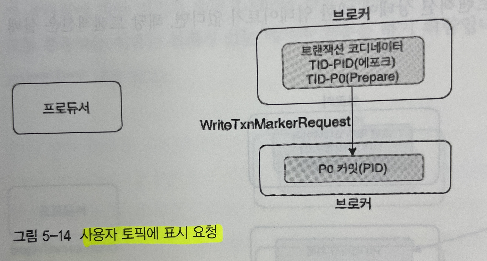

#### 7) 트랜잭션 완료

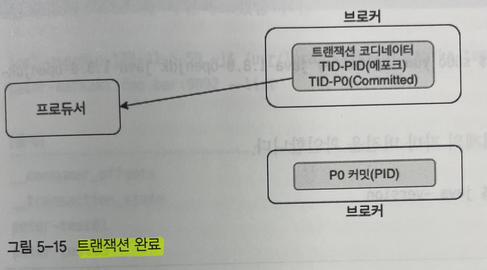

* 트랜잭션 코디네이터는 Committed 라고 트랜잭션 로그에 기록한다.
* 프로듀서에게 해당 트랜잭션이 완료됨을 알린 다음 해당 트랜잭션에 대한 처리는 모두 마무리된다.
* 트랜잭션을 이용하는 컨슈머는 read_committed 설정을 하면 트랜잭션에 성공한 메시지들만 읽을 수 있다.


