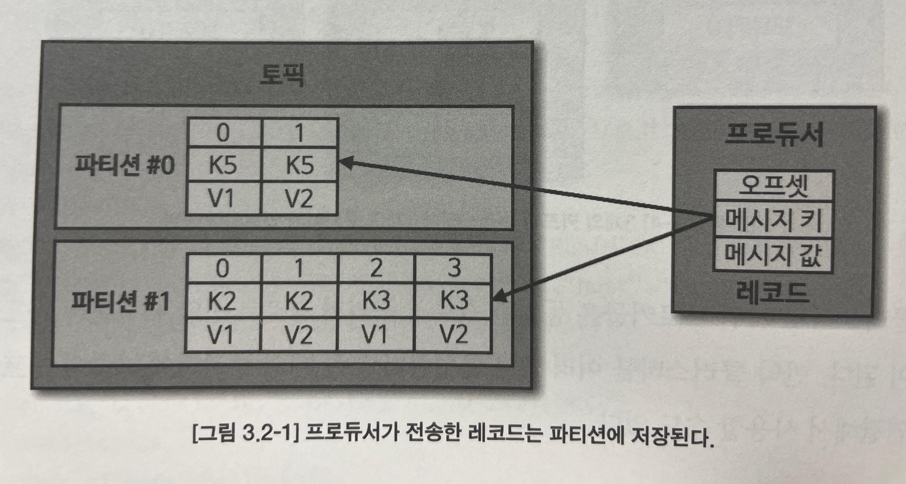
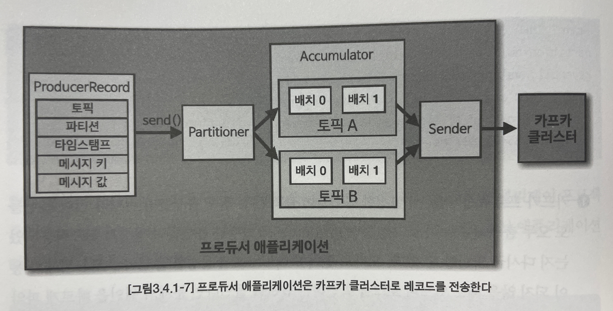

# Chapter 03 "카프카 기본 개념 설명"

## 1. 카프카 브로커, 클러스터, 주키퍼


### 1) 카프카 브로커의 역할

* 데이터 저장, 전송
    * 카프카 브로커는 프로듀서가 요청한 토픽의 파티션에 데이터를 저장하고, 컨슈머가 데이터를 요청하면 파티션에 저장된 데이터를 전달한다.
    * 데이터는 파일 시스템에 저장되는데, 파티션 갯수만큼, 카프카 토픽 이름 별로 디렉토리가 생성된다.
    * 카프카는 페이지 캐시를 사용하여 디스트 입출력 속도를 높여서 빠르게 동작한다.
        * 한번 읽은 파일의 내용은 메모리의 페이지 캐시 영역에 저장시킨 후, 추후 동일한 파일의 접근이 일어나면 디스크에서 읽지 않고 메모리에서 직접 읽는 방식이다.
        * 이 이유로 힙 메모리 사이즈를 크게 설정할 필요가 없다.

```bash
$ ls /tmp/kafka-logs
```

* 데이터 복제, 싱크
    * 복제(replication): 클러스터로 묶인 브로커 중 일부에 장애가 발생하더라도 데이터를 유실하지 않고 안전하게 사용할 수 있다.
    * 카프카의 데이터 복제는 파티션 단위로 이루어진다.
    * 리더: 프로듀서 또는 컨슈머와 직접 통신 / 팔로워 파티션: 나머지 복제 데이터를 가지고 있음.
* 컨트롤러(Controller)
    * 클러스터의 다수 브로커 중 한 대가 컨트롤러의 역할을 한다.
    * 컨트롤러: 다른 브로커들의 상태를 체크하고, 브로커가 클러스터에서 빠지는 경우 해당 브로커에 존재하는 리더 파티션을 재분배한다.
* 데이터 삭제
    * 컨슈머가 데이터를 가져가더라도 토픽의 데이터는 삭제되지 않고, 오직 브로커만 데이터를 삭제할 수 있다.
    * 데이터 삭제는 파일 단위로 이루어지고 (로그 세그먼트) 특정 데이터를 선별해서 삭제할 수 없다.
* 컨슈머 오프셋 저장
    * 컨슈머 그룹은 토픽이 특정 파티션으로부터 데이터를 가져가서 처리하고 이 파티션의 어느 레코드까지 가져갔는지 확인하기 위해 오프셋을 커밋한다.
* 코디네이터(Coordinator)
    * 클러스터의 다수 브로커 중 한 대는 코디네이터의 역할을 수행한다.
    * 코디네이터: 컨슈머 그룹의 상태를 체크하고 파티션을 컨슈머와 매칭되도록 분배하는 역할을 한다. (리밸런스)

### 2) 주키퍼의 역할

* 주키퍼: 카프카의 메타데이터를 관리한다.
* 카프카 서버에서 실행되는 주키퍼에 직접 연결하여 쉘 명령어를 실행해해보자.
* ZooKeeper 쉘을 통해 znode를 조회하고 수정할 수 있다.
* znode: ZooKeeper가 제공해주는 파일시스템에 저장되는 파일 단위이다.

```bash
$ bin/zookeeper-shell.sh my-kafka:2181

$ ls /                  # root znode의 하위 znode 출력
$ get /brokers/ids/0    # 카프카 브로커에 대한 정보 확인
$ get /controller       # 어떤 브로커가 컨트롤러 인지 확인
$ ls /brokers/topics    # 카프카에 저장된 토픽들 확인
```

## 2. 토픽과 파티션



* 토픽: 카프카에서 데이터를 구분하기 위해 사용하는 단위
* 레코드: 프로듀서가 보낸 데이터
* 파티션: 그룹으로 묶인 컨슈머들이 레코드를 병렬로 처리할 수 있도록 매칭된다.
    * FIFO
    * 데이터가 삭제되지 않으므로, 여러 컨슈머 그룹들이 토픽의 데이터를 여러 번 가져갈 수 있다.
* 의미 있는 토픽 이름 작명
    * 명확하게 작성하여 유지 보수를 원활하게 한다.
    * 규칙을 정의한다. 
    * 카프카는 토픽 이름 변경을 지원하지 않는다. (삭제 후 다시 생성)
    * 예) prd.marketing-team.sms-platform.json

## 3. 레코드

* 프로듀서가 생성한 레코드가 브로커로 전송되면 오프셋과 타임스탬프가 지정되어 저장된다.
* 브로커에 한번 적재된 레코드는 수정할 수 없고 로그 리텐션 기간 또는 용량에 따라서만 삭제된다.
* 메시지 키 - 메시지 키의 해시값을 토대로 파티션을 지정하게 된다. 다만, 파티션 개수가 변경 되면 매칭이 달라진다.
* 메시지 값 - 실질적으로 처리할 데이터가 들어있다.
    * 직렬화, 역직렬화가 필요하고 이 때 반드시 동일한 형태로 처리해야 한다.
* 오프셋 - 직접 지정할 수 없고 +1 값으로 자동 생성된다.

## 4. 카프카 클라이언트

* 카프카 클라이언트를 라이브러리로 추가하여 자바 기본 애플리케이션을 만들어 보자.

### 4.1. 프로듀서 API

#### 1) 카프카 프로듀서 프로젝트 생성

* 자바 애플리케이션

```java
/**
 * 카프카 프로듀서 프로젝트를 생성하여 레코드를 전송한다.
 */
public class SimpleProducerTests {

    private final static Logger logger = LoggerFactory.getLogger(SimpleProducerTests.class);
    private final static String TOPIC_NAME = "test";                    // 프로듀서가 전송할 토픽 이름
    private final static String BOOTSTRAP_SERVERS = "my-kafka:9092";    // 서버의 host, IP 접속 정보

    public static void main(String[] args) {

        // 프로듀서 옵션들을 key/value 값으로 선언한다.
        Properties configs = new Properties();
        configs.put(ProducerConfig.BOOTSTRAP_SERVERS_CONFIG, BOOTSTRAP_SERVERS);
        configs.put(ProducerConfig.KEY_SERIALIZER_CLASS_CONFIG, StringSerializer.class.getName());      // 메시지 키, 값을 직렬화하기 위한 직렬화 클래스 (String 객체 전송)
        configs.put(ProducerConfig.VALUE_SERIALIZER_CLASS_CONFIG, StringSerializer.class.getName());

        // KafkaProducer 인스턴스를 생성하여 ProducerRecord를 전송할때 사용한다.
        KafkaProducer<String, String> producer = new KafkaProducer<>(configs);

        String messageValue = "testMessage";

        // 카프카 브로커로 데이터를 보내기 위해 ProducerRecord 를 생성한다.
        ProducerRecord<String, String> record = new ProducerRecord<>(TOPIC_NAME, messageValue); // 메시지 키, 값의 타입은 직렬화 클래스와 동일하게 설정해야 한다.

        // send(): 즉각적인 전송은 아니고, record를 프로듀서 내부에 가지고 있다가 배치 형태로 묶어서 브로커에 전송한다. (배치 전송)
        producer.send(record);
        logger.info("{}", record);

        // 배치 전송을 테스트 하기 위하여 record 한개 더 생성
        ProducerRecord<String, String> record2 = new ProducerRecord<>(TOPIC_NAME, "testMessage2");
        producer.send(record2);

        // flush(): 프로듀서 내부 버퍼에 가지고 있던 레코드 배치를 브로커로 전송한다.
        producer.flush();

        // producer 인스턴스의 리소스 종료
        producer.close();
    }
}
```

* 카프카 프로듀서 애플리케이션을 실행하기 전, 로컬에 전송될 토픽을 생성하자.

```bash
	$ bin/kafka-topics.sh \
	--create \
	--bootstrap-server my-kafka:9092 \
	--topic test
```

```bash
    $ bin/kafka-console-consumer.sh --bootstrap-server my-kafka:9092 \
	--topic test \
	--property print.key=true \
	--property key.separator=":" \
	--from-beginning 
    $ bin/kafka-console-consumer.sh --bootstrap-server my-kafka:9092 --topic test --property print.key=true --property key.separator=":" --from-beginning
```

#### 2) 프로듀서 중요 개념



* 프로듀서는 카프카 브로커로 데이터를 전송할 때 내부적으로 파티셔너, 배치 생성 단계를 거친다.
* KafkaProducer 인스턴스가 send() 메서드를 호출하면 ProducerRecord는 파티셔너에서 토픽의 어느 파티션으로 전송될 것인지 정해진다.
* 파티셔너에 의해 구분된 레코드는 데이터를 전송하기 전에 Accumulator에 데이터를 버퍼로 쌓아놓고 발송한다.
* Sender thread는 버퍼로 쌒인 데이터를 배치로 묶어서 전송하여, 카프카의 프로듀서 처리량을 향상시키는데 도움을 준다.

#### 3) 프로듀서 주요 옵션

* 필수 옵션
    * bootstrap.servers: 카프카 클러스터의 브로커 정보를 설정한다.
    * key.serializer/value.serializer: 레코드의 메시지 키/값을 직렬화하는 클래스를 지정한다.
* 선택 옵션
    * acks: 전송 성공 여부 확인
    * buffer.memory
    * retries
    * batch.size
    * linger.ms
    * partitioner.class
    * enable.impotence
    * transactional.id

#### 4) 메시지 키를 가진 데이터를 전송하는 프로듀서

```java
ProducerRecord<String, String> record = new ProducerRecord<>(TOPIC_NAME, "Pangyo", "Pangyo");
```

#### 5) 커스텀 파티셔너를 가지는 프로듀서

* 특정 데이터를 가지는 레코드를 특정 파티션으로 보내야 할 때가 있다.

```java
public class CustomPartitioner implements Partitioner {

    // 레코드를 기반으로 파티션을 정하여, 주어진 레코드가 들어갈 파티션 번호를 return 한다.
    @Override
    public int partition(String topic, Object key, byte[] keyBytes, Object value, byte[] valueBytes, Cluster cluster) {

        // 메시지 키를 가지고 있지 않은 경우 Exception을 발생시킨다.
        if (keyBytes == null) {
            throw new InvalidRecordException("Need message key");
        }
        // 메시지 키가 Pangyo 일 때에는 파티션을 0번으로 지정한다.
        if (((String)key).equals("Pangyo"))
            return 0;

        // 그 외의 키를 가진 레코드는 해시값을 지정하여 특정 파티션에 매칭되도록 설정한다.
        List<PartitionInfo> partitions = cluster.partitionsForTopic(topic);
        int numPartitions = partitions.size();
        return Utils.toPositive(Utils.murmur2(keyBytes)) % numPartitions;
    }


    @Override
    public void configure(Map<String, ?> configs) {}

    @Override
    public void close() {}
}
```

```java
        Properties configs = new Properties();
        ...
        configs.put(ProducerConfig.PARTITIONER_CLASS_CONFIG, CustomPartitioner.class);  // 커스텀 파티션

        KafkaProducer<String, String> producer = new KafkaProducer<>(configs);
        ProducerRecord<String, String> record = new ProducerRecord<>(TOPIC_NAME, "Pangyo", "Pangyo");
```

#### 6) 브로커 정상 전송 여부를 확인하는 프로듀서

* KafkaProducer의 send()메서드는 Future 객체를 반환하는데, 이 객체는 ProducerRecord가 카프카 브로커에 정상적으로 적재되었는지에 대한 데이터가 포함되어 있다.
* `토픽이름-파티션번호@오프셋번호`가 출력된다.
* 동기 - get()
    * 기다렸다가 응답이 오면 RecordMetadata 인스턴스를 반환한다.

```java
// get() 메서드를 사용하여 프로듀서로 전송한 데이터의 결과를 동기적으로 가져올 수 있다.
RecordMetadata metadata = producer.send(record).get();
logger.info("RecordMetadata Sync Result === " + metadata.toString()); 
// {토픽이름-파티션번호@오프셋번호} (예: test-0@6)
```

* 비동기 - Callback 클래스를 작성하여 send()에 함께 사용한다.
    * 더 빠른 속도로 데이터를 추가 처리할 수 있지만, 전송하는 데이터의 순서가 중요한 경우 사용하면 안된다.

```java
/**
 * 비동기로 결과를 확인할 수 있도록 Callback 인터페이스를 제공한다.
 * -> 사용자 정의 Callback 클래스를 생성하자.
 */
public class ProducerCallback implements Callback {
    private final static Logger logger = LoggerFactory.getLogger(ProducerCallback.class);

    // 레코드의 비동기 결과를 받아온다.
    @Override
    public void onCompletion(RecordMetadata recordMetadata, Exception e) {
        if (e != null)
            logger.error(e.getMessage(), e);
        else
            logger.info("RecordMetadata Sync Result === " + recordMetadata.toString());
    }
}
```

```java
// send() 메서드 호출 시 Callback 클래스를 넣어준다.
producer.send(record, new ProducerCallback());
```

### 4.2. 컨슈머 API

* 프로듀서가 전송한 데이터는 카프카 브로커에 적재된다.
* 컨슈머는 적재된 데이터를 사용하기 위해 브로커부터 데이터를 가져와서 필요한 처리를 한다.

#### 1) 카프카 컨슈머 프로젝트 생성

```java
public class SimpleConsumerTests {
    private final static Logger logger = LoggerFactory.getLogger(SimpleConsumerTests.class);
    private final static String TOPIC_NAME = "test";
    private final static String BOOTSTRAP_SERVERS = "my-kafka:9092";
    private final static String GROUP_ID = "test-group";    // 컨슈머 그룹 지정 (컨슈머 목적 구분)

    public static void main(String[] args) {
        Properties configs = new Properties();
        configs.put(ConsumerConfig.BOOTSTRAP_SERVERS_CONFIG, BOOTSTRAP_SERVERS);
        configs.put(ConsumerConfig.GROUP_ID_CONFIG, GROUP_ID);
        configs.put(ConsumerConfig.KEY_DESERIALIZER_CLASS_CONFIG, StringDeserializer.class.getName());
        configs.put(ConsumerConfig.VALUE_DESERIALIZER_CLASS_CONFIG, StringDeserializer.class.getName());

        // KafkaConsumer 인스턴스를 생성하여 데이터를 가져온다.
        KafkaConsumer<String, String> consumer = new KafkaConsumer<>(configs);

        // 컨슈머에게 토픽을 할당한다.
        consumer.subscribe(Arrays.asList(TOPIC_NAME));

        while (true) {  // 지속적으로 반복 호출 하기 위함.
            // 컨슈머는 poll() 메서드를 호출하여 데이터를 가져와 처리한다.
            ConsumerRecords<String, String> records = consumer.poll(Duration.ofSeconds(1));
            for (ConsumerRecord<String, String> record : records) {
                logger.info("record:{}", record);
            }
        }
    }
}
```
