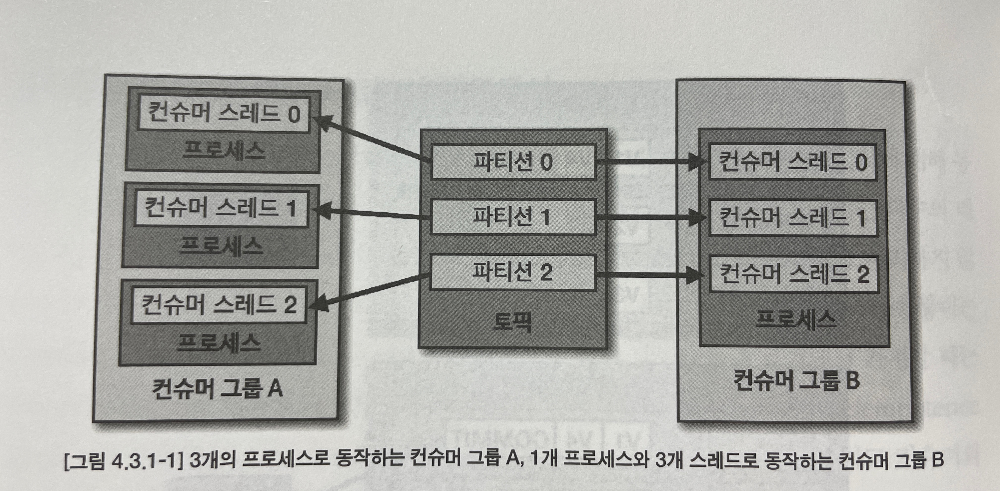
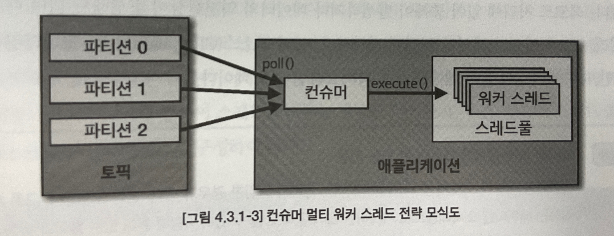
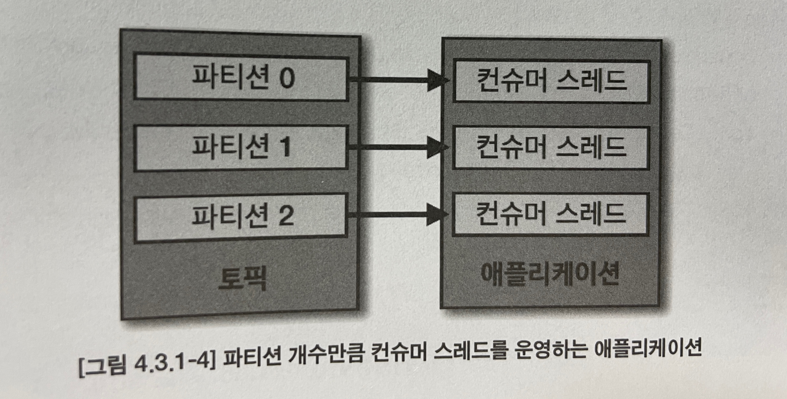
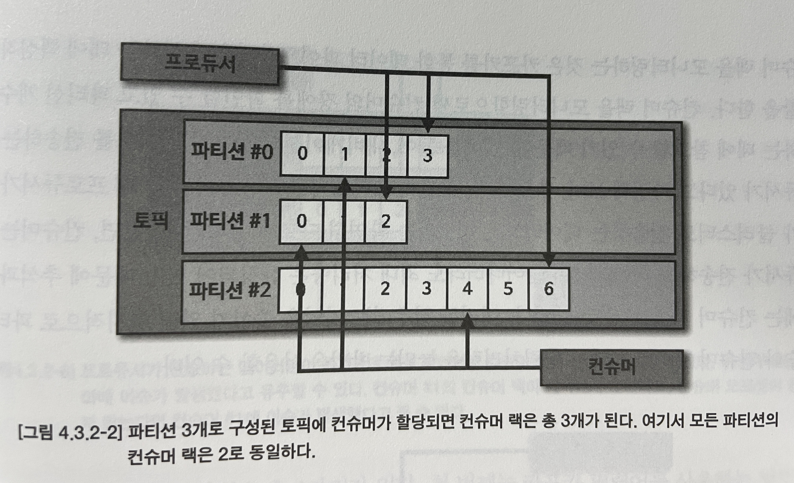

# Chapter 04 "카프카 상세 개념 설명"

## 3. 카프카 컨슈머의 고급 활용법과 옵션별 동작 방식

### 3.1. 멀티 스레드 컨슈머

* 카프카는 처리량을 늘리기 위해 파티션과 컨슈머 개수를 늘려서 운영할 수 있다.
* 이 때, 데이터를 병렬처리하기 위해서 파티션 개수와 컨슈머 개수를 동일하게 맞추는 것이 가장 좋은 방법이다.
* 파티션 개수가 n개라면 동일 컨슈머 그룹으로 묶인 컨슈머 스레드를 최대 n개 운영할 수 있으므로, 멀티 스레드 지원 환경을 고려하여 개발자의 선택에 따라 아래 2가지 방식으로 운영할 수 있다.



* 멀티스레드 환경에서 컨슈머를 안전하게 운영하기 위해 고려할 사항
    * 하나의 컨슈머에서 예외(예: OutofMemoryException)이 발생할 경우, 프로세스 자체가 종료될 수 있고 이는 다른 컨슈머 스레드에까지 영향을 미칠 수 있다.<br>
    그리고 이때, 컨슈머 스레드들이 비정상적으로 종료될 경우, 데이터 처리에서 중복/유실이 발생할 수 있다.
    * 각 컨슈머 스레드 간에 영향이 미치지 않도록 스레드 세이프 로직, 변수를 적용해야 한다.
* 멀티 컨슈머 스레드를 효율적으로 활용하는 방식 2가지
    * 멀티 워커 스레드 전략 
    * 컨슈머 멀티 스레드 전략 - 컨슈머 인스턴스에서 poll() 메서드를 호출하는 스레드를 여러개 띄워서 사용한다.

#### 1) 방식 1. 멀티 워커 스레드 전략

* 컨슈머 스레드는 1개만 실행하고, 데이터 처리를 담당하는 워커 스레드를 여러개 실행한다.
* 레코드들을 병렬로, 동시에 처리할 수 있기 때문에 처리 시간을 현저히 줄일 수 있다.
* ExecutorService 자바 라이브러리 사용하여 스레드를 사용할 수 있다.



```java
/**
 *Runnable 인터페이스로 구현한 ConsumerWorker 클래스는 스레드로 실행된다.
 */
public class ConsumerWorker implements Runnable {

    private final static Logger logger = LoggerFactory.getLogger(ConsumerWorker.class);
    private String recordValue;

    ConsumerWorker(String recordValue) {
        this.recordValue = recordValue;
    }

    @Override
    public void run() { // 데이터를 처리할 구문
        logger.info("thread:{}\trecord:{}", Thread.currentThread().getName(), recordValue);
    }
}
```

```java
/**
 * 스레드를 호출하는 구문
 */
public class ConsumerWithMultiWorkerThread {
    ...

    public static void main(String[] args) {
        ...
        KafkaConsumer<String, String> consumer = new KafkaConsumer<>(configs);
        consumer.subscribe(Arrays.asList(TOPIC_NAME));
        // 스레드를 실행하기 위해 ExceutorService 를 사용한다.
        ExecutorService executorService = Executors.newCachedThreadPool();
        while (true) {
            ConsumerRecords<String, String> records = consumer.poll(Duration.ofSeconds(10));
            for (ConsumerRecord<String, String> record : records) {
                // 스레드를 레코드마다 개별 실행한다.
                ConsumerWorker worker = new ConsumerWorker(record.value());
                executorService.execute(worker);
            }
        }
    }
}
```

* 주의해야 하는 사항
    * 스레드를 사용함으로써 데이터 처리가 끝나지 않았음에도 불구하고 커밋을 하기 때문에 리밸런싱, 컨슈머 장애 시에 데이터 유실이 발생할 수 있다.
        * 위 예제에서, 각 레코드의 데이터 처리가 끝났다는 것을 스레드로부터 리턴받지 않고 바로 그 다음 poll() 메서드를 호출하고 있다.
        * 오토 커밋일 경우 데이터 처리가 스레드에서 진행 중임에도 불구하고 다음 poll() 메서드 호출 시에 커밋을 할 수 있기 떄문이다.
    * 레코드 처리의 역전 현상
        * 각 스레드의 처리 시간이 다를 수 있어, 레코드 처리에 있어 중복이 발생하거나 데이터의 역전 현상이 발생할 수 있다.
* → 즉, 위 상황이 발생하더라도 매우 빠른 처리 속도가 필요한 데이터 처리에 적합하다.
* 사용 예: 서버 리소스(CPU, 메모리 등) 모니터링 파이프라인, IoT 센서 데이터 수집 파이프라인

### 2) 방식 2. 컨슈머 멀티 스레드 전략 

* 컨슈머 인스턴스에서 poll() 메서드를 호출하는 스레드를 여러개 띄워서 사용한다.
* 파티션과 컨슈머는 N:1 할당이 가능하므로 1개의 애플리케이션에 구독하고자 하는 토픽의 파티션 개수만큼 컨슈머 스레드 개수를 늘려서 운영하는 것이 이상적이다.<br>
→ 각 스레드에 파티션이 할당되며, 파티션의 레코드들을 병렬처리할 수 있다.

* 1개의 애플리케이션에 N개의 컨슈머 스레드를 띄워보자.

```java
/**
 *컨슈머 스레드 클래스를 Runnable 인터페이스로 구성하여 만든다.
 */
public class ConsumerWorker implements Runnable {
    private final static Logger logger = LoggerFactory.getLogger(ConsumerWorker.class);
    private Properties prop;
    private String topic;
    private String threadName;
    private KafkaConsumer<String, String> consumer;

    // KafkaConsumer 인스턴스를 생성하기 위해 필요한 변수
    ConsumerWorker(Properties prop, String topic, int number) {
        this.prop = prop;
        this.topic = topic;
        this.threadName = "consumer-thread-" + number;
    }

    @Override
    public void run() {
        // KafkaConsumer 클래스는 스레드 세이프하지 않으므로, 스레드별로 인스턴스를 별개로 만들어야 한다.
        consumer = new KafkaConsumer<>(prop);
        // 토픽 구독
        consumer.subscribe(Arrays.asList(topic));
        while (true) {
            ConsumerRecords<String, String> records = consumer.poll(Duration.ofSeconds(1));
            for (ConsumerRecord<String, String> record : records) {
                // 레코드 처리
                logger.info("{}", record);
            }
            consumer.commitSync();
        }
    }
}
```

```java
public class MultiConsumerThread {

    private final static String TOPIC_NAME = "test";
    private final static String BOOTSTRAP_SERVERS = "my-kafka:9092";
    private final static String GROUP_ID = "test-group";
    private final static int CONSUMER_COUNT = 3;    // 스레드 개수 지정

    public static void main(String[] args) {
        ...
        // 컨슈머 스레드 생성
        ExecutorService executorService = Executors.newCachedThreadPool();
        // 3개의 컨슈머 스레드를 execute() 메서드를 통해 실행
        for (int i = 0; i < CONSUMER_COUNT; i++) {
            ConsumerWorker worker = new ConsumerWorker(configs, TOPIC_NAME, i);
            executorService.execute(worker);
        }
    }
}
```

### 3.2. 컨슈머 랙

* 컨슈머 랙(LAG): 토픽의 최신 오프셋(LOG-END-OFFSET)과 컨슈머 오프셋(CURRENT-OFFSET) 간의 차이
* 컨슈머 랙은 컨슈머 그룹과 토픽, 파티션 별로 생성된다.

* 컨슈머 랙은 컨슈머가 정상 동작하는지 여부를 확인할 수 있기때문에 필수적으로 모니터링 해야 한다.
    * 최소값은 0으로 지연이 없음을 뜻한다.
    * 모니터링을 통해 장애를 확인할 수 있고, 파티션 개수를 정하는 데 참고할 수 있다.
* 컨슈머 랙을 확인하는 방법 3가지
    * 카프카 명령어 사용
    * 컨슈머 애플리케이션에서 metrics() 메서드를 사용
    * 외부 모니터링 툴

#### 1) 컨슈머 랙 확인 방법 1. 카프카 명령어 사용

```bash
$ bin/kafka-consumer-groups.sh  \
--bootstrap-server my-kafka:9092    \
--group my-group    \
--describe
```

* 컨슈머 랙을 포함한 특정 컨슈머 그룹의 상태를 확인할 수 있다.
* 일회성에 그치고 지표를 지속적으로 기록하고 모니터링하기에는 부족하므로, 이 방법은 테스트용 카프카에서 주로 사용한다.

#### 2) 컨슈머 metrics() 메서드를 사용하여 컨슈머 랙 조회

* KafkaConsumer 인스턴스가 제공하는 컨슈머 랙 관련 모니터링 지표 3가지
    * records-lag : 파티션의 가장 최근 LAG
    * records-lag-avg : 파티션의 평균 LAG
    * records-lag-max : 해당 window에 최대 LAG

```java
/**
 * metrics() 메서드를 사용하여 컨슈머 랙 조회
 */
for (Map.Entry<MetricName, ? extends Metric> entry : consumer.metric().entrySet()) {
    if ("record-lag-max".equals(entry.getKey().name())
        || "record-lags".equals(entry.getKey().name())
        || "record-lag-avg".equals(entry.getKey().name())) {
        Metric metric = entry.getValue();
        log.info(entry.getKey().name(), metric.metricValue());
    }
}
```

* 위 방법의 문제점
    * 컨슈머가 정상 동작할 경우에만 확인할 수 있다.
    * 모든 컨슈머 애플리케이션에 컨슈머 랙 모니터링 코드를 중복해서 작성해야 한다.
        * 특정 컨슈머 그룹에 해당하는 애플리케이션이 수집하는 컨슈머 랙은 자기 자신 컨슈머 그룹에 한정적이기 때문이다.
    * 카프카 서드 파티 애플리케이션의 경우, 모니터링하는 코드를 추가할 수 없다.

#### 3) 외부 모니터링 툴을 사용하여 컨슈머 랙 조회

* 데이터독, 컨플루언트 컨트롤 센터, 카프카드롭...
* 컨슈머 랙 모니터링만을 위한 툴로는 버로우가 있다.
* 모니터링 툴은 클러스터와 연동되어 컨슈머의 데이터 처리와는 별개로 지표를 수집하기 때문에, 데이터를 활용하는 프로듀서나 컨슈머의 동작에 영향을 미치지 않는다.

### 3.3. 컨슈머 배포 프로세스

* 배포 방법 2가지
    * 중단 배포
    * 무중단 배포

#### 1) 중단 배포

* 유연한 인스턴스 발급이 어려운 물리 장비에서 운영하는 것과 같은, 한정된 서버 자원을 운영하는 경우 적합하다.
* 새로운 로직이 적용된 신규 애플리케이션의 실행 전후를 명확하게 특정 오프셋 지점으로 나눌수 있어, 전후의 데이터를 명확히 구분할 수 있다.
* 이 특징은, 신규 배포한 애플리케이션에 이슈가 발생해서 롤백할 때 유용하다.

#### 2) 무중단 배포

* 인스턴스의 발급과 반환이 다소 유연한 가상 서버를 사용하는 경우에 유용하다.
* 무중단 배포 방법 3가지
    * 블루/그린 배포
        * 이전 버전 애플리케이션과 신규 버전 애플리케이션을 동시에 띄워놓고 트래픽을 전환하는 방법이다.
        * 파티션 개수와 컨슈머 개수를 동일하게 실행하는 애플리케이션을 운영할때 유용하다.
        * 신규 버전 애플리케이션이 준비되어 기존 애플리케이션을 모두 중단하면, 1번의 리밸런싱이 발생하면서 파티션은 모두 신규 컨슈머와 연동된다.
    * 롤링 배포
        * 블루/그린 배포의 인스턴스 할당과 반환으로 인한 리소스 낭비를 줄이면서 무중단 배포를 할 수 있다.
        * 파티션 개수가 인스턴스 개수와 같거나, 그보다 많아야 한다.
        * 일부 인스턴스를 신규 버전으로 실행하고 모니터링 한 이후에 나머지 인스턴스를 신규 버전으로 배포하여 롤링 업그레이드를 진행한다. 그러므로 리밸런싱이 여러 회 발생한다.
        * 파티션 개수가 많을수록 리밸런스 시간도 길어지므로 파티션 개수가 많지 않은 경우에 효과적이다.
    * 카나리 배포
        * 작은 위험을 통해 큰 위험을 예방하는 방법이다.
        * 데이터 중 일부분을 신규 버전의 애플리케이션에 먼저 배포함으로써 이슈가 없는지 사전에 탐지한다.
        * 소수 파티션에 컨슈머를 따로 배정하여 테스트하고, 이러한 카나리 배포로 사전 테스트가 완료되면 나머지 파티션에 할당된 컨슈머는 롤링 또는 블루/그린 배포를 수행하여 무중단 배포를 진행한다.


