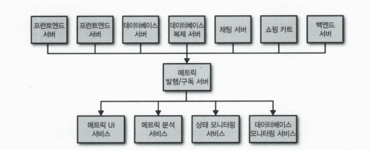
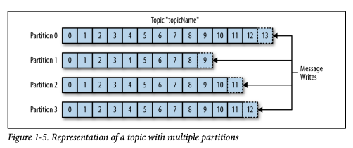
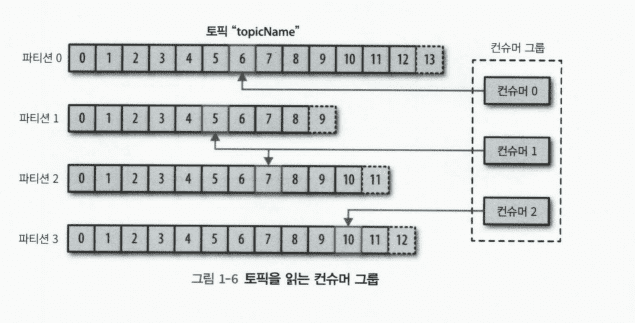
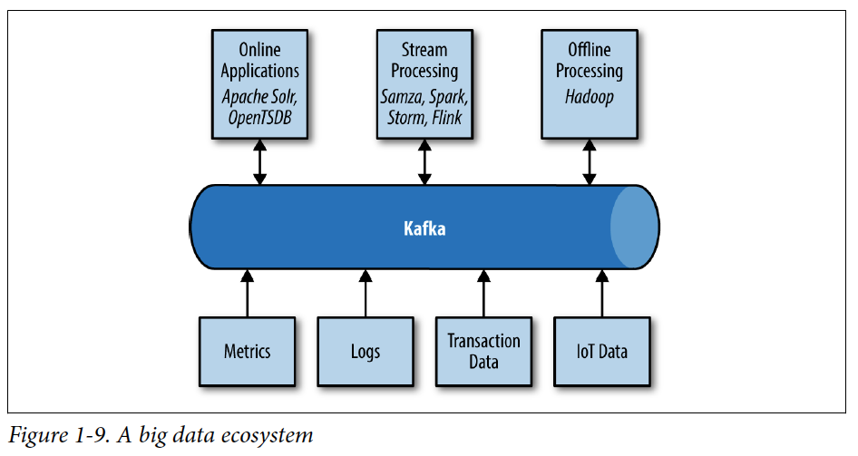

# Chapter 01 "카프카 훑어보기"

## 1. 메시지 발행과 구독하기

* 메시지 발행/구독(publish/subscribe) 시스템 에서는 데이터(메시지)를 발행자(전송자)가 직접 구독자(수신자)에게 보내지 않는다.
* 대신, 발행자가 메시지를 구분해서 발행/구독 시스템에 전송하면<br>
구독자가 특정 부류의 메시지를 구독할 수 있게 해준다.
* 이때, 브로커(broker)가 발행된 메시지를 저장하고 중계하는 역할을 수행한다.

### 초기의 발행/구독 시스템

* 간단한 메시지 큐나 프로세스 간 통신 채널을 갖는 형태
    * 발행자와 구독자가 직접 연결된 단일 메트릭 발행/구독 시스템
* → 메트릭 발행/구독 서버를 두어, 모든 애플리케이션의 메트릭을 하나의 애플리케이션이 수신하게 하여 어떤 시스템에서도 쉽게 조회할 수 있도록 한다.
    * 

### 개별적인 메시지 큐 시스템

* 로그 메시지/추적 메시지 등 다수의 중복되는 메시지 처리 시스템을 유지 관리해야 한다.
* → 따라서 일반화된 유형의 메시지 데이터를 발행/구독하는 하나의 집중 처리 시스템으로 만들면 유연성과 확장성이 좋아진다.

## 2. 카프카 살펴보기

* 카프카
    * = 분산 커밋 로그 (distributed commit log)
    * = 분산 스트리밍 플랫폼 (distributed streaming platfor)
* 파일 시스템이나 데이터베이스의 커밋로그는 시스템의 상태를 일관성 있게 유지할 수 있도록 모든 트랜잭션을 지속적으로 기록하는 기능을 제공한다.
* 시스템 장애에 대비하고 확장에 따른 성능 저하를 방지하기 위해 데이터가 분산 처리 될 수 있다.

### 메시지와 배치

* 메시지: 카프카에서 데이터의 기본 단위 (db의 row, record)
* 배치: 여러 개의 메시지를 모아 배치 형태로 파티션에 수록, 네트워크로 매번 각 메시지를 받아서 처리하는데 따른 부담을 줄일 수 있다.

### 스키마

* 카프카는 메시지를 단순히 바이트 배열로 처리하지만, 내용을 이해하기 쉽도록 메시지의 구조를 나타내는 schema도 사용할 수 있다.
* 스키마로 사용되는 여러 가지 표준 형식
    * JSON
    * XML
    * 아파치 Avro - 하둡을 위해 개발된 serializaion 프레임워크
        * 메시지와는 별도로 스키마를 유지 관리하므로, 스키마가 변경되더라도 애플리케이션의 코드를 추가/변경할 필요가 없다.
* 일관된 데이터 형식이 중요하다.
    * 메시지 쓰기와 읽기 작업을 분리해서 할 수 있기 때문이다.
    * 잘 정의된 스키마를 공유 repository에 저장하여 사용할 수 있으므로, 애플리케이션 변경 없이 메시지를 처리할 수 있다.

### 토픽과 파티션



* 토픽(topic) - 카프카의 메시지가 분류되는 단위.
    * 데이터베이스 테이블이나 파일 시스템의 폴더와 유사
* 파티션(partition) - 하나의 토픽은 여러 개의 파티션으로 구성될 수 있다.
    * 파티션은 하나의 로그에 해당한다.
    * 메시지는 파티션에 추가되는 형태로만 수록되며, 맨 앞부터 제일 끝까지의 순서로 읽힌다.
    * 하나의 토픽은 여러 개의 파티션을 갖지만, 메시지 처리 순서는 토픽이 아닌 파티션별로 유지 관리된다.
    * 각 파티션은 서로 다른 서버에 분산될 수 있다.<br>
    → 하나의 토픽이 여러 서버에 걸쳐 수평적으로 확장될 수 있으므로, 단일 서버로 처리할 때보다 훨씬 성능이 우수하다.
* 스트림(stream) - 데이터를 쓰는 프로듀서로부터 데이터를 읽는 컨슈머로 이동되는 연속적인 데이터
    * 스트림은 파티션의 개수와 상관 없이 하나의 토픽 데이터로 간주된다.
    * 실시간 메시지 처리
        * vs. 하둡(오프라인으로 대량의 데이터를 처리하는 프레임워크)

### 프로듀서와 컨슈머

```
카프카의 클라이언트: 시스템의 사용자
    ㄴ 프로듀서
    ㄴ 컨슈머
```
* 프로듀서 (발행자/작성자)- 새로운 메시지를 생성한다. (쓰기)
    * 메시지는 특정 토픽으로 생성된다.
    * 프로듀서는 메시지가 어떤 파티션에 수록되는지 관여하지 않는다.
    * 메시지 키나 partitioner를 사용하여 파티션에 메시지를 직접 쓸 수 있다. 
        * 파티셔너 - 키의 해시 값을 생성하고 그것을 특정 파티션에 대응시켜, 지정된 키를 갖는 메시지가 항상 같은 파티션에 수록되게 한다.
* 컨슈머 (구독자/독자) - 메시지를 읽는다.
    * 하나 이상의 토픽을 구독하여, 메시지가 생성된 순서로 읽는다.
    * 메시지의 offset을 유지하여, 읽는 메시지의 위치를 알 수 있다.
        * offset - 메타 데이터. 메시지가 생성될 때 카프카가 추가해주는, 지속적으로 증가하는 정숫값.
        * 파티션에 수록된 각 메시지는 고유한 오프셋을 갖는다.
        * Zookeper나 카프카엥서는 각 파티션에서 마지막에 읽은 메시지의 오프셋을 저장하고 있어,<br>
        컨슈머가 메시지 읽기를 중단했다가 닫시 시작하더라도 언제든 그 다음 메시지부터 읽을 수 있다. 



* 컨슈머 그륩 - 하나 이상의 컨슈머로 구성된다.
    * 한 토픽을 소비하기(읽고 처리하기 위해 같은 그룹의 여러 컨슈머가 함께 동작한다.
    * 한 토픽의 각 파티션은 하나의 컨슈머만 소비할 수 있다.
    * 파티션 소유권(ownership) - 각 컨슈머가 특정 파티션에 대응되는 것
        * → 컨슈머를 수평적으로 확장할 수 있다.
        * 한 커슈머가 자신의 파티션 메시지를 읽는 데 실패하더라도, 같은 그룹의 다른 컨슈머가 파티션 소유권을 재조정받은 후 실패한 컨슈머의 파티션 메시지를 대신 읽을 수 있다.

### 브로커와 클러스터

* broker - 하나의 카프카 서버
    *  프로듀서로부터 메시지를 수신하고 오프셋을 지정한 후 해당 메시지를 디스크에 저장한다.
    * 컨슈머의 파티션 읽기 요청에 응답하고 디스크에 수록된 메시지를 전송한다.
* 클러스터(cluster) - 카프카의 브로커는 클러스터의 일부로 동작하도록 설계되었다.
    * 여러 개의 브로커가 하나의 클러스터에 포함될 수 있고,<br>
    그중 하나는 자동으로 선정되는 클러스터 컨트롤러의 기능을 수행한다.
    * 컨트롤러 - 같은 클러스터의 각 브로커에 담당 파티션을 할당하고, 브로커들이 정상적으로 동작하는지 모니터링하는 관리 기능을 한다.
    * 파티션 리더 - 각 파티션은 클러스터의 한 브로커가 소유한다.
    * 파티션 복제(replication) - 같은 파티션이 여러 브로커에 지정될 수도 있다. 
        * 이 경우 해당 파티션의 메시지는 중복으로 저장되지만, 관련 브로커에 장애가 생기면 다른 브로커가 소유권을 인계받아 그 파티션을 처리할 수 있다.
        * 각 파티션을 사용하는 모든 컨슈머와 프로듀서는 파티션 리더에 연결해야 한다. 
* 보존(retention) - 일정 기간 메시지를 보존한다.
    * 브로커는 기본적으로 토픽을 보존한다.
    * 한도 값에 도달하면 최소한의 데이터가 유지되도록 만료 메시지들이 삭제된다.
    * log compacted 경우, 같은 키를 같은 메시지들은 가장 최신 것만 보존 되어 마지막으로 변겨된 것이 중요한 로그데이터에 유용하다.

### 다중 클러스터

* 데이터 타입에 따라 구분해서 처리할 수 있다.
* 보안 요구사항을 분리해서 처리할 수 있다.
* 재해 복구를 대비한 다중 데이터센터를 유지할 수 있다.

## 3. 카프카를 사용하는 이유

* 다중 프로듀서
    * 여러 클라이언트가 많은 토픽을 사용하거나 같은 토픽을 같으 사용해도, 카프카는 무리 없이 많은 프로듀서의 메시지를 처리할 수 있다.
    * 따라서 여러 프런트엔드 시스템으로부터 데이터를 수집하고 유지하는데 이상적이다.
* 다중 컨슈머
    * 많은 컨슈머가 상호 간섭 없이 어떤 메시지 스트림도 읽을 수 있게 지원한다.
    * 카프카 컨슈머는 컨슈머 그룹의 멤버가 되어 메시지 스트림을 공유할 수 있다.
* 디스크 기반의 보존
    * 지속해서 메시지를 보존할 수 있으므로, 컨슈머가 항상 실시간으로 실행되지 않아도 된다.
    * 데이터 유실 위험이 없고, 컨슈머의 유지 보수도 자유롭게 수행 가능하다.
* 확장성
    * 어떤 크기의 데이터도 쉽게 처리할 수 있다. 
* 고성능 (위의 모든 장점)

## 4. 데이터 생태계



* 데이터 처리 흐름 - 모든 클라이언트에 대해 일관된 인터페이스를 제공하면서 데이터 기반 구조의 다양한 멤버간에 메시지를 전달한다. 
* 이용 사례
    * 활동추적
    * 알림 메시지 전송
    * 메트릭과 로깅
    * 커밋로그 - DB의 변경 사항이 카프카 메시지 스트림으로 생성
    * 스트림 프로세싱 - 메시지가 생성되자마자 실시간으로 데이터 처리

## 5. 카프카의 기원

* 링크드인에서 데이터 파이프라인 문제를 해결하기 위해 개발되었다.
* 다양한 유형의 데이터를 처리할 수 있고, 고성능의 메시징 시스템을 제공하도록 설계되었다.
* 링크드인의 문제점 - 활동 정보 추적 시스템
     * HTTP 서비스에서 XML 형식의 메시지를 수집하는데, 오프라인 처리로 전달되어 분석됨. XML형식에 일관성이 없음.
     * 모니터링에서 사용하는 polling 모델은 활동 추적의 push 모델과 호환성이 없음.
     * 실시간이 아님.
* 카프카의 탄생 및 특징
    * push-pull 모델을 사용하여 메시지 프로듀서와 컨슈머를 분리시킨다.
    * 다수의 컨슈머가 사용할 수 있게 메시징 시스템의 데이터를 지속적으로 보존한다.
    * 많은 메시지 처리량에 최적화 시킨다.
    * 데이터 스트림의 양이 증가될 때 시스템을수평 확장할 수 있게 한다.
    * avro를 결합하여 메시지 직렬화를 쉽게 할 수 있게 해준다 (registry 구축)
    * 오픈 소스

## Reference
* https://dobby.work/development/kafka-1/