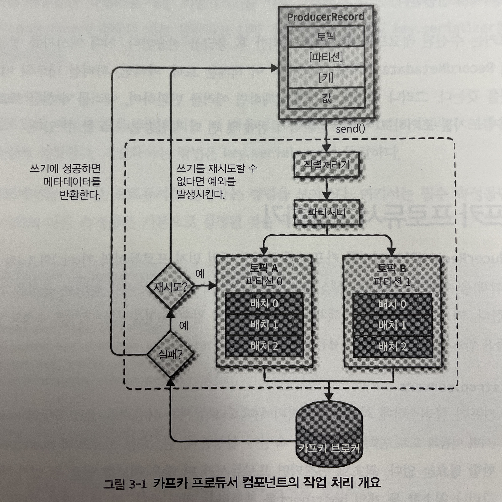

# Chapter 03 "카프카 프로듀서: 카프카에 메시지 쓰기"

* 아파치 카프카는 클라이언트 API를 포함해서 배포되며, 이것을 사용해서 개발자는 카프카의 프로듀서와 컨슈머 애플리케이션을 개발할 수 있다.
* 이 장에서는 카프카 프로듀서를 작성하고 사용하는 방법을 배운다.

## 1. 프로듀서 개요

1. 카프카에 쓰려는 메시지를 갖는 ProducerRecord를 생성한다.
1. 직렬처리기(Serializer) 컴포넌트(클래스) - 키와 값의 쌍으로 구성되는 메시지 객체들이 네트워크로 전송될 수 있도록 byte array로 직렬화한다.
1. 파티셔너 컴포넌트(클래스) - 파티션이 선택되면 해당 레코드(ProducerRecord 객체)의 메시지가 저장될 토픽과 파티션을 프로듀서가 알게 된다.
1. 같은 토픽과 파티션으로 전송될 레코드들을 모은 레코드 배치에 추가하며, 별개의 스레드가 그 배치를 카프카 브로커에게 전송한다.
1. 브로커는 수신된 레코드의 메시지를 처리한 후 응답을 전송하고, 이 때 성공시 RecordMetadata 객체를 반환한다.

## 2. 카프카 프로듀서 구성하기

* 

## 3. 카프카에 메시지 전송하기
## 4. 프로듀서 구성하기
## 5. 직렬처리기
## 6. 파티션
## 7. 구버전의 브로듀서 API들
## 8. 요약

## Reference

* https://colinch4.github.io/2021-01-15/403_producer/