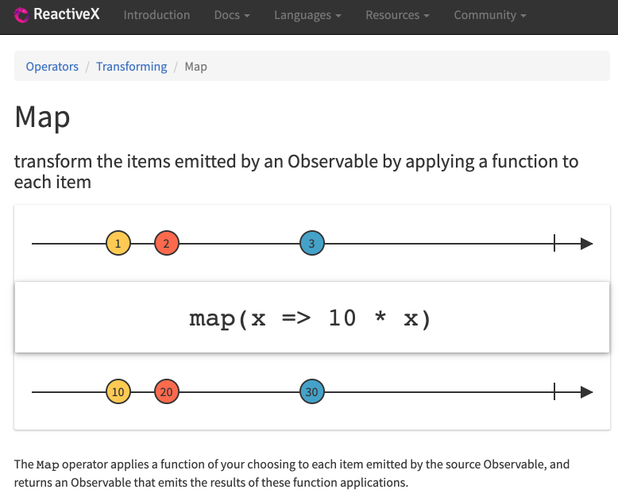

# Chapter01 "Introduction to Reactive Programming"

## 1. 리액티브 프로그래밍이란?

### 1.1. Reactive Programming<br>
> [In computing, reactive programming is a `declarative programming` paradigm concerned with `data streams and the propagation of change.`](https://en.wikipedia.org/wiki/Reactive_programming)

* 데이터 흐름과 변화의 전파: 데이터가 변경 될 때 마다 이벤트를 발생시켜서 데이터를 계속적으로 전달한다.
* 선언적 프로그래밍 : 실행할 동작(알고리즘)을 구체적으로 명시하는 명령형 프로그래밍과 달리, 선언형 프로그래밍은 단순히 목표를 선언한다.

```java
/**
 * 선언형 프로그래밍
 * List에 있는 숫자들 중에서 6보다 큰 홀수들의 합계를 구하세요.
 */
public class DeclarativePrograming {
    public static void main(String[] args){
        List<Integer> numbers = Arrays.asList(1, 3, 21, 10, 8, 11);

        // stream api 사용
        int sum = numbers.stream()
                .filter(number -> number > 6 && (number % 2 != 0))  // filtering 선언만 할 뿐, 구체적인 알고리즘 명시하지 않음.
                .mapToInt(number -> number)
                .sum();

        System.out.println("# 선언형 프로그래밍 사용: " + sum);
    }
}
```

### 1.2. 리액티브의 개념이 적용된 예

* Push 방식 : 데이터의 변화가 발생했을 때 변경이 발생한 곳에서 데이터를 보내주는 방식 (Reactive)
    * Real Time Communication
    * 소켓 프로그래밍 - 채팅
    * DB Trigger - 이벤트 발생 했을때 후속 처리
    * Spring ApplicationEvent
    * Angular의 데이터 바인딩
    * 스마트폰의 Push 메시지
* Pull 방식 : 변경된 데이터가 있는지 요청을 보내 질의하고 변경된 데이터를 가져오는 방식
    * 전통적인 클라이언트 요청 & 서버 응답 방식의 애플리케이션
    * Java 와 같은 절차형 프로그래밍 언어

### 1.3. 리액티브 프로그래밍을 위해 알아야 할 것

>  데이터 발행 -> 가공 -> 처리

* Observable: 데이터 소스. 지속적으로 변경이 가능한 데이터의 집합. 변경되는 데이터를 관찰할 수 있음.
* 리액티브 연산자(Operators): 데이터 소스로부터 전달받은 데이터를 처리하는 함수.
* 스케쥴러(Scheduler): 스레드 관리자
* Subscriber: Observable이 발행하는 데이터를 구독하는 구독자
* 함수형 프로그래밍: RxJava에서 제공하는 연산자(Operator) 함수를 사용

```java
public class ToDoSample {
    public static void main(String[] args) throws InterruptedException {
        Observable.just(100, 200, 300, 400, 500)    // data 발행
                // 각각의 데이터가 발행이 될 때, doOnNext 함수가 실행됨. thread는 계속 main 임.
                .doOnNext(data -> System.out.println(getThreadName() + " : " + "#doOnNext() : " + data))
                // main thread 가 아닌, 다른 thread 를 사용하도록 함.
                .subscribeOn(Schedulers.io())
                // RxComputationThreadPool-1 를 사용하여 데이터를 처리하게 됨.
                .observeOn(Schedulers.computation())
                .filter(number -> number > 300)
                .subscribe(num -> System.out.println(getThreadName() + " : result : " + num));

        Thread.sleep(500);
    }

    public static String getThreadName(){
        return Thread.currentThread().getName();
    }
}
```

```
RxCachedThreadScheduler-1 : #doOnNext() : 100
RxCachedThreadScheduler-1 : #doOnNext() : 200
RxCachedThreadScheduler-1 : #doOnNext() : 300
RxCachedThreadScheduler-1 : #doOnNext() : 400
RxCachedThreadScheduler-1 : #doOnNext() : 500
RxComputationThreadPool-1 : result : 400
RxComputationThreadPool-1 : result : 500
```

* subscribeOn: 데이터의 발행, 흐름을 제어하는 thread를 결정함.
* observeOn: 발행한 데이터를 가공하고 처리하는 thread를 제어함.

## 2. 마블 다이어그램 소개 

### 2.1. 마블 다이어그램이란?

* 리액티브 프로그래밍을 통해 발생하는 `비동기적인 데이터의 흐름을 시간의 흐름에 따라` 시각적으로 표시한 다이어그램 

#### 2.2. 마블 다이어그램을 알아야 하는 이유

* 문장으로 적혀 있는 리액티브 연산자(Operators)의 기능을 이해하기 어려움
* 리액티브 연산자의 기능이 시각화 되어 있어서 이해하기 쉬움
* 리액티브 프로그래밍의 핵심인 연산자(Operators)를 사용하기 위한 핵심 도구


#### 2.3. 마블 다이어그램 보는 법
* http://reactivex.io/documentation/operators/map.html



* 위의 타임라인: 시간 순으로 데이터가 발행 됨. Observable이 `발행하는 데이터`임. 함수의 입력으로 들어옴.
* 가운데 네모: 연산자 함수
* 아래 타임라인: 발행된 데이터가 함수를 거쳐 변환 됨. `함수의 출력으로 나온 변환된 데이터`임.


