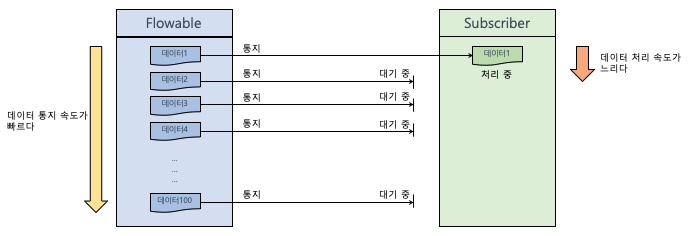

# Chapter03 "리액티브 프로그래밍 구성 요소"

* 생산자: 데이터를 생성하여 내보내는 쪽
* 데이터를 통제한다: 생산자가 데이터를 내보내는 행위
* 소비자: 생산자가 보내는 데이터를 받아서 처리하는 쪽
* 데이터를 소비한다: 소비자가 데이터를 처리하는 행위

## 1. Reactive Streams

### 1.1. Reactive Streams 란?

> https://github.com/reactive-streams/reactive-streams-jvm

* 리액티브 프로그래밍 라이브러리의 표준 사양 
* 리액티브 프로그래밍에 대한 인터페이스만 제공한다.
* RxJava는 이 Reactive Streams의 인터페이스들을 구현한 구현체이다.
* Reactive Streams는 Publisher, Subscriber, Subscription, Processor 라는 4개의 인터페이스를 제공한다. 
    * Publisher: 데이터를 생성하고 통지
    * Subscriber: 데이터를 수신, 전달 받아서 처리
    * Subscription: publisher와 Subscriber의 상호 연결을 정의, 전달 받을 데이터의 개수를 요청하고 구독을 해지
    * Processor: Publisher와 Subscriber의 기능이 모두 있음. 두 인터페이스 간에 주고받는 데이터를 변환

### 1.2. Publisher와 Subscriber간의 프로세스 흐름


* https://jade314.tistory.com/entry/%EB%A6%AC%EC%97%91%ED%8B%B0%EB%B8%8CReactive-%ED%94%84%EB%A1%9C%EA%B7%B8%EB%9E%98%EB%B0%8D-%EA%B8%B0%EB%B3%B8-%EA%B5%AC%EC%84%B1-%EC%9A%94%EC%86%8C

### 1.3. Cold Publisher & Hot Publisher

* Cold Publisher
    * 생산자는 소비자가 구독 할때마다 데이터를 처음부터 새로 통지한다.
    * → 데이터를 통지하는 새로운 타임 라인이 생성된다.  
    * 소비자는 구독 시점과 상관없이 통지된 데이터를 처음부터 전달 받을 수 있다.  
    * Flowable이나 Observable 은 cold pusblisher에 해당한다.


```java
public class ColdPublisherExample {
    public static void main(String[] args) {
        Flowable<Integer> flowable = Flowable.just(1, 3, 5, 7);

        flowable.subscribe(data -> System.out.println("구독자1: " + data));
        flowable.subscribe(data -> System.out.println("구독자2: " + data));
    }
}

/*
구독자1: 1
구독자1: 3
구독자1: 5
구독자1: 7
구독자2: 1
구독자2: 3
구독자2: 5
구독자2: 7
 */
```

* Hot Publisher
    * 생산자는 소비자 수와 상관없이 데이터를 한번만 통지한다.
    * → 데이터를 통지하는 타임 라인은 하나이다.  
    * 소비자는 발행된 데이터를 처음부터 전달 받는게 아니라 구독한 시점에 통지된 데이터들만 전달 받을 수 있다.  


```java
public class HotPublisherExample {
    public static void main(String[] args){
        PublishProcessor<Integer> processor = PublishProcessor.create();
        processor.subscribe(data -> System.out.println("구독자1: " + data));
        processor.onNext(1);
        processor.onNext(3);

        processor.subscribe(data -> System.out.println("구독자2: " + data));
        processor.onNext(5);
        processor.onNext(7);

        processor.onComplete();
    }
}

/*
구독자1: 1
구독자1: 3
구독자1: 5
구독자2: 5
구독자1: 7
구독자2: 7
 */
```

## 2. Flowable Observable - 데이터를 통제하는 생산자

### 2.1. Flowable Observable 의 비교

* 
    * Reactive Streams 인터페이스를 구현함.
    * Subscriber에서 데이터를 처리함.
    * 데이터 개수를 제어하는 배압 기능이 있음.
    * Subscription으로 전달 받는 데이터 개수를 제어할 수 있음.
    * Subscription으로 구독을 해지함.
* Observable
    * Reactive Streams 인터페이스를 구현하지 않음.
    * Observer에서 데이터를 처리함.
    * 데이터 개수를 제어하는 배압 기능이 없음.
    * 배압 기능이 없기 때문에 데이터 개수를 제어할 수 없음.
    * Disposable로 구독을 해지함.

### 2.2. 배압이란? (Back Pressure)

* Flowable에서 데이터를 통지하는 속도가 Subscriber에서 통지된 데이터를 전달받아 처리하는 속도 보다 빠를 때 밸런스를 맞추기 위해 데이터 통지량을 제어하는 기능.



* 배압 전략이 없을 때 발생하는 현상은?

```java
/**
 * 생산자 쪽에서 통지하는 데이터가 소비자 쪽에서 처리하는 데이터 속도보다 훨씬 빠른 상황.
 */
public class MissingBackpressureExceptionExample {
    public static void main(String[] agrs) throws InterruptedException {
        Flowable.interval(1L, TimeUnit.MILLISECONDS)
                .doOnNext(data -> Logger.log(LogType.DO_ON_NEXT, data))
                .observeOn(Schedulers.computation())    // 데이터 처리하는 thread 분리
                .subscribe(
                        data -> {   // 데이터 전달받아서 처리함.
                            Logger.log(LogType.PRINT, "# 소비자 처리 대기 중..");
                            TimeUtil.sleep(1000L);
                            Logger.log(LogType.ON_NEXT, data);
                        },
                        error -> Logger.log(LogType.ON_ERROR, error),
                        () -> Logger.log(LogType.ON_COMPLETE)
                );
        Thread.sleep(2000L);
    }
}
/*
doOnNext() | RxComputationThreadPool-2 | 00:06:44.733 | 0
doOnNext() | RxComputationThreadPool-2 | 00:06:44.735 | 1
print() | RxComputationThreadPool-1 | 00:06:44.735 | # 소비자 처리 대기 중..
doOnNext() | RxComputationThreadPool-2 | 00:06:44.735 | 2
doOnNext() | RxComputationThreadPool-2 | 00:06:44.736 | 3
...
doOnNext() | RxComputationThreadPool-2 | 00:06:44.827 | 127
onNext() | RxComputationThreadPool-1 | 00:06:45.740 | 0
onERROR() | RxComputationThreadPool-1 | 00:06:45.740 | io.reactivex.exceptions.MissingBackpressureException: Can't deliver value 128 due to lack of requests
 */
```

### 2.3. 배압 전략(BackpressureStrategy)

* Rxjava에서는 BackpressureStrategy 를 통해 Flowable이 통지 대기 중인 데이터를 어떻게 다룰지에 대한 배압 전략을 제공한다.

## 3. Single, Maybe, Completable - 데이터를 최대 1건만 발행하는 생성자들.

### 3.1. Single
* 데이터를 1건만 통지하거나 에러를 통지한다. 
* 데이터 통지 자체가 완료를 의미하기 때문에 완료 통지는 하지 않는다. 
* 데이터를 1건만 통지하므로 데이터 개수를 요청할 필요가 없다. 
* onNext( ), onComplete( )가 없으며 이 둘을 합한 onSuccess( )를 제공한다. 
* Single의 대표적인 소비자는 SingleObserver이다.
* 클라이언트의 요청에 대응하는 서버의 응답이 Single을 사용하기 좋은 대표적인 예다. 
