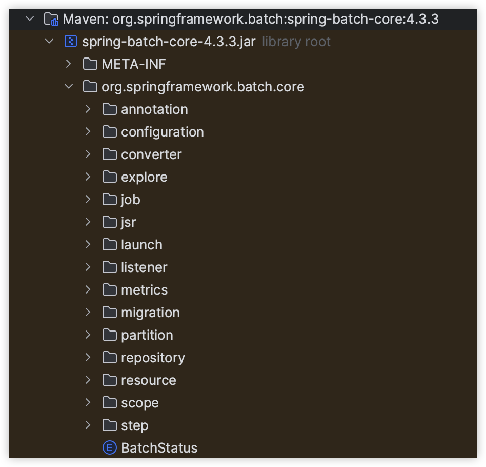
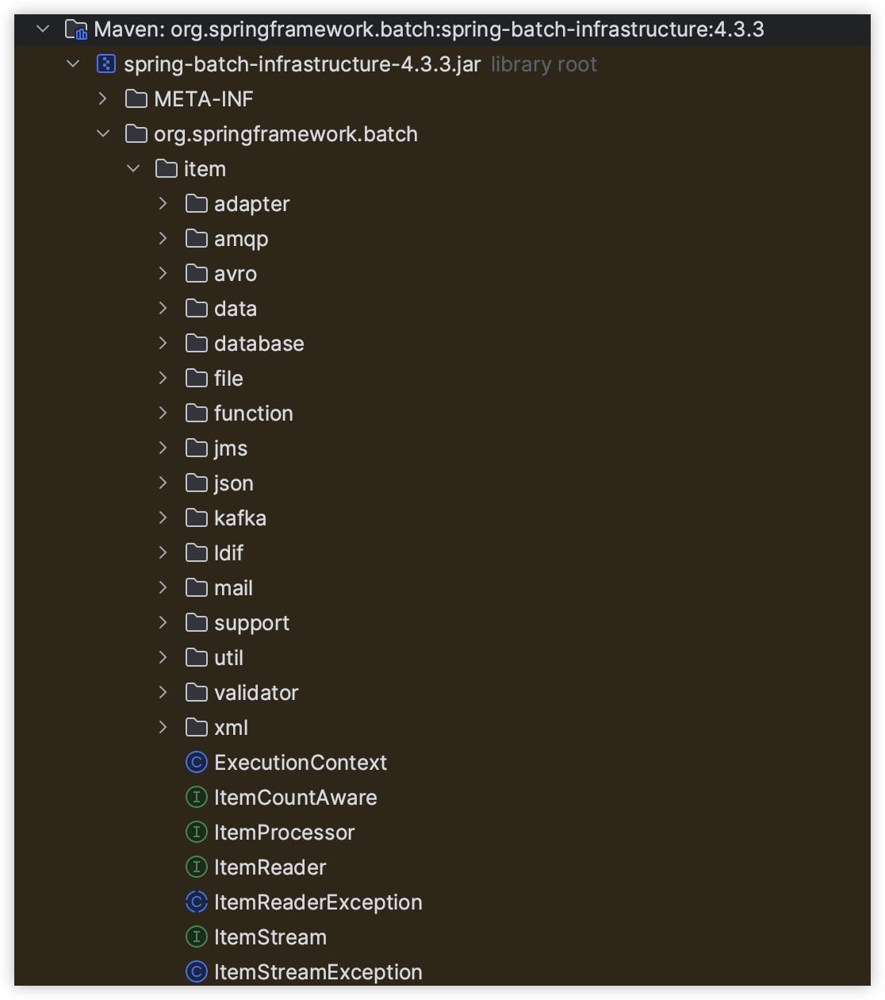

# Chapter 01. "스프링 배치 소개"

> https://docs.spring.io/spring-batch/docs/4.3.x/reference/html/spring-batch-intro.html#spring-batch-intro

## 00. 스프링 배치 주제 선정 배경

* 프로시저 등 쿼리 의존에서 벗어나, 자바로 배치를 처리하여 오류 처리/유지 보수를 쉽게 하기 위해
* 상품 배치 플랫폼이 스프링 배치로 전환되었는데, EP 업무의 경우 기존 레거시 배치(ssg-batch-app)을 이관한 개념일 뿐이라 
  스프링 배치 스터디를 통해 소스코드를 리팩토링 하고자 함

## 01. 스프링 배치 탄생 배경

* 스펙 정의서 JSR에 일괄 처리를 위한 배치 기술의 표준이 없었음 -> 필요성이 대두됨.

## 02. 배치 핵심 패턴 구성

* Read - DB, 파일, 큐에서 다량의 데이터를 조회
* Process - 특정 방법으로 데이터를 가공
* Write - 데이터를 수정된 양식으로 다시 저장

## 03. 배치 시나리오에 포함되어야 하는 내용

* 최소한의 자원을 가지고 최대한의 성능을 낼 수 있도록, 배치 프로세스를 주기적으로 커밋하는 전략을 제공한다.
* 동시 다발적인 Job의 배치 처리, 대용량 병렬 처리
* 실패 후 수동 또는 스케줄링에 의한 재시작
* 의존 관계가 있는 step 여러 개를 순차적으로 처리
* 조건적 Flow 구성을 통한 체계적이고 유연한 배치 모델 구성
* 반복, 재시도, Skip 처리

## 04. 아키텍처

* 어플리케이션
    * 스프링 배치 프레임워크를 통해 개발자가 만든 모든 배치 Job과 커스텀 코드를 포함한다.
    * 개발자는 업무 로직의 구현에만 집중하고 공통적인 기반 기술은 프레임워크가 담당하게 한다.
* 배치 코어 
    * 
    * 배치 Job 명세서
    * Job을 실행, 모니터링, 관리하는 API로 구성되어 있다.
    * JobLauncher, Job, Step, Flow 등이 속한다. (구성과 설정)
* 배치 인프라스트럭처
    * 
    * Application, Core 모두 공통 Infrastructure 위에서 빌드한다.
    * Job, Sep, Flow 설정 등, Job 실행의 흐름과 처리를 위한 틀을 제공한다.
    * 실제 데이터를 핸들링하고 처리하는 Reader, Processor Writer, Skip, Retry 등이 속한다. (배치 실행에 직접 관련된 클래스)
