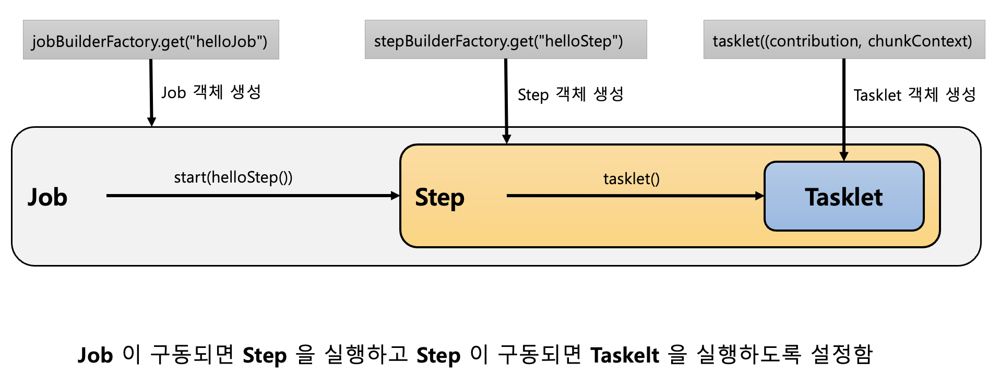

# Chapter 02 "스프링 배치 시작"

## 01. 프로젝트 구성 및 의존성 설정

### 1) pom.xml 설정

```xml
<dependencies>
    <dependency>
        <groupId>org.springframework.boot</groupId>
        <artifactId>spring-boot-starter-batch</artifactId>
    </dependency>
</dependencies>
```

### 2) 스프링 배치 활성화

```java
@SpringBootApplication
@EnableBatchProcessing  // 스프링 배치 기능 활성화
public class SpringBatchLectureApplication {

    public static void main(String[] args) {
        SpringApplication.run(SpringBatchLectureApplication.class, args);
    }

}
```

* `@EnableBatchProcessing` - 스프링 배치가 작동하기 위해 선언해야 하는 어노테이션
    * 총 4개의 설정 클래스를 실행시키며 스프링 배치의 모든 초기화 및 실행 구성이 이루어진다.
    * 스프링 부트 배치의 자동 설정 클래스가 실행되므로,<br>
    빈으로 등록된 모든 Job 을 검색해서 초기화와 동시에 Job 을 수행하도록 구성된다.

### 3) 스프링 배치 초기화 설정 클래스


1. @EnableBatchProcessing 호출
    * 
    * 
1. SimpleBatchConfiguration
    * JobBuilderFactory 와 StepBuilderFactory 생성
    * 스프링 배치의 주요 구성 요소 생성 - 프록시 객체로 생성됨
    * 
1. BatchConfigurerConfiguration
    * BasicBatchConfigurer 
        * SimpleBatchConfiguration 에서 생성한 프록시 객체의 실제 대상 객체를 생성하는 설정 클래스<br>
        (프록시 객체의 타겟을 실제 가지고 있음)
        * 빈으로 의존성 주입 받아서 주요 객체들을 참조해서 사용할 수 있다.
    * JpaBatchConfigurer 
        * JPA 관련 객체를 생성하는 설정 클래스
    * 사용자 정의 BatchConfigurer 인터페이스를 구현하여 사용할 수 있다.
1. BatchAutoConfiguration
    * 
    * 스프링 배치가 초기화 될 때 자동으로 실행되는 설정 클래스
    * JobLauncherApplicationRunner 클래스가 실제 Job을 실행하는 클래스이다.

## 02. Hello Srping Batch 시작하기

```java
@RequiredArgsConstructor
@Configuration  // 배치 Job 정의 & 빈 설정
public class HelloJobConfiguration {

    // Job을 생성하는 빌더 팩토리
    private final JobBuilderFactory jobBuilderFactory;
    // Step을 생성하는 빌더 팩토리
    private final StepBuilderFactory stepBuilderFactory;

    // helloJob 이름으로 Job 생성
    @Bean
    public Job helloJob() {
        return this.jobBuilderFactory.get("helloJob")   // Job 구현체 생성
                .start(helloStep1())
                .next(helloStep2())
                .build();
    }

    // helloStep1 이름으로 Step 생성
    @Bean
    public Step helloStep1() {
        return stepBuilderFactory.get("helloStep1") // Step 구현체 생성
                // tasklet: Step 안에서 단일 태스크로 수행되는 비즈니스 로직을 구현 (step 안에서 tasklet을 수행)
                .tasklet((contribution, chunkContext) -> {
                    System.out.println(" ============================");
                    System.out.println(" >> Hello Spring Batch");
                    System.out.println(" ============================");
                    return RepeatStatus.FINISHED;
                })
                .build();
    }
    public Step helloStep2() {
        return stepBuilderFactory.get("helloStep2")
                .tasklet((contribution, chunkContext) -> {
                    System.out.println(" ============================");
                    System.out.println(" >> Step2 has executed");
                    System.out.println(" ============================");
                    return RepeatStatus.FINISHED;
                })
                .build();
    }
}
```

> Job 구동 -> Step 실행 -> Tasklet 실행<br>(Tasklet에서 비즈니스 로직이 담긴 Service 클래스를 구현)



* JOB (일, 일감) - Job 안에 여러 단계의 Task 를 지정할 수 있다.
* STEP (일의 항목, 단계) - Job 에서 지정한 개별 Task 를 말한다.
* TASKLET (작업 내용) - Step 이 Tasklet을 실행하는 구조. 실제 비즈니스 로직을 구현하는 부분. 작업내용을 기술.

## 03. DB 스키마 생성 및 이해

### 1) 스프링 배치 메타 데이터

* 스프링 배치의 실행 및 관리를 위한 목적으로 여러 도메인들(Job, Step, JobParameters..) 의 정보들을 관리할 수 있는 스키마 제공 → 리스크 발생시 빠른 대처 가능
* DB 와 연동할 경우 필수적으로 메타 테이블이 생성 되어야 함

### 2) DB 스키마 제공

* 파일 위치 : /org/springframework/batch/core/schema-*.sql (sql 파일로 자동으로 생성할 수 있는 방법을 제공)
* DB 유형별로 제공

### 3) 스키마 생성 방법
* 수동 생성 - 쿼리 복사 후 직접 실행
* 자동 생성 - spring.batch.jdbc.initialize-schema 설정
    * ALWAYS - 스크립트 항상 실행. RDBMS 설정이 되어 있을 경우 내장 DB보다 우선적으로 실행.
    * EMBEDDED - 내장 DB일때만 실행됨. 스키마가 자동 생성됨. (default)
    * NEVER - 스크립트 항상 실행 안함. 내장 DB일 경우 스크립트가 생성이 안되기 때문에 오류 발생.
* 운영에서 수동으로 스크립트 생성 후 NEVER을 설정하는 것을 권장.

### 4) DB 스키마

]

* Job  관련 테이블
    * BATCH_JOB_INSTANCE
        * Job 이 실행될 때 JobInstance 정보가 저장되며 job_name과 job_key를 키로 하여 하나의 데이터가 저장
        * 동일한 job_name 과 job_key 로 중복 저장될 수 없다
    * BATCH_JOB_EXECUTION
        * job 의 실행정보가 저장되며 Job 생성, 시작, 종료 시간,  실행상태, 메시지 등을 관리
    * BATCH_JOB_EXECUTION_PARAMS
        * Job과 함께 실행되는 JobParameter 정보를 저장
    * BATCH_JOB_EXECUTION_CONTEXT
        * Job 의 실행동안 여러가지 상태정보, 공유 데이터를 직렬화 (Json 형식) 해서 저장
        * Step 간 서로 공유 가능함
* Step  관련 테이블
    * BATCH_STEP_EXECUTION
        * Step 의 실행정보가 저장되며 생성, 시작, 종료 시간,  실행상태, 메시지 등을 관리
    * BATCH_STEP_EXECUTION_CONTEXT
        * Step 의 실행동안 여러가지 상태정보, 공유 데이터를 직렬화 (Json 형식) 해서 저장
        * Step 별로 저장되며 Step 간 서로 공유할 수 없음

## Reference

* https://zzang9ha.tistory.com/424