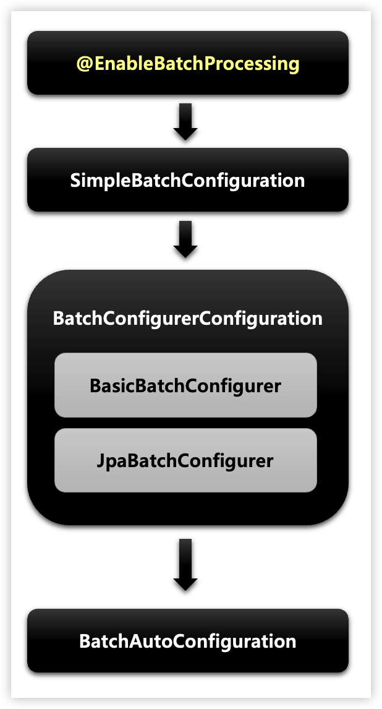
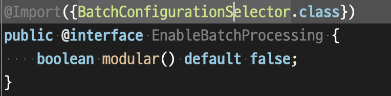
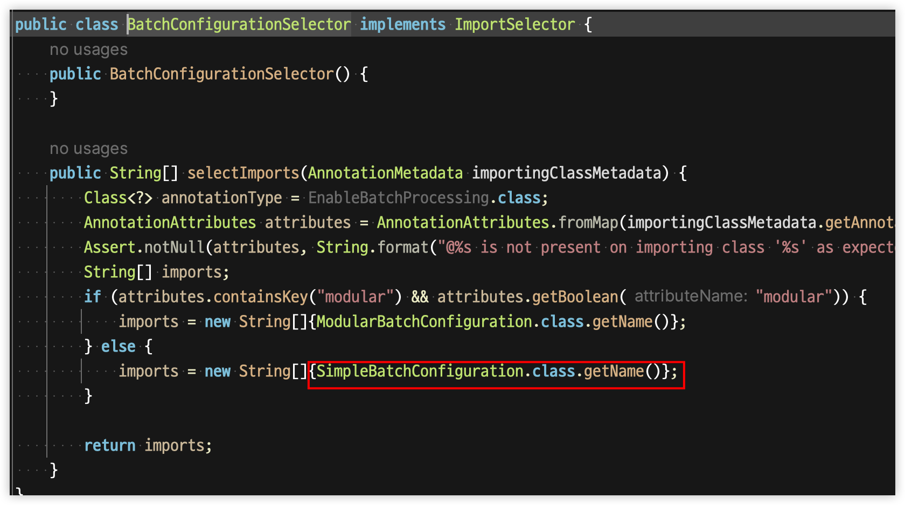
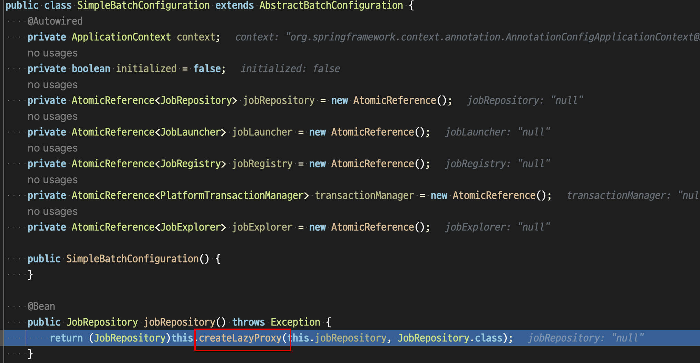
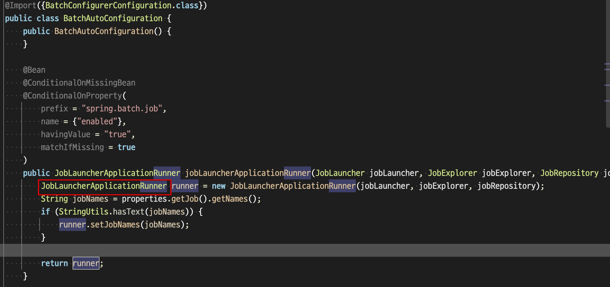

# Chapter 02 "스프링 배치 시작"

## 01. 프로젝트 구성 및 의존성 설정

### 1) pom.xml 설정

```xml
<dependencies>
    <dependency>
        <groupId>org.springframework.boot</groupId>
        <artifactId>spring-boot-starter-batch</artifactId>
    </dependency>
</dependencies>
```

### 2) 스프링 배치 활성화

```java
@SpringBootApplication
@EnableBatchProcessing  // 스프링 배치 기능 활성화
public class SpringBatchLectureApplication {

    public static void main(String[] args) {
        SpringApplication.run(SpringBatchLectureApplication.class, args);
    }

}
```

* `@EnableBatchProcessing` - 스프링 배치가 작동하기 위해 선언해야 하는 어노테이션
    * 총 4개의 설정 클래스를 실행시키며 스프링 배치의 모든 초기화 및 실행 구성이 이루어진다.
    * 스프링 부트 배치의 자동 설정 클래스가 실행되므로,<br>
    빈으로 등록된 모든 Job 을 검색해서 초기화와 동시에 Job 을 수행하도록 구성된다.

### 3) 스프링 배치 초기화 설정 클래스



1. @EnableBatchProcessing 호출
    * 
    * 
1. SimpleBatchConfiguration
    * JobBuilderFactory 와 StepBuilderFactory 생성
    * 스프링 배치의 주요 구성 요소 생성 - 프록시 객체로 생성됨
    * 
1. BatchConfigurerConfiguration
    * BasicBatchConfigurer 
        * SimpleBatchConfiguration 에서 생성한 프록시 객체의 실제 대상 객체를 생성하는 설정 클래스<br>
        (프록시 객체의 타겟을 실제 가지고 있음)
        * 빈으로 의존성 주입 받아서 주요 객체들을 참조해서 사용할 수 있다.
    * JpaBatchConfigurer 
        * JPA 관련 객체를 생성하는 설정 클래스
    * 사용자 정의 BatchConfigurer 인터페이스를 구현하여 사용할 수 있다.
1. BatchAutoConfiguration
    * * 
    * 스프링 배치가 초기화 될 때 자동으로 실행되는 설정 클래스
    * JobLauncherApplicationRunner 클래스가 실제 Job을 실행하는 클래스이다.

## 02. Hello Srping Batch 시작하기

> Job 구동 -> 

```java
@RequiredArgsConstructor
@Configuration  // 배치 Job 정의 & 빈 설정
public class HelloJobConfiguration {

    // Job을 생성하는 빌더 팩토리
    private final JobBuilderFactory jobBuilderFactory;
    // Step을 생성하는 빌더 팩토리
    private final StepBuilderFactory stepBuilderFactory;

    // helloJob 이름으로 Job 생성
    @Bean
    public Job helloJob() {
        return this.jobBuilderFactory.get("helloJob")   // Job 구현체 생성
                .start(helloStep1())
                .next(helloStep2())
                .build();
    }

    // helloStep1 이름으로 Step 생성
    @Bean
    public Step helloStep1() {
        return stepBuilderFactory.get("helloStep1") // Step 구현체 생성
                // tasklet: Step 안에서 단일 태스크로 수행되는 비즈니스 로직을 구현 (step 안에서 tasklet을 수행)
                .tasklet((contribution, chunkContext) -> {
                    System.out.println(" ============================");
                    System.out.println(" >> Hello Spring Batch");
                    System.out.println(" ============================");
                    return RepeatStatus.FINISHED;
                })
                .build();
    }
    public Step helloStep2() {
        return stepBuilderFactory.get("helloStep2")
                .tasklet((contribution, chunkContext) -> {
                    System.out.println(" ============================");
                    System.out.println(" >> Step2 has executed");
                    System.out.println(" ============================");
                    return RepeatStatus.FINISHED;
                })
                .build();
    }
}
```

## Reference

* https://zzang9ha.tistory.com/424