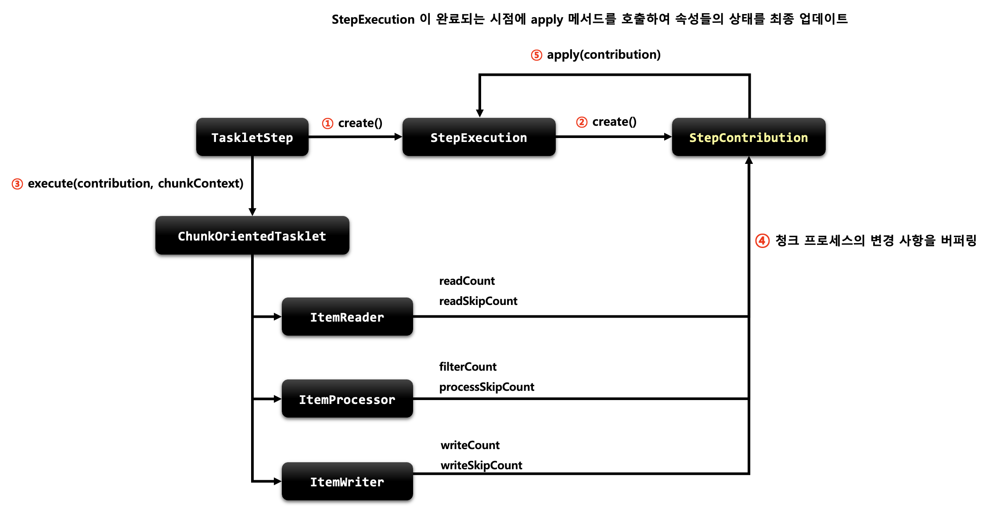

# Chapter 03 "스프링 배치 도메인 이해"

## 01. Job


### 1) Job

* 기본 개념
    * 배치 계층 구조에서 가장 상위에 있는 개념으로서 하나의 배치작업 자체를 의미한다.
    * Job Configuration 을 통해 생성되는 객체 단위로서, 배치작업을 어떻게 구성하고 실행할 것인지 전체적으로 설정하고 명세해 놓은 객체이다.
    * 배치 Job 을 구성하기 위한 최상위 인터페이스이며 스프링 배치가 기본 구현체를 제공한다.
    * 여러 Step 을 포함하고 있는 컨테이너로서 반드시 한개 이상의 Step으로 구성해야 한다. (Step 에 실제 실행 내용이 담겨 있으므로)
* 기본 구현체 - 2개 도메인 제공
    * Simple Job
        * 순차적으로 Step 을 실행시키는 Job
        * 모든 Job에서 유용하게 사용할 수 있는 표준 기능을 갖고 있다.
    * Flow Job
        * 특정한 조건과 흐름에 따라 Step을 구성하여 실행시키는 Job
        * Flow객체를 실행시켜서 작업을 진행한다.

```java
/**
 * Job 객체: 배치작업을 어떻게 구성하고 실행할 것인지 전체적으로 설정하고 명세해 놓은 객체이다.
 * @return
 */
@Bean
public Job job() {
    return this.jobBuilderFactory.get("Job")
            .start(step1()) // List<Step>에 step 저장
            .next(step2())
            .build();   // 2개의 step을 가지고 있는 Simple Job 객체를 생성
}
```

### 2) JobInstance

* 기본 개념
    * Job 이 실행될 때 생성되는 Job 의 논리적 실행 단위 객체로서, 고유하게 식별 가능한 작업 실행을 나타낸다.
    * Job 의 설정과 구성은 동일하지만, Job 이 실행되는 시점에 처리하는 내용은 다르기 때문에 Job 의 실행을 구분해야 한다.
        * 예) 하루에 한 번 씩 배치 Job이 실행된다면 매일 실행되는 각각의 Job 을 JobInstance 로 표현한다.
    * JobInstance 생성 및 실행
        * 처음 시작하는 Job + JobParameter 일 경우 → 새로운 JobInstance 생성
        * 이전과 동일한 Job + JobParameter  으로 실행 할 경우 → 이미 존재하는 JobInstance 리턴<br>
        (내부적으로 JobName + jobKey (jobParametes 의 해시값) 를 가지고  JobInstance 객체를 얻는다.)
    * Job 과는 1:N 관계
* BATCH_JOB_INSTANCE  테이블과 매핑
    * JOB_NAME (Job) 과 JOB_KEY (JobParameter 해시값) 가 동일한 데이터는 중복해서 저장할 수 없다.<br>
    → 즉, 실행 도중에 이미 존재하는 JobInstance값에 대해서는 오류를 발생시킨다.
* 도메인 이해<br>

### 3) JobParameter

* 기본 개념
    * Job을 실행할 때 함께 포함되어 사용되는 파라미터를 가진 도메인 객체
    * 하나의 Job에 존재할 수 있는 여러개의 JobInstance를 구분하기 위한 용도
    * JobParameters와 JobInstance는 1:1 관계
* 생성 및 바인딩
    * 어플리케이션 실행 시 주입
    ```
    Java -jar LogBatch.jar requestDate=20210101
    ```
    * 코드로 생성
    ```
    JobParameterBuilder, DefaultJobParametersConverter
    ```
    * SpEL 이용 
    ```java
    @Value(“#{jobParameter[requestDate]}”), @JobScope, @StepScope 선언 필수
    ```
* BATCH_JOB_EXECUTION_PARAM 테이블과 매핑
    * JOB_EXECUTION 과 1:N 의 관계
* 구조<br>

```java
@Override
public void run(ApplicationArguments args) throws Exception {

    JobParameters jobParameters = new JobParametersBuilder().addString("name", "user1")
            .addLong("seq", 1L)
            .addDate("date", new Date())
            .toJobParameters();

    jobLauncher.run(job, jobParameters);
}
```

### 4) JobExecution

* 기본 개념
    * JobIstance 에 대한 한번의 시도를 의미하는 객체로서 Job 실행 중에 발생한 정보들을 저장하고 있는 객체
    * 시작시간, 종료시간, 상태(시작,완료,실패), 종료상태의 속성을 가진다.
    * JobExecution은 JobInstance가 실행 될때마다 생성된다.
    * JobInstance 과의 관계 - JobExecution은 `FAILED` 또는 `COMPLETED`  등의 Job의 실행 결과 상태를 가지고 있다.
        * JobExecution 의 결과가 `COMPLETED` - JobInstance 실행이 완료된 것으로 간주해서 재 실행이 불가하다.
        * JobExecution 의 결과가 `FAILED` - JobInstance 실행이 완료되지 않은 것으로 간주해서 재실행이 가능함<br>
        (JobParameter 가 동일한 값으로 Job 을 실행할지라도 JobInstance 를 계속 실행할 수 있음)
        * JobExecution 의 결과가 `COMPLETED` 가 될 때까지 하나의 JobInstance 내에서 여러 번의 시도가 생길 수 있다.
* BATCH_JOB_EXECUTION 테이블과 매핑
    * JobInstance 와 JobExecution 는 1:N 의 관계
    * JobInstance 에 대한 성공/실패의 내역을 가지고 있다.
* 구조<br>
* 도메인 이해<br>
<br>


## 02. Step

### 01) Step

* 기본 개념
    * Batch job을 구성하는 독립적인 하나의 단계.
    * 실제 배치 처리를 정의하고 컨트롤하는 데 필요한 모든 정보를 가지고 있는 도메인 객체 (실제 배치 Job 구성)
    * 단순한 단일 태스크 뿐 아니라 입력과 처리 그리고 출력과 관련된 복잡한 비즈니스 로직을 포함하는 모든 설정들을 담고 있다.
    * 배치작업을 어떻게 구성하고 실행할 것인지 Job 의 세부 작업을 Task 기반으로 설정하고 명세해 놓은 객체
    * 모든 Job은 하나 이상의 step으로 구성된다.
* 기본 구현체<br>
    * TaskletStep - 가장 기본이 되는 클래스로서 Tasklet 타입의 구현체들을 제어한다.
    * PartitionStep - 멀티 스레드 방식으로 Step 을 여러 개로 분리해서 실행한다.
    * JobStep - Step 내에서 Job 을 실행하도록 한다.
    * FlowStep - Step 내에서 Flow 를 실행하도록 한다.
* API 설정에 따른 각 Step 생성<br>

### 02) StepExecution

* 기본 개념
    * Step 에 대한 한번의 시도를 의미하는 객체로서 Step 실행 중에 발생한 정보들을 저장하고 있는 객체
    * 시작시간, 종료시간, 상태(시작,완료,실패), commit count, rollback count 등의 속성을 가진다.
    * Step 이 매번 시도될 때마다 생성되며 각 Step 별로 생성된다.
    * Job 이 재시작 하더라도 이미 성공적으로 완료된 Step 은 재 실행되지 않고 실패한 Step 만 실행된다.
    * 이전 단계 Step이 실패해서 현재 Step을 실행하지 않았다면 StepExecution을 생성하지 않는다. Step이 실제로 시작됐을 때만 StepExecution을 생성한다.
* JobExecution 과의 관계
    * Step의 StepExecution 이 모두 정상적으로 완료 되어야 JobExecution이 정상적으로 완료된다.
    * Step의 StepExecution 중 하나라도 실패하면 JobExecution 은 실패한다
* BATCH_STEP_EXECUTION 테이블과 매핑
    * JobExecution 와 StepExecution 는 1:N 의 관계
    * 하나의 Job 에 여러 개의 Step 으로 구성했을 경우 각 StepExecution 은 하나의 JobExecution 을 부모로 가진다.
* 구조<br>
* 도메인 이해<br>

### 03) StepContribution

* 기본 개념
    * 청크 프로세스(예: Tasklet)의 변경 사항을 버퍼링 한 후 StepExecution 상태를 업데이트하는 도메인 객체
    * 청크 커밋 직전에 StepExecution 의 apply 메서드를 호출하여 상태를 업데이트 한다.
    * ExitStatus 의 기본 종료코드 외 사용자 정의 종료코드를 생성해서 적용 할 수 있다.
* 구조<br>
* StepContributeion 내부 동작 방식<br>



## 03. Execution Context

* 기본 개념
    * 프레임워크에서 유지 및 관리하는 키/값으로 된 컬렉션(Map)
    * StepExecution 또는 JobExecution 객체의 상태(state)를 저장하는 공유 객체
    * DB에 직렬화 한 값으로 저장됨 - { “key” : “value”}
    * 공유 범위
        * Step 범위 – 각 Step 의 StepExecution 에 저장되며 Step 간 서로 공유 안됨
        * Job 범위 – 각 Job의 JobExecution 에 저장되며 Job 간 서로 공유 안되며 해당 Job의 Step 간 서로 공유됨
    * Job 재 시작시 이미 처리한 Row 데이터는 건너뛰고 이후로 수행하도록 할 때 상태 정보를 활용함.
* 구조
    ```java
    public class ExecutionContext implements Serializable {
        private volatile boolean dirty;
        private final Map<String, Object> map;

        public ExecutionContext() {
            this.dirty = false;
            this.map = new ConcurrentHashMap();
        }
    ...
    }
    ```
    * 유지, 관리에 필요한 키값 설정
* 사용
    ```java
    @Component
    public class ExecutionContextTasklet2 implements Tasklet {

        @Override
        public RepeatStatus execute(StepContribution contribution, ChunkContext chunkContext) throws Exception {

            ExecutionContext jobExecutionContext = chunkContext.getStepContext().getStepExecution().getJobExecution().getExecutionContext();
            ExecutionContext stepExecutionContext = chunkContext.getStepContext().getStepExecution().getExecutionContext();

            System.out.println("jobName: " + jobExecutionContext.get("jobName"));
            System.out.println("stepName: " + stepExecutionContext.get("stepName"));

            String stepName = chunkContext.getStepContext().getStepExecution().getStepName();
            if(stepExecutionContext.get("stepName") == null) {
                stepExecutionContext.put("stepName", stepName);
            }
            return RepeatStatus.FINISHED;
        }
    }
    ```
* 도메인 이해<br>

## 04. JobRepository


* 기본 개념
    * 배치 작업 중의 정보를 저장하는 저장소 역할
    * Job이 언제 수행되었고, 언제 끝났으며, 몇 번이 실행되었고 실행에 대한 결과 등의 배치 작업의 수행과 관련된 모든 meta data 를 저장함
    * JobLauncher, Job, Step 구현체 내부에서 CRUD 기능을 처리함
* JobRepository의 메서드
    ```java
    // JobInstance 가 존재하는지 여부
    boolean isJobInstanceExists(String jobName, JobParameters jobParameters)

    // Job 이 실행될 때 마다 JobExecution 생성
    JobExecution createJobExecution(String jobName, JobParameters jobParameters)

    // 해당 Job의 실행 이력 중 가장 최근의 JobExecutioin 반환
    JobExecution getLastJobExecution(String jobName, JobParameters jobParameters)

    // Job 의 실행정보 업데이트
    void update(JobExecution jobExecution)

    // Step 의 실행정보 업데이트
    void update(StepExecution stepExecution)

    // 실행 중인 해당 Step 의 새로운 stepExecution 저장
    void add(StepExecution stepExecution)

    // Step 의 공유데이터 및 상태정보를 담고 있는 ExecutionContext 업데이트
    void updateExecutionContext(StepExecution stepExecution)

    // Job 의 공유데이터 및 상태정보를 담고 있는 ExecutionContext 업데이트
    void updateExecutionContext(JobExecution jobExecution)

    // 해당 Step의 실행 이력 중 가장 최근의 StepExecutioin 반환
    StepExecution getLastStepExecution(JobInstance jobInstance, String stepName)
    ```
* JobRepository 설정 - 커스텀하게 설정 가능
    * @EnableBatchProcessing 어노테이션만 선언하면 JobRepository 가 자동으로 빈으로 생성됨
    * BatchConfigurer 인터페이스를 구현하거나 BasicBatchConfigurer 를 상속해서 JobRepository 설정을 커스터마이징 할 수 있음.
    * 방식
        1. JDBC 방식으로 설정- JobRepositoryFactoryBean
            * 내부적으로 AOP 기술를 통해 트랜잭션 처리를 해주고 있음
            * 트랜잭션 isolation 의 기본값은 SERIALIZEBLE 로 최고 수준. 다른 레벨(READ_COMMITED, REPEATABLE_READ)로 지정 가능
            * 메타테이블의 Table Prefix 를 변경할 수 있음, 기본 값은 “BATCH_” 임
        1. In Memory 방식으로 설정 – MapJobRepositoryFactoryBean
            * 성능 등의 이유로 도메인 오브젝트를 굳이 데이터베이스에 저장하고 싶지 않을 경우
            * 보통 Test 나 프로토타입의 빠른 개발이 필요할 때 사용
* 사용
    ```java
    // JDBC 방식으로 설정
    @Override
    protected JobRepository createJobRepository() throws Exception {
        JobRepositoryFactoryBean factory = new JobRepositoryFactoryBean();
        factory.setDataSource(dataSource);
        factory.setTransactionManager(getTransactionManager());
        factory.setIsolationLevelForCreate("ISOLATION_REPEATABLE_READ");    // isolation 수준. 기본값.
        factory.afterPropertiesSet();
        return factory.getObject(); // Proxy 객체가 생성됨 (트랜잭션 Advice 적용 등을 위해 AOP 기술 적용))
    }
    ```

## 05. JobLauncher

* 기본 개념
    * 배치 Job 을 실행시키는 역할
    * `Job과 Job Parameters`를 인자로 받으며 요청된 배치 작업을 수행한 후 최종 client 에게 JobExecution을 반환함
    * 스프링 부트 배치가 구동이 되면 JobLauncher 빈이 자동 생성 된다
    * Job 실행
        ```java
        JobLanucher.run(Job, JobParameters)
        ```
        * 스프링 부트 배치에서는 JobLauncherApplicationRunner 가 자동적으로 JobLauncher 을 실행시킨다
        * 동기적 실행
            * taskExecutor 를 SyncTaskExecutor 로 설정할 경우 (기본값은 SyncTaskExecutor)
            * JobExecution 을 획득하고 배치 처리를 최종 완료한 이후 Client 에게 JobExecution 을 반환
            * 스케줄러에 의한 배치처리에 적합 – 배치처리시간이 길어도 상관없는 경우
        * 비 동기적 실행
            * taskExecutor 가 SimpleAsyncTaskExecutor 로 설정할 경우
            * JobExecution 을 획득한 후 Client 에게 바로 JobExecution 을 반환하고 배치처리를 완료한다
            * HTTP 요청에 의한 배치처리에 적합함 – 배치처리 시간이 길 경우 응답이 늦어지지 않도록 함
* 구조
    ```java
    public interface JobLauncher {
        JobExecution run(Job var1, JobParameters var2) throws JobExecutionAlreadyRunningException, JobRestartException, JobInstanceAlreadyCompleteException, JobParametersInvalidException;
    }
    ```