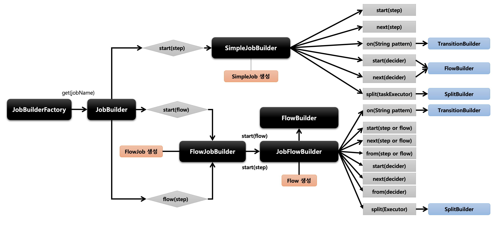
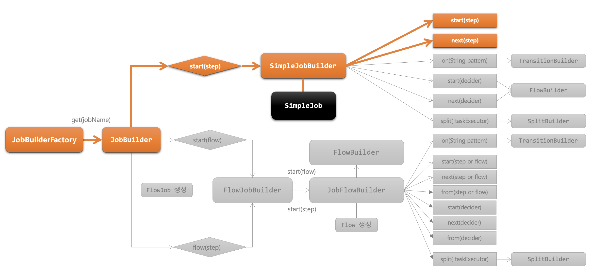
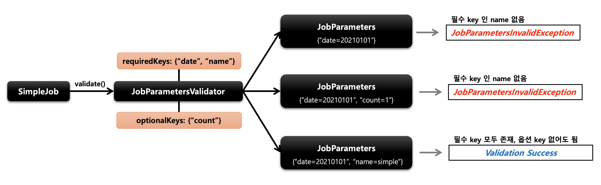
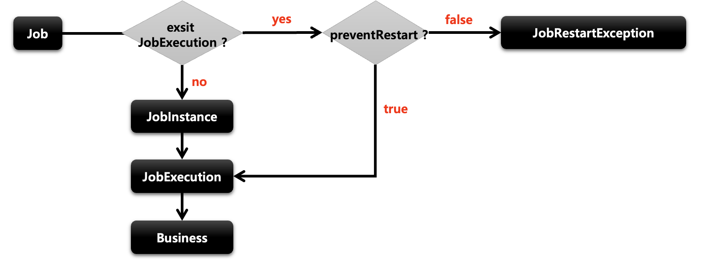
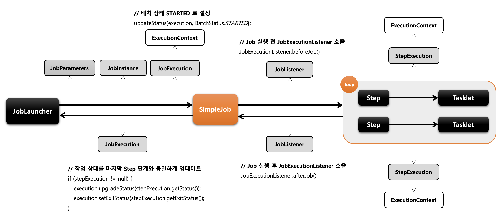

# Chapter 04 "스프링 배치 실행"

## 01. 배치 초기화 설정

### 1) JobLauncherApplicationRunner

* Spring Batch 작업을 시작하는 ApplicationRunner 로서 BatchAutoConfiguration 에서 생성된다.
* 스프링 부트에서 제공하는 ApplicationRunner 의 구현체로 어플리케이션이 정상적으로 구동되자 마다 실행된다.
* 기본적으로 빈으로 등록된 모든 job 을 실행시킨다.

```java
public class BatchAutoConfiguration {
    public BatchAutoConfiguration() {
    }
    ...

    public JobLauncherApplicationRunner jobLauncherApplicationRunner(JobLauncher jobLauncher, JobExplorer jobExplorer, JobRepository jobRepository, BatchProperties properties) {
        JobLauncherApplicationRunner runner = new JobLauncherApplicationRunner(jobLauncher, jobExplorer, jobRepository);
        String jobNames = properties.getJob().getNames();
        if (StringUtils.hasText(jobNames)) {
            runner.setJobNames(jobNames);
        }

        return runner;
    }
    ...
}
```

### 2) BatchProperties

* Spring Batch 의 환경 설정 클래스
* Job 이름, 스키마 초기화 설정, 테이블 Prefix 등의 값을 설정할 수 있다.
* application.properties or application.yml


### 3) Job 실행 옵션

* 지정한 Batch Job만 실행하도록 할 수 있다.
* spring.batch.job.names: ${job.name:NONE}

```yml
# job 을 argumanet로 받아서 실행할수 있다.
# --job.name=batchJob1
spring:
  batch:    
      names: ${job.name:NONE}

# 어플리케이션 실행시 Program arguments 로 job 이름을 입력한다.
--job.name=helloJob
--job.name=helloJob,simpleJob  (하나 이상의 job 을 실행 할 경우 쉼표로 구분해서 입력함)
```

## 02. Job and Step

* 스프링 배치는 Job 과 Step 을 쉽게 생성 및 설정할 수 있도록 util 성격의 빌더 클래스들을 제공한다.

### 1) JobBuilderFactory & JobBuilder

#### JobBuilderFactory

* JobBuilder 를 생성하는 팩토리 클래스로서 get(String name) 메서드를 제공한다.
* "jobName" 은 스프링 배치가 Job 을 실행시킬 때 참조하는 Job 의 이름이다.

```java
public class JobBuilderFactory {
    ...
    public JobBuilder get(String name) {
        JobBuilder builder = (JobBuilder)(new JobBuilder(name)).repository(this.jobRepository);
        return builder;
    }
}
```

#### JobBuilder

* Job 을 구성하는 설정 조건에 따라 두 개의 하위 빌더 클래스를 생성하고 실제 Job 생성을 위임한다.
* SimpleJobBuilder
    * SimpleJob 을 생성하는 Builder 클래스
    * Job 실행과 관련된 여러 설정 API 를 제공한다.
* FlowJobBuilder
    * FlowJob 을 생성하는 Builder 클래스
    * 내부적으로 FlowBuilder 를 반환함으로써 Flow 실행과 관련된 여러 설정 API 를 제공한다.



### 02) SimpleJob

#### SimpleJob 개념



* SimpleJob 은 Step 을 실행시키는 Job 구현체로서 SimpleJobBuilder 에 의해 생성된다.
* 여러 단계의 Step 으로 구성할 수 있으며 Step 을 순차적으로 실행시킨다.
* 모든 Step 의 실행이 성공적으로 완료되어야 Job 이 성공적으로 완료 된다.
* 맨 마지막에 실행한 Step 의 BatchStatus 가 Job 의 최종 BatchStatus 가 된다.

> JobBuilderFactory > JobBuilder > SimpleJobBuilder  > SimpleJob

```java
public Job batchJob() {
    return jobBuilderFactory.get("batchJob")        // JobBuilder 를 생성하는 팩토리,  Job 의 이름을 매개변수로 받음
            .start(Step)                            // 처음 실행 할 Step 설정,  최초 한번 설정, 이 메서드를 실행하면 SimpleJobBuilder 반환
            .next(Step)                             // 다음에 실행 할 Step 설정, 횟수는 제한이 없으며 모든 next() 의 Step 이 종료가 되면 Job 이 종료된다
            .incrementer(JobParametersIncrementer)  // JobParameter 의 값을 자동을 증가해 주는 JobParametersIncrementer 설정
            .preventRestart(true)                   // Job 의 재 시작 가능 여부 설정, 기본값은 true
            .validator(JobParameterValidator)       // JobParameter 를 실행하기 전에 올바른 구성이 되었는지 검증하는 JobParametersValidator 설정
            .listener(JobExecutionListener)         // Job 라이프 사이클의 특정 시점에 콜백 제공받도록 JobExecutionListener 설정 
            .build();                               // SimpleJob 생성
}

```

#### validator()

* Job 실행에 꼭 필요한 파라미터를 검증하는 용도
* DefaultJobParametersValidator 구현체를 지원하며, 좀 더 복잡한 제약 조건이 있다면 인터페이스를 직접 구현할 수도 있다.

```java
public interface JobParametersValidator {
    // JobParameters  값을 매개변수로 받아 검증
    void validate(@Nullable JobParameters var1) throws JobParametersInvalidException;
}
```



#### preventRestart()

* Job 의 재 시작 여부를 설정
* 기본 값은 true 이며 false 로 설정 시 '이 Job은 재 시작을 지원하지 않는다' 라는 의미
* Job 이 실패해도 재 시작이 안되며 Job을 재 시작하려고 하면 JobRestartException이 발생
* 재 시작과 관련 있는 기능으로 Job 을 처음 실행하는 것 과는 아무런 상관 없음
* Job 의 실행이 처음이 아닌 경우는 Job 의 성공/실패와 상관없이 오직 preventRestart 설정 값에 따라서 실행 여부를 판단한다 



#### incrementer()

* JobParameters 에서 필요한 값을 증가시켜 다음에 사용될 JobParameters 오브젝트를 리턴
* 기존의 JobParameter 변경없이 Job 을 여러 번 시작하고자 할때
* RunIdIncrementer 구현체를 지원하며 인터페이스를 직접 구현할 수 있음

```java
public interface JobParametersIncrementer {
    JobParameters getNext(@Nullable JobParameters var1);
}

// 인터페이스를 직접 구현
public class HolaJobParametersIncrementer implements JobParametersIncrementer {

    private static String RUN_DATE_KEY = "run.date";

    @Override
    public JobParameters getNext(JobParameters jobParameters) {
        return (new JobParametersBuilder(ObjectUtils.isEmpty(jobParameters) ? new JobParameters() : jobParameters)).addDate(RUN_DATE_KEY, new Date()).toJobParameters();
    }
}
```

#### SimpleJob 아키텍처



### 3) StepBuilderFactory & StepBuilder

### 4) TaskletStep

### 5) JobStep

## 03. Job and Flow

## 04. @JobScope / @StepScope