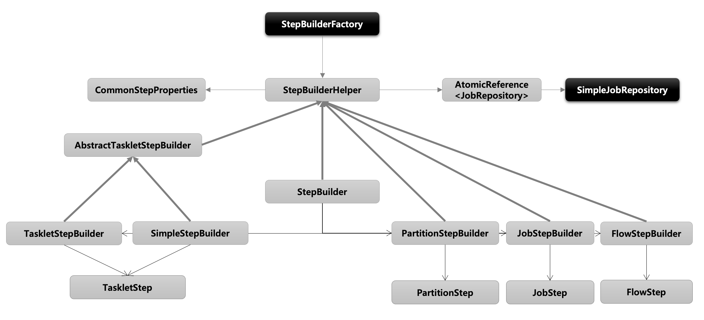

# Chapter 05 "스프링 배치 실행 - Step"

## 01. StepBuilderFactory & StepBuilder

### 1) StepBuilderFactory

* Step을 만들기 위해서는 StepBuilderFactory를 이용해야한다. 
* StepBuilderFactory는 StepBuilder 를 생성하는 팩토리 클래스로서 get(String name) 메서드를 제공한다.

```java
// "stepName" 으로 Step 을 생성
StepBuilderFactory.get("stepName") 
```

### 2) StepBuilder  

* Step 을 구성하는 설정 조건에 따라 다섯 개의 하위 빌더 클래스를 생성하고 실제 Step 생성을 위임한다.
* Step 생성 
    1. StepBuilderFactory에서 get() 메서드를 이용하면 StepBuilder를 반환해준다. 
    1. StepBuilder는 어떤 메서드를 사용하고, 어떤 메서드를 사용하는지에 따라 여러 종류의 하위 StepBuilder를 반환해준다. 
    1. 그리고 이 하위 StepBuilder를 이용해서 Step을 만들게 된다. 
* 생성 Builder
    * TaskletStepBuilder - TaskletStep 을 생성하는 기본 빌더 클래스 (Tasklet 구현체를 실행)
    * SimpleStepBuilder - TaskletStep 을 생성하며 내부적으로 청크기반의 작업을 처리하는 ChunkOrientedTasklet  클래스를 생성한다.
    * PartitionStepBuilder - PartitionStep 을 생성하며 멀티 스레드 방식으로 Job 을 실행한다.
    * JobStepBuilder - JobStep 을 생성하여 Step 안에서 Job 을 실행한다.
    * FlowStepBuilder - FlowStep 을 생성하여 Step 안에서 Flow 를 실행한다.


### 3) 상속 구조



* StepBuilderHelper 클래스는 공통 설정 클래스인 CommonStepProperties를 가지고 있으며, 메타 정보 기록을 위한 JobRepository 클래스도 가지고 있다. <br>
(JobRepository 은 빌더 클래스를 통해 Step 객체에 전달되어 메타데이터를 기록하는데 사용된다.)
* 각각의 Builder들은 StepBuilderHelper 객체를 상속받는다. 
* StepBuilderFactory는 get() 메서드를 이용해 StepBuilder를 반환한다.
* StepBuilder는 전달되는 메서드에 따라서 TaskletStepBuilder, SimpleStepBuilder, PartitionStepBuilder, JobStepbuilder, FlowStepBuilder 등을 만든다. 
* 각 하위 StepBuilder들은 각각의 Step을 만들어서 반환해준다. 

## 02. TaskletStep

### 1) 개념 및 API 소개

#### 기본 개념

* TaskLetStep은 내부적으로 TaskLet을 가지는 객체이며, TaskLet은 실제 일을 하는 객체이다.
* TaskLetStep은 내부적으로 RepetableTemplate 객체를 가지는데, 이 객체를 통해 TaskLet을 기본적으로는 트랜잭션 내에서 무한대로 반복하는 형태의 동작을 한다.
    * Transaction 처리 없이 자동으로 Transaction 내에서 비즈니스 로직이 수행되므로, 별도의 트랜잭션 처리를 위한 구문을 작성할 필요가 없다.
    * TaskLetStep은 기본적으로 무한히 반복하는 형태로 동작을 하는데, 단 한번만 동작하기 위해서는 TaskLet 객체를 반환할 때 RepeatStatus.Finished / null값을 반환하면 단 한번만 반복한다. 
* Task 기반과 Chunk 기반으로 나누어서 Tasklet 을 실행한다.

#### Task vs Chunk 기반 비교

* 스프링 배치에서 Step의 실행 단위는 크게 2가지로 나누어짐.


* Task 기반
    * ItemReader 와 ItemWriter 와 같은 청크 기반의 작업 보다 단일 작업 기반으로 처리되는 것이 더 효율적인 경우
    * 주로 Tasklet 구현체를 만들어 사용
    * 대량 처리를 하는 경우 chunk 기반에 비해 더 복잡한 구현 필요
* chunk 기반
    * 하나의 큰 덩어리를 n개씩 나눠서 실행한다는 의미로 대량 처리를 하는 경우 효과적으로 설계 됨
    * ItemReader, ItemProcessor, ItemWriter 를 사용하며 청크 기반 전용 Tasklet 인 ChunkOrientedTasklet 구현체가 제공된다.
* 비교
    * TaskLet 기반은 단일 객체를 바탕으로 비즈니스 로직을 수행하고, Chunk 기반은 ItemReader, ItemProcessor, ItemWriter로 나누어져 객체가 기능을 수행하는 것으로 이해할 수 있다. 
    * 둘다 동일하게 Tasklet 클래스를 실행시키지만, Custom 하게 단일 처리를 하기 위해서는 Task 기반을, Cunk 기반의 대량 작업을 할 경우에는 Chunk 기반을 사용한다.

#### StepBuilderFactory > StepBuilder > TaskletStepBuilder  > TaskletStep

```java
public Step batchStep() {
        // StepBuilder 를 생성하는 팩토리,  Step 의 이름을 매개변수로 받음
    return stepBuilderFactory.get("batchStep")
        // Tasklet 클래스 설정, 이 메서드를 실행하면 TaskletStepBuilder 반환
        .tasklet(Tasklet)
        // Step의 실행 횟수를 설정, 설정한 만큼 실행되고 초과시 오류 발생, 기본값음 INTEGER.MAX_VALUE
        .startLimit(10)
        // Step의 성공, 실패와 상관없이 항상 Step 을 실행하기 위한 설정
        .allowStartIfComplete(true)
        // Step 라이프 사이클의 특정 시점에 콜백 제공받도록 StepExecutionListener 설정
        .listener(StepExecutionListener)
        // TaskletStep 을 생성
        .build();
    }
```

#### 실행

* Task 기반으로 TaskletStep 생성

```java
public Step step() {
    return this.stepBuilderFactory.get("step")
        .tasklet(myTasklet())
        .build();
}

public abstract class AbstractTaskletStepBuilder<B extends AbstractTaskletStepBuilder<B>> extends StepBuilderHelper<AbstractTaskletStepBuilder<B>> {
    public TaskletStep build() {
        this.registerStepListenerAsChunkListener();
        TaskletStep step = new TaskletStep(this.getName());
        super.enhance(step);
        step.setChunkListeners((ChunkListener[])this.chunkListeners.toArray(new ChunkListener[0]));
        if (this.transactionAttribute != null) {
            step.setTransactionAttribute(this.transactionAttribute);
        }

        if (this.stepOperations == null) {
            this.stepOperations = new RepeatTemplate();
            if (this.taskExecutor != null) {
                // RepeatTemplate 를 사용해서 Tasklet 의 구문을 트랜잭션 내에서 반복해서 실행함
                TaskExecutorRepeatTemplate repeatTemplate = new TaskExecutorRepeatTemplate();
                repeatTemplate.setTaskExecutor(this.taskExecutor);
                repeatTemplate.setThrottleLimit(this.throttleLimit);
                this.stepOperations = repeatTemplate;
            }

            ((RepeatTemplate)this.stepOperations).setExceptionHandler(this.exceptionHandler);
        }

        step.setStepOperations(this.stepOperations);
        step.setTasklet(this.createTasklet());  // Tasklet 전달
        step.setStreams((ItemStream[])this.streams.toArray(new ItemStream[0]));

        try {
            step.afterPropertiesSet();
            return step;
        } catch (Exception var3) {
            throw new StepBuilderException(var3);
        }
    }
}

public abstract class StepBuilderHelper<B extends StepBuilderHelper<B>> {
    protected void enhance(Step target) {
        if (target instanceof AbstractStep) {
            AbstractStep step = (AbstractStep)target;
            // JobRepository 은 빌더 클래스를 통해 Step 객체에 전달되어 메타데이터를 기록하는데 사용된다.
            step.setJobRepository(this.properties.getJobRepository());
            // 각각의 API 설정
            Boolean allowStartIfComplete = this.properties.allowStartIfComplete;
            if (allowStartIfComplete != null) {
                step.setAllowStartIfComplete(allowStartIfComplete);
            }

            step.setStartLimit(this.properties.startLimit);
            List<StepExecutionListener> listeners = this.properties.stepExecutionListeners;
            if (!listeners.isEmpty()) {
                step.setStepExecutionListeners((StepExecutionListener[])listeners.toArray(new StepExecutionListener[0]));
            }
        }

        // 트랜잭션 처리
        if (target instanceof TaskletStep) {
            TaskletStep step = (TaskletStep)target;
            step.setTransactionManager(this.properties.transactionManager);
        }

    }
}
```

* Chunk 기반으로 TaskletStep 생성

```java
public Step step() {
    return this.stepBuilderFactory.get("step")
    	.<String, String>chunk(100)
        .reader()
        .writer()
        .build();
}

public class ChunkOrientedTasklet<I> implements Tasklet {
    ...
    @Nullable
    public RepeatStatus execute(StepContribution contribution, ChunkContext chunkContext) throws Exception {
        Chunk<I> inputs = (Chunk)chunkContext.getAttribute("INPUTS");
        if (inputs == null) {
            inputs = this.chunkProvider.provide(contribution);
            if (this.buffering) {
                chunkContext.setAttribute("INPUTS", inputs);
            }
        }

        this.chunkProcessor.process(contribution, inputs);
        this.chunkProvider.postProcess(contribution, inputs);
        if (inputs.isBusy()) {
            logger.debug("Inputs still busy");
            return RepeatStatus.CONTINUABLE;
        } else {
            chunkContext.removeAttribute("INPUTS");
            chunkContext.setComplete();
            if (logger.isDebugEnabled()) {
                logger.debug("Inputs not busy, ended: " + inputs.isEnd());
            }

            return RepeatStatus.continueIf(!inputs.isEnd());
        }
    }
}
```

### 2) API 설정

#### tasklet()

* 기본 개념
    * Tasklet 타입의 클래스를 설정한다.
    * Tasklet
        * Step 내에서 구성되고 실행되는 도메인 객체로서 주로 단일 태스크를 수행하기위한 것
        * TaskletStep 에 의해 반복적으로 수행되며 반환값에 따라 계속 수행 혹은 종료한다
        * RepeatStatus - Tasklet 의 반복 여부 상태 값
            * RepeatStatus.FINISHED - Tasklet 종료, RepeatStatus 을 null 로 반환하면 RepeatStatus.FINISHED로 해석됨
            * RepeatStatus.CONTINUABLE - Tasklet 반복
            * RepeatStatus.FINISHED가 리턴되거나 실패 예외가 던져지기 전까지 TaskletStep 에 의해 while 문 안에서 반복적으로 호출됨 (무한루프 주의)
    * 익명 클래스 혹은 구현 클래스를 만들어서 사용한다.
    * 이 메소드를 실행하게 되면 TaskletStepBuilder 가 반환되어 관련 API 를 설정할 수 있다.
    * Step 에 오직 하나의 Tasklet 설정이 가능하며 두개 이상을 설정 했을 경우 마지막에 설정한 객체가 실행된다.
* 구조
```java
public interface Tasklet {
    @Nullable
    RepeatStatus execute(StepContribution var1, ChunkContext var2) throws Exception;
}
```
* 사용
```java
public Step batchStep() {
    return stepBuilderFactory.get("batchStep")
        .tasklet(new Tasklet() {
            @Override
            public RepeatStatus execute(StepContribution contribution, ChunkContext chunkContext) throws Exception {
                // To do Business Logic
                return RepeatStatus.FINISHED; }
            })
        .startLimit(10)
        .allowStartIfComplete(true)
        .listener(StepExecutionListener)
        .build();
}
```

#### startLimit()

* 기본 개념
    * Step의 실행 횟수를 조정할 수 있다
    * Step 마다 설정할 수 있다
    * 설정 값을 초과해서 다시 실행하려고 하면 StartLimitExceededException이 발생
    * start-limit의 디폴트 값은 Integer.MAX_VALUE
* 사용
```java
public Step batchStep() {
    return stepBuilderFactory.get("batchStep")
	    .tasklet(Tasklet)
        .startLimit(10)
        .allowStartIfComplete(true)
        .listener(StepExecutionListener)
        .build();
}
```

#### allowStartIfComplete()

* 기본 개념
    * 재시작 가능한 job 에서 Step 의 이전 성공 여부와 상관없이 항상 step 을 실행하기 위한 설정<br>(실행 마다 유효성을 검증하는 Step이나 사전 작업이 꼭 필요한 Step 등)
    * 기본적으로 COMPLETED 상태를 가진 Step 은 Job 재 시작 시 실행하지 않고 스킵한다.
    * allow-start-if-complete가 “true”로 설정된 step은 항상 실행한다.
* 흐름도<br>

    * BatchStatus.COMPLETED 상태가 아니면, 원칙적으로는 Step 이 실행되지 않는다.
    * 그러나 Yes이면 Tasklet을 수행한다.
* 사용
    ```java
    public Step batchStep() {
        return stepBuilderFactory.get("batchStep")
            .tasklet(Tasklet)
            .startLimit(10)
            .allowStartIfComplete(true)
            .listener(StepExecutionListener)
            .build();
    }
    ```

### 3) TaskletStep 아키텍처

* 기본 구조<br>
    * 예외, 반복의 상태에 따라서 지속적으로 반복 가능한 구성이다.
* Tasklet 실행을 위한 설정/실행 단계<br>

## 03. JobStep

### 1) 기본 개념
* Job 에 속하는 Step 중 외부의 Job 을 포함하고 있는 Step
* 외부의 Job 이 실패하면 해당 Step 이 실패하므로 결국 최종 기본 Job 도 실패한다
* 모든 메타데이터는 기본 Job 과 외부 Job 별로 각각 저장된다.
* 커다란 시스템을 작은 모듈로 쪼개고 job의 흐름를 관리하고자 할 때 사용할 수 있다.

### 2) API

> StepBuilderFactory > StepBuilder > JobStepBuilder  > JobStep

```java
public Step jobStep() {
        // StepBuilder 를 생성하는 팩토리,  Step 의 이름을 매개변수로 받음
    return stepBuilderFactory.get("jobStep")
        // JobStep 내 에서 실행 될 Job 설정, JobStepBuilder  반환
        .job(Job)
        // Job 을 실행할 JobLauncher설정
        .launcher(JobLauncher)
        // Step의 ExecutionContext를 Job이 실행되는 데 필요한 JobParameters로 변환
        .parametersExtractor(JobParametersExtractor)
        // JobStep 을 생성
        .build();
}
```


## Reference

* https://ojt90902.tistory.com/772