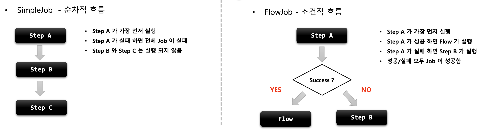
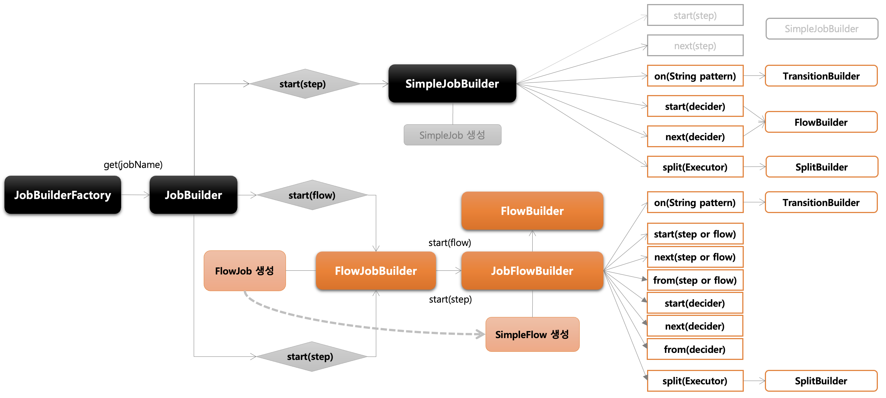
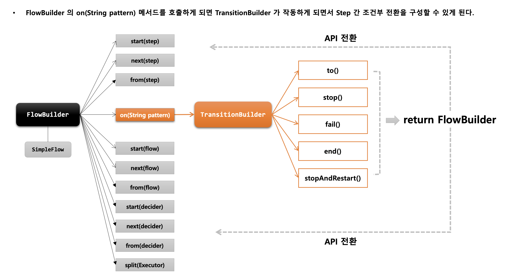
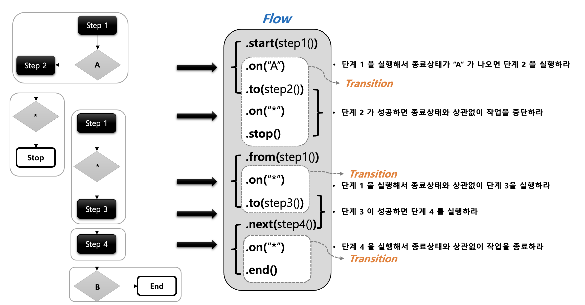
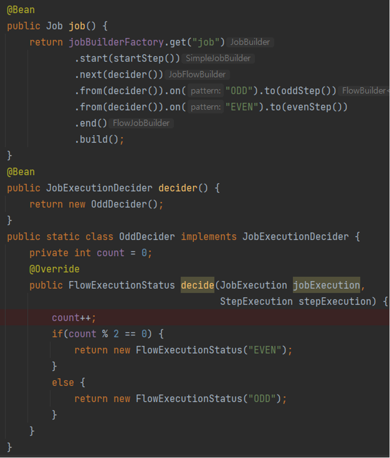
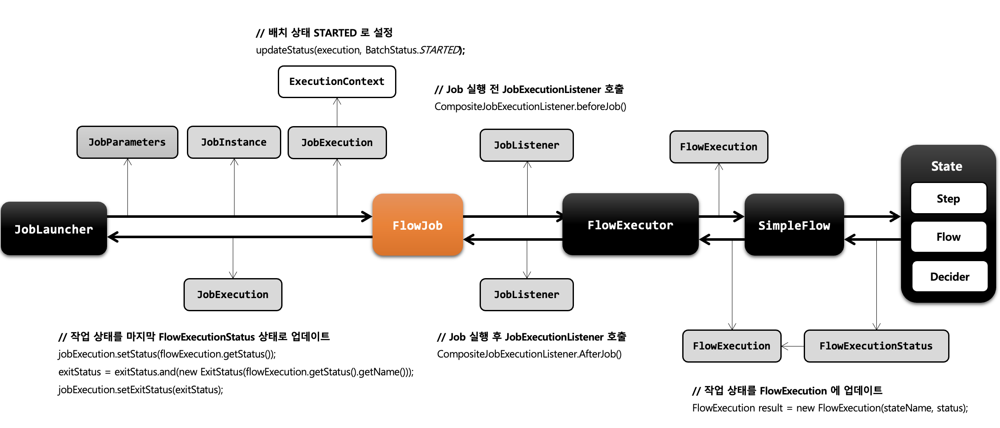

# Chapter 06 "스프링 배치 실행 - Flow"

* Job/Step에 Flow 라는 개념이 더해지면 정해진 순서나 패턴이 아닌, 유연하고 상대적으로 복잡한 구성을 할 수 있다.

## 01. FlowJob

### 1) 개념 및 API 소개

#### 기본개념

* Step 을 순차적으로만 구성하는 것이 아닌 특정한 상태에 따라 흐름을 전환하도록 구성할 수 있으며 FlowJobBuilder 에 의해 생성된다.
    * Step 이 실패 하더라도 Job 은 실패로 끝나지 않도록 해야 하는 경우
    * Step 이 성공 했을 때 다음에 실행해야 할 Step 을 구분해서 실행 해야 하는경우
    * 특정 Step은 전혀 실행되지 않게 구성 해야 하는 경우
* Flow 와 Job 의 흐름을 구성하는데만 관여하고 실제 비즈니스 로직은 Step 에서 이루어진다.
* 내부적으로 SimpleFlow 객체를 포함하고 있으며 Job 실행 시 호출한다.

#### SimpleJob vs. FlowJob



#### 실행

> JobBuilderFactory > JobBuilder > JobFlowBuilder > FlowBuilder  > FlowJob

```java
public Job batchJob() {
    return jobBuilderFactory.get("batchJob")
        .start(Step)    // Flow 시작하는 Step 설정
        .on(String pattern) // Step의 실행 결과로 돌려받는 종료상태 (ExitStatus)를 캐치하여 매칭하는 패턴, TransitionBuilder 반환
        .to(Step)       // 다음으로 이동할 Step 지정
        .stop() / fail() / end() / stopAndRestart()	   // Flow 를 중지 / 실패 / 종료 하도록  Flow 종료 (Job 을 중지시키는것이 아님)
        .from(Step)     // 이전 단계에서 정의한 Step 의 Flow 를 추가적으로 정의함
        .next(Step)     // 다음으로 이동할 Step 지정
        .end()          // build() 앞에 위치하면 FlowBuilder 를 종료하고 SimpleFlow 객체 생성
        .build()        // FlowJob 생성하고 flow 필드에 SimpleFlow 저장
}
```

* Flow: 흐름을 정의하는 역할 (start/from/next)
* Transtition: 조건에 따라 흐름을 전환시키는 역할 (on/to/stop/fail/end/stopAndRestart)

```java
// example
public Job firewallTestJob_step() {
    return jobBuilderFactory.get(JOB_NAME)
            .start(firewallTestJob_step1())
                .on(ExitStatus.COMPLETED.getExitCode()).to(firewallTestJob_step2())
            .from(firewallTestJob_step1())
                .on(ExitStatus.FAILED.getExitCode()).to(firewallTestJob_step2())
            .from(firewallTestJob_step2())
                .on(ExitStatus.COMPLETED.getExitCode()).to(firewallTestJob_step3())
            .from(firewallTestJob_step2())
                .on(ExitStatus.FAILED.getExitCode()).to(firewallTestJob_step3())
            .end()
            .incrementer(new SsgJobParametersIncrementer())
            .listener(new SsgJobExecutionListener())
            .build();
}
```

#### API 소개

* 단순한 Step으로 생성하는 SimpleJob 보다 다양한 Flow로 구성하는 FlowJob의 생성 구조가 더 복잡하고 많은 API를 제공한다.



* `on`은 TransitionBuilder로 가기 위한 API이고, to/stop/fail() 등의 API를 통해 FlowBuilder를 반환하여 다시 API를 사용할 수 있다.



```java
public class FlowBuilder<Q> {
    ...
    public static class TransitionBuilder<Q> {
        private final FlowBuilder<Q> parent;
        private final String pattern;

        public TransitionBuilder(FlowBuilder<Q> parent, String pattern) {
            this.parent = parent;
            this.pattern = pattern;
        }

        public FlowBuilder<Q> to(Step step) {
            State next = this.parent.createState(step);
            this.parent.addTransition(this.pattern, next);
            this.parent.currentState = next;
            return this.parent;
        }
    }
}
```

### 2) API 설정

#### start() / next()

```java
public Job batchJob() {
    return jobBuilderFactory.get("batchJob")
        // 처음 실행 할 Flow 설정, JobFlowBuilder 가 반환된다. 
        // 만약 여기에 Step 이 인자로 오게 되면 SimpleJobBuilder가 반환된다.
        .start(Flow)
        .next(Step or Flow or JobExecutionDecider)
        .on(String pattern)
	    .to(Step)
	    .stop() / fail() / end() / stopAndRestart()
	    .end()
        .build();
}
```

#### Transition

* 배치 상태 유형
    * BatchStatus
        * JobExecution 과 StepExecution의 속성으로 Job 과 Step 의 종료 후 최종 결과 상태가 무엇인지 정의
        * SimpleJob
            * 마지막 Step 의 BatchStatus 값을 Job 의 최종 BatchStatus 값으로 반영
            * Step 이 실패할 경우 해당 Step 이 마지막 Step 이 된다
        * FlowJob
            * Flow 내 Step 의 ExitStatus 값을 FlowExecutionStatus 값으로 저장
            * 마지막 Flow 의 FlowExecutionStatus 값을 Job 의 최종 BatchStatus 값으로 반영
        * COMPLETED, STARTING, STARTED, STOPPING, STOPPED, FAILED, ABANDONED, UNKNOWN 
    * ExitStatus
        * JobExecution 과 StepExecution의 속성으로 Job 과 Step 의 실행 후 어떤 상태로 종료되었는지 정의
        * 기본적으로 ExitStatus 는 BatchStatus 와 동일한 값으로 설정된다.
        * UNKNOWN, EXECUTING, COMPLETED, NOOP, FAILED, STOPPED
        * 사용자 정의 ExitStatus 설정 가능
    * FlowExecutionStatus
        * FlowExecution 의 속성으로 Flow 의 실행 후 최종 결과 상태가 무엇인지 정의
        * Flow 내 Step 이 실행되고 나서 ExitStatus 값을 FlowExecutionStatus 값으로 저장
        * FlowJob 의 배치 결과 상태에 관여함
        * COMPLETED, STOPPED, FAILED, UNKNOWN


* on() / to() / stop(), fail(), end(), stopAndRestart()

```java
public Job batchJob() {
    return jobBuilderFactory.get("batchJob")
        .start(Flow)
        .next(Step or Flow or JobExecutionDecider)
        // Transition Builder 를 반환하여 Transition Flow 를 구성
        .on(String pattern) 
	    .to(Step or Flow or JobExecutionDecider)
	    .stop() / fail() / end() / stopAndRestart(Step or Flow or JobExecutionDecider)
	    .end()
        .build();
}
```

* Transition
    * Flow 내 Step 의 조건부 전환(전이)을 정의함
    * Step의 종료상태(ExitStatus) 가 어떤 pattern 과도 매칭되지 않으면 스프링 배치에서 예외을 발생하고 Job 은 실패
    * transition은 구체적인 것부터 그렇지 않은 순서로 적용된다.
* API
    * on(String Pattern) - Sterp의 실행 결과로 돌려받는 종료상태(ExitStatus)와 매칭이 되면, 다음으로 실행할 Step을 지정할 수 있다.
    * to() - 다음으로 실행할 단계를 지정
    * from() - 이전 단계에서 정의한 Transition을 새롭게 추가 정의
    * stop(), fail(), end(), stopAndRestart() - STOPPED/FAILED/COMPLETED/STOPPED
        * Flow가 실행되면 FlowExecutionStatus 에 상태값이 저장되고 최종적으로 Job 의 BatchStatus 와 ExitStatus 에 반영된다.
        * Step의 BatchStatus 및 ExitStatus 에는 아무런 영향을 주지 않고 Job 의 상태만을 변경한다.



#### JobExecutionDecider

* ExitStatus 를 조작하거나 StepExecutionListener 를 등록할 필요 없이 Transition 처리를 위한 전용 클래스
* Step과 Transition 역할을 명확히 분리해서 설정할 수 있음.



### 3) FlowJob 아키텍처



## 02. SimpleFlow

### 1) 개념 및 API 소개

* 스프링 배치에서 제공하는 Flow 의 구현체로서 각 요소(Step, Flow, JobExecutionDecider) 들을 담고 있는 State 를 실행시키는 도메인 객체
* FlowBuilder 를 사용해서 생성하며 Transition 과 조합하여 여러 개의 Flow 및 중첩 Flow 를 만들어 Job 을 구성할 수 있다.

> JobBuilderFactory > FlowJobBuilder > FlowBuilder > SimpleFlow

```java
public Job batchJob() {
    return jobBuilderFactory.get("flowJob")
        .start(flow1()) // SimpleFlow
        .on("COMPLETED").to(flow2())    // SimpleFlow
        .end()  // flow1, flow2를 포함하는 SimpleFlow 객체 생성
        .build();   // FlowJob 객체 생성
}
```

## 03. FlowStep

* Step 내에 Flow 를 할당하여 실행시키는 도메인 객체
* flowStep 의 BatchStatus 와 ExitStatus 은 Flow 의 최종 상태값에 따라 결정된다.

> StepBuilderFactory > StepBuilder > FlowStepBuilder  > FlowStep

```java
public Step flowStep() {
    return stepBuilderFactory.get("flowStep")
        .flow(flow())   // Step 내에서 실행 될 flow 설정, FlowStepBuilder 반환
        .build();       // FlowStep 객체를 생성
}
```

## 04. @JobScope / @StepScope

* 