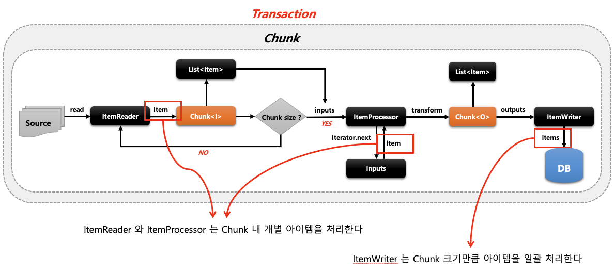
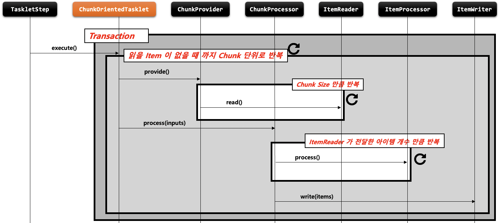
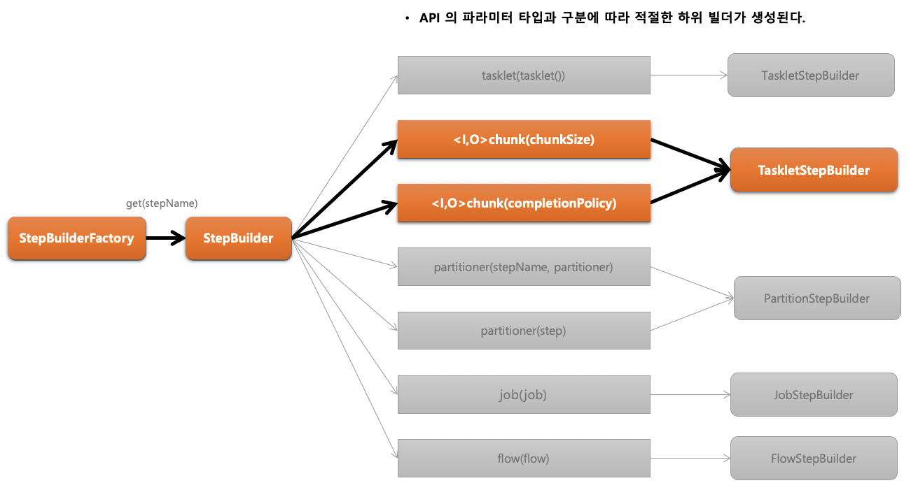

# Chapter 07 "스프링 배치 청크 프로세스"

## 01. Chunk

### 1) 기본 개념

* 한번에 하나씩 아이템을 입력 받아 Chunk 단위의 덩어리로 만든 후 Chunk 단위로 트랜잭션을 처리함, 즉 Chunk 단위의 Commit 과 Rollback 이 이루어짐.
* 일반적으로 대용량 데이터를 한번에 처리하는 것이 아닌 청크 단위로 쪼개어서 더 이상 처리할 데이터가 없을 때까지 반복해서 입출력하는데 사용됨.

### 2) Chunk<I/O>

* Chunk<I> 는 ItemReader 로 읽은 하나의 아이템을 Chunk 에서 정한 개수만큼 반복해서 저장하는 타입
* Chunk<O> 는 ItemReader 로부터 전달받은 Chunk<I> 를 참조해서 ItemProcessor 에서 적절하게 가공, 필터링한 다음 ItemWriter 에 전달하는 타입



## 02. ChunkOrientedTasklet

### 1) 개념 및 API

#### 개념

* ChunkOrientedTasklet 은 스프링 배치에서 제공하는 Tasklet 의 구현체로서 Chunk 지향 프로세싱를 담당하는 도메인 객체
* ItemReader, ItemWriter, ItemProcessor 를 사용해 Chunk 기반의 데이터 입출력 처리를 담당한다.
* TaskletStep 에 의해서 반복적으로 실행되며 ChunkOrientedTasklet 이 실행 될 때마다 매번 새로운 트랜잭션이 생성되어 처리가 이루어진다.
* exception이 발생할 경우, 해당 Chunk는 롤백 되며 이전에 커밋한 Chunk는 완료된 상태가 유지된다.
* 내부적으로 ItemReader 를 핸들링 하는 ChunkProvider 와 <br>
ItemProcessor, ItemWriter 를 핸들링하는 ChunkProcessor 타입의 구현체를 가진다.



#### 구조

```java
public class ChunkOrientedTasklet<I> implements Tasklet {
    private final ChunkProcessor<I> chunkProcessor; // Chunk 단위 아이템 처리자 (ItemProcessor, ItemWriter) 
    private final ChunkProvider<I> chunkProvider;   // Chunk 단위 아이템 제공자 (ItemReader)
}
```

#### ChunkOrientedTasklet 클래스

```java 
public RepeatStatus execute(StepContribution contribution, ChunkContext chunkContext) throws Exception {

    /**
     * 데이터 가지고 오기
     */
    
    // Chunk 처리 중 예외가 발생하여 재 시도할 경우 다시 데이터를 읽지 않고 버퍼에 담아 놓았던 데이터를 가지고 옴
    Chunk<I> inputs = (Chunk)chunkContext.getAttribute("INPUTS");
    if (inputs == null) {
        // Item 을 Chunk size 만큼 반복해서 읽은 다음 Chunk<I> 에 저장하고 반환
        inputs = this.chunkProvider.provide(contribution);
        if (this.buffering) {
            // Chunk 를 캐싱하기 위해 ChunkContext 버퍼에 담음
            chunkContext.setAttribute("INPUTS", inputs);
        }
    }

    /**
     * 데이터 처리
     */

    // ChunkProvider 로 부터 받은 Chunk<I> 의 아이템 개수만큼 데이터를 가공하고 저장
    this.chunkProcessor.process(contribution, inputs);
    this.chunkProvider.postProcess(contribution, inputs);
    if (inputs.isBusy()) {
        logger.debug("Inputs still busy");
        return RepeatStatus.CONTINUABLE;
    } else {
        // Chunk 단위 입출력이 완료되면 버퍼에 저장한 Chunk 데이터 삭제
        chunkContext.removeAttribute("INPUTS");
        chunkContext.setComplete();
        if (logger.isDebugEnabled()) {
            logger.debug("Inputs not busy, ended: " + inputs.isEnd());
        }

        // 읽을 Item 이 더 존재하는지 체크해서 존재하면 Chunk 프로세스 반복하고 
        // null 일경우 RepeatStaus.FINISHED 반환하고 Chunk 프로세스 종료
        return RepeatStatus.continueIf(!inputs.isEnd());
    }
}
```

#### API

> StepBuilderFactory > StepBuilder > SimpletepBuilder  > TaskletStep



```java
public Step chunkStep() {
    return stepBuilderFactory.get(STEP_NAME)
            // Chunk Size 설정 (=Commit Interval)
            .<I, O>chunk(500)
            // 소스로 부터 item 을 읽거나 가져오는 ItemReader 구현체 설정
            .reader(itemReader())
            // item 을 변형, 가공, 필터링 하기 위한 ItemProcessor 구현체 설정
            .processor(itemProcessor())
            // item 을 목적지에 쓰거나 보내기 위한 ItemWriter 구현체 설정
            .writer(itemWriter())
            .build();
}

```

### 2) ChunkProvider / ChunkProcessor

#### ChunkProvider

* ItemReader 를 사용해서 소스로부터 아이템을 Chunk size 만큼 읽어서 Chunk 단위로 만들어 제공하는 도메인 객체
* Chunk<I> 를 만들고 내부적으로 반복문을 사용해서 ItemReader.read() 를 계속 호출하면서 item 을 Chunk 에 쌓는다.


```java
public interface ChunkProvider<T> {
    // Item 읽고 Chunk 단위로 저장해서 반환
    Chunk<T> provide(StepContribution var1) throws Exception;
}

```

#### ChunkProcessor

* ItemProcessor 를 사용해서 Item 을 변형, 가공, 필터링하고 ItemWriter 를 사용해서 Chunk 데이터를 저장, 출력한다
* Chunk<O> 를 만들고 앞에서 넘어온 Chunk<I> 의 item 을 한 건씩 처리한 후 Chunk<O> 에 저장한다.

```java
public interface ChunkProcessor<I> {
    // Chunk Item 을 변형하고 저장
    void process(StepContribution var1, Chunk<I> var2) throws Exception;
}
```

## 03. ItemReader / ItemWriter / ItemProcessor

### 1) ItemReader

* 다양한 입력으로부터 데이터를 읽어서 제공하는 인터페이스 (File, DB, Message Queuing 서비스)

```java
public interface ItemReader<T> {
    @Nullable
    // 입력 데이터를 읽고 다음 데이터로 이동한다
    T read() throws Exception, UnexpectedInputException, ParseException, NonTransientResourceException;
}

```

### 2) ItemWriter

* Chunk 단위로 데이터를 받아 일괄 출력 작업을 하기 위한 인터페이스
* 아이템 하나가 아닌 아이템 리스트를 전달 받는다. 

```java
public interface ItemWriter<T> {
    // 출력이 완료되고 트랜잭션이 종료되면 새로운 Chunk 단위 프로세스로 이동한다.
    void write(List<? extends T> var1) throws Exception;
}
```

### 3) ItemProcessor

#### 개념

* 데이터를 출력하기 전에 데이터를 가공, 변형, 필터링하는 역할
* ItemReader 및 ItemWriter 와 분리되어 비즈니스 로직을 구현할 수 있다.

```java
public interface ItemProcessor<I, O> {
    @Nullable
    O process(@NonNull I var1) throws Exception;
}
```
