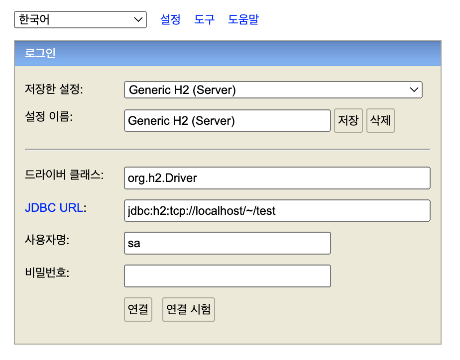

# Chapter 2 "JPA 시작"

## 1. 프로젝트 불러오기

* https://github.com/holyeye/jpabook

## 2. H2 데이터베이스 설치

* H2 데이터 베이스
    * 자바 기반의 오픈소스 관계형 DBMS 이다.
    * 설치가 필요 없고 용량 1.7M로 가벼워서, 개발용 로컬 DB 및 테스트 환경에서 사용하기 좋다.  
* H2 DB를 1.4.199 버전으로 설치
    * http://h2database.com/html/main.html
* H2 DB 실행
    * /h2/bin/h2.sh 을 실행하면 서버 모드로 실행된다.

```bash
# bin 으로 들어간다.
$ cd h2/bin

# 실행 파일에 권한을 준다.
$ chmod 755 h2.sh

# h2 DB를 실행한다.
$ ./h2.sh
```

* 웹 콘솔 접속<br>

    * http://localhost:8082/
    * 접속 정보 - jdbc:h2:tcp://localhost/~/test
    * h2 1.4.198 이후 버전부터는 보안 문제로 데이터베이스가 자동으로 생성되지 않기 때문에, 데이터베이스를 직접 생성한 후 연결해야 한다.

* 위 방법 또는 ... mac 버전 이슈로 권한 문제에 따른 에러가 발생하여 homebrew를 통해 H2 DB 이용

```bash
$ brew install hw
$ h2 -web
```

* Reference
    * https://atoz-develop.tistory.com/entry/H2-Database-%EC%84%A4%EC%B9%98-%EC%84%9C%EB%B2%84-%EC%8B%A4%ED%96%89-%EC%A0%91%EC%86%8D-%EB%B0%A9%EB%B2%95
    * https://dev-jj.tistory.com/entry/MacH2-%EB%8D%B0%EC%9D%B4%ED%84%B0%EB%B2%A0%EC%9D%B4%EC%8A%A4-%EC%97%90%EB%9F%AC-Database-Users-not-found-either-pre-create-it-or-allow-remote-database-creation-not-recommended-in-secure-environments-90149-200-9014990149-%EB%8F%84%EC%9B%80%EB%A7%90

## 3. 라이브러리와 프로젝트 구조

* 라이브러리
    * hibernate-core: JPA 표준과 하이버네이트를 포함하는 라이브러리
        * hibernate-core.jar 포함
        * hibernate-jpa-2.1-api.jar 포함 (JPA 2.1 표준 API를 모아둔 라이브러리)
    * h2 DB 라이브러리
```xml
<dependencies>
	<!-- JPA, 하이버네이트 -->
	<dependency>
		<groupId>org.hibernate</groupId>
		<artifactId>hibernate-entitymanager</artifactId>
		<version>${hibernate.version}</version>
	</dependency>
	<!-- H2 데이터베이스 -->
	<dependency>
		<groupId>com.h2database</groupId>
		<artifactId>h2</artifactId>
		<version>${h2db.version}</version>
	</dependency>
</dependencies>
```
* 프로젝트 구조
```java
src/main
|- java
    |-  jpabook/start
        |- JpaMain.java (실행 클래스)
        |- Member.java  (회원 엔티티)
|- resources
    |-  META-INF
        |- persistence.xml  (JPA 설정 정보)
pom.xml
```

## 4. persistence.xml 설정

* JPA 실행을 위한 기본 설정을 관리한다.

```xml
<?xml version="1.0" encoding="UTF-8"?>
<!-- XML 네임 스페이스와 버전 지정 -->
<persistence xmlns="http://xmlns.jcp.org/xml/ns/persistence" version="2.1">
    <!-- JPA 설정의 시작점. DB 당 1개의 영속성 유닛을 등록 -->
    <persistence-unit name="jpabook">

        <properties>

            <!-- 필수 속성 -->
            <!-- JPA 표준 속성 / DB 연결 -->
            <property name="javax.persistence.jdbc.driver" value="org.h2.Driver"/>
            <property name="javax.persistence.jdbc.user" value="sa"/>
            <property name="javax.persistence.jdbc.password" value=""/>
            <property name="javax.persistence.jdbc.url" value="jdbc:h2:tcp://localhost/~/test"/>
            <!-- 하이버네이트 전용 속성 / 데이터베이스 Dialect 설정 -->
            <property name="hibernate.dialect" value="org.hibernate.dialect.H2Dialect" />

            <!-- 옵션 -->
            <property name="hibernate.show_sql" value="true" />
            <property name="hibernate.format_sql" value="true" />
            <property name="hibernate.use_sql_comments" value="true" />
            <property name="hibernate.id.new_generator_mappings" value="true" />

            <!--<property name="hibernate.hbm2ddl.auto" value="create" />-->
        </properties>
    </persistence-unit>

</persistence>
```

### # Database Dialect (데이터베이스 방언)

* JPA는 특정 DB에 종속적이지 않은 기술이므로, 다른 DB로 손쉽게 교체할 수 있다.
* 그런데 DB마다 데이터 타입/함수명/페이징 처리 기술 등이 모두 다르므로, 이러한 특정 DB 만의 고유한 기능을 JPA에서는 Dialect 라고 한다.
* → 개발자는 JPA가 제공하는 표준 문법에 맞추어 JPA를 사용하면 되고, 특정 DB에 종속적인 SQL은 DB Dialect가 처리해준다.
* DBMS 별 hibernate dialect 설정은 persistence.xml 파일에서 hibernate.dialect 설정 값을 변경해주면 된다.


### # 하이버네이트 속성

* hibernate.show_sql: 하이버네이트가 실행한 SQL을 출력
* hibernate.format_sql: SQL을 정렬하여 출력
* hibernate.use_sql_comments: 쿼리와 함께 주석도 출력

## 5. Entity 클래스를 작성하여 객체 매핑 

* 회원 테이블

```sql
CREATE TABLE MEMBER (
    ID VARCHAR(255) NOT NULL, --아이디(기본 키)
    NAME VARCHAR(255),        --이름
    AGE INTEGER NOT NULL,     --나이
    PRIMARY KEY (ID)
)
```

* 회원 클래스와 회원 테이블 매핑

```java
import javax.persistence.*;  // JPA 어노테이션 패키지

@Getter
@Setter
@Entity // 이 클래스를 테이블과 매핑
@Table(name="MEMBER")   // 테이블 이름
public class Member {

    @Id // 식별자 필드 (PK)
    @Column(name = "ID")    // 컬럼에 매핑
    private String id;

    @Column(name = "NAME")
    private String username;

    private Integer age;    // 매핑 어노테이션을 생략하면, 자동으로 컬럼명에 매핑됨. (age 컬럼)
}
```

## 6. JPA로 CRUD 작성하기

### # 엔티티 메니저 설정

* 엔티티 매니저 팩토리
    * JPA 사용 준비를 하는 단계
    * Cost 가 크므로, 애플리케이션 실행할 때 한 번만 생성하고 공유하여 사용한다.
* 엔티티 매니저 생성
    * 엔티티 매니저를 사용해서 엔티티를 DB에 CRUD 한다.
    * DB 커넥션과 관계가 있으므로, Thread 간에 공유하거나 재사용하면 안된다.
* 사용이 끝난 앤티티 매니저/팩토리는 반드시 종료해야 한다.

```java
public class JpaMain {

    public static void main(String[] args) {

        // 1. JPA 사용 준비 /  엔티티 매니저 팩토리 생성
        EntityManagerFactory emFactory = Persistence.createEntityManagerFactory("jpabook");

        // 2. 엔티티 매니저를 생성하여 CRUD 진행
        EntityManager entityManager = emFactory.createEntityManager();

        // 3. 트랜잭션 생성 및 시작
        EntityTransaction transaction = entityManager.getTransaction();

        try {

            // 트랜잭션 시작 / 항상 트랜잭션 안에서 데이터를 변경해야 한다.
            transaction.begin();

            // CRUD와 관련된 비즈니스 로직
            logic(entityManager);

            // 트랜잭션 커밋
            transaction.commit();

        } catch (Exception e) {
            e.printStackTrace();
            // 트랜잭션 롤백
            transaction.rollback();
        } finally {
            // 엔티티 매니저 종료
            entityManager.close();
        }

        // 엔티티 매니저 팩토리 종료
        emFactory.close();
    }
}
```

### # CRUD 실행

* 저장: jpa.persist(member);
* 조회: Member member = jpa.find(memberId);
* 수정: member.setName("hello Jpa!");
* 삭제: jpa.remove(member);
* JPQL
    * JPA 를 활용해 검색시 테이블이 아닌 엔티티 객체를 대상으로 검색해야 하는데, DB의 모든 데이터를 애플리케이션을 불러와서 엔티티 객체로 변경한 다음 검색하는 것은 불가능하다.
    * 따라서, 애플리케이션이 필요한 데이터만 DB에서 불러오려면, 결국 검색 조건이 포함된 SQL을 사용해야 한다.
    * JPQL은 테이블이 아닌 엔티티 객체를 대상으로, 즉 클래스와 필드를 대상으로 쿼리한다. <br>
    (JPQL은 DB 테이블을 전혀 알지 못한다.)


```java
public static void logic(EntityManager entityManager) {
    // Member 객체 생성
    String id = "id1";
    Member member = new Member();
    member.setId(id);
    member.setUsername("spa-jpa");
    member.setAge(2);

    // 저장
    entityManager.persist(member);

    // 수정 / 엔티티의 값만 변경하면 UPDATE문이 생성되어 DB 값을 변경한다.
    member.setAge(20);

    // 1건 조회
    Member findMember = entityManager.find(Member.class, id);
    System.out.println("findMember=" + findMember.getUsername() + ", age=" + findMember.getAge());

    // 목록 조회 (검색 쿼리를 위한 쿼리 작성 기능 / JPQL 사용)
    // 조회 대상은 테이블이 아닌 엔티티 객체가 대상이다.
    List<Member> members = entityManager.createQuery("select m from Member m", Member.class).getResultList();
    System.out.println("members.size=" + members.size());

    // 삭제
    entityManager.remove(member);

    }
```