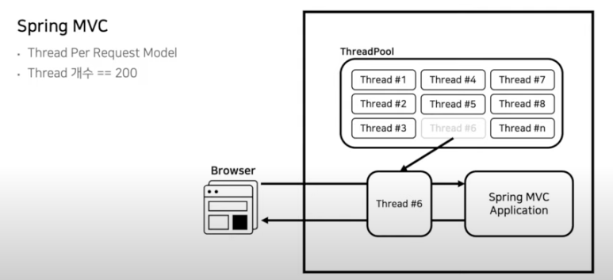

# 참고. "Spring Webflux란"

## Spring MVC와 Spring WebFlux의 기본 구조 차이, 그리고 성능

아래 동영상을 보고 간략하게나마 남겨본다.
Sprinc Webflux를 이해하기 가장 쉽고 편한 동영상이었다.
https://www.youtube.com/watch?v=I0zMm6wIbRI

### 1. Spring MVC와 Spring WebFlux의 차이

#### 1.1. Spring MVC

* Spring MVC의 서버는 스레드풀의 스레드를 하나씩 할당해 주고 사용 후 스레드 풀에 반납하는 Thread Per Request Model이다.
* 그러나 분산 시스템 서버에서 사용 시, 스레드 하나가 모든 서버를 처리하기 때문에 
Network I/O가 끝날 때까지 Waiting 하게 된다.
* 따라서 (200개의) 스레드가 CPU Core를 점유하기 위해서 경합하는 현상이 발생한다.

#### 1.2. Spring Webflux

* 사용자들의 요청이나 애플리케이션 내부에서 처리해야 하는 작업들은 모두 Event로 관리되고, Event Queue에 적재되어 순서대로 처리되는 EventLoop Model이다.
* 이벤트를 처리하는 스레드 루프(=이벤트 루프)가 이벤트 큐에서 이벤트를 풀어서 하나씩 처리하는 방식이다.
* 따라서 Webflux는 상대적으로 적은 스레드 Pool을 유지하기 때문에 CPU 사용량이 높은 작업량이 많거나 blocking I/O를 이용하여 프로그래밍을 한다면 이벤트 루프가 빨리 이벤트 큐에 있는 이벤트를 처리할 수가 없다. 
즉, 이 경우 전반적인 성능 저하가 발생한다.

### 2. WebFlux가 느린 이유

#### 2.1. 동영상 Case Study

* log 제거 및 RollingFileAppender로 변경
* 동기 처리는 map()으로 비동기 처리는 flatMap()으로 처리해야 한다.
* 너무 많은 map() 메서드 조합은 map() 연산마다 객체를 생성하므로 GC의 대상이 많아지는 단점이 있다.

#### 2.2. 성능 개선 사항

위 케이스에 덧붙여 개선 사항을 정리하면...

* blocking 코드가 있을 때에 성능 저하가 발생한다. 따라서 블로킹 코드를 찾아주는 라이브러리인 BlockHound를 테스트 코드 작성 시 활용하여 분석하자. 

* Reactor MeltDown를 피하자.
    * 가능하면 모든 코드들은 비동기 논 블로킹으로 개발해야 하지만, 상황에 따라서는 동기식 블로킹으로 개발할 때도 있다. 이 경우, EventLoop의 스레드들이 blocking API 때문에 Reactor 시스템 전체가 Hang 걸릴 수도 있다.
    * EventLoop에 스레드들이 녹아내리는 것을 방지하기 위해 Blocking API를 위한 별도의 스레드 풀을 만들고 해당 코드는 거기서 실행시킨다. (격리) - publishOn(), subscribeOn()

## Flux와 Mono

* "Reactive Streams" 인터페이스 중에서 Publisher를 구현을 해 놓은 발행자이며, Flux 와 Mono 의 차이점은 발행하는 데이터 갯수이다.
* Controller는 Mono나 Flux를 리턴하고 바로 끝나버린다.
* `"나중에 Mono나 Flux가 준비(처리할 준비가)되면 이를 Consume하여 Client쪽으로 내려준다"` 가 핵심이다.