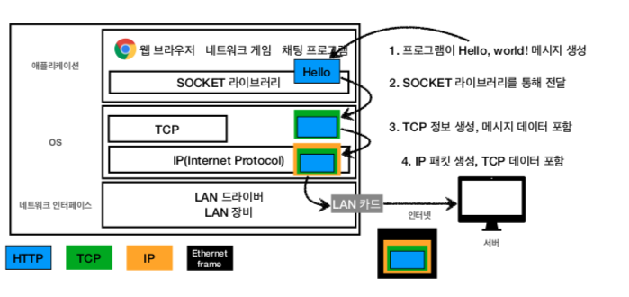
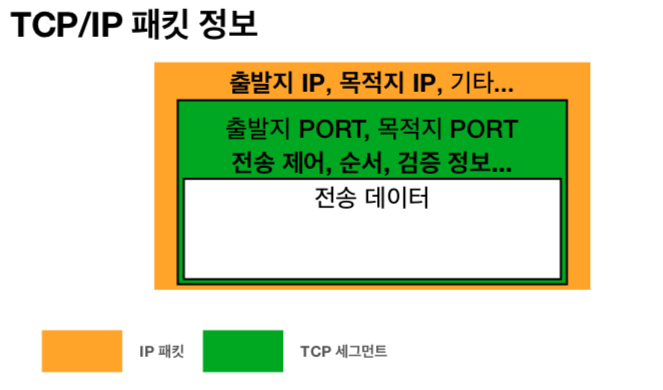
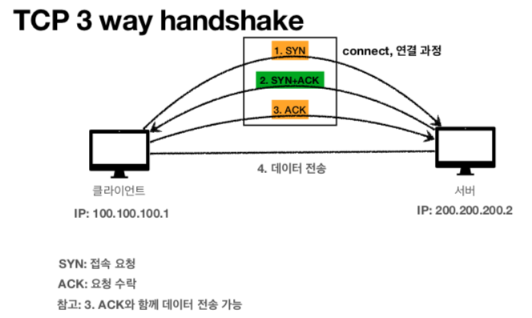
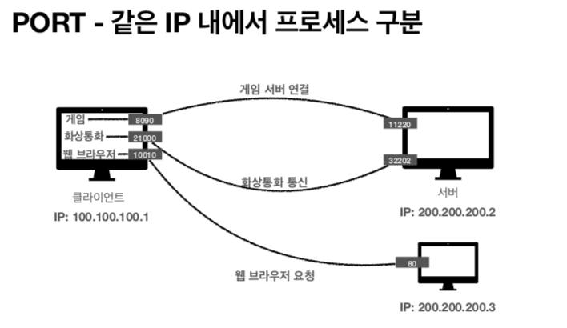
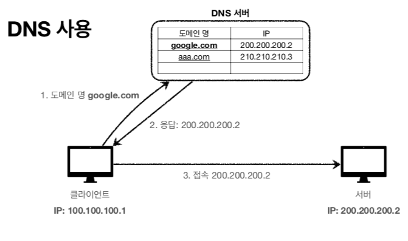

# Chapter 01 "Internet Network"
* HTTP도 결국에는 TCP/IP나 UDP 기반 위에서 동작하기 때문에 아주 기본적인 인터넷 네트워크를 이해해야 함.

## 01. 인터넷 통신
## 02. IP(Internet Protocol) 
### IP - 인터넷 프로토콜 역할
* 지정한 IP 주소(IP Address)에 데이터 전달 
* 패킷(Packet)이라는 통신 단위로 데이터 전달
### IP 패킷 정보

### IP 프로토콜의 한계
* 비연결성 
    * 패킷을 받을 대상이 없거나 서비스 불능 상태여도 패킷 전송
    * 대상 서버가 패킷을 받을 수 있는 상태인지 모름
* 비신뢰성
    * 중간에 패킷이 사라지면? 
    * 패킷을 여러개 보냈을때 순서대로 안오면? 
        * 끊어서 보내는 패킷이 각각 다른 노드를 탈 수도 있음
        * TCP, UDP 로 해결
* 프로그램 구분
    * 같은 IP를 사용하는 서버에서 통신하는 애플리케이션이 둘 이상이면? 어떤 방식으로 구분하지?

## 03. TCP, UDP
* IP 프로토콜의 문제를 해결해줌

### 인터넷 프로토콜 스택의 4계층
* 애플리케이션 계층 - HTTP, FTP
* 전송 계층 - TCP, UDP
* 인터넷 계층 - IP
* 네트워크 인터페이스 계층
    * Ethernet frame: 실제 MAC 주소와 같은 물리적인 정보 포함

### TCP 특징 - 전송 제어 프로토콜(Transmission Control Protocol)

* 연결지향 - TCP 3 way handshake (가상 연결), 일단 연결을 한 후에 메시지 전송 

    * 요즘에는 최적화가 되어서, 3.ACK를 보낼때 4.데이터 전송도 함께 함.
    * 논리적 연결임, 나를 위한 물리적 랜선이 보장된 것이 아님.
* 데이터 전달 보증 - 데이터 누락이 된 것을 알 수 있음
    1. 데이터 전송함
    2. 데이터 잘 받았음
* 순서 보장 
    1. 패킷1, 패킷2, 패킷3 순서로 전송
    2. 패킷1, 패킷3, 패킷2 순서로 도착
    3. 패킷2부터 다시 보내
* 신뢰할 수 있는 프로토콜 - TCP/IP 패킷에 위 정보들이 모두 들어있으므로.
* 현재는 대부분 TCP 사용

### UDP 특징 - 사용자 데이터그램 프로토콜(User Datagram Protocol)
* 기능이 거의 없음
* 연결지향 - TCP 3 way handshake X 
* 데이터 전달 보증 X
* 순서 보장 X
* 데이터 전달 및 순서가 보장되지 않지만, 단순하고 빠름
* Summary
    * IP와 거의 같다. +PORT +체크섬 정도만 추가
    * 애플리케이션에서 추가 작업 필요/가능
    * 장점 - 단순하고 빠름 (HTTP/33에서는 UDP 프로토콜 사용)

## 04. PORT - 같은 IP 내에서 프로세스 구분
* 한 번에 둘 이상 연결해야 하면?
* TCP/IP 패킷 정보에는 출발지 IP, PORT/목적지 IP, PORT/전송 데이터... 가 있음.

### PORT 구분
* 0 ~ 65535 할당 가능
* 0 ~ 1023: 잘 알려진 포트, 사용하지 않는 것이 좋음
    * FTP - 20, 21
    * TELNET - 23
    * HTTP - 80 
    * HTTPS - 443 (HTTP+보안)

## 05. DNS (Domain Name System)
* IP는 기억하기 어렵고, 변경될 수 있음.
* 전화번호부 개념
* 도메인 명을 IP 주소로 변환

