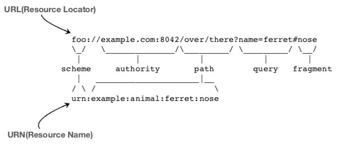
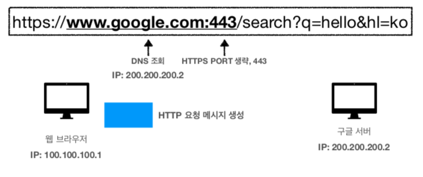
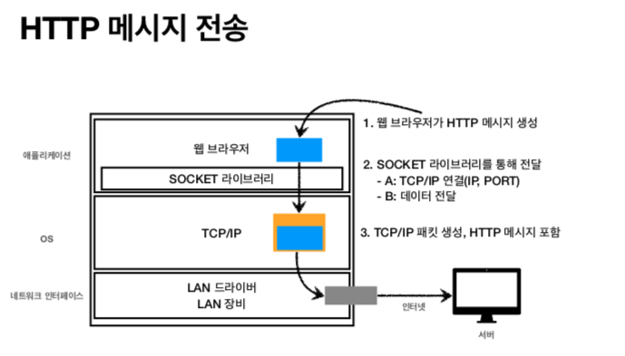
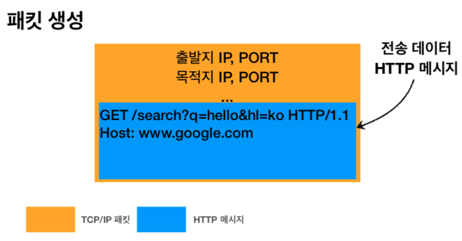

# Chapter 02 "URI-WebBrowser"
* URI와 URL의 개념
* 웹 브라우저 요청 흐름을 통해 HTTP 메시지가 어떻게 TCP/IP 메시지로 변하고, 네트워크를 통해 목적지까지 도착하는지, 그리고 HTML 응답을 받아와서 웹 브라우저에 렌더링 되는지의 과정
* HTTP와 네트워크의 전체 사이클 이해

## 01. URI(Uniform Resource Identifier)  
* resource 를 식별하는 통합된 방법

### URI? URL? URN?
* "URI는 로케이터(locator), 이름(name) 또는 둘 다 추가로 분류될 수 있다"
    * from [표준 스펙](https://www.ietf.org/rfc/rfc3986.txt)
* [URL vs URI vs URN](https://mygumi.tistory.com/139)



### URI
* Uniform: 리소스 식별하는 통일된 방식
* Resource: 자원, URI로 식별할 수 있는 모든 것(제한 없음) 
* Identifier: 다른 항목과 구분하는데 필요한 정보

### URL, URN
* URL - Locator: 리소스가 있는 위치를 지정
* URN - Name: 리소스에 이름을 부여
* 위치는 변할 수 있지만, 이름은 변하지 않는다. 
    * 예) urn:isbn:8960777331 (어떤 책의 isbn URN)
* URN 이름만으로 실제 리소스를 찾을 수 있는 방법이 보편화 되지 않음 
> → 앞으로 URI를 URL과 같은 의미로 이야기하겠음

### URL 문법
> scheme://[userinfo@]host[:port][/path][?query][#fragment] <br>
> 예) https://www.google.com:443/search?q=hello&hl=ko
* 프로토콜(https) 
* 호스트명(www.google.com) 
* 포트 번호(443)
* 패스(/search)
* 쿼리 파라미터(q=hello&hl=ko)

#### schema
* 주로 프로토콜 사용
    * 프로토콜: 어떤 방식으로 자원에 접근할 것인가 하는 약속 규칙
    * 예) http, https, ftp 등등
* http는 80 포트, https는 443 포트를 주로 사용, 포트는 생략 가능 
    * https는 http에 보안 추가 (HTTP Secure)

#### userinfo
* URL에 사용자정보를 포함해서 인증 
* 거의 사용하지 않음

#### host 
* 호스트명
* 도메인명 또는 IP 주소를 직접 사용가능

#### port 
* 접속 포트
* 일반적으로 생략, 생략시 http는 80, https는 443

#### path
* 리소스 경로(path), 계층적 구조

#### query (query parameter, query string)
* key=value 형태
* ?로 시작, &로 추가 가능 ?keyA=valueA&keyB=valueB
* 웹서버에 제공하는 파라미터, 문자 형태

#### fragment
* 예) https://docs.spring.io/spring-boot/docs/current/reference/html/getting-started.html#getting-started-introducing-spring-boot
* html 내부 북마크 등에 사용
* 서버에 전송하는 정보 아님

## 02. 웹 브라우저 요청 흐름
1. HTTP 요청 메시지 생성
    ```shell script
    GET /search?q=hello&hl=ko HTTP/1.1 Host: www.google.com
    ```
    

2. HTTP 메시지 전송
    

3. 패킷 생성 - 출발지 IP, PORT / 목적지 IP, PORT / 전송 데이터 ...
    

4. 요청 패킷 전달
5. HTTP 응답 메시지 응답
    ```shell script
    HTTP/1.1 200 OK
    Content-Type: text/html;charset=UTF-8 Content-Length: 3423
   
    <html> 
    <body>...</body>
    </html>
    ```


